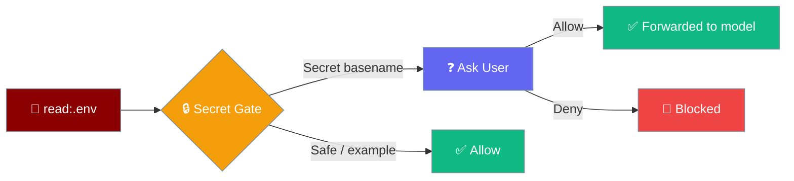
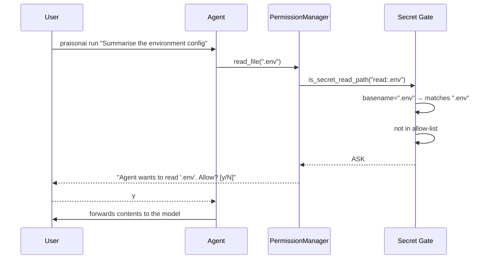
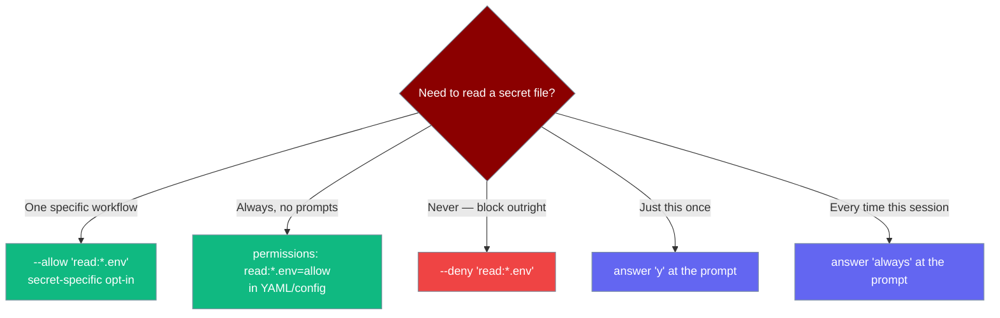

Every `praisonai run` now asks before an agent reads `.env` or a private key, so credentials never leak silently to the model provider.



<Note>
This gate ships in [PraisonAI PR #3256](https://github.com/MervinPraison/PraisonAI/pull/3256) (fixes [#3255](https://github.com/MervinPraison/PraisonAI/issues/3255)). It lives in the core `PermissionManager`, so it protects every frontend — CLI, YAML, and Python `Agent` — by default. No new parameters, exports, or config surface.
</Note>

The default protects you with no configuration — a bare `read:*` allow rule no longer authorises `.env` reads.

```bash
# The default protects you; nothing to configure.
praisonai run "Look at .env and tell me which providers are configured"
# → prompts:  "Agent wants to read '.env'. Allow? [y/N]"
```

## Quick Start

<Steps>
<Step title="Default behaviour">

Nothing to configure — the agent asks before reading any secret file:

```bash
praisonai run "read my .env and summarise"
```

The run pauses with an approval prompt before the contents ever reach the model.

</Step>

<Step title="Opt in for a trusted workflow">

Pass a **secret-specific** allow to skip the prompt for that pattern:

```bash
praisonai run "Compare prod.env and staging.env" --allow 'read:*.env'
```

</Step>

<Step title="Harden further">

Deny outright so no prompt ever appears:

```bash
praisonai run "audit the repo" --deny 'read:*.env'
```

</Step>
</Steps>

---

## How It Works

The gate matches the file's basename against a fixed set of secret globs; a match that is not on the safe-doc allow-list defaults to **ask**.



Only two read prefixes are gated:

| Gated prefix | Not gated |
|---|---|
| `read:` | `write:` |
| `read_file:` | `edit:`, `delete:`, `bash:cat …`, `tool:*` |

<Note>
`write:.env` is **unaffected** — only `read:` / `read_file:` targets pass through the secret gate. Writing to a `.env` file behaves exactly as before.
</Note>

---

## What Counts As a Secret

Patterns are matched **case-insensitively** against the file's **basename**, so `config/.env` and `.env` both match.

| Category | Secret basename globs |
|---|---|
| Env files | `.env`, `*.env`, `.env.*`, `*.env.*` |
| Certificates | `*.pem`, `*.pfx`, `*.p12` |
| Keys | `*.key`, `id_rsa`, `id_dsa`, `id_ecdsa`, `id_ed25519` |

Example and template files are **never gated** (the safe-doc allow-list):

```
*.env.example
*.env.sample
*.env.template
.env.example
.env.sample
.env.template
*.example
*.sample
*.template
```

So `read:.env.example`, `read:config/.env.template`, and `read:settings.example` are always allowed.

---

## Overriding the Default

Users can opt in, harden, or approve at the prompt — pick the path that fits the workflow.



Precedence, highest first:

| Priority | Rule | Outcome |
|---|---|---|
| 1 | Persistent approval (`approve("read:.env", approved=True, scope="always")`) | Always wins |
| 2 | Explicit `deny` on any matching pattern | Always wins |
| 3 | Secret-**specific** `allow` (`read:*.env=allow`, `read:.env=allow`, `read:*.pem=allow`, `read:id_rsa=allow`) | Opts in — regex rules are treated as specific |
| 4 | Broad catch-all `allow` (`read:*` alone) | **Does NOT opt in** — falls through to ask |
| 5 | No matching rule | Ask |

<Warning>
A broad `read:*` allow does **not** authorise secret reads on its own. The gate falls through to **ask**. To opt in, use a *secret-specific* rule such as `read:*.env`.
</Warning>

The prompt emits this exact reason string — grep for it:

```
Reading a secret file requires approval (override with a secret-specific 'read' allow rule, e.g. read:*.env, to opt in)
```

---

## Interaction Flow

A default run asks once before the contents are forwarded:

```
User: praisonai run "Summarise the environment config"
Agent: read_file(".env")
PermissionManager: basename=".env" → matches ".env" pattern; not in allow-list → ASK
CLI: prompt user — "Agent wants to read '.env'. Allow? [y/N]"
User: y
CLI: records one-shot approval; forwards contents to the model
```

An opt-in run skips the prompt entirely:

```
User: praisonai run "..." --allow 'read:*.env'
PermissionManager: rule matches → is_specific_secret_allow() → True → ALLOW
Agent reads .env without a prompt.
```

---

## Common Patterns

CLI opt-in for a single trusted run:

```bash
praisonai run "Compare prod.env and staging.env" --allow 'read:*.env'
```

YAML policy block — secret-specific opt-in, hardening, and a broad allow that does **not** cover secrets:

```yaml
# permissions.yaml
permissions:
  "read:*.env": allow      # secret-specific opt-in
  "read:*.pem": deny       # hardening
  "read:*": allow          # broad — DOES NOT authorise secrets on its own
```

Python `PermissionRule`:

```python
from praisonaiagents.permissions import PermissionManager, PermissionRule, PermissionAction

manager = PermissionManager()
manager.add_rule(PermissionRule(pattern="read:*.env", action=PermissionAction.ALLOW))
```

<Note>
`write:.env` is not affected by the gate — only reads are gated. A `write:*.env` rule behaves exactly as it did before.
</Note>

---

## Best Practices

<AccordionGroup>
<Accordion title="Prefer secret-specific globs over read:*">
Use `read:*.env` or `read:id_rsa` to opt in to a specific secret. A broad `read:*` intentionally does not cover secrets, so relying on it will still prompt.
</Accordion>

<Accordion title="Leave the default alone for user-facing agents">
For any agent a person interacts with, keep the ask default. The one-shot prompt is the last line of defence against silent credential exfiltration.
</Accordion>

<Accordion title="Use read:*.env=deny for CI">
Unattended CI runners should never read secrets. Add `read:*.env` → deny (and `read:*.pem` → deny) so the operation is blocked outright with no prompt.
</Accordion>

<Accordion title="Example and sample files are never gated">
`*.env.example`, `*.env.template`, and `*.sample` files pass straight through. Documentation and onboarding flows that read these are unaffected.
</Accordion>
</AccordionGroup>

---

## Related

<CardGroup cols={2}>
<Card title="Permissions" icon="shield" href="/docs/features/permissions">
  Programmatic PermissionManager API and rule patterns
</Card>
<Card title="Permissions CLI" icon="terminal" href="/docs/cli/permissions">
  Manage allow/deny rules from the command line
</Card>
<Card title="Declarative Permissions" icon="file-code" href="/docs/features/declarative-permissions">
  YAML, CLI, and Python permission policies
</Card>
<Card title="Workspace Boundary" icon="shield-halved" href="/docs/features/workspace-boundary">
  Sibling core default — gate access outside the project root
</Card>
</CardGroup>
