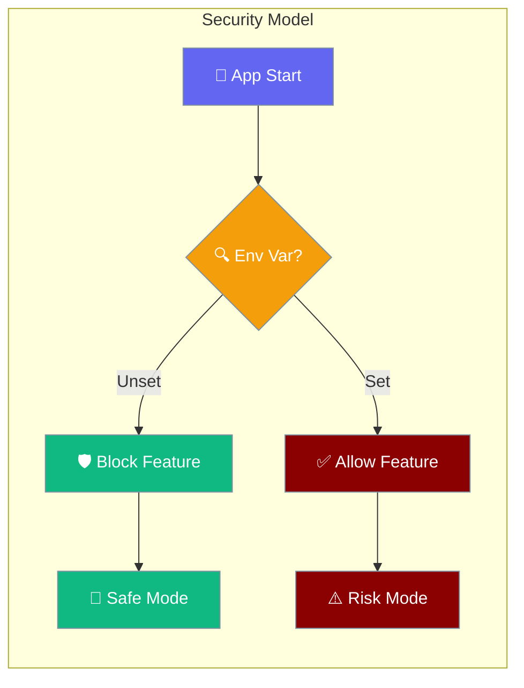
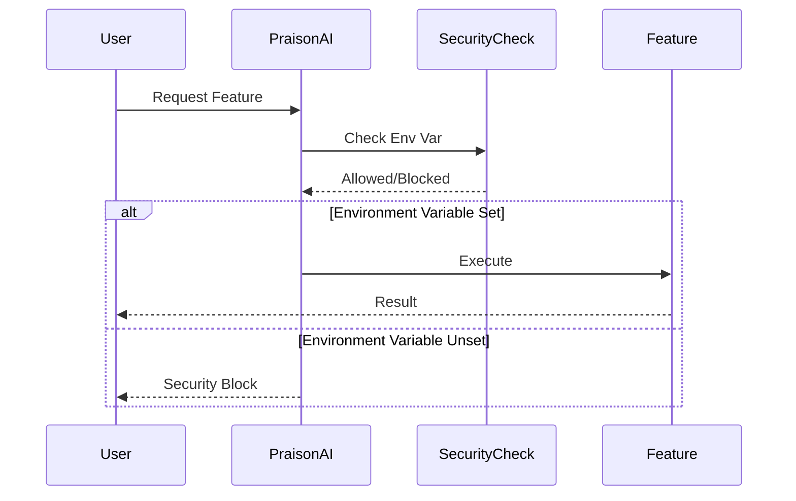

Security environment variables control opt-in access to potentially dangerous operations, ensuring secure defaults for RCE and session hijacking prevention.



## Quick Start

<Steps>
<Step title="Enable Local Tools">
```bash
export PRAISONAI_ALLOW_LOCAL_TOOLS=true
python -m praisonai "Create a report using tools.py"
```
</Step>

<Step title="Enable Job Workflows">
```bash
export PRAISONAI_ALLOW_JOB_WORKFLOWS=true
praisonai --workflow job_workflow.yaml
```
</Step>

<Step title="Enable Remote Browser">
```bash
export PRAISONAI_BROWSER_ALLOW_REMOTE=true
praisonai browser --host 0.0.0.0 --port 8080
```
</Step>
</Steps>

---

## How It Works



| Phase | Action | Default Behavior |
|-------|--------|------------------|
| **Startup** | Check environment variables | Block dangerous features |
| **Request** | Validate security permissions | Allow only safe operations |
| **Execute** | Run with appropriate restrictions | Fail-safe mode active |

---

## Environment Variables

### PRAISONAI_ALLOW_LOCAL_TOOLS

Controls automatic loading of `tools.py` files from the current working directory.

**Security Risk**: Remote Code Execution (RCE) via malicious tools.py files

```bash
# Enable local tools loading
export PRAISONAI_ALLOW_LOCAL_TOOLS=true

# Disable (default - secure)
unset PRAISONAI_ALLOW_LOCAL_TOOLS
```

**Affected Components**:
- Tool resolver system
- Agent API calls
- Real-time UI interactions

**Usage Example**:
```python
from praisonaiagents import Agent

# This will only work if PRAISONAI_ALLOW_LOCAL_TOOLS=true
agent = Agent(
    name="Tool User",
    instructions="Use tools from tools.py to help the user"
)

agent.start("Calculate using local tools")
```

### PRAISONAI_ALLOW_JOB_WORKFLOWS

Controls execution of job and hybrid workflow types that can run shell commands and scripts.

**Security Risk**: Remote Code Execution (RCE) via malicious YAML workflows

```bash
# Enable job workflows
export PRAISONAI_ALLOW_JOB_WORKFLOWS=true

# Disable (default - secure)  
unset PRAISONAI_ALLOW_JOB_WORKFLOWS
```

**Workflow Types Affected**:
- **Job workflows**: Direct shell, Python, and script execution
- **Hybrid workflows**: Combined agent + job execution

**Usage Example**:
```yaml
# job_workflow.yaml
type: job
steps:
  - name: setup
    shell: |
      echo "Setting up environment"
      pip install requirements.txt
      
  - name: process
    python: |
      import os
      result = os.listdir(".")
      print(f"Files: {result}")
```

```bash
# Only works with PRAISONAI_ALLOW_JOB_WORKFLOWS=true
praisonai --workflow job_workflow.yaml
```

### PRAISONAI_BROWSER_ALLOW_REMOTE

Controls browser server binding to non-loopback interfaces (0.0.0.0, remote IPs).

**Security Risk**: WebSocket session hijacking and unauthorized browser access

```bash
# Enable remote browser access
export PRAISONAI_BROWSER_ALLOW_REMOTE=true

# Disable (default - secure, localhost only)
unset PRAISONAI_BROWSER_ALLOW_REMOTE
```

**Default Behavior**:
- Binds to `127.0.0.1` (localhost only)
- Blocks attempts to bind to `0.0.0.0` or remote interfaces

**Usage Example**:
```python
from praisonai.browser import BrowserServer

# This will only bind to 0.0.0.0 if PRAISONAI_BROWSER_ALLOW_REMOTE=true
# Otherwise falls back to 127.0.0.1
server = BrowserServer(host="0.0.0.0", port=8080)
server.start()
```

---

## Common Patterns

<Tabs>
<Tab title="Development Mode">
```bash
# Enable all features for development
export PRAISONAI_ALLOW_LOCAL_TOOLS=true
export PRAISONAI_ALLOW_JOB_WORKFLOWS=true  
export PRAISONAI_BROWSER_ALLOW_REMOTE=true

# Add to ~/.bashrc or ~/.zshrc for persistence
echo 'export PRAISONAI_ALLOW_LOCAL_TOOLS=true' >> ~/.bashrc
```
</Tab>

<Tab title="Production Mode">
```bash
# Secure defaults - explicitly unset dangerous variables
unset PRAISONAI_ALLOW_LOCAL_TOOLS
unset PRAISONAI_ALLOW_JOB_WORKFLOWS
unset PRAISONAI_BROWSER_ALLOW_REMOTE

# Or use systemd service with secure environment
# /etc/systemd/system/praisonai.service
[Service]
Environment="PRAISONAI_ALLOW_LOCAL_TOOLS=false"
Environment="PRAISONAI_ALLOW_JOB_WORKFLOWS=false"
Environment="PRAISONAI_BROWSER_ALLOW_REMOTE=false"
```
</Tab>

<Tab title="Docker Deployment">
```dockerfile
# Secure Docker deployment
FROM python:3.11-slim

# Secure defaults - do not set dangerous env vars
# ENV PRAISONAI_ALLOW_LOCAL_TOOLS=true  # DON'T DO THIS

COPY . /app
WORKDIR /app
RUN pip install praisonai

# Only enable specific features if needed
# ENV PRAISONAI_ALLOW_JOB_WORKFLOWS=true  # Only if required

CMD ["python", "-m", "praisonai"]
```
</Tab>
</Tabs>

---

## Migration Guide

### Upgrading from Vulnerable Versions

<Steps>
<Step title="Identify Usage">
Check if you use any of these features:
- Local `tools.py` files
- Job or hybrid workflows with shell/script execution
- Browser server binding to `0.0.0.0`
</Step>

<Step title="Add Environment Variables">
```bash
# Only add variables for features you actually use
export PRAISONAI_ALLOW_LOCAL_TOOLS=true      # If you use tools.py
export PRAISONAI_ALLOW_JOB_WORKFLOWS=true    # If you use job workflows
export PRAISONAI_BROWSER_ALLOW_REMOTE=true   # If you bind browser to 0.0.0.0
```
</Step>

<Step title="Test Functionality">
Verify your existing workflows still work:
```bash
# Test local tools
praisonai "Use local tools to help me"

# Test job workflows  
praisonai --workflow your_job_workflow.yaml

# Test remote browser
praisonai browser --host 0.0.0.0
```
</Step>

<Step title="Review Security">
Evaluate if you really need each dangerous feature:
- Can you avoid local tools.py files?
- Can you use agent workflows instead of job workflows?
- Can you use localhost-only browser access?
</Step>
</Steps>

---

## Best Practices

<AccordionGroup>
<Accordion title="🔒 Principle of Least Privilege">
Only enable environment variables for features you actively use. Each variable increases your attack surface.

```bash
# BAD - Enables everything
export PRAISONAI_ALLOW_LOCAL_TOOLS=true
export PRAISONAI_ALLOW_JOB_WORKFLOWS=true
export PRAISONAI_BROWSER_ALLOW_REMOTE=true

# GOOD - Only enable what you need
export PRAISONAI_ALLOW_LOCAL_TOOLS=true  # Only if you use tools.py
```
</Accordion>

<Accordion title="🏢 Production Environment Isolation">
Never enable dangerous variables in production unless absolutely necessary. Use staging environments for testing.

```bash
# Production - secure defaults
unset PRAISONAI_ALLOW_LOCAL_TOOLS
unset PRAISONAI_ALLOW_JOB_WORKFLOWS
unset PRAISONAI_BROWSER_ALLOW_REMOTE

# Development/Staging - enable as needed
export PRAISONAI_ALLOW_LOCAL_TOOLS=true
```
</Accordion>

<Accordion title="📁 File System Security">
When `PRAISONAI_ALLOW_LOCAL_TOOLS=true`, ensure your working directory doesn't contain untrusted `tools.py` files.

```bash
# Check for tools.py before running
ls -la tools.py 2>/dev/null && echo "WARNING: tools.py found"

# Run from clean directory
mkdir -p /tmp/clean_workspace
cd /tmp/clean_workspace
praisonai "Your task here"
```
</Accordion>

<Accordion title="🌐 Network Security">
When `PRAISONAI_BROWSER_ALLOW_REMOTE=true`, use firewalls and authentication to protect browser endpoints.

```bash
# Use specific IP instead of 0.0.0.0 when possible
export PRAISONAI_BROWSER_ALLOW_REMOTE=true
praisonai browser --host 192.168.1.100 --port 8080

# Consider using reverse proxy with authentication
# nginx, caddy, or similar with basic auth
```
</Accordion>
</AccordionGroup>

---

## Security Advisories

These environment variables address the following security vulnerabilities:

| Advisory | Severity | Description | Environment Variable |
|----------|----------|-------------|---------------------|
| **GHSA-g985-wjh9-qxxc** | High | RCE via Automatic tools.py Import | `PRAISONAI_ALLOW_LOCAL_TOOLS` |
| **GHSA-vc46-vw85-3wvm** | Critical | RCE via job workflow YAML | `PRAISONAI_ALLOW_JOB_WORKFLOWS` |  
| **GHSA-8x8f-54wf-vv92** | Critical | WebSocket session hijacking | `PRAISONAI_BROWSER_ALLOW_REMOTE` |

**CVE IDs**: Pending assignment by GitHub Security Advisory system

**Fixed Versions**:
- **praisonai**: `>=0.0.57` 
- **praisonaiagents**: `>=0.0.23`

---

## Related

<CardGroup cols={2}>
<Card title="Guardrails" icon="shield" href="/docs/features/guardrails">
  Content filtering and safety controls
</Card>
<Card title="Permissions" icon="key" href="/docs/features/permissions">
  Agent permission management system
</Card>
</CardGroup>