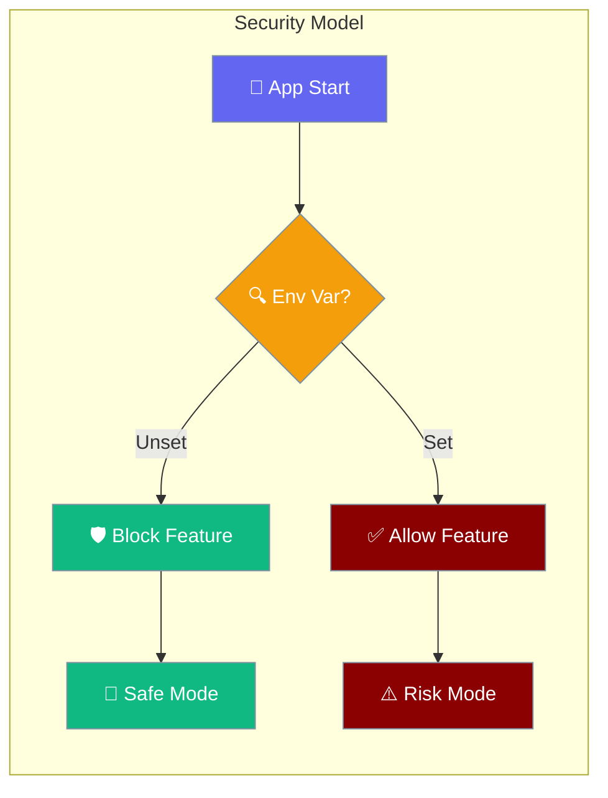
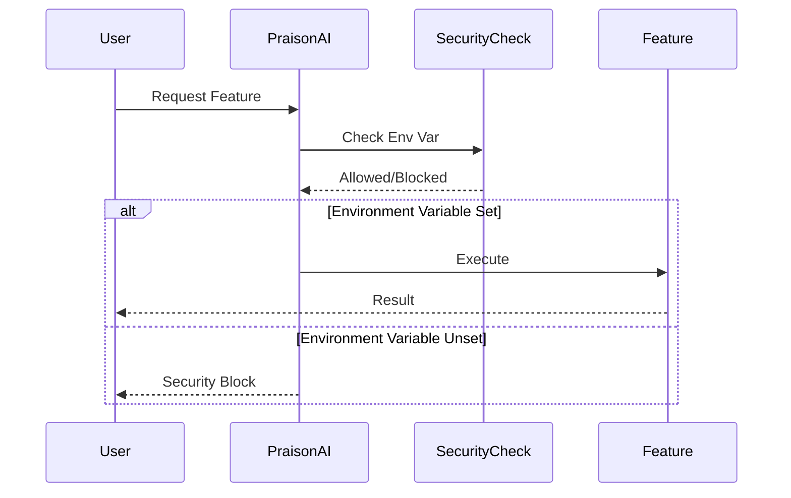

Security environment variables control opt-in access to potentially dangerous operations, ensuring secure defaults for RCE and session hijacking prevention.



## Quick Start

<Steps>
<Step title="Enable Local Tools">
```bash
export PRAISONAI_ALLOW_LOCAL_TOOLS=true
python -m praisonai "Create a report using tools.py"
```
</Step>

<Step title="Enable Job Workflows">
```bash
export PRAISONAI_ALLOW_JOB_WORKFLOWS=true
praisonai --workflow job_workflow.yaml
```
</Step>

<Step title="Enable Remote Browser">
```bash
export PRAISONAI_BROWSER_ALLOW_REMOTE=true
praisonai browser --host 0.0.0.0 --port 8080
```
</Step>
</Steps>

---

## How It Works



| Phase | Action | Default Behavior |
|-------|--------|------------------|
| **Startup** | Check environment variables | Block dangerous features |
| **Request** | Validate security permissions | Allow only safe operations |
| **Execute** | Run with appropriate restrictions | Fail-safe mode active |

---

## Environment Variables

### PRAISONAI_TOOL_SAFETY

Controls whether dangerous built-in tools (shell exec, file delete/move/copy, code execution) are gated by the approval system.

**Default**: unset → `default` preset active (blocks destructive ops in CI, asks on TTY)

```bash
# Disable all tool gating (restore pre-4.6.27 behaviour)
export PRAISONAI_TOOL_SAFETY=off

# Equivalent accepted values: off, full, none, 0, false
PRAISONAI_TOOL_SAFETY=off praisonai code "Clean up logs"
```

| Value | Behaviour |
|-------|-----------|
| unset | `default` preset — denies destructive ops in CI, asks on TTY |
| `off` / `full` / `none` / `0` / `false` | Bypass all gating (trust the LLM) |
| `safe` / `read_only` | Block all tools in `DEFAULT_DANGEROUS_TOOLS` |
| `default` | Explicit default (same as unset) |

<Note>
`--dangerously-skip-approval` on `praisonai code` automatically exports `PRAISONAI_TOOL_SAFETY=off` so that child processes inherit the bypass.
</Note>

**Usage Example**:
```python
from praisonaiagents import Agent

# Equivalent to PRAISONAI_TOOL_SAFETY=off — tool gating disabled
agent = Agent(
    name="Trusted Coder",
    instructions="Run any tool needed",
    tools=["shell", "write_file", "delete_file"],
    approval="bypass",
)
agent.start("Clean up temp files")
```

---

### PRAISONAI_ALLOW_LOCAL_TOOLS

Controls automatic loading of `tools.py` files from the current working directory.

**Security Risk**: Remote Code Execution (RCE) via malicious tools.py files

```bash
# Enable local tools loading
export PRAISONAI_ALLOW_LOCAL_TOOLS=true

# Disable (default - secure)
unset PRAISONAI_ALLOW_LOCAL_TOOLS
```

**Affected Components** (verified against PR #1658 head `83b8b14c`):
- `praisonai` wrapper agent generator (`generate_crew_and_kickoff` and `_run_praisonai`), now delegating to `ToolResolver.get_local_callables()` / `ToolResolver.get_local_tool_classes()`
- `praisonai.tool_resolver.ToolResolver._load_local_tools` (single source of truth; the env-var gate itself is enforced by `praisonai._safe_loader.load_user_module`)
- `praisonai run` YAML workflows (recipe `tools.py` under `_run_yaml_workflow`)
- `praisonai research --tools <file.py>`
- `praisonai chat --rewrite-tools <file.py>` and `--expand-tools <file.py>`
- Generic CLI `_load_tools(tools_path)`
- HTTP API: `praisonai.api.call.import_tools_from_file` (raises `ValueError` if disabled)
- Path-traversal guard: files outside the current working directory are refused even when `PRAISONAI_ALLOW_LOCAL_TOOLS=true`
- `praisonaiagents.workflows.workflows.AgentFlow` (SDK-level: skips `tools.py` next to the workflow class when unset)

<Note>
Even when `PRAISONAI_ALLOW_LOCAL_TOOLS=true`, the loader refuses any path outside the current working directory. This is a deliberate defence-in-depth layer for HTTP-API callers (`praisonai.api.call.import_tools_from_file`) where the path can come from network input. Move the `tools.py` you want to load into your CWD if you hit `Refusing to exec ... outside working directory.` in the logs.
</Note>

`PRAISONAI_ALLOW_LOCAL_TOOLS` accepts only `true` (case-insensitive) in the **wrapper** (`praisonai`). Values like `1`, `yes`, or `on` are **not** truthy for the wrapper (unlike `PRAISONAI_ALLOW_TEMPLATE_TOOLS`).

<Note>
**Truthy-value inconsistency across surfaces:** The wrapper (`praisonai`) accepts only `true`; the SDK's `AgentFlow` (`praisonaiagents.workflows.workflows`) accepts `true`, `1`, or `yes`; the SDK's recipe path in `workflows.py` accepts `true`, `1`, `yes`, or `on`. If you rely on `PRAISONAI_ALLOW_LOCAL_TOOLS=1`, the wrapper will reject it even though the SDK's AgentFlow will accept it. This is the SDK's actual behavior — set `true` to be safe across all surfaces.
</Note>

**Usage Example**:
```python
from praisonaiagents import Agent

# This will only work if PRAISONAI_ALLOW_LOCAL_TOOLS=true
agent = Agent(
    name="Tool User",
    instructions="Use tools from tools.py to help the user"
)

agent.start("Calculate using local tools")
```

**Error & Warning Messages**

| When | Where it appears | Message |
|------|------------------|---------|
| Env var unset, CLI tool loader (research/rewrite/expand/recipe) | stdout (rich `[yellow]`) | `Warning: Tools loading disabled. Set PRAISONAI_ALLOW_LOCAL_TOOLS=true to enable.` |
| Env var unset, agent generator | logger.warning | `Refusing to exec %s: set PRAISONAI_ALLOW_LOCAL_TOOLS=true to enable.` |
| Env var unset, HTTP API (`api/call.py`) | raised exception | `ValueError("Local tools loading disabled. Set PRAISONAI_ALLOW_LOCAL_TOOLS=true to enable.")` |
| Path outside CWD, env var **set** | logger.warning | `Refusing to exec <path>: outside working directory.` |
| Path outside CWD via HTTP API, env var **set** | raised exception | `LocalToolsDisabled("Refusing to exec <path>: outside working directory.")` |
| Env var unset, SDK `AgentFlow` with `tools.py` present | logger.debug | `Skipping tools.py load for <class>: set PRAISONAI_ALLOW_LOCAL_TOOLS=true` |

### PRAISONAI_ALLOW_TEMPLATE_TOOLS

Controls implicit `tools.py` autoload by the template tool-override system, both from the current working directory and from a recipe's template directory.

**Security Risk**: Remote Code Execution (RCE) when loading recipes/templates from untrusted sources (e.g. recipes fetched from a remote registry)

```bash
# Enable template tools autoload
export PRAISONAI_ALLOW_TEMPLATE_TOOLS=1

# Disable (default - secure)
unset PRAISONAI_ALLOW_TEMPLATE_TOOLS
```

**Default**: unset → disabled  
**Accepted truthy values**: `1`, `true`, `yes`, `on` (case-insensitive, whitespace-stripped)

**Affected Components**:
- `praisonai.templates.tool_override.create_tool_registry_with_overrides`
- `praisonai.templates.tool_override.resolve_tools`

**Note**: Explicit `override_files`, `override_dirs`, and `tools_sources` continue to work without this opt-in and are the recommended way to load custom tools.

**Usage Example**:
```python
from praisonai.templates.tool_override import create_tool_registry_with_overrides

# This will only load implicit tools.py if PRAISONAI_ALLOW_TEMPLATE_TOOLS=1
registry = create_tool_registry_with_overrides(include_defaults=True)

# Explicit loading works without the env var
registry = create_tool_registry_with_overrides(
    override_files=["./my_tools.py"],  # Always works
    include_defaults=True
)
```

### PRAISONAI_ALLOW_PLUGIN_DISCOVERY

Controls automatic discovery and loading of plugins from `.praisonai/plugins/` (project-level) and `~/.praisonai/plugins/` (user-level) directories.

**Security Risk**: Remote Code Execution (RCE) via malicious third-party plugins discovered on `sys.path`.

```bash
# Enable plugin auto-discovery
export PRAISONAI_ALLOW_PLUGIN_DISCOVERY=true

# Disable (default - secure)
unset PRAISONAI_ALLOW_PLUGIN_DISCOVERY
```

**Default**: unset → discovery skipped silently (debug log only)  
**Accepted truthy values**: `true`, `1`, `yes` (case-insensitive, whitespace-stripped). `on` is **not** accepted.

**Affected Component**: `praisonaiagents.plugins.manager.PluginManager.discover_and_load_plugins`

**Default behavior when unset**: `discover_and_load_plugins()` is a no-op and returns `0`. A `logger.debug` message fires: `Plugin auto-discovery disabled; set PRAISONAI_ALLOW_PLUGIN_DISCOVERY=true`.

**Usage Example**:
```python
import os
os.environ["PRAISONAI_ALLOW_PLUGIN_DISCOVERY"] = "true"

from praisonaiagents import Agent
from praisonaiagents.plugins.manager import PluginManager

manager = PluginManager()
loaded = manager.discover_and_load_plugins()
print(f"Loaded {loaded} plugins")

agent = Agent(
    name="Plugin User",
    instructions="Use discovered plugins to help"
)
agent.start("Run task with plugins")
```

**Workaround when off**: Register plugins explicitly without enabling discovery:
```python
from praisonaiagents.plugins.manager import PluginManager

manager = PluginManager()
manager.register_plugin("my_plugin", my_plugin_module)
```

### PRAISONAI_PROJECT_ROOT

Sets the allowed root directory for agent output file writes. Writes outside this root are silently blocked.

**Security Risk**: Path-traversal write outside the project tree (e.g. `output_file="../../etc/passwd"`).

```bash
# Set a specific project root
export PRAISONAI_PROJECT_ROOT=/home/user/myproject

# Default: current working directory at save time
unset PRAISONAI_PROJECT_ROOT
```

**Default**: unset → `os.getcwd()` at save time  
**Affected Component**: `praisonaiagents.agent.memory_mixin.MemoryMixin._save_output_to_file`

**Silent-failure semantics**: When the output path resolves outside the project root, the save returns `False`, logs `Output file %r is outside project root %r; skipping save` at `logging.warning`, and prints `⚠️ Output path outside project root: <path>` to stdout. No exception is raised.

**Usage Example**:
```python
import os
os.environ["PRAISONAI_PROJECT_ROOT"] = "/home/user/myproject"

from praisonaiagents import Agent

# This saves successfully — path is within project root
agent = Agent(
    name="Writer",
    instructions="Write a report",
    output_file="report.md"
)
agent.start("Summarise the project")

# This is blocked — path escapes the project root
agent2 = Agent(
    name="Writer",
    instructions="Write a report",
    output_file="../report.md"
)
agent2.start("Summarise the project")
# Prints: ⚠️ Output path outside project root: ../report.md
```

### ALLOW_LOCAL_CRAWL

Bypasses SSRF protection for loopback, private, link-local, multicast, and unspecified IP addresses in web crawl tools.

**Security Risk**: Server-Side Request Forgery (SSRF) — agents fetching `http://169.254.169.254/...` (cloud metadata), `http://localhost:6379` (Redis), etc.

```bash
# Allow crawling local/private addresses
export ALLOW_LOCAL_CRAWL=true

# Disable (default - secure)
unset ALLOW_LOCAL_CRAWL
```

**Default**: unset → loopback/private/link-local/multicast/unspecified IPs blocked; returns `{"error": "URL blocked by SSRF policy"}` per blocked URL  
**Accepted truthy values**: `true` only — **exact, case-sensitive match**. This is stricter than other env vars on this page.

**Affected Components**:
- `praisonaiagents.tools.web_crawl_tools` (both `_crawl_with_crawl4ai` and `_crawl_with_httpx` via `_is_safe_crawl_url`)
- `praisonaiagents.tools.url_safety.is_safe_http_url`

**Usage Example**:
```python
import os

# Without ALLOW_LOCAL_CRAWL — blocked
from praisonaiagents import Agent

agent = Agent(
    name="Crawler",
    instructions="Fetch the given URL"
)
result = agent.start("Crawl http://192.168.1.1/api/status")
# Returns: {"error": "URL blocked by SSRF policy"}

# With ALLOW_LOCAL_CRAWL=true — allowed
os.environ["ALLOW_LOCAL_CRAWL"] = "true"
result = agent.start("Crawl http://192.168.1.1/api/status")
# Fetches and returns content
```

<Warning>
`ALLOW_LOCAL_CRAWL` uses **exact** `"true"` matching (case-sensitive). `"True"`, `"TRUE"`, `"1"`, and `"yes"` are all rejected. This differs from the `PRAISONAI_*` variables on this page.
</Warning>

### PRAISONAI_ALLOW_JOB_WORKFLOWS

Controls execution of job and hybrid workflow types that can run shell commands and scripts.

**Security Risk**: Remote Code Execution (RCE) via malicious YAML workflows

```bash
# Enable job workflows
export PRAISONAI_ALLOW_JOB_WORKFLOWS=true

# Disable (default - secure)  
unset PRAISONAI_ALLOW_JOB_WORKFLOWS
```

**Workflow Types Affected**:
- **Job workflows**: Direct shell, Python, and script execution
- **Hybrid workflows**: Combined agent + job execution

**Usage Example**:
```yaml
# job_workflow.yaml
type: job
steps:
  - name: setup
    shell: |
      echo "Setting up environment"
      pip install requirements.txt
      
  - name: process
    python: |
      import os
      result = os.listdir(".")
      print(f"Files: {result}")
```

```bash
# Only works with PRAISONAI_ALLOW_JOB_WORKFLOWS=true
praisonai --workflow job_workflow.yaml
```

### PRAISONAI_BROWSER_ALLOW_REMOTE

Controls browser server binding to non-loopback interfaces (0.0.0.0, remote IPs).

**Security Risk**: WebSocket session hijacking and unauthorized browser access

```bash
# Enable remote browser access
export PRAISONAI_BROWSER_ALLOW_REMOTE=true

# Disable (default - secure, localhost only)
unset PRAISONAI_BROWSER_ALLOW_REMOTE
```

**Default Behavior**:
- Binds to `127.0.0.1` (localhost only)
- Blocks attempts to bind to `0.0.0.0` or remote interfaces

**Usage Example**:
```python
from praisonai.browser import BrowserServer

# This will only bind to 0.0.0.0 if PRAISONAI_BROWSER_ALLOW_REMOTE=true
# Otherwise falls back to 127.0.0.1
server = BrowserServer(host="0.0.0.0", port=8080)
server.start()
```

### PRAISONAI_RUN_SYNC_TIMEOUT

Default maximum seconds the wrapper's sync-to-async bridge will wait for a coroutine to complete.

**Default:** `300` (5 minutes)

```bash
# Tighten for latency-sensitive servers
export PRAISONAI_RUN_SYNC_TIMEOUT=30

# Loosen for long-running batch jobs
export PRAISONAI_RUN_SYNC_TIMEOUT=3600
```

Applies to every `praisonai` CLI entry and wrapper-based server (gateway, a2u, mcp_server, scheduler). The SDK (`praisonaiagents`) uses a separate bridge — see [Async Bridge](/docs/features/async-bridge).

---

## Common Patterns

<Tabs>
<Tab title="Development Mode">
```bash
# Enable all features for development
export PRAISONAI_ALLOW_LOCAL_TOOLS=true
export PRAISONAI_ALLOW_TEMPLATE_TOOLS=true
export PRAISONAI_ALLOW_JOB_WORKFLOWS=true  
export PRAISONAI_BROWSER_ALLOW_REMOTE=true
export PRAISONAI_RUN_SYNC_TIMEOUT=30
export PRAISONAI_TOOL_SAFETY=off   # disable tool gating in dev

# Add to ~/.bashrc or ~/.zshrc for persistence
echo 'export PRAISONAI_ALLOW_LOCAL_TOOLS=true' >> ~/.bashrc
```
</Tab>

<Tab title="Production Mode">
```bash
# Secure defaults - explicitly unset dangerous variables
unset PRAISONAI_ALLOW_LOCAL_TOOLS
unset PRAISONAI_ALLOW_TEMPLATE_TOOLS
unset PRAISONAI_ALLOW_JOB_WORKFLOWS
unset PRAISONAI_BROWSER_ALLOW_REMOTE
export PRAISONAI_RUN_SYNC_TIMEOUT=300

# Or use systemd service with secure environment
# /etc/systemd/system/praisonai.service
[Service]
Environment="PRAISONAI_ALLOW_LOCAL_TOOLS=false"
Environment="PRAISONAI_ALLOW_TEMPLATE_TOOLS=false"
Environment="PRAISONAI_ALLOW_JOB_WORKFLOWS=false"
Environment="PRAISONAI_BROWSER_ALLOW_REMOTE=false"
Environment="PRAISONAI_RUN_SYNC_TIMEOUT=300"
```
</Tab>

<Tab title="Docker Deployment">
```dockerfile
# Secure Docker deployment
FROM python:3.11-slim

# Secure defaults - do not set dangerous env vars
# ENV PRAISONAI_ALLOW_LOCAL_TOOLS=true  # DON'T DO THIS

COPY . /app
WORKDIR /app
RUN pip install praisonai

# Only enable specific features if needed
# ENV PRAISONAI_ALLOW_JOB_WORKFLOWS=true  # Only if required

CMD ["python", "-m", "praisonai"]
```
</Tab>
</Tabs>

---

## Migration Guide

### Upgrading from Vulnerable Versions

<Steps>
<Step title="Identify Usage">
Check if you use any of these features:
- Local `tools.py` files
- Recipes / templates that ship a `tools.py` and rely on it being implicitly loaded
- Job or hybrid workflows with shell/script execution
- Browser server binding to `0.0.0.0`
- HTTP API callers that pass a `file_path` to `praisonai.api.call.import_tools_from_file` — these now raise `ValueError` until you opt in
</Step>

<Step title="Add Environment Variables">
```bash
# Only add variables for features you actually use
export PRAISONAI_ALLOW_LOCAL_TOOLS=true      # If you use tools.py
export PRAISONAI_ALLOW_TEMPLATE_TOOLS=1      # If you rely on implicit template/CWD tools.py autoload
export PRAISONAI_ALLOW_JOB_WORKFLOWS=true    # If you use job workflows
export PRAISONAI_BROWSER_ALLOW_REMOTE=true   # If you bind browser to 0.0.0.0
export PRAISONAI_RUN_SYNC_TIMEOUT=300        # Adjust timeout as needed
```
</Step>

<Step title="Test Functionality">
Verify your existing workflows still work:
```bash
# Test local tools
praisonai "Use local tools to help me"

# Test job workflows  
praisonai --workflow your_job_workflow.yaml

# Test remote browser
praisonai browser --host 0.0.0.0
```
</Step>

<Step title="Review Security">
Evaluate if you really need each dangerous feature:
- Can you avoid local tools.py files?
- Can you use agent workflows instead of job workflows?
- Can you use localhost-only browser access?
</Step>
</Steps>

---

## Best Practices

<AccordionGroup>
<Accordion title="🔒 Principle of Least Privilege">
Only enable environment variables for features you actively use. Each variable increases your attack surface.

```bash
# BAD - Enables everything
export PRAISONAI_ALLOW_LOCAL_TOOLS=true
export PRAISONAI_ALLOW_JOB_WORKFLOWS=true
export PRAISONAI_BROWSER_ALLOW_REMOTE=true

# GOOD - Only enable what you need
export PRAISONAI_ALLOW_LOCAL_TOOLS=true  # Only if you use tools.py
```
</Accordion>

<Accordion title="🏢 Production Environment Isolation">
Never enable dangerous variables in production unless absolutely necessary. Use staging environments for testing.

```bash
# Production - secure defaults
unset PRAISONAI_ALLOW_LOCAL_TOOLS
unset PRAISONAI_ALLOW_JOB_WORKFLOWS
unset PRAISONAI_BROWSER_ALLOW_REMOTE

# Development/Staging - enable as needed
export PRAISONAI_ALLOW_LOCAL_TOOLS=true
```
</Accordion>

<Accordion title="📁 File System Security">
When `PRAISONAI_ALLOW_LOCAL_TOOLS=true` or `PRAISONAI_ALLOW_TEMPLATE_TOOLS=1` is set, ensure your working directory doesn't contain untrusted `tools.py` files. This is especially risky for recipes fetched from remote registries.

```bash
# Check for tools.py before running
ls -la tools.py 2>/dev/null && echo "WARNING: tools.py found"

# Run from clean directory
mkdir -p /tmp/clean_workspace
cd /tmp/clean_workspace
praisonai "Your task here"
```
</Accordion>

<Accordion title="🌐 Network Security">
When `PRAISONAI_BROWSER_ALLOW_REMOTE=true`, use firewalls and authentication to protect browser endpoints.

```bash
# Use specific IP instead of 0.0.0.0 when possible
export PRAISONAI_BROWSER_ALLOW_REMOTE=true
praisonai browser --host 192.168.1.100 --port 8080

# Consider using reverse proxy with authentication
# nginx, caddy, or similar with basic auth
```
</Accordion>
</AccordionGroup>

---

## Security Advisories

These environment variables address the following security vulnerabilities:

| Advisory | Severity | Description | Environment Variable |
|----------|----------|-------------|---------------------|
| **GHSA-g985-wjh9-qxxc** | High | RCE via Automatic tools.py Import | `PRAISONAI_ALLOW_LOCAL_TOOLS` |
| **GHSA-xcmw-grxf-wjhj** | High | Implicit RCE via template/CWD tools.py autoload | `PRAISONAI_ALLOW_TEMPLATE_TOOLS` |
| **GHSA-vc46-vw85-3wvm** | Critical | RCE via job workflow YAML | `PRAISONAI_ALLOW_JOB_WORKFLOWS` |  
| **GHSA-8x8f-54wf-vv92** | Critical | WebSocket session hijacking | `PRAISONAI_BROWSER_ALLOW_REMOTE` |
| pending | High | SSRF via web crawl to loopback/private addresses | `ALLOW_LOCAL_CRAWL` |

**CVE IDs**: Pending assignment by GitHub Security Advisory system

**Fixed Versions**:
- **praisonai**: `>=0.0.57` 
- **praisonaiagents**: `>=0.0.23`

PR #1583 (2026-04-30) extended `PRAISONAI_ALLOW_LOCAL_TOOLS` enforcement to research/rewrite/expand/recipe tool-loading paths and the HTTP API, and added a CWD-only path constraint as defence-in-depth. No new advisory was filed; the threat model is unchanged from GHSA-g985-wjh9-qxxc.

---

## Related

<CardGroup cols={2}>
<Card title="Guardrails" icon="shield" href="/docs/features/guardrails">
  Content filtering and safety controls
</Card>
<Card title="Permissions" icon="key" href="/docs/features/permissions">
  Agent permission management system
</Card>
</CardGroup>