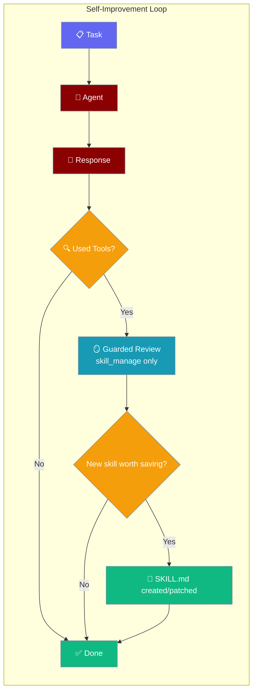
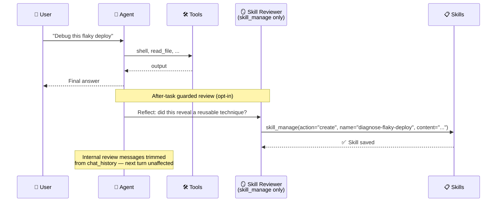
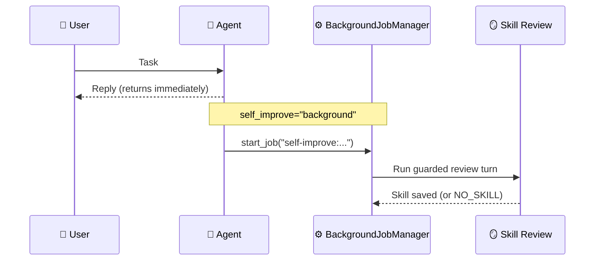
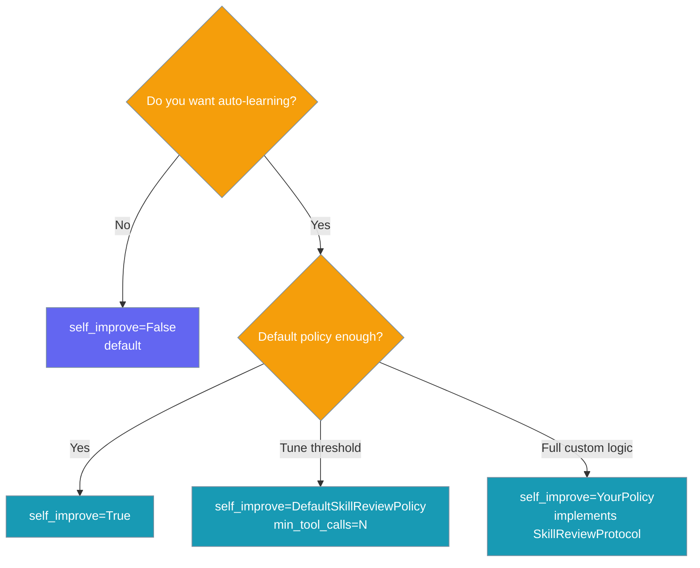
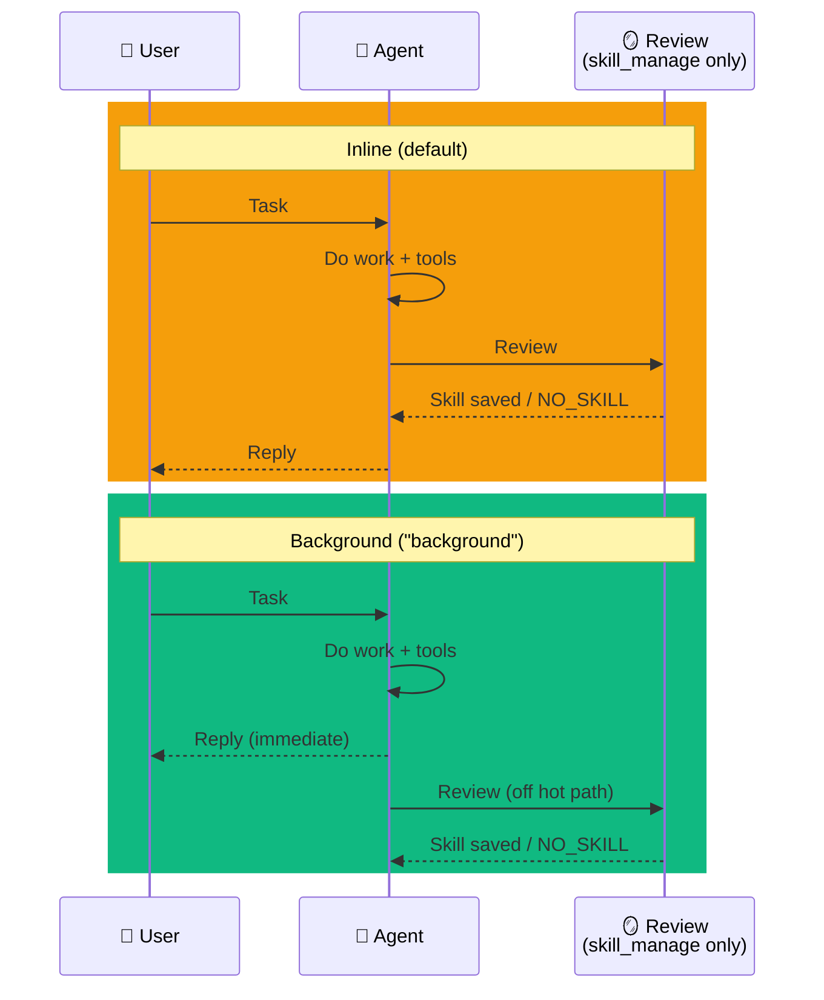

Enable `self_improve=True` on an agent and after every task it asks itself "did I just learn something reusable?" — if yes, it writes or patches a skill for next time. Use `self_improve="background"` to reply first and run the review off the hot path.

<Note>
**Before you run any example:**
- Install the SDK: `pip install praisonaiagents`
- Set your key: `export OPENAI_API_KEY=sk-...`
- Every learning example needs `tools=` — the review gate only fires after a real tool call.
- `SKILL_WRITE_APPROVAL` defaults on, so new skills are staged for approval. Set `SKILL_WRITE_APPROVAL=0` for direct local writes.
- Windows: run with `python script.py`.
</Note>

```python
from praisonaiagents import Agent

agent = Agent(
    name="Engineer",
    instructions="Help debug and fix issues. Read project files first.",
    self_improve=True,
    tools=["read_file"],
)
agent.start(
    "Debug this flaky deploy script and fix it. "
    "Read deploy.sh in the current directory first."
)
```


The user assigns a task; after each run the agent may write or patch a skill when it learns something reusable.




## Quick Start

<Steps>
<Step title="Simple Usage">
```python
from praisonaiagents import Agent

agent = Agent(
    name="Engineer",
    instructions="Help debug and fix issues. Read project files first.",
    self_improve=True,
    tools=["read_file"],
)
agent.start(
    "Debug this flaky deploy script and fix it. "
    "Read deploy.sh in the current directory first."
)
```

After the task ends, the agent runs a guarded review pass — but only if at least one tool was used. If a reusable technique emerged it may write a SKILL.md; otherwise it replies `NO_SKILL`.
</Step>

<Step title="With Configuration">
Require at least three tool calls before a review fires:

```python
from praisonaiagents import Agent

class HeavySessionPolicy:
    def should_review(self, trajectory):
        return len(trajectory.get("tools_used", [])) >= 3

    def review_prompt(self, trajectory):
        return (
            "If a reusable technique emerged, call skill_manage to save it. "
            "Otherwise reply NO_SKILL."
        )

agent = Agent(
    name="Engineer",
    instructions="Help debug and fix issues. Read project files first.",
    self_improve=HeavySessionPolicy(),
    tools=["read_file"],
)
agent.start(
    "Debug this flaky deploy script. "
    "Read deploy.sh, README-deploy.md, and check-staging.sh in order."
)
```
</Step>

<Step title="Background Mode (no added latency)">
Reply first, run the review turn off the hot path — ideal for latency-sensitive gateway and bot agents:

```python
from praisonaiagents import Agent

agent = Agent(
    name="Support Bot",
    instructions="Answer customer questions. Use read_file for playbooks when needed.",
    self_improve="background",
    tools=["read_file"],
)
agent.start("How do I reset my password? Check reset-playbook.md if needed.")
# Reply returns immediately; the skill review runs in the background after tool use.
```
</Step>
</Steps>

---

## How It Works



<Note>
The task phase requires `tools=` on the Agent. Without a tool call, the default review gate exits early and no skill is written.
</Note>

After each task, if `self_improve` is enabled:

1. The policy checks `should_review(trajectory)` — by default, only when ≥1 tool was called
2. The agent runs one extra turn with **only** `skill_manage` available
3. The agent calls `skill_manage` to create/patch a skill, or replies `NO_SKILL`
4. The internal review exchange is trimmed back out of `chat_history`

---

## Execution Modes

`self_improve` accepts strings that pick *when* the review runs relative to the reply.



- **Inline** (`True`, `"inline"`, `"blocking"`, `"sync"`) — the review turn runs before the reply returns. Simplest; adds one extra LLM round-trip to reply latency.
- **Background** (`"background"`, `"async"`) — the reply returns first, then the review runs off the hot path on the shared `BackgroundJobManager`. No added user-visible latency.

Prefer **background** for latency-sensitive gateway or bot agents; prefer **inline** for batch jobs where latency does not matter.

<Note>
- **Best-effort fallback** — if the background runner is unreachable, the review runs inline rather than being dropped.
- **Gateway clones** — `clone_for_channel()` preserves the background mode on per-channel gateway clones.
</Note>

---

## Configuration Options

### `Agent(self_improve=...)`

| Value | Behavior |
|-------|----------|
| `False` *(default)* | Off. No review pass runs. |
| `True` | On, review runs **inline** (blocks the reply) with `DefaultSkillReviewPolicy()` (reviews when ≥1 tool was used). |
| `"inline"` / `"blocking"` / `"sync"` | Same as `True`. |
| `"background"` / `"async"` | On, review runs **after the reply** on the shared background job runner. Recommended for gateways/bots. |
| `DefaultSkillReviewPolicy(min_tool_calls=N)` | On (inline), requires at least N tool calls before a review fires. |
| Any object implementing `SkillReviewProtocol` | On (inline), with your custom policy. |

<Note>
An unrecognised string (e.g. a typo like `"backround"`) disables self-improvement and logs a warning rather than silently enabling a review on every reply.
</Note>

### `DefaultSkillReviewPolicy`

| Option | Type | Default | Description |
|--------|------|---------|-------------|
| `min_tool_calls` | `int` | `1` | Minimum tools used during the task before a review fires. Clamped to `>= 1`. |
| `MAX_PROMPT_CHARS` *(class constant)* | `int` | `500` | Hard cap on how much of the original prompt is echoed into the review directive. |

### `SkillReviewProtocol` (custom policy)

| Method | Signature | Purpose |
|--------|-----------|---------|
| `should_review` | `(trajectory: dict) -> bool` | Decide whether to run the review pass at all. |
| `review_prompt` | `(trajectory: dict) -> str` | Build the directive prompt for the guarded turn. |

`trajectory` shape: `{"prompt": str, "response": str, "tools_used": list[str]}`.

---

## Choosing What to Pass



---

## Inline vs Background

Choose based on how latency-sensitive the reply is.



| Mode | Reply latency | Best for |
|------|--------------|----------|
| `True` / `"inline"` *(default)* | Includes one extra LLM turn | Batch scripts, short-lived agents, tests |
| `"background"` | Immediate | Chatbots, gateway/long-lived agents, Slack/Discord bots |

---

## Common Patterns

### Agent that gets sharper over time

```python
from praisonaiagents import Agent

engineer = Agent(
    name="Backend Engineer",
    instructions="Diagnose and fix production issues. Read logs and scripts first.",
    self_improve=True,
    tools=["read_file"],
)

# Day 1: agent solves a flaky-deploy problem from scratch.
engineer.start(
    "Why does deploy fail intermittently on the staging cluster? "
    "Read deploy.sh and check-staging.sh first."
)
# After answering, the review MAY write a skill (e.g. diagnose-flaky-deploy) — not guaranteed.

# Day 2: if a skill was saved, it is now available and the agent can reuse it.
engineer.start("Staging deploys are flaky again — same as last week?")
```

### Conservative policy (only review heavy sessions)

```python
from praisonaiagents import Agent

class MinToolsPolicy:
    def should_review(self, trajectory):
        return len(trajectory.get("tools_used", [])) >= 3

    def review_prompt(self, trajectory):
        return "Save a skill via skill_manage if reusable; else NO_SKILL."

agent = Agent(
    name="Researcher",
    instructions="Research and report.",
    self_improve=MinToolsPolicy(),
    tools=["read_file"],
)
agent.start(
    "Debug this flaky deploy script. "
    "Read deploy.sh, README-deploy.md, and check-staging.sh."
)
```

### Fully custom policy

```python
from praisonaiagents import Agent

class TimedReviewPolicy:
    """Only review every 5th tool-using session."""
    def __init__(self):
        self.counter = 0

    def should_review(self, trajectory):
        if not trajectory.get("tools_used"):
            return False
        self.counter += 1
        return self.counter % 5 == 0

    def review_prompt(self, trajectory):
        return (
            "Reflect on this session. If a reusable technique emerged, "
            "call skill_manage to save it. Otherwise reply NO_SKILL."
        )

agent = Agent(
    name="Worker",
    instructions="Read provided files carefully.",
    self_improve=TimedReviewPolicy(),
    tools=["read_file"],
)
for prompt in [
    "Read deploy.sh and summarize the flake.",
    "Read README-deploy.md and list the checklist.",
    "Read check-staging.sh — what does it simulate?",
    "Read deploy.sh — what line causes random failure?",
    "Read all three files and write a one-paragraph runbook.",
]:
    agent.start(prompt)
```

---

## Guarantees

<Note>
- **Off by default** — explicit opt-in via a single switch.
- **Never runs with the full toolset** — the review turn sees only `skill_manage`.
- **Re-entrancy guarded** — a review turn cannot trigger another review.
- **Chat-history isolated** — the review exchange is trimmed back out after the pass; chatbots and REPLs are unaffected.
- **Best-effort** — any failure is logged and swallowed; your main task response is never affected.
- **Distinct from `reflection`** — `reflection` retries for answer quality within a task; `self_improve` captures durable skills for next time. They are independent flags and compose cleanly.
</Note>

<Note>
**Background mode guarantees**

- **Reply first** — the user-visible response returns before the review LLM turn starts.
- **Serialized per agent** — a background review holds a per-agent lock, so the next turn on the same agent waits its turn instead of racing chat-history state.
- **Unique job id** — every review gets a fresh id, so overlapping reviews never overwrite each other in the background job map.
- **Falls back to inline** — if the background job runner is unreachable, the review runs inline instead of being silently dropped.
- **Same guardrails as inline** — restricted-tool review turn, chat-history isolation, best-effort failure swallowing all still apply.
</Note>

---

## Best Practices

<AccordionGroup>
<Accordion title="Start with True, then tune">
The default policy is conservative (≥1 tool call). Only switch to a custom `min_tool_calls` when you see review LLM cost you want to cut.
</Accordion>

<Accordion title="Pair with named, persistent skill directories">
Skills written by the review go to the first existing skill directory (project `.praisonai/skills/`, then ancestors, then `~/.praisonai/skills/`). Make sure the right one exists so captures land where you want them.
</Accordion>

<Accordion title="Don't confuse with reflection">
`reflection` improves *this* answer; `self_improve` captures a skill for *next* time. They compose cleanly — turn both on if you want both behaviors.
</Accordion>

<Accordion title="Use the protocol for fully custom policies">
Any object with `should_review` and `review_prompt` satisfies `SkillReviewProtocol`. Use this to gate on cost, time-of-day, session length, or any other signal.
</Accordion>

<Accordion title="Use background mode for chatbots and gateways">
If your agent lives inside a chatbot, gateway, or bot process where users notice reply latency, pass `self_improve="background"` instead of `True`. The review still runs after every task — it just doesn't sit in front of the reply.

```python
from praisonaiagents import Agent

agent = Agent(name="Bot", self_improve="background", tools=["read_file"])
```
</Accordion>

<Accordion title="Know how SKILL_WRITE_APPROVAL stages writes">
`SKILL_WRITE_APPROVAL` is on by default, so a review that decides to save a skill stages it as a pending proposal instead of writing to disk. Approve it later, or set `SKILL_WRITE_APPROVAL=0` for direct writes in trusted local tests.

```python
import os
os.environ["SKILL_WRITE_APPROVAL"] = "0"  # direct writes — local/trusted only

from praisonaiagents import Agent

agent = Agent(name="Engineer", self_improve=True, tools=["read_file"])
agent.start("Read deploy.sh and fix the flake.")
```
</Accordion>
</AccordionGroup>

---

## Related

<CardGroup cols={2}>
<Card title="Skill Manage" icon="wand-magic-sparkles" href="/docs/features/skill-manage">
  The underlying tool the review uses to create and patch skills
</Card>
<Card title="Skills" icon="puzzle-piece" href="/docs/features/skills">
  What skills are and how agents use them
</Card>
<Card title="Hooks" icon="webhook" href="/docs/features/hooks">
  Where the review trigger is wired — the after-agent funnel
</Card>
<Card title="Self Reflection" icon="rotate" href="/docs/features/selfreflection">
  Improves answer quality within a task
</Card>
</CardGroup>
