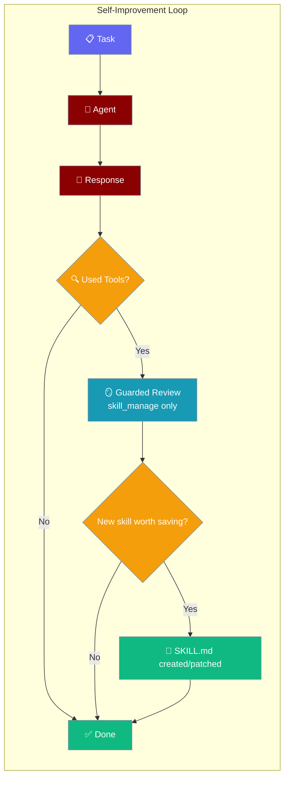
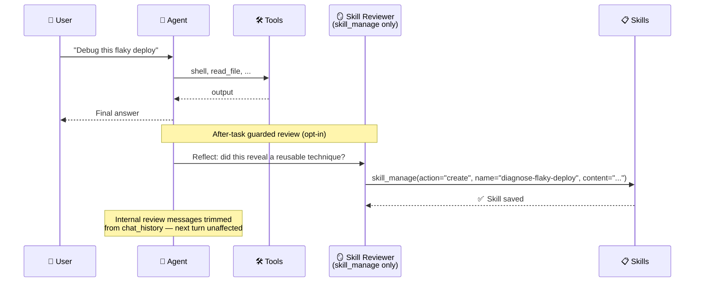
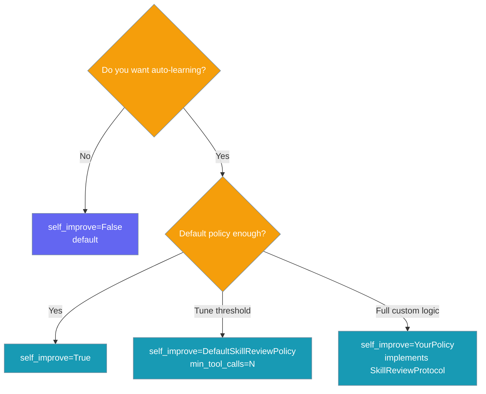

Enable `self_improve=True` on an agent and after every task it asks itself "did I just learn something reusable?" — if yes, it writes or patches a skill for next time.

```python
from praisonaiagents import Agent

agent = Agent(
    name="Engineer",
    instructions="Help debug and fix issues.",
    self_improve=True,
)
agent.start("Debug this flaky deploy script and fix it.")
```


The user assigns a task; after each run the agent may write or patch a skill when it learns something reusable.




## Quick Start

<Steps>
<Step title="Simple Usage">
```python
from praisonaiagents import Agent

agent = Agent(
    name="Engineer",
    instructions="Help debug and fix issues.",
    self_improve=True,
)
agent.start("Debug this flaky deploy script and fix it.")
```

After the task ends, the agent runs a guarded review pass. If it found a reusable technique, it writes a SKILL.md for next time.
</Step>

<Step title="With Configuration">
Require at least three tool calls before a review fires:

```python
from praisonaiagents import Agent

class HeavySessionPolicy:
    def should_review(self, trajectory):
        return len(trajectory.get("tools_used", [])) >= 3

    def review_prompt(self, trajectory):
        return (
            "If a reusable technique emerged, call skill_manage to save it. "
            "Otherwise reply NO_SKILL."
        )

agent = Agent(
    name="Engineer",
    instructions="Help debug and fix issues.",
    self_improve=HeavySessionPolicy(),
)
```
</Step>
</Steps>

---

## How It Works



After each task, if `self_improve` is enabled:

1. The policy checks `should_review(trajectory)` — by default, only when ≥1 tool was called
2. The agent runs one extra turn with **only** `skill_manage` available
3. The agent calls `skill_manage` to create/patch a skill, or replies `NO_SKILL`
4. The internal review exchange is trimmed back out of `chat_history`

---

## Configuration Options

### `Agent(self_improve=...)`

| Value | Behavior |
|-------|----------|
| `False` (default) | Off. No review pass runs. |
| `True` | On with `DefaultSkillReviewPolicy()` (reviews when ≥1 tool was used). |
| `DefaultSkillReviewPolicy(min_tool_calls=N)` | On, requires at least N tool calls before a review fires. |
| Any object implementing `SkillReviewProtocol` | On, with your custom policy. |

### `DefaultSkillReviewPolicy`

| Option | Type | Default | Description |
|--------|------|---------|-------------|
| `min_tool_calls` | `int` | `1` | Minimum tools used during the task before a review fires. Clamped to `>= 1`. |
| `MAX_PROMPT_CHARS` *(class constant)* | `int` | `500` | Hard cap on how much of the original prompt is echoed into the review directive. |

### `SkillReviewProtocol` (custom policy)

| Method | Signature | Purpose |
|--------|-----------|---------|
| `should_review` | `(trajectory: dict) -> bool` | Decide whether to run the review pass at all. |
| `review_prompt` | `(trajectory: dict) -> str` | Build the directive prompt for the guarded turn. |

`trajectory` shape: `{"prompt": str, "response": str, "tools_used": list[str]}`.

---

## Choosing What to Pass



---

## Common Patterns

### Agent that gets sharper over time

```python
from praisonaiagents import Agent

engineer = Agent(
    name="Backend Engineer",
    instructions="Diagnose and fix production issues.",
    self_improve=True,
)

# Day 1: agent solves a flaky-deploy problem from scratch.
engineer.start("Why does deploy fail intermittently on the staging cluster?")
# After answering, writes skill: "diagnose-flaky-deploy"

# Day 2: the same skill is now available and the agent uses it directly.
engineer.start("Staging deploys are flaky again — same as last week?")
```

### Conservative policy (only review heavy sessions)

```python
from praisonaiagents import Agent

class MinToolsPolicy:
    def should_review(self, trajectory):
        return len(trajectory.get("tools_used", [])) >= 3

    def review_prompt(self, trajectory):
        return "Save a skill via skill_manage if reusable; else NO_SKILL."

agent = Agent(
    name="Researcher",
    instructions="Research and report.",
    self_improve=MinToolsPolicy(),
)
```

### Fully custom policy

```python
from praisonaiagents import Agent

class TimedReviewPolicy:
    """Only review every 5th tool-using session."""
    def __init__(self):
        self.counter = 0

    def should_review(self, trajectory):
        if not trajectory.get("tools_used"):
            return False
        self.counter += 1
        return self.counter % 5 == 0

    def review_prompt(self, trajectory):
        return (
            "Reflect on this session. If a reusable technique emerged, "
            "call skill_manage to save it. Otherwise reply NO_SKILL."
        )

agent = Agent(name="Worker", self_improve=TimedReviewPolicy())
```

---

## Guarantees

<Note>
- **Off by default** — explicit opt-in via a single switch.
- **Never runs with the full toolset** — the review turn sees only `skill_manage`.
- **Re-entrancy guarded** — a review turn cannot trigger another review.
- **Chat-history isolated** — the review exchange is trimmed back out after the pass; chatbots and REPLs are unaffected.
- **Best-effort** — any failure is logged and swallowed; your main task response is never affected.
- **Distinct from `reflection`** — `reflection` retries for answer quality within a task; `self_improve` captures durable skills for next time. They are independent flags and compose cleanly.
</Note>

---

## Best Practices

<AccordionGroup>
<Accordion title="Start with True, then tune">
The default policy is conservative (≥1 tool call). Only switch to a custom `min_tool_calls` when you see review LLM cost you want to cut.
</Accordion>

<Accordion title="Pair with named, persistent skill directories">
Skills written by the review go to the first existing skill directory (project `.praisonai/skills/`, then ancestors, then `~/.praisonai/skills/`). Make sure the right one exists so captures land where you want them.
</Accordion>

<Accordion title="Don't confuse with reflection">
`reflection` improves *this* answer; `self_improve` captures a skill for *next* time. They compose cleanly — turn both on if you want both behaviors.
</Accordion>

<Accordion title="Use the protocol for fully custom policies">
Any object with `should_review` and `review_prompt` satisfies `SkillReviewProtocol`. Use this to gate on cost, time-of-day, session length, or any other signal.
</Accordion>
</AccordionGroup>

---

## Related

<CardGroup cols={2}>
<Card title="Skill Manage" icon="wand-magic-sparkles" href="/docs/features/skill-manage">
  The underlying tool the review uses to create and patch skills
</Card>
<Card title="Skills" icon="puzzle-piece" href="/docs/features/skills">
  What skills are and how agents use them
</Card>
<Card title="Hooks" icon="webhook" href="/docs/features/hooks">
  Where the review trigger is wired — the after-agent funnel
</Card>
<Card title="Self Reflection" icon="rotate" href="/docs/features/selfreflection">
  Improves answer quality within a task
</Card>
</CardGroup>
