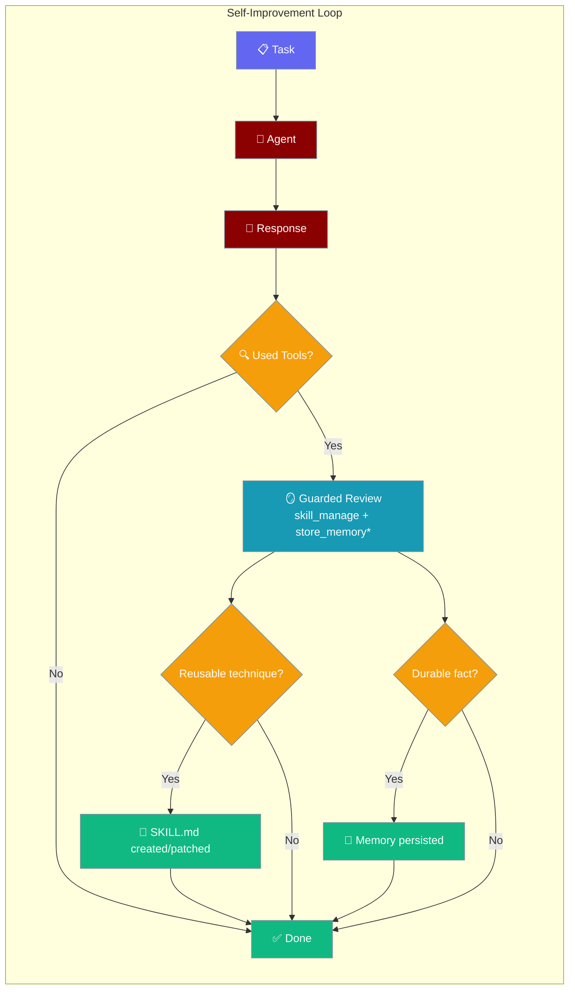
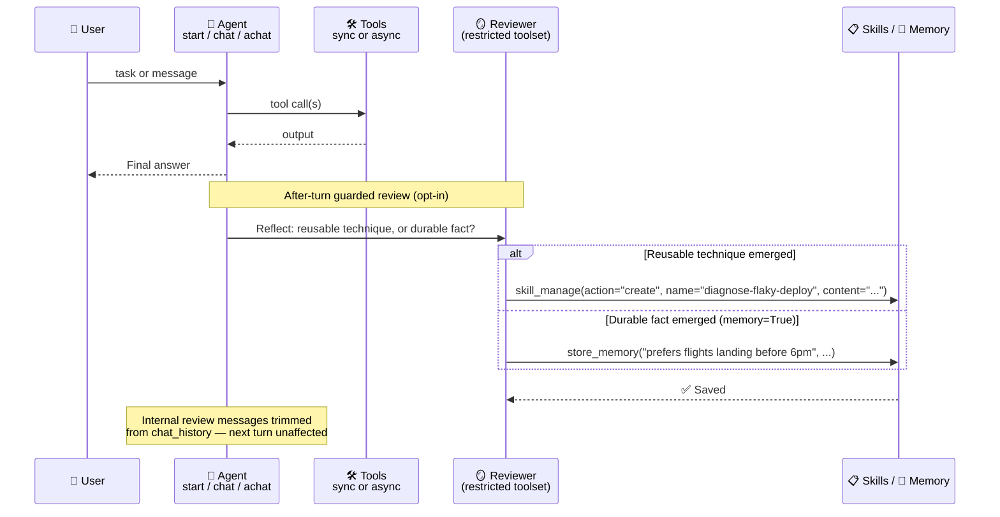
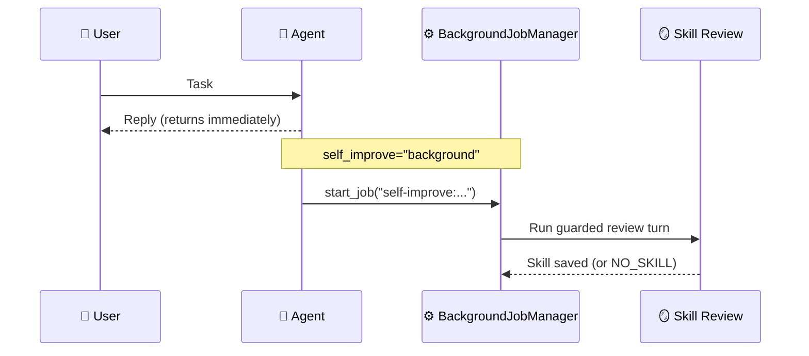
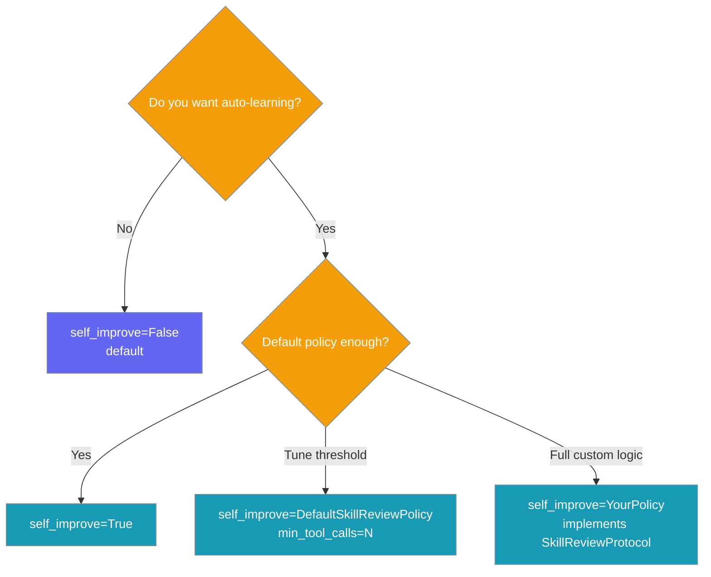
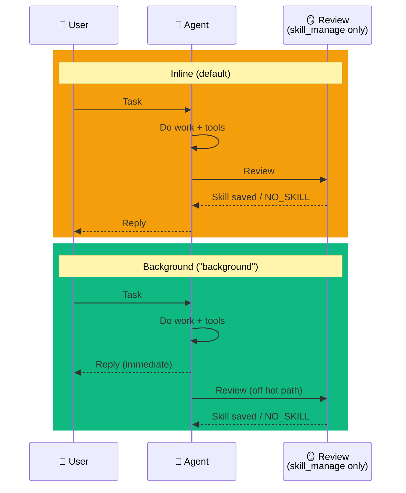

Enable `self_improve=True` on an agent and after every task it asks itself "did I just learn something reusable, or a durable fact worth remembering?" — if yes, it writes/patches a skill and/or persists a memory for next time. Use `self_improve="background"` to reply first and run the review off the hot path.

<Note>
**Before you run any example:**
- Install the SDK: `pip install praisonaiagents`
- Set your key: `export OPENAI_API_KEY=sk-...`
- Every learning example needs `tools=` — the review gate only fires after a real tool call.
- `SKILL_WRITE_APPROVAL` defaults on, so new skills are staged for approval. Set `SKILL_WRITE_APPROVAL=0` for direct local writes.
- Windows: run with `python script.py`.
</Note>

<Note>
The string form of `self_improve=` must name a valid preset (`inline`, `blocking`, `sync`, `background`, …). A typo raises `ValueError` at construction time with a "Did you mean ...?" suggestion — see [Fail-Loud Defaults](/features/fail-loud-defaults). Matching is case-insensitive, whitespace-tolerant, and treats `-`/`_` interchangeably.
</Note>

```python
from praisonaiagents import Agent

agent = Agent(
    name="Engineer",
    instructions="Help debug and fix issues. Read project files first.",
    self_improve=True,
    tools=["read_file"],
)
agent.start(
    "Debug this flaky deploy script and fix it. "
    "Read deploy.sh in the current directory first."
)
```

<Note>
**Supported invocation paths.** `self_improve` triggers the review after any of these end-of-turn moments — pick whichever fits your app:

- `agent.start(prompt)` — the task-execution path.
- `agent.chat(prompt)` — the conversational path (chatbots, REPLs).
- `agent.achat(prompt)` — the async conversational path (gateways, servers).
- Any custom loop that ends by returning through the after-agent hook.

Async tool calls (via `execute_tool_async` or async tool functions) are tracked identically to sync ones. Requires **`praisonaiagents >= 1.6.151`** — earlier versions silently skipped the review on `chat` / `achat` paths (see Troubleshooting below).
</Note>


The user assigns a task; after each run the agent may write or patch a skill when it learns something reusable.



```mermaid
graph LR
    subgraph "Self-Improvement Loop"
        T[📋 Task] --> A[🤖 Agent]
        A --> R[💬 Response]
        R --> G{🔍 Used Tools?}
        G -->|No| Done[✅ Done]
        G -->|Yes| Rev[🪞 Guarded Review<br/>skill_manage + store_memory*]
        Rev --> D1{Reusable technique?}
        Rev --> D2{Durable fact?}
        D1 -->|Yes| S[💾 SKILL.md created/patched]
        D2 -->|Yes| M[🧠 Memory persisted]
        D1 -->|No| Done
        D2 -->|No| Done
        S --> Done
        M --> Done
    end

    classDef input fill:#6366F1,stroke:#7C90A0,color:#fff
    classDef agent fill:#8B0000,stroke:#7C90A0,color:#fff
    classDef gate fill:#F59E0B,stroke:#7C90A0,color:#fff
    classDef review fill:#189AB4,stroke:#7C90A0,color:#fff
    classDef done fill:#10B981,stroke:#7C90A0,color:#fff

    class T input
    class A,R agent
    class G,D1,D2 gate
    class Rev review
    class S,M,Done done
```

<Note>
`store_memory` is only added to the review toolset when the agent has `memory=True`. Skill-only agents are unchanged.
</Note>

## Quick Start

<Steps>
<Step title="Simple Usage">
```python
from praisonaiagents import Agent

agent = Agent(
    name="Engineer",
    instructions="Help debug and fix issues. Read project files first.",
    self_improve=True,
    tools=["read_file"],
)
agent.start(
    "Debug this flaky deploy script and fix it. "
    "Read deploy.sh in the current directory first."
)
```

After the task ends, the agent runs a guarded review pass — but only if at least one tool was used. If a reusable technique emerged it may write a SKILL.md; otherwise it replies `NO_SKILL`.
</Step>

<Step title="With Configuration">
Require at least three tool calls before a review fires:

```python
from praisonaiagents import Agent

class HeavySessionPolicy:
    def should_review(self, trajectory):
        return len(trajectory.get("tools_used", [])) >= 3

    def review_prompt(self, trajectory):
        return (
            "If a reusable technique emerged, call skill_manage to save it. "
            "Otherwise reply NO_SKILL."
        )

agent = Agent(
    name="Engineer",
    instructions="Help debug and fix issues. Read project files first.",
    self_improve=HeavySessionPolicy(),
    tools=["read_file"],
)
agent.start(
    "Debug this flaky deploy script. "
    "Read deploy.sh, README-deploy.md, and check-staging.sh in order."
)
```
</Step>

<Step title="Background Mode (no added latency)">
Reply first, run the review turn off the hot path — ideal for latency-sensitive gateway and bot agents:

```python
from praisonaiagents import Agent

agent = Agent(
    name="Support Bot",
    instructions="Answer customer questions. Use read_file for playbooks when needed.",
    self_improve="background",
    tools=["read_file"],
)
agent.start("How do I reset my password? Check reset-playbook.md if needed.")
# Reply returns immediately; the skill review runs in the background after tool use.
```
</Step>

<Step title="Chat and Async Chat">
The same `self_improve` flag works with `chat()` / `achat()` — the review fires after any turn that used at least one tool.

```python
import asyncio
from praisonaiagents import Agent

agent = Agent(
    name="Support",
    instructions="Answer customer questions. Use read_file for playbooks when needed.",
    self_improve=True,
    tools=["read_file"],
)

# Sync chat — review runs after the reply
agent.chat("How do I reset my password? Check reset-playbook.md if needed.")

# Async chat — same behaviour, non-blocking
asyncio.run(agent.achat("Escalate this ticket. Check escalation-rules.md first."))
```

The review pass is scheduled after every chat turn that used ≥1 tool — inline for `self_improve=True`, off the hot path for `self_improve="background"`.
</Step>

<Step title="Background + Memory (grow skills and user model)">
With `memory=True`, the same guarded review pass can also persist a durable fact via `store_memory` — closing the learning loop for memory, not just skills.

```python
from praisonaiagents import Agent

agent = Agent(
    name="Personal Assistant",
    instructions="You are a personal assistant on Telegram.",
    self_improve="background",   # skills: guarded background review
    memory=True,                 # memory: same pass also persists durable facts
    tools=["read_file"],
)
agent.chat("I prefer flights that land before 6pm — book Delhi → Bangalore next Friday.")
# Reply returns immediately. Off the hot path, the guarded review may:
#   • call skill_manage(...) if a reusable technique emerged, and/or
#   • call store_memory("prefers flights landing before 6pm", ...) to remember the preference.
```
</Step>
</Steps>

---

## How It Works


```mermaid
sequenceDiagram
    participant U as 👤 User
    participant A as 🤖 Agent<br/>start / chat / achat
    participant T as 🛠️ Tools<br/>sync or async
    participant R as 🪞 Reviewer<br/>(restricted toolset)
    participant S as 📋 Skills / 🧠 Memory

    U->>A: task or message
    A->>T: tool call(s)
    T-->>A: output
    A-->>U: Final answer
    Note over A,R: After-turn guarded review (opt-in)
    A->>R: Reflect: reusable technique, or durable fact?
    alt Reusable technique emerged
        R->>S: skill_manage(action="create", name="diagnose-flaky-deploy", content="...")
    else Durable fact emerged (memory=True)
        R->>S: store_memory("prefers flights landing before 6pm", ...)
    end
    S-->>R: ✅ Saved
    Note over A: Internal review messages trimmed<br/>from chat_history — next turn unaffected
```

<Note>
The task phase requires `tools=` on the Agent. Without a tool call, the default review gate exits early and no skill is written.
</Note>

After each **turn** — whether you called `agent.start()`, `agent.chat()`, or `agent.achat()`, and whether the tool ran sync or async — if `self_improve` is enabled:

1. The policy checks `should_review(trajectory)` — by default, only when ≥1 tool was called
2. The agent runs one extra turn with a restricted toolset — `skill_manage` always, plus `store_memory` when the agent has `memory=True`
3. The agent calls `skill_manage` to create/patch a skill, and/or `store_memory` to persist a durable fact, or replies `NO_SKILL`
4. The internal review exchange is trimmed back out of `chat_history`

---

## Execution Modes

`self_improve` accepts strings that pick *when* the review runs relative to the reply.


```mermaid
sequenceDiagram
    participant U as 👤 User
    participant A as 🤖 Agent
    participant B as ⚙️ BackgroundJobManager
    participant R as 🪞 Skill Review

    U->>A: Task
    A-->>U: Reply (returns immediately)
    Note over A,B: self_improve="background"
    A->>B: start_job("self-improve:...")
    B->>R: Run guarded review turn
    R-->>B: Skill saved (or NO_SKILL)
```

- **Inline** (`True`, `"inline"`, `"blocking"`, `"sync"`) — the review turn runs before the reply returns. Simplest; adds one extra LLM round-trip to reply latency.
- **Background** (`"background"`, `"async"`) — the reply returns first, then the review runs off the hot path on the shared `BackgroundJobManager`. No added user-visible latency.

Prefer **background** for latency-sensitive gateway or bot agents; prefer **inline** for batch jobs where latency does not matter.

<Note>
- **Best-effort fallback** — if the background runner is unreachable, the review runs inline rather than being dropped.
- **Gateway clones** — `clone_for_channel()` preserves the background mode on per-channel gateway clones.
</Note>

---

## Configuration Options

### `Agent(self_improve=...)`

| Value | Behavior |
|-------|----------|
| `False` *(default)* | Off. No review pass runs. |
| `True` | On, review runs **inline** (blocks the reply) with `DefaultSkillReviewPolicy()` (reviews when ≥1 tool was used). |
| `"inline"` / `"blocking"` / `"sync"` | Same as `True`. |
| `"background"` / `"async"` | On, review runs **after the reply** on the shared background job runner. Recommended for gateways/bots. |
| `DefaultSkillReviewPolicy(min_tool_calls=N)` | On (inline), requires at least N tool calls before a review fires. |
| Any object implementing `SkillReviewProtocol` | On (inline), with your custom policy. |

<Note>
An unrecognised string (e.g. a typo like `"backround"`) disables self-improvement and logs a warning rather than silently enabling a review on every reply.
</Note>

When the agent also has `memory=True`, the guarded review turn additionally exposes `store_memory` so the same pass can persist a durable fact off the hot path. The set stays restricted — never the agent's full toolset.

### `DefaultSkillReviewPolicy`

| Option | Type | Default | Description |
|--------|------|---------|-------------|
| `min_tool_calls` | `int` | `1` | Minimum tools used during the task before a review fires. Clamped to `>= 1`. |
| `MAX_PROMPT_CHARS` *(class constant)* | `int` | `500` | Hard cap on how much of the original prompt is echoed into the review directive. |

### `SkillReviewProtocol` (custom policy)

| Method | Signature | Purpose |
|--------|-----------|---------|
| `should_review` | `(trajectory: dict) -> bool` | Decide whether to run the review pass at all. |
| `review_prompt` | `(trajectory: dict) -> str` | Build the directive prompt for the guarded turn. |

`trajectory` shape: `{"prompt": str, "response": str, "tools_used": list[str]}`.

---

## Choosing What to Pass


```mermaid
graph TB
    Q{Do you want auto-learning?} -->|No| Off[self_improve=False<br/>default]
    Q -->|Yes| Q2{Default policy enough?}
    Q2 -->|Yes| On[self_improve=True]
    Q2 -->|Tune threshold| Tune[self_improve=DefaultSkillReviewPolicy<br/>min_tool_calls=N]
    Q2 -->|Full custom logic| Custom[self_improve=YourPolicy<br/>implements SkillReviewProtocol]

    classDef q fill:#F59E0B,stroke:#7C90A0,color:#fff
    classDef opt fill:#189AB4,stroke:#7C90A0,color:#fff
    classDef off fill:#6366F1,stroke:#7C90A0,color:#fff

    class Q,Q2 q
    class On,Tune,Custom opt
    class Off off
```

---

## Inline vs Background

Choose based on how latency-sensitive the reply is.


```mermaid
sequenceDiagram
    participant U as 👤 User
    participant A as 🤖 Agent
    participant R as 🪞 Review<br/>(skill_manage only)

    rect rgb(245, 158, 11)
    Note over U,R: Inline (default)
    U->>A: Task
    A->>A: Do work + tools
    A->>R: Review
    R-->>A: Skill saved / NO_SKILL
    A-->>U: Reply
    end

    rect rgb(16, 185, 129)
    Note over U,R: Background ("background")
    U->>A: Task
    A->>A: Do work + tools
    A-->>U: Reply (immediate)
    A->>R: Review (off hot path)
    R-->>A: Skill saved / NO_SKILL
    end
```

| Mode | Reply latency | Best for |
|------|--------------|----------|
| `True` / `"inline"` *(default)* | Includes one extra LLM turn | Batch scripts, short-lived agents, tests |
| `"background"` | Immediate | Chatbots, gateway/long-lived agents, Slack/Discord bots |

---

## Common Patterns

### Agent that gets sharper over time

```python
from praisonaiagents import Agent

engineer = Agent(
    name="Backend Engineer",
    instructions="Diagnose and fix production issues. Read logs and scripts first.",
    self_improve=True,
    tools=["read_file"],
)

# Day 1: agent solves a flaky-deploy problem from scratch.
engineer.start(
    "Why does deploy fail intermittently on the staging cluster? "
    "Read deploy.sh and check-staging.sh first."
)
# After answering, the review MAY write a skill (e.g. diagnose-flaky-deploy) — not guaranteed.

# Day 2: if a skill was saved, it is now available and the agent can reuse it.
engineer.start("Staging deploys are flaky again — same as last week?")
```

### Persistent assistant that grows both skills and user model

```python
from praisonaiagents import Agent

assistant = Agent(
    name="Concierge",
    instructions=(
        "You are a long-running concierge for one user across many sessions. "
        "Help with travel, calendar and reminders."
    ),
    self_improve="background",   # skills grow autonomously
    memory=True,                 # user model grows autonomously — same pass
    tools=["read_file"],
)

# Turn 1 — user reveals a preference
assistant.chat("I only fly economy on flights under 4 hours; premium economy otherwise.")

# Turn 2 — a totally new session (or process). The reply already reflects it.
assistant.chat("Find me options for Delhi → Singapore next month.")
# The background review from turn 1 may have persisted the seat-class rule via store_memory;
# on turn 2 memory recall surfaces it, so the agent proposes premium economy without asking.
```

### Conservative policy (only review heavy sessions)

```python
from praisonaiagents import Agent

class MinToolsPolicy:
    def should_review(self, trajectory):
        return len(trajectory.get("tools_used", [])) >= 3

    def review_prompt(self, trajectory):
        return "Save a skill via skill_manage if reusable; else NO_SKILL."

agent = Agent(
    name="Researcher",
    instructions="Research and report.",
    self_improve=MinToolsPolicy(),
    tools=["read_file"],
)
agent.start(
    "Debug this flaky deploy script. "
    "Read deploy.sh, README-deploy.md, and check-staging.sh."
)
```

### Fully custom policy

```python
from praisonaiagents import Agent

class TimedReviewPolicy:
    """Only review every 5th tool-using session."""
    def __init__(self):
        self.counter = 0

    def should_review(self, trajectory):
        if not trajectory.get("tools_used"):
            return False
        self.counter += 1
        return self.counter % 5 == 0

    def review_prompt(self, trajectory):
        return (
            "Reflect on this session. If a reusable technique emerged, "
            "call skill_manage to save it. Otherwise reply NO_SKILL."
        )

agent = Agent(
    name="Worker",
    instructions="Read provided files carefully.",
    self_improve=TimedReviewPolicy(),
    tools=["read_file"],
)
for prompt in [
    "Read deploy.sh and summarize the flake.",
    "Read README-deploy.md and list the checklist.",
    "Read check-staging.sh — what does it simulate?",
    "Read deploy.sh — what line causes random failure?",
    "Read all three files and write a one-paragraph runbook.",
]:
    agent.start(prompt)
```

---

## Guarantees

<Note>
- **Off by default** — explicit opt-in via a single switch.
- **Never runs with the full toolset** — the review turn sees only `skill_manage` (always) and `store_memory` (only when `memory=True`).
- **Task echo is delimited as untrusted data** — the review directive wraps the original task in `<original_task>…</original_task>` and labels it `UNTRUSTED DATA`, so an injected instruction inside a user message cannot steer `store_memory` / `skill_manage`.
- **Re-entrancy guarded** — a review turn cannot trigger another review.
- **Chat-history isolated** — the review exchange is trimmed back out after the pass; chatbots and REPLs are unaffected.
- **Best-effort** — any failure is logged and swallowed; your main task response is never affected.
- **Distinct from `reflection`** — `reflection` retries for answer quality within a task; `self_improve` captures durable skills for next time. They are independent flags and compose cleanly.
</Note>

<Note>
**Background mode guarantees**

- **Reply first** — the user-visible response returns before the review LLM turn starts.
- **Serialized per agent** — a background review holds a per-agent lock, so the next turn on the same agent waits its turn instead of racing chat-history state.
- **Unique job id** — every review gets a fresh id, so overlapping reviews never overwrite each other in the background job map.
- **Falls back to inline** — if the background job runner is unreachable, the review runs inline instead of being silently dropped.
- **Same guardrails as inline** — restricted-tool review turn, chat-history isolation, best-effort failure swallowing all still apply.
</Note>

---

## Troubleshooting

Ran self-improve and see **no `SKILL.md` on disk**? Work through these four causes in order.

<AccordionGroup>
<Accordion title="1. The review returned NO_SKILL">
The model judged that nothing durable emerged, so it replied `NO_SKILL` and wrote nothing. Enable INFO logging to see the review response:

```python
import logging
logging.basicConfig(level=logging.INFO)
```
</Accordion>

<Accordion title="2. The create was staged for approval">
`SKILL_WRITE_APPROVAL` is on by default, so the review **stages** the skill instead of writing it. Check the pending store:

```python
from praisonaiagents import SkillManager

print(SkillManager().list_pending())   # look for your skill, then approve(id)
```

The staged proposal lives in `~/.praisonai/skills/.pending_skills.json`.
</Accordion>

<Accordion title="3. The file went to user home, not the project cwd">
`./.praisonai/skills/` did not exist, so the write fell back to `~/.praisonai/skills/`. Create the folder so the next run lands in the project:

```bash
mkdir -p .praisonai/skills
```

On a direct write the SDK logs the exact path — grep for `Skill created:` after enabling INFO logging.
</Accordion>

<Accordion title="4. The review pass never ran">
Self-improve only reviews when the task used **at least one tool** — the guarded review skips tool-less tasks. Confirm the agent has `tools=` and that the task actually invoked one.
</Accordion>

<Accordion title="5. Review not firing on agent.chat() / agent.achat()?">
On `praisonaiagents < 1.6.151`, the chat and async-chat paths returned without wiring `tools_used` into the review hook, so the default policy always saw an empty tools list and skipped the review — silently, with no warning. Upgrade to fix:

```bash
pip install -U "praisonaiagents>=1.6.151"
```

Confirm the fix with a one-line reproducer:

```python
from praisonaiagents import Agent

agent = Agent(
    instructions="Read files before answering.",
    self_improve=True,
    tools=["read_file"],
)
agent.chat("Read deploy.sh in the current directory and summarize.")
print("tools_used after turn:", agent._turn_tools_used)
# Expect [] here (buffer is consumed by the hook), but you should see the review turn run.
```

If the review still doesn't run on 1.6.151+, check the other accordions — the most common causes are (a) no `tools=` on the Agent, (b) the task didn't actually call a tool, or (c) `SKILL_WRITE_APPROVAL` staged the create rather than writing directly.
</Accordion>

<Accordion title="6. Review wrote a skill but not a memory (or vice versa)">
Each review is independent: the model persists a skill, a memory, both, or neither based on what actually emerged that turn. Writing one but not the other is normal — a reusable technique doesn't always coincide with a durable user fact.

`store_memory` is only in the review toolset when `memory=True` is set on the Agent. If you expected a memory write but see none, confirm the Agent has `memory=True` (or a `MemoryConfig`). See [Memory](/features/memory) for where the persisted fact lands per backend.

```python
from praisonaiagents import Agent

agent = Agent(
    self_improve="background",
    memory=True,                 # required for store_memory in the review toolset
    tools=["read_file"],
)
```
</Accordion>
</AccordionGroup>

---

## Best Practices

<AccordionGroup>
<Accordion title="Start with True, then tune">
The default policy is conservative (≥1 tool call). Only switch to a custom `min_tool_calls` when you see review LLM cost you want to cut.
</Accordion>

<Accordion title="Pair with named, persistent skill directories">
Skills written by the review land in the project's `./.praisonai/skills/` when that directory exists in the cwd, otherwise in `~/.praisonai/skills/`. Discovery is broader (project → ancestors → user → system), but **writes** only use those two locations — they never walk ancestors. Run `mkdir -p .praisonai/skills` in the project you want captures to accumulate in.
</Accordion>

<Accordion title="Don't confuse with reflection">
`reflection` improves *this* answer; `self_improve` captures a skill for *next* time. They compose cleanly — turn both on if you want both behaviors.
</Accordion>

<Accordion title="Use the protocol for fully custom policies">
Any object with `should_review` and `review_prompt` satisfies `SkillReviewProtocol`. Use this to gate on cost, time-of-day, session length, or any other signal.
</Accordion>

<Accordion title="Use background mode for chatbots and gateways">
If your agent lives inside a chatbot, gateway, or bot process where users notice reply latency, pass `self_improve="background"` instead of `True`. The review still runs after every task — it just doesn't sit in front of the reply.

```python
from praisonaiagents import Agent

agent = Agent(name="Bot", self_improve="background", tools=["read_file"])
```
</Accordion>

<Accordion title="Know how SKILL_WRITE_APPROVAL stages writes">
`SKILL_WRITE_APPROVAL` is on by default, so a review that decides to save a skill stages it as a pending proposal instead of writing to disk. Approve it later, or set `SKILL_WRITE_APPROVAL=0` for direct writes in trusted local tests.

```python
import os
os.environ["SKILL_WRITE_APPROVAL"] = "0"  # direct writes — local/trusted only

from praisonaiagents import Agent

agent = Agent(name="Engineer", self_improve=True, tools=["read_file"])
agent.start("Read deploy.sh and fix the flake.")
```

When staging is on, the destination for each proposal is **pinned at staging time**. If you later run `SkillManager.approve(id)` from a different working directory — from `~`, from a CI job, from another project — the approved skill is still written back to the original project's `.praisonai/skills/`. You never lose the origin by approving elsewhere.

Async tool calls made from `achat` or `execute_tool_async` are tracked identically to sync calls — the review fires whether the tool ran sync or async, and pending creates staged from an async turn behave the same as those staged from a sync turn.
</Accordion>
</AccordionGroup>

---

## Related

<CardGroup cols={2}>
<Card title="Skill Manage" icon="wand-magic-sparkles" href="/features/skill-manage">
  The underlying tool the review uses to create and patch skills
</Card>
<Card title="Skills" icon="puzzle-piece" href="/features/skills">
  What skills are and how agents use them
</Card>
<Card title="Hooks" icon="webhook" href="/features/hooks">
  Where the review trigger is wired — the after-agent funnel
</Card>
<Card title="Self Reflection" icon="rotate" href="/features/selfreflection">
  Improves answer quality within a task
</Card>
<Card title="Memory" icon="brain" href="/features/memory">
  The same review pass persists durable facts via store_memory when memory=True
</Card>
</CardGroup>
