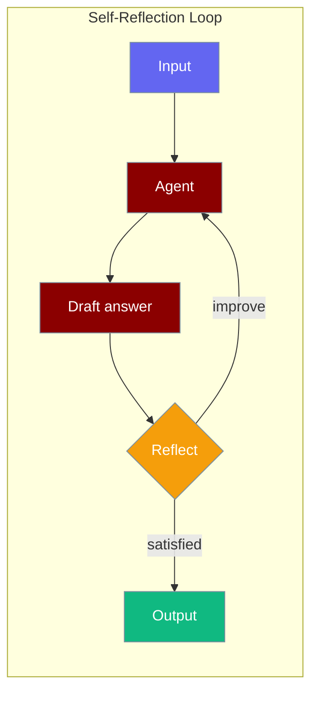
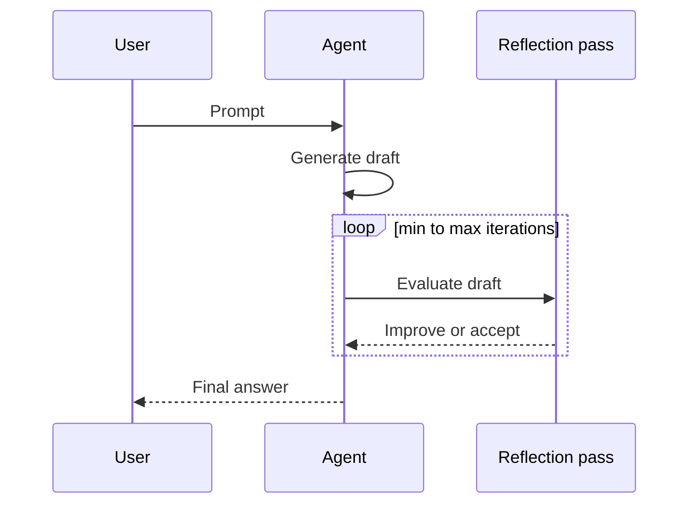
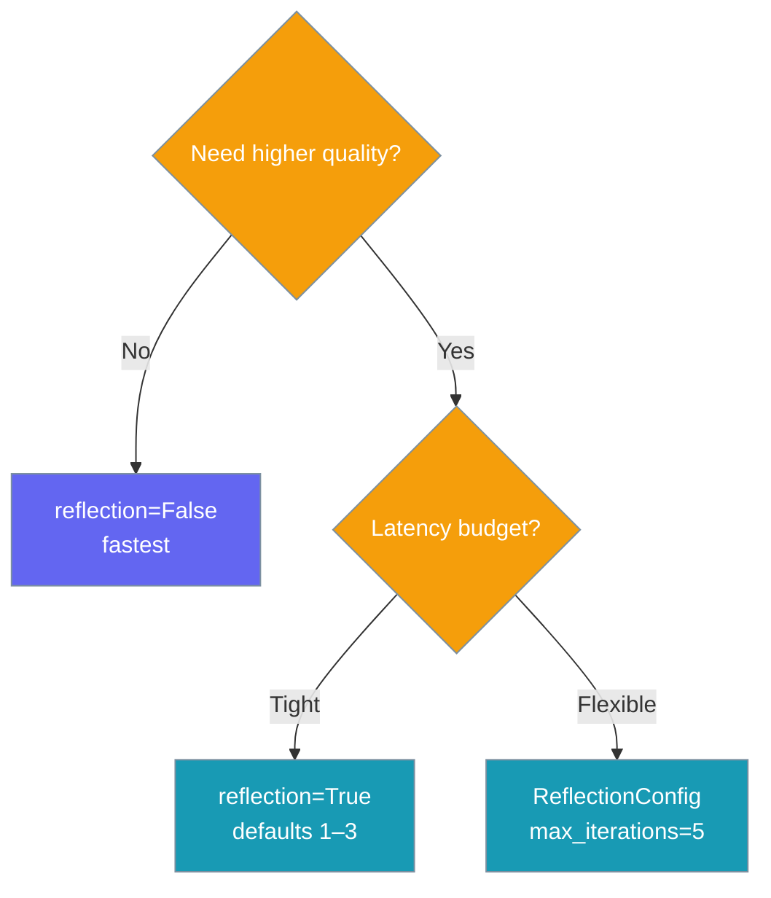

Enable `reflection=True` on an agent and it critiques its own answer before returning — improving quality within the same task.

```python
from praisonaiagents import Agent

agent = Agent(
    name="Analyst",
    instructions="Provide thorough, accurate analysis.",
    reflection=True,
)
agent.start("Summarise recent AI safety developments")
```



## Quick Start

<Steps>
<Step title="Simple Usage">

```python
from praisonaiagents import Agent

agent = Agent(
    name="Analyst",
    instructions="Provide thorough, accurate analysis.",
    reflection=True,
)
agent.start("Summarise recent AI safety developments")
```

</Step>

<Step title="With Configuration">

```python
from praisonaiagents import Agent, ReflectionConfig

agent = Agent(
    name="Analyst",
    instructions="Provide thorough, accurate analysis.",
    reflection=ReflectionConfig(
        min_iterations=1,
        max_iterations=3,
        llm="gpt-4o",
        prompt="Check accuracy, completeness, and clarity.",
    ),
)
agent.start("Summarise recent AI safety developments")
```

</Step>
</Steps>

---

## How It Works



After each response, the agent runs one or more reflection passes (between `min_iterations` and `max_iterations`). Each pass asks whether the answer meets quality criteria; if not, the agent revises before returning.

---

## Configuration Options

<Card title="ReflectionConfig SDK Reference" icon="code" href="/docs/sdk/reference/python/classes/ReflectionConfig">
  Full parameter reference for ReflectionConfig
</Card>

**Precedence ladder** — choose the level you need:

```python
# Level 1: Bool (simplest — enable with defaults)
agent = Agent(reflection=True)

# Level 2: ReflectionConfig (full control)
agent = Agent(reflection=ReflectionConfig(
    min_iterations=1,
    max_iterations=3,
    llm="gpt-4o",
    prompt="Evaluate for accuracy, completeness, and clarity.",
))
```

| Option | Type | Default | Description |
|--------|------|---------|-------------|
| `min_iterations` | `int` | `1` | Minimum reflection passes |
| `max_iterations` | `int` | `3` | Maximum reflection passes |
| `llm` | `str \| None` | `None` | Model for reflection (defaults to agent model) |
| `prompt` | `str \| None` | `None` | Custom evaluation prompt |

---

## Choosing Reflection Strength



---

## Best Practices

<AccordionGroup>
<Accordion title="Disable for tool-heavy agents">
Reflection adds an extra LLM pass per turn. Set `reflection=False` on agents that call tools frequently to keep latency down.
</Accordion>

<Accordion title="Pair with a dedicated reflection model">
Use `ReflectionConfig(llm="gpt-4o")` when the main model is fast but you want a stronger critic.
</Accordion>

<Accordion title="Do not confuse with self_improve">
`reflection` improves *this* answer within the task. `self_improve` captures reusable skills for *next* time — they compose independently.
</Accordion>

<Accordion title="Set max_iterations for cost control">
Cap `max_iterations` in production to avoid runaway loops on open-ended prompts.
</Accordion>
</AccordionGroup>

---

## Related

<CardGroup cols={2}>
<Card title="Self Improve" icon="sparkles" href="/docs/features/self-improve">
  Capture reusable skills after each task
</Card>
<Card title="Guardrails" icon="shield" href="/docs/features/guardrails">
  Validate agent outputs with policies
</Card>
<Card title="Planning Mode" icon="list-check" href="/docs/features/planning-mode">
  Let agents plan before acting
</Card>
<Card title="Execution Systems" icon="play" href="/docs/features/execution-systems">
  Configure agent execution limits
</Card>
</CardGroup>
