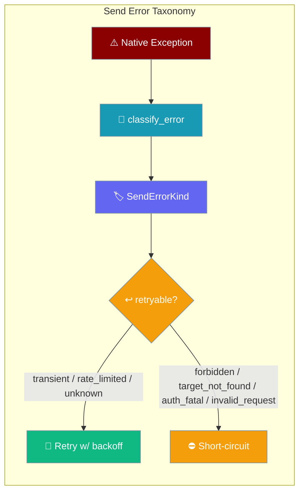
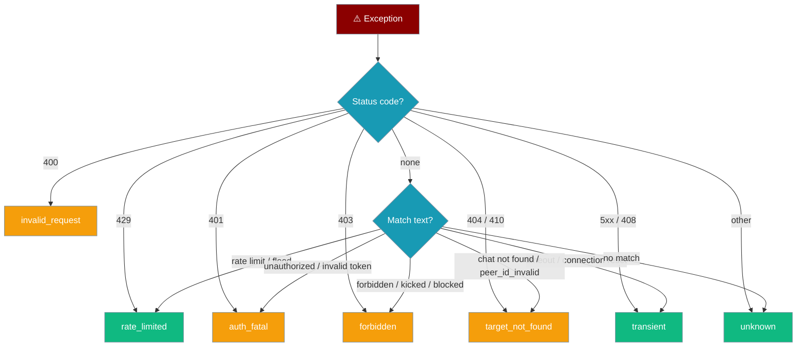

Structured classification of why an outbound send failed, so the retry loop stops burning budget on permanent failures.



Every gateway/bot adapter now tags a failed send with a `SendErrorKind`. Permanent failures — a blocked user, a deleted chat, a revoked token — short-circuit instead of exhausting the retry budget against a dead target.

## Quick Start

<Steps>
<Step title="Benefit automatically">
Any adapter that inherits `BasePlatformAdapter` gains status-code-aware short-circuiting with no code change. A permanent failure returns immediately instead of retrying `max_retries` times.

```python
from praisonaiagents.bots import BasePlatformAdapter, SendResult

class MyPlatformAdapter(BasePlatformAdapter):
    async def connect(self, *, is_reconnect=False):
        return True

    async def disconnect(self):
        ...

    async def send(self, chat_id, content, *, reply_to=None, metadata=None) -> SendResult:
        message_id = await my_api.send(chat_id, content)
        return SendResult(ok=True, message_id=message_id, chat_id=chat_id)

    async def get_chat_info(self, chat_id):
        return {"id": chat_id}
```
</Step>

<Step title="Inspect the result">
After a delivery, read `error_kind` and `retryable` to react — rotate credentials on `auth_fatal`, mark a target dead on `forbidden`.

```python
from praisonaiagents.bots import SendErrorKind

result = await adapter.deliver(chat_id="123", content="Hi!")
if not result.ok:
    if result.error_kind == SendErrorKind.AUTH_FATAL:
        print("Rotate the bot token — retrying won't help.")
    elif result.error_kind == SendErrorKind.FORBIDDEN:
        print(f"Bot was blocked/kicked from chat {result.chat_id}; marking dead.")
    elif result.retryable:
        print(f"Transient issue ({result.error_kind.value}); the retry loop handles it.")
```
</Step>
</Steps>

---

## How It Works

Failures are classified once at the boundary via `classify_error(exc)`. Only `retryable` kinds are retried; provably-permanent kinds short-circuit immediately, and the router records the dead target by kind.

```mermaid
sequenceDiagram
    participant Loop as 🔁 Delivery Loop
    participant Adapter as 📡 Adapter
    participant Router as 🗂️ DeliveryRouter

    Loop->>Adapter: send(chat_id, content)
    Adapter-->>Loop: raise native exception
    Loop->>Adapter: classify_error(exc)
    Adapter-->>Loop: SendResult(error_kind, retryable)
    alt retryable
        Note over Loop: back off, retry
    else permanent
        Note over Loop: short-circuit, return result
        Loop->>Router: mark_dead(reason="forbidden: …")
    end
```

The retry loop (`BasePlatformAdapter._send_with_retry`) stamps `chat_id` onto the classified `SendResult`, so the caller can act on `result.error_kind` without re-parsing the error string.

---

## Which Kind Gets Returned?

The classifier keys off the HTTP/platform status code first, then falls back to a small set of cross-platform substrings when no status is present.



`asyncio.TimeoutError`, `TimeoutError`, `ConnectionError`, and `OSError` are treated as `transient` before the text fallback runs.

---

## SendErrorKind Reference

Seven members, spelled exactly as in `praisonaiagents/bots/base.py`.

| Kind | HTTP triggers | Text triggers (fallback) | Retryable |
|------|---------------|--------------------------|-----------|
| `rate_limited` | 429 | `too many requests`, `rate limit`, `rate_limited`, `flood` | ✅ (with `retry_after`) |
| `target_not_found` | 404, 410 | `chat not found`, `channel not found`, `peer_id_invalid`, `user is deactivated`, `group chat was deleted` | ❌ (mark dead) |
| `forbidden` | 403 | `forbidden`, `blocked`, `kicked`, `not enough rights`, `no rights to send` | ❌ (mark dead) |
| `auth_fatal` | 401 | `unauthorized`, `invalid token`, `invalid_auth`, `token_revoked`, `not_authed`, `authentication failed` | ❌ (surface degraded) |
| `invalid_request` | 400 | _(none — status only)_ | ❌ (fix payload) |
| `transient` | 5xx, 408, `asyncio.TimeoutError`, `ConnectionError`, `OSError` | `timeout`, `timed out`, `temporarily unavailable`, `service unavailable`, `connection reset`, `connection refused`, `bad gateway`, `gateway timeout` | ✅ |
| `unknown` | anything else | anything unmatched | ✅ (safety default) |

The enum is a `str`-Enum: `SendErrorKind.FORBIDDEN.value == "forbidden"`.

<Warning>
`SendResult.retryable` defaults to `True`. Setting `error_kind` alone does not stop retries unless you also set `retryable=False` (or use `classify_send_error`, which derives it for you).
</Warning>

---

## Writing a Custom Adapter

Override `classify_error` to map your platform SDK's native exceptions into the taxonomy with full fidelity. Fall through to `classify_send_error` for the shared status/text-aware default.

```python
from praisonaiagents.bots import (
    BasePlatformAdapter,
    SendErrorKind,
    SendResult,
    classify_send_error,
)

class MyPlatformAdapter(BasePlatformAdapter):
    def classify_error(self, exc):
        # Full-fidelity mapping from your platform SDK's native exceptions
        if isinstance(exc, MyPlatformSDK.BotBlocked):
            return SendResult(ok=False, error=str(exc),
                              error_kind=SendErrorKind.FORBIDDEN, retryable=False)
        if isinstance(exc, MyPlatformSDK.RateLimited):
            return SendResult(ok=False, error=str(exc),
                              error_kind=SendErrorKind.RATE_LIMITED,
                              retryable=True, retry_after=exc.retry_after)
        # Fall through to the shared status/text-aware default
        return classify_send_error(exc)
```

The default `classify_error` delegates to `classify_send_error`, so an adapter that skips this override still short-circuits standard HTTP failures.

---

## Serialization & Observability

`SendResult.to_dict()` exposes `error_kind` as the enum **value** (a plain string) plus the derived `retryable` flag — ready for log pipelines and dashboards.

```python
from praisonaiagents.bots import classify_send_error

class Blocked(Exception):
    status = 403

result = classify_send_error(Blocked("bot was kicked"))
print(result.to_dict())
# {
#   'ok': False,
#   'message_id': None,
#   'chat_id': None,
#   'message_ids': [],
#   'error': 'bot was kicked',
#   'error_kind': 'forbidden',
#   'retryable': False,
#   'retry_after': None,
#   'metadata': {},
# }
```

`error_kind` is `None` on success. Record dead targets by kind so dashboards read `forbidden: bot was kicked` instead of an opaque `str(exc)`.

---

## Best Practices

<AccordionGroup>
<Accordion title="Override classify_error in your adapter">
The default's text fallback is deliberately narrow so it stays cross-platform. Your SDK's typed exceptions give perfect fidelity — map them directly and fall through to `classify_send_error` for the rest.
</Accordion>

<Accordion title="Never downgrade a permanent failure to retryable">
A blocked user or deleted chat cannot be recovered by retry. Short-circuiting is a feature, not a bug — keep `retryable=False` for `forbidden`, `target_not_found`, `auth_fatal`, and `invalid_request`.
</Accordion>

<Accordion title="Persist dead targets by error_kind, not str(exc)">
Record the failure by kind (e.g. `reason="forbidden: bot was kicked"`), matching what `DeliveryRouter` now does. Machine-readable kinds make dashboards and alerts readable.
</Accordion>

<Accordion title="Treat UNKNOWN as retryable-by-default">
`unknown` preserves the historical retry-everything behaviour and prevents silent drops of failures the classifier can't name. Do not special-case it into a permanent failure.
</Accordion>
</AccordionGroup>

<Note>
This is a fully backward-compatible change. Existing YAML, existing Python `Agent(...)` code, and existing custom adapters that don't override `classify_error` all keep working — they simply gain automatic status-code-aware short-circuiting via the default implementation.
</Note>

<Warning>
The `unknown → forbidden` upgrade only happens in the bot layer (`_resilience.classify_send_failure`), where the broader `is_permanent_target_failure` predicate recognises confirmed whole-target deaths. Core `classify_send_error` never upgrades a kind.
</Warning>

---

## Related

<CardGroup cols={2}>
<Card title="Durable Outbound Delivery" icon="shield-check" href="/features/durable-outbound-delivery">
  Retry-with-backoff and dead-letter queue mechanics
</Card>
<Card title="Gateway Channel Supervision" icon="tower-broadcast" href="/features/gateway-channel-supervision">
  Dead-target parking and degraded credential states
</Card>
</CardGroup>
