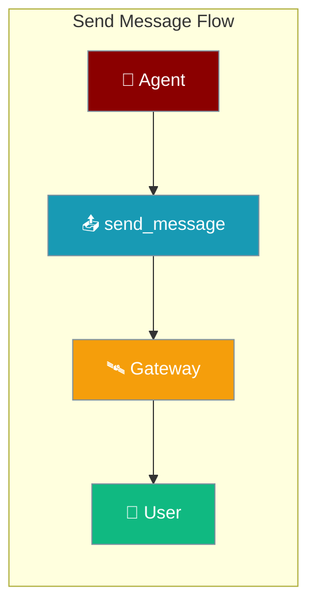
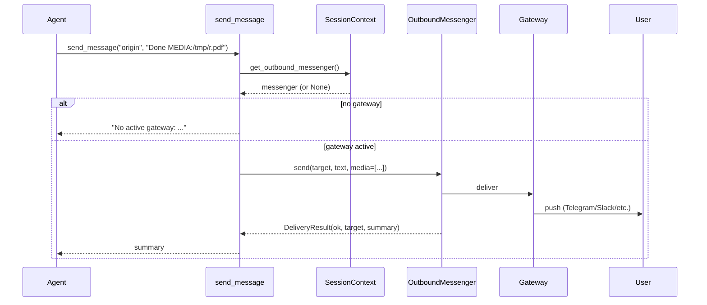
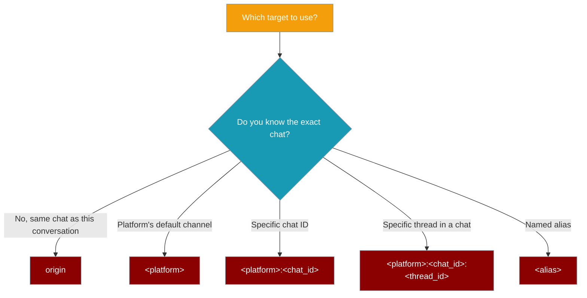
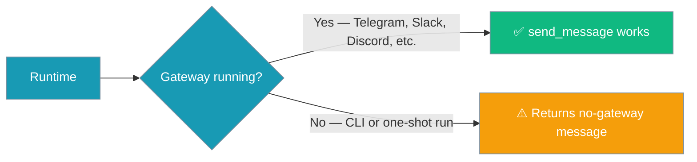
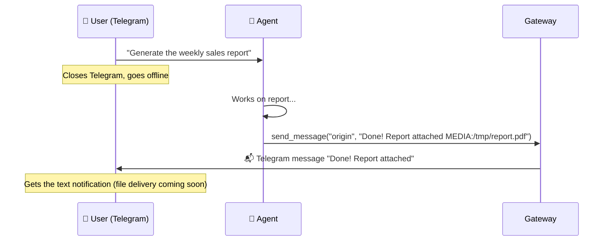

Send Message lets a running agent reach the user proactively on their configured channels — without waiting for the next user turn.

```python
from praisonaiagents import Agent
from praisonaiagents.tools import send_message

agent = Agent(
    name="Reporter",
    instructions="When you finish a long task, message the user on their channel.",
    tools=[send_message],
)
agent.start("Generate the weekly report and notify me when it's ready.")
```


The user starts a long job; the agent proactively messages them on Telegram, Slack, or email when it finishes.




## Quick Start

<Steps>
<Step title="Give Your Agent the Tool">

```python
from praisonaiagents import Agent
from praisonaiagents.tools import send_message

agent = Agent(
    name="Reporter",
    instructions="When you finish a long task, message the user on their channel.",
    tools=[send_message],
)

agent.start("Generate the weekly report and notify me when it's ready.")
```

The agent can now call `send_message` at any point mid-task to push a notification to the user.

</Step>

<Step title="List Available Targets">

```python
# The model calls:
#   send_message(action="list")
# and gets back JSON like:
#   [{"target": "telegram:home", "platform": "telegram", "kind": "home", "label": "Telegram"}]
```

Use `action="list"` first when you want the agent to pick the right channel rather than defaulting to `"origin"`.

</Step>

<Step title="Send with a File Attachment">

```python
# Model call:
#   send_message("origin", "Weekly report ready MEDIA:/tmp/report.pdf")
# Returns: "Sent to telegram:<chat_id> (media not attached)."
```

Append `MEDIA:<path>` to the message text to attach a local file. Multiple attachments are supported.

<Note>
**Media attachments aren't delivered yet.** The text portion is sent, the `MEDIA:` paths are parsed and counted, and the result detail confirms how many files were skipped. File delivery will land in a future transport update — track [PraisonAI#2374](https://github.com/MervinPraison/PraisonAI/pull/2374) for follow-ups.
</Note>

</Step>
</Steps>

---

## How It Works



| Component | Purpose |
|-----------|---------|
| **send_message tool** | Agent-callable function; resolves messenger from context |
| **OutboundMessengerProtocol** | Interface the gateway registers per-turn |
| **SessionContext** | Task-local registry — no globals, safe for concurrent handlers |
| **Gateway** | Delivers to Telegram, Slack, Discord, WhatsApp, etc. |

---

## Targets

Choose the right target form for your situation:



| Target form | Example | Description |
|------------|---------|-------------|
| `"origin"` | `"origin"` | The chat this conversation came from (default) |
| `"<platform>"` | `"telegram"` | That platform's configured home channel |
| `"<platform>:<chat_id>"` | `"slack:#ops"` | A specific chat or channel |
| `"<platform>:<chat_id>:<thread_id>"` | `"slack:#ops:T123"` | A specific thread within a chat |
| `"<alias>"` | `"my-ops-alert"` | A named alias configured in the gateway |

---

## Attachments (MEDIA:)

Append `MEDIA:<path>` to the message string to attach a local file to the delivery.

```python
# Single attachment
send_message("origin", "Report ready MEDIA:/tmp/report.pdf")

# Multiple attachments — each MEDIA: token is stripped and the paths collected
send_message("origin", "Charts attached MEDIA:/tmp/chart1.png MEDIA:/tmp/chart2.png")
```

<Note>
File paths must not contain whitespace. The `MEDIA:` directive is stripped from the displayed message text before delivery.
</Note>

---

## Listing Targets

`action="list"` returns a JSON array of all reachable targets so the agent can pick the right one before sending.

```python
# Model call:
#   send_message(action="list")

# Returns JSON:
# [
#   {"target": "origin", "platform": "telegram", "kind": "origin", "label": "Current chat"},
#   {"target": "telegram", "platform": "telegram", "kind": "home", "label": "Telegram"},
#   {"target": "slack:#ops", "platform": "slack", "kind": "alias", "label": "#ops"}
# ]
```

Each entry in the array:

| Field | Type | Description |
|-------|------|-------------|
| `target` | `str` | Token to pass as the `target` argument to `send_message` |
| `platform` | `str` | Platform name (e.g. `"telegram"`, `"slack"`) |
| `kind` | `str` | One of `"origin"`, `"home"`, `"alias"`, or `"observed"` |
| `label` | `str` | Friendly name for display |

`"observed"` means a channel the gateway has seen activity on but is not a configured home or alias.

---

## When It's Available



| Runtime | Behaviour |
|---------|-----------|
| Bot / Gateway (Telegram, Slack, Discord, WhatsApp, …) | Delivers the message; returns a short summary string |
| CLI / one-shot (`agent.start(...)` directly) | Returns the string below — **does not raise** |

When no gateway is active the tool returns:

```
No active gateway: send_message is only available inside a running bot/gateway (e.g. Telegram, Slack, Discord). It is unavailable for CLI/one-shot runs.
```

Agent instructions can check for this string and fall back gracefully.

---

## User Interaction Flow

A user starts a long research task on Telegram, then closes their phone. The agent finishes compiling the report, calls `send_message("origin", "Your report is ready MEDIA:/tmp/report.pdf")`, and the user receives a Telegram push notification with the text — without ever having to ask "are you done yet?".



---

## Configuration Reference

`send_message` takes three arguments. All are optional:

| Argument | Type | Default | Description |
|----------|------|---------|-------------|
| `target` | `str` | `"origin"` | Symbolic destination (see Targets table) |
| `message` | `str` | `""` | Text to send; append `" MEDIA:<path>"` to attach files. Attachments are parsed today but not yet delivered through bot transports — the result detail reports how many were skipped. |
| `action` | `str` | `"send"` | `"send"` to deliver, `"list"` to enumerate reachable targets |

`action="send"` vs `action="list"` at a glance:

| `action` | Returns |
|----------|---------|
| `"send"` | Short summary string, e.g. `"Delivered to slack:#ops"` |
| `"list"` | JSON array of `{target, platform, kind, label}` objects |

---

## Common Patterns

### Notify on long-task completion

```python
agent = Agent(
    name="Analyst",
    instructions="""
    Run deep analysis tasks. When a task finishes, always call
    send_message("origin", "<summary>") to let the user know.
    """,
    tools=[send_message],
)
```

### Cross-channel handoff

```python
# Model calls send_message(action="list") first, picks slack:#ops, then:
#   send_message("slack:#ops", "Deploy finished ✅")
```

### Pick the target from the list, then send

```python
# 1. List targets
#    send_message(action="list")
#    → [{"target": "slack:#ops", ...}, {"target": "telegram", ...}]
# 2. Choose and send
#    send_message("slack:#ops", "All tests passed")
```

---

## Best Practices

<AccordionGroup>
<Accordion title="Confirm channel before sending to an explicit target">
Call `send_message(action="list")` first when the user hasn't specified where they want to be notified. Sending to a channel the user doesn't monitor is noise.
</Accordion>

<Accordion title="Default to 'origin'">
`"origin"` sends to the chat the conversation started in — usually the right choice. Only override it when you have a specific reason (e.g., sending an ops alert to a dedicated Slack channel).
</Accordion>

<Accordion title="Handle the no-gateway fallback in agent instructions">
Include a note like _"If send_message returns a 'No active gateway' message, skip the notification and continue."_ so the agent doesn't retry endlessly on CLI runs.
</Accordion>

<Accordion title="Keep messages short — they hit a phone">
Mobile push notifications truncate long text. Send a one-line summary; attach details as a file with `MEDIA:`.
</Accordion>
</AccordionGroup>

---

## Related

<CardGroup cols={2}>
<Card title="Send Policy" icon="shield-check" href="/docs/features/send-policy">
Restrict which channels send_message is allowed to deliver to
</Card>

<Card title="Clarify Tool" icon="messages-question" href="/docs/features/clarify-tool">
Ask the user mid-task for clarifying input
</Card>

<Card title="Channels Gateway" icon="satellite-dish" href="/docs/features/channels-gateway">
Connect agents to Telegram, Slack, Discord, and WhatsApp
</Card>

<Card title="Bot Gateway" icon="robot" href="/docs/features/bot-gateway">
Run the gateway server
</Card>

<Card title="Bot Routing" icon="route" href="/docs/features/bot-routing">
Route messages by channel and platform
</Card>
</CardGroup>
