Send Message lets a running agent reach the user proactively on their configured channels — without waiting for the next user turn.

Need the answer back, not just delivery? See [Ask Conversation](/features/ask-conversation-tool).

```python
from praisonaiagents import Agent
from praisonaiagents.tools import send_message

agent = Agent(
    name="Reporter",
    instructions="When you finish a long task, message the user on their channel.",
    tools=[send_message],
)
agent.start("Generate the weekly report and notify me when it's ready.")
```


The user starts a long job; the agent proactively messages them on Telegram, Slack, or email when it finishes.


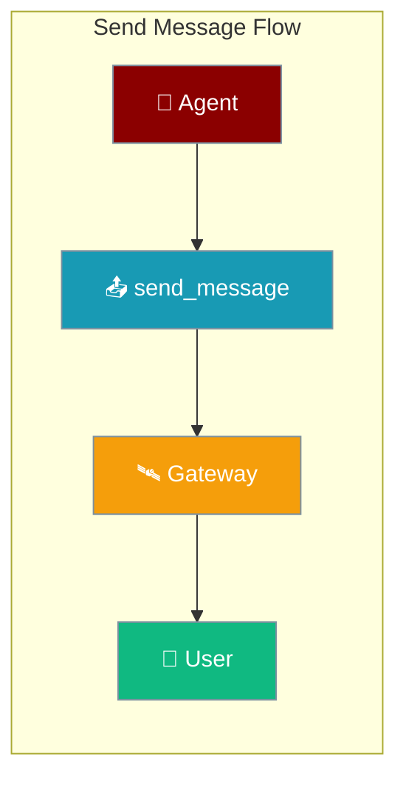
```mermaid
graph LR
    subgraph "Send Message Flow"
        A[🤖 Agent] --> B[📤 send_message]
        B --> C[🛰️ Gateway]
        C --> D[📱 User]
    end

    classDef agent fill:#8B0000,stroke:#7C90A0,color:#fff
    classDef tool fill:#189AB4,stroke:#7C90A0,color:#fff
    classDef gateway fill:#F59E0B,stroke:#7C90A0,color:#fff
    classDef user fill:#10B981,stroke:#7C90A0,color:#fff

    class A agent
    class B tool
    class C gateway
    class D user
```

## Quick Start

<Steps>
<Step title="Give Your Agent the Tool">

```python
from praisonaiagents import Agent
from praisonaiagents.tools import send_message

agent = Agent(
    name="Reporter",
    instructions="When you finish a long task, message the user on their channel.",
    tools=[send_message],
)

agent.start("Generate the weekly report and notify me when it's ready.")
```

The agent can now call `send_message` at any point mid-task to push a notification to the user.

</Step>

<Step title="List Available Targets">

```python
# The model calls:
#   send_message(action="list")
# and gets back JSON like:
#   [{"target": "telegram:home", "platform": "telegram", "kind": "home", "label": "Telegram"}]
```

Use `action="list"` first when you want the agent to pick the right channel rather than defaulting to `"origin"`.

</Step>

<Step title="Send with a File Attachment">

```python
# Model call:
#   send_message("origin", "Weekly report ready MEDIA:/tmp/report.pdf")
# Returns: "Sent to telegram:<chat_id> (media not attached)."
```

Append `MEDIA:<path>` to the message text to attach a local file. Multiple attachments are supported.

<Note>
**Media attachments aren't delivered yet.** The text portion is sent, the `MEDIA:` paths are parsed and counted, and the result detail confirms how many files were skipped. File delivery will land in a future transport update — track [PraisonAI#2374](https://github.com/MervinPraison/PraisonAI/pull/2374) for follow-ups.

The `MEDIA:` caveat applies only to the `send_message` tool path (via `BotOutboundMessenger`). Proactive / scheduled / gateway-driven deliveries via `DeliveryRouter.send_media` **do** deliver attachments and honour threaded targets — see [Outbound Media Delivery](/features/outbound-media-delivery).
</Note>

</Step>
</Steps>

---

## How It Works

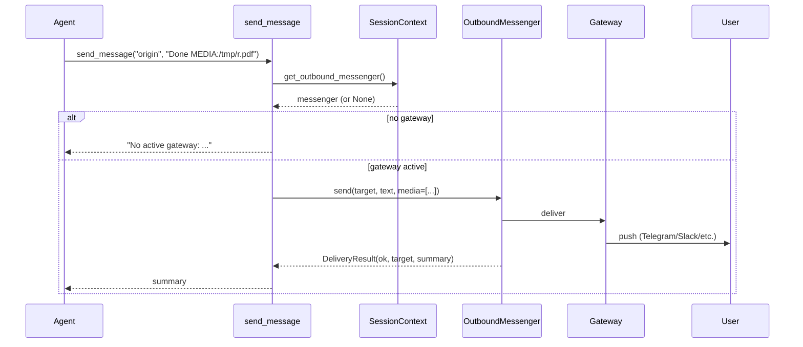
```mermaid
sequenceDiagram
    participant Agent
    participant SendMessage as send_message
    participant Context as SessionContext
    participant Messenger as OutboundMessenger
    participant Gateway
    participant User

    Agent->>SendMessage: send_message("origin", "Done MEDIA:/tmp/r.pdf")
    SendMessage->>Context: get_outbound_messenger()
    Context-->>SendMessage: messenger (or None)
    alt no gateway
        SendMessage-->>Agent: "No active gateway: ..."
    else gateway active
        SendMessage->>Messenger: send(target, text, media=[...])
        Messenger->>Gateway: deliver
        Gateway->>User: push (Telegram/Slack/etc.)
        Messenger-->>SendMessage: DeliveryResult(ok, target, summary)
        SendMessage-->>Agent: summary
    end
```

| Component | Purpose |
|-----------|---------|
| **send_message tool** | Agent-callable function; resolves messenger from context |
| **OutboundMessengerProtocol** | Interface the gateway registers per-turn |
| **SessionContext** | Task-local registry — no globals, safe for concurrent handlers |
| **Gateway** | Delivers to Telegram, Slack, Discord, WhatsApp, etc. |

The verbs `react`, `thread`, `edit`, and `delete` add a capability-gate step: the router checks the adapter's `supports_*` flag before dispatch and returns a typed `unsupported` when the channel lacks the primitive — it never raises.

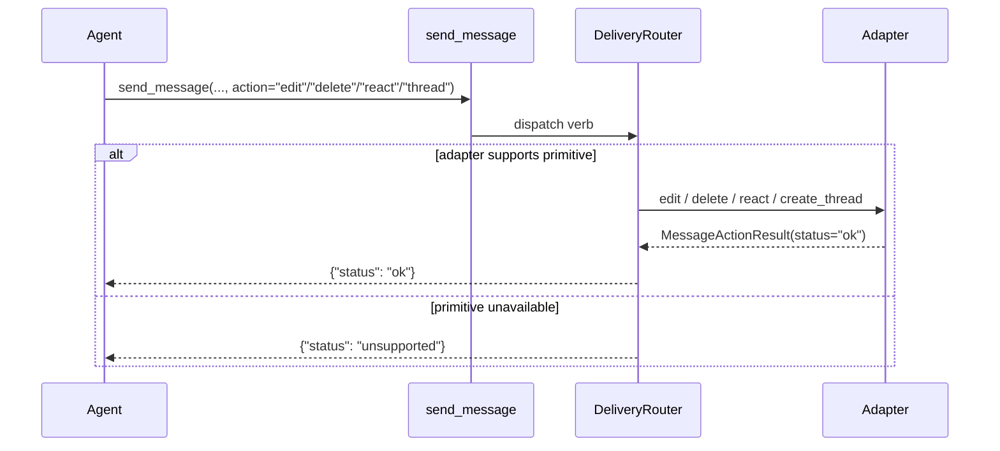
```mermaid
sequenceDiagram
    participant Agent
    participant SendMessage as send_message
    participant Router as DeliveryRouter
    participant Adapter

    Agent->>SendMessage: send_message(..., action="edit"/"delete"/"react"/"thread")
    SendMessage->>Router: dispatch verb
    alt adapter supports primitive
        Router->>Adapter: edit / delete / react / create_thread
        Adapter-->>Router: MessageActionResult(status="ok")
        Router-->>Agent: {"status": "ok"}
    else primitive unavailable
        Router-->>Agent: {"status": "unsupported"}
    end
```

---

## Targets

Choose the right target form for your situation:

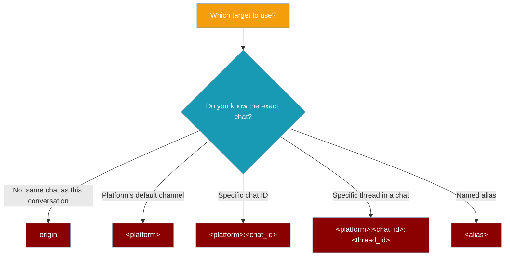
```mermaid
graph TD
    A[Which target to use?] --> B{Do you know the exact chat?}
    B -->|No, same chat as this conversation| C["origin"]
    B -->|Platform's default channel| D["&lt;platform&gt;"]
    B -->|Specific chat ID| E["&lt;platform&gt;:&lt;chat_id&gt;"]
    B -->|Specific thread in a chat| F["&lt;platform&gt;:&lt;chat_id&gt;:&lt;thread_id&gt;"]
    B -->|Named alias| G["&lt;alias&gt;"]

    classDef choice fill:#189AB4,stroke:#7C90A0,color:#fff
    classDef target fill:#8B0000,stroke:#7C90A0,color:#fff
    classDef start fill:#F59E0B,stroke:#7C90A0,color:#fff

    class A start
    class B choice
    class C,D,E,F,G target
```

| Target form | Example | Description |
|------------|---------|-------------|
| `"origin"` | `"origin"` | The chat this conversation came from (default) |
| `"<platform>"` | `"telegram"` | That platform's configured home channel |
| `"<platform>:<chat_id>"` | `"slack:#ops"` | A specific chat or channel |
| `"<platform>:<chat_id>:<thread_id>"` | `"slack:#ops:T123"` | A specific thread within a chat |
| `"<alias>"` | `"my-ops-alert"` | A named alias configured in the gateway |

---

## Attachments (MEDIA:)

Append `MEDIA:<path>` to the message string to attach a local file to the delivery.

```python
# Single attachment
send_message("origin", "Report ready MEDIA:/tmp/report.pdf")

# Multiple attachments — each MEDIA: token is stripped and the paths collected
send_message("origin", "Charts attached MEDIA:/tmp/chart1.png MEDIA:/tmp/chart2.png")
```

<Note>
File paths must not contain whitespace. The `MEDIA:` directive is stripped from the displayed message text before delivery.
</Note>

---

## Reactions

Agents can tap a lightweight ✅ / 👍 / ⏳ reaction on a message instead of sending a full reply — perfect for busy group chats where every reply is noise.

```python
from praisonaiagents.tools import send_message

# React to the message being handled right now
send_message(action="react", target="origin", message="👍")

# Remove a reaction you added earlier
send_message(action="unreact", target="origin", message="👍")
```

The emoji rides in the `message` argument and is `.strip()`-ed — an empty emoji returns `{"status": "failed", "detail": "no emoji provided"}`.

<Note>
`target="origin"` reacts to the **inbound** message the agent is currently handling — its `message_id` is carried on the session automatically, so no extra parameter is needed. To react to a different message, use the explicit `"<platform>:<chat_id>:<message_id>"` form.
</Note>

### Reaction outcomes

Reactions return a JSON string of a `ReactionResult` with a typed `status` (plus optional `target` and `detail`):

| `status` | Meaning |
|----------|---------|
| `"ok"` | Reaction added/removed successfully |
| `"unsupported"` | The channel doesn't support reactions (e.g. WhatsApp) — degrade gracefully |
| `"failed"` | Blocked by send-policy, empty emoji, or downstream error |
| `"no_route"` | Target could not be resolved to a reachable channel |

```json
{"status": "ok", "target": "telegram:12345"}
{"status": "unsupported", "detail": "the active gateway does not support reactions"}
{"status": "failed", "detail": "no emoji provided"}
```

Channels that support reactions today: **Telegram, Slack, Discord**. Others (WhatsApp, Signal, email, agentmail, Linear) return `"unsupported"` — the tool never raises.

The same [Send Policy](/features/send-policy) that guards `action="send"` also guards `react`/`unreact` — a steered or prompt-injected agent cannot react on a channel the operator never intended.

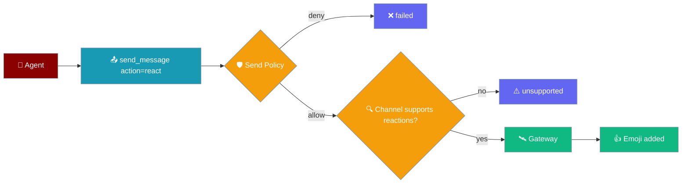
```mermaid
graph LR
    A[🤖 Agent] --> B[📤 send_message action=react]
    B --> P{🛡️ Send Policy}
    P -->|deny| F[❌ failed]
    P -->|allow| C{🔍 Channel supports reactions?}
    C -->|no| U[⚠️ unsupported]
    C -->|yes| G[🛰️ Gateway]
    G --> D[👍 Emoji added]

    classDef agent fill:#8B0000,stroke:#7C90A0,color:#fff
    classDef tool fill:#189AB4,stroke:#7C90A0,color:#fff
    classDef check fill:#F59E0B,stroke:#7C90A0,color:#fff
    classDef ok fill:#10B981,stroke:#7C90A0,color:#fff
    classDef fail fill:#6366F1,stroke:#7C90A0,color:#fff

    class A agent
    class B tool
    class P,C check
    class G,D ok
    class F,U fail
```

---

## Threads

Open a topic or thread under a target so a long-running effort has its own space.

```python
from praisonaiagents.tools import send_message

# Open a topic titled "Rollout 2026-09" under the current Slack channel
send_message("slack:#ops", "Rollout 2026-09", action="thread")
```

The thread title rides in the `message` argument. An empty title returns `{"status": "failed", "detail": "no thread title provided"}`.

### Thread outcomes

Threads return a JSON `ThreadResult` with a typed `status` (plus `thread_id` on success):

| `status` | Meaning |
|----------|---------|
| `"ok"` | A new thread/topic was opened; `thread_id` carries its id |
| `"unsupported"` | The channel can't open threads — degrade gracefully to the parent channel |
| `"failed"` | Topics mode off, missing permission, or empty title |
| `"no_route"` | Target could not be resolved to a reachable channel |

```json
{"status": "ok", "target": "slack:#ops", "thread_id": "T789"}
{"status": "unsupported", "detail": "the active gateway does not support threads"}
{"status": "failed", "detail": "no thread title provided"}
```

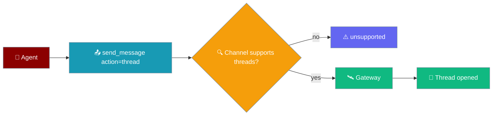
```mermaid
graph LR
    A[🤖 Agent] --> B[📤 send_message action=thread]
    B --> C{🔍 Channel supports threads?}
    C -->|no| U[⚠️ unsupported]
    C -->|yes| G[🛰️ Gateway]
    G --> D[🧵 Thread opened]

    classDef agent fill:#8B0000,stroke:#7C90A0,color:#fff
    classDef tool fill:#189AB4,stroke:#7C90A0,color:#fff
    classDef check fill:#F59E0B,stroke:#7C90A0,color:#fff
    classDef ok fill:#10B981,stroke:#7C90A0,color:#fff
    classDef fail fill:#6366F1,stroke:#7C90A0,color:#fff

    class A agent
    class B tool
    class C check
    class G,D ok
    class U fail
```

Thread-aware routing across platforms is covered in [Gateway Threads](/features/gateway-threads).

---

## Edit and Delete (own messages)

Update a status in place, or retract a message the agent shouldn't have sent — instead of spamming follow-ups.

```python
from praisonaiagents.tools import send_message

# Post a live status, then update it in place instead of spamming follow-ups
send_message("origin", "Working…", action="send")
# ... later:
send_message("origin", "Done ✅", action="edit", message_id="98")

# Retract a message the agent shouldn't have sent
send_message("origin", "", action="delete", message_id="77")
```

- **Authority**: `edit` and `delete` are the most-restricted class — `own-prior-message`. They only work on messages this agent/session sent.
- **Capability gate**: powered by the adapter's `supports_edit` / `supports_delete`. Channels that can't edit/delete return a typed `unsupported` outcome — the tool never raises.
- **Send-policy** still guards `edit`/`delete` — a steered agent cannot mutate messages on channels the operator hasn't allowed.
- **Required `message_id`**: a missing id returns `{"status": "failed", "detail": "no message_id provided"}`.
- **Result shape**: a JSON `MessageActionResult` with `status` (`ok` / `unsupported` / `failed` / `no_route`), optional `target`, and optional `detail`.

```json
{"status": "ok", "target": "telegram:12345"}
{"status": "unsupported", "detail": "the active gateway does not support edit"}
{"status": "unsupported", "detail": "the active gateway does not support delete"}
{"status": "failed", "detail": "no message_id provided"}
```

### Channel support today

| Channel | `supports_edit` | `supports_delete` |
|---------|-----------------|-------------------|
| Telegram | ✅ | ✅ |
| Slack | ✅ | ✅ |
| Discord | ✅ | ✅ |
| WhatsApp / Signal / email / agentmail / Linear | `unsupported` | `unsupported` |

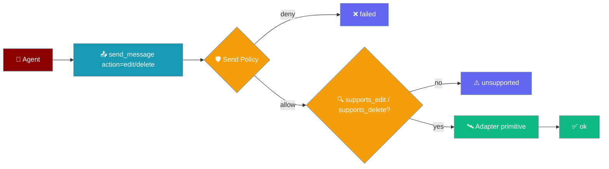
```mermaid
graph LR
    A[🤖 Agent] --> B[📤 send_message action=edit/delete]
    B --> P{🛡️ Send Policy}
    P -->|deny| F[❌ failed]
    P -->|allow| C{🔍 supports_edit / supports_delete?}
    C -->|no| U[⚠️ unsupported]
    C -->|yes| G[🛰️ Adapter primitive]
    G --> D[✅ ok]

    classDef agent fill:#8B0000,stroke:#7C90A0,color:#fff
    classDef tool fill:#189AB4,stroke:#7C90A0,color:#fff
    classDef check fill:#F59E0B,stroke:#7C90A0,color:#fff
    classDef ok fill:#10B981,stroke:#7C90A0,color:#fff
    classDef fail fill:#6366F1,stroke:#7C90A0,color:#fff

    class A agent
    class B tool
    class P,C check
    class G,D ok
    class F,U fail
```

Per-channel capability flags live in [Bot Platform Capabilities](/features/bot-platform-capabilities).

---

## Action Vocabulary and Authority

Every verb the tool accepts declares one of three authority classes — a closed set that keeps a steered agent from inventing new mutation verbs.

| Authority | Verbs | What it means |
|-----------|-------|---------------|
| `read-only` | `list` | Inspects reachable targets, sends nothing |
| `current-conversation` | `send`, `react`, `unreact`, `thread` | Writes to the current conversation (or an operator-permitted target) |
| `own-prior-message` | `edit`, `delete` | Mutates a specific earlier message the agent sent — the most sensitive class |

Any verb missing from the map is rejected — the agent cannot "invent" a new mutation verb that silently inherits `send`'s guard:

```
Unknown action '<verb>'. Use 'send', 'list', 'react', 'unreact', 'thread', 'edit', or 'delete'.
```

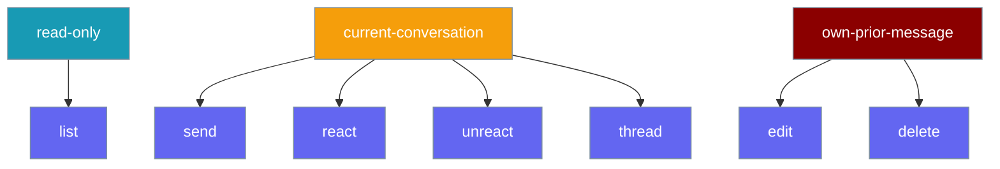
```mermaid
graph TB
    RO[read-only] --> L[list]
    CC[current-conversation] --> S[send]
    CC --> R[react]
    CC --> UN[unreact]
    CC --> T[thread]
    OPM[own-prior-message] --> E[edit]
    OPM --> DEL[delete]

    classDef readonly fill:#189AB4,stroke:#7C90A0,color:#fff
    classDef current fill:#F59E0B,stroke:#7C90A0,color:#fff
    classDef own fill:#8B0000,stroke:#7C90A0,color:#fff
    classDef verb fill:#6366F1,stroke:#7C90A0,color:#fff

    class RO readonly
    class CC current
    class OPM own
    class L,S,R,UN,T,E,DEL verb
```

The same [Send Policy](/features/send-policy) guards every write verb. Per-channel primitives are listed in [Bot Platform Capabilities](/features/bot-platform-capabilities).

---

## Listing Targets

`action="list"` returns a JSON array of all reachable targets so the agent can pick the right one before sending.

```python
# Model call:
#   send_message(action="list")

# Returns JSON:
# [
#   {"target": "origin", "platform": "telegram", "kind": "origin", "label": "Current chat"},
#   {"target": "telegram", "platform": "telegram", "kind": "home", "label": "Telegram"},
#   {"target": "slack:#ops", "platform": "slack", "kind": "alias", "label": "#ops"}
# ]
```

Each entry in the array:

| Field | Type | Description |
|-------|------|-------------|
| `target` | `str` | Token to pass as the `target` argument to `send_message` |
| `platform` | `str` | Platform name (e.g. `"telegram"`, `"slack"`) |
| `kind` | `str` | One of `"origin"`, `"home"`, `"alias"`, or `"observed"` |
| `label` | `str` | Friendly name for display |

`"observed"` means a channel the gateway has seen activity on but is not a configured home or alias.

---

## When It's Available

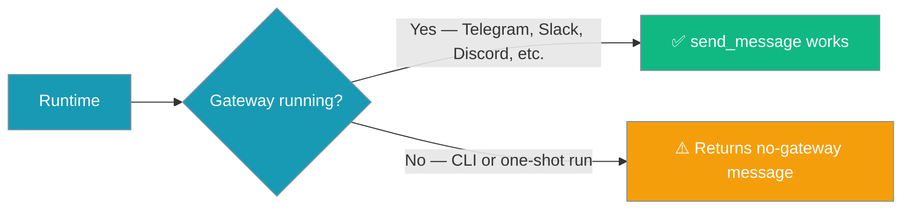
```mermaid
graph LR
    A[Runtime] --> B{Gateway running?}
    B -->|Yes — Telegram, Slack, Discord, etc.| C[✅ send_message works]
    B -->|No — CLI or one-shot run| D[⚠️ Returns no-gateway message]

    classDef ok fill:#10B981,stroke:#7C90A0,color:#fff
    classDef warn fill:#F59E0B,stroke:#7C90A0,color:#fff
    classDef neutral fill:#189AB4,stroke:#7C90A0,color:#fff

    class A,B neutral
    class C ok
    class D warn
```

| Runtime | Behaviour |
|---------|-----------|
| Bot / Gateway (Telegram, Slack, Discord, WhatsApp, …) | Delivers the message; returns a short summary string |
| CLI / one-shot (`agent.start(...)` directly) | Returns the string below — **does not raise** |

When no gateway is active the tool returns:

```
No active gateway: send_message is only available inside a running bot/gateway (e.g. Telegram, Slack, Discord). It is unavailable for CLI/one-shot runs.
```

Agent instructions can check for this string and fall back gracefully.

---

## User Interaction Flow

A user starts a long research task on Telegram, then closes their phone. The agent finishes compiling the report, calls `send_message("origin", "Your report is ready MEDIA:/tmp/report.pdf")`, and the user receives a Telegram push notification with the text — without ever having to ask "are you done yet?".

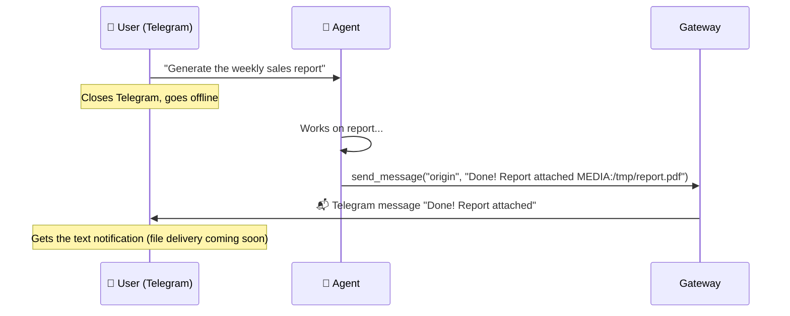
```mermaid
sequenceDiagram
    participant User as 📱 User (Telegram)
    participant Bot as 🤖 Agent
    participant Gateway

    User->>Bot: "Generate the weekly sales report"
    Note over User: Closes Telegram, goes offline
    Bot->>Bot: Works on report...
    Bot->>Gateway: send_message("origin", "Done! Report attached MEDIA:/tmp/report.pdf")
    Gateway->>User: 📬 Telegram message "Done! Report attached"
    Note over User: Gets the text notification (file delivery coming soon)
```

A user pings the agent in a 500-person Slack channel. Instead of replying and cluttering the thread, the agent taps a ⏳ reaction to acknowledge, works on the task, then swaps to ✅ when done — no message noise, but the user still sees progress.

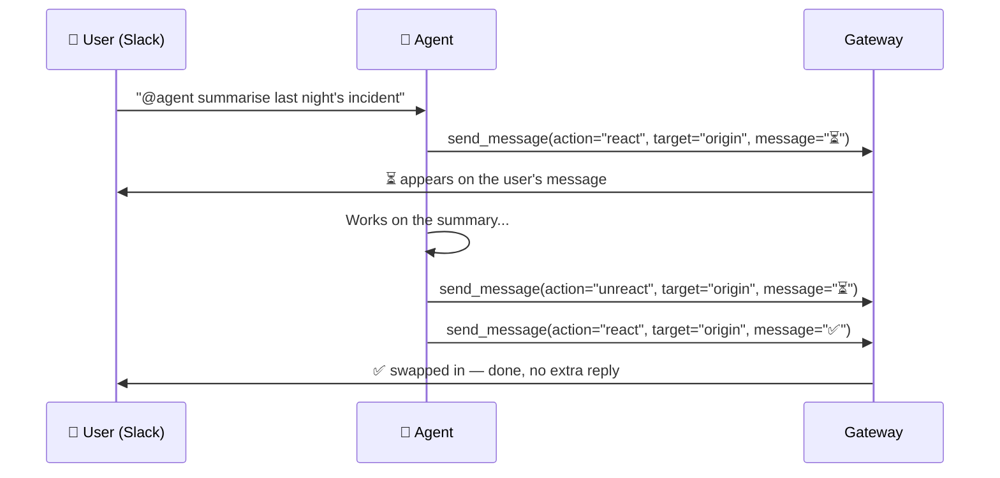
```mermaid
sequenceDiagram
    participant User as 📱 User (Slack)
    participant Bot as 🤖 Agent
    participant Gateway

    User->>Bot: "@agent summarise last night's incident"
    Bot->>Gateway: send_message(action="react", target="origin", message="⏳")
    Gateway->>User: ⏳ appears on the user's message
    Bot->>Bot: Works on the summary...
    Bot->>Gateway: send_message(action="unreact", target="origin", message="⏳")
    Bot->>Gateway: send_message(action="react", target="origin", message="✅")
    Gateway->>User: ✅ swapped in — done, no extra reply
```

An agent posts "Working…" on Telegram, keeps working, then edits that same message to "Done ✅" — the user sees a single evolving status line on their phone, not a stream of noisy follow-ups.

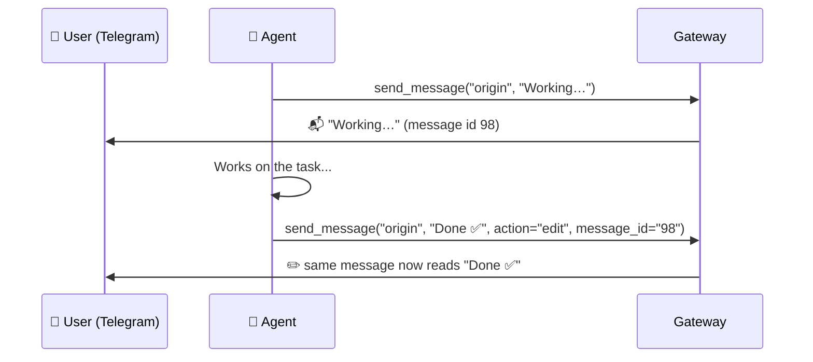
```mermaid
sequenceDiagram
    participant User as 📱 User (Telegram)
    participant Bot as 🤖 Agent
    participant Gateway

    Bot->>Gateway: send_message("origin", "Working…")
    Gateway->>User: 📬 "Working…" (message id 98)
    Bot->>Bot: Works on the task...
    Bot->>Gateway: send_message("origin", "Done ✅", action="edit", message_id="98")
    Gateway->>User: ✏️ same message now reads "Done ✅"
```

The agent notices it posted a message with the wrong figure and calls `send_message("origin", "", action="delete", message_id="…")` to unsend it before the user reads it.

---

## Configuration Reference

`send_message` takes four arguments. All are optional:

| Argument | Type | Default | Description |
|----------|------|---------|-------------|
| `target` | `str` | `"origin"` | Symbolic destination (see Targets table) |
| `message` | `str` | `""` | Text (for `send`), emoji (for `react`/`unreact`), thread title (for `thread`), or new text (for `edit`). Append `" MEDIA:<path>"` on `send` to attach files. |
| `action` | `str` | `"send"` | One of `"send"`, `"list"`, `"react"`, `"unreact"`, `"thread"`, `"edit"`, `"delete"` |
| `message_id` | `str` | `""` | The id of the message to react to / edit / delete. Optional for `react`/`unreact` on `origin` (the inbound message is used). Required for `edit`/`delete`. |

`action` values at a glance:

| `action` | `message` carries | `message_id` | Returns |
|----------|-------------------|--------------|---------|
| `"send"` | text (`" MEDIA:<path>"` optional) | — | Short summary string |
| `"list"` | ignored | — | JSON array of `{target, platform, kind, label}` |
| `"react"` | the emoji | optional (defaults to inbound msg on `origin`) | JSON `ReactionResult` |
| `"unreact"` | the emoji to remove | optional | JSON `ReactionResult` |
| `"thread"` | the thread title | — | JSON `ThreadResult` |
| `"edit"` | the new text | **required** | JSON `MessageActionResult` |
| `"delete"` | ignored | **required** | JSON `MessageActionResult` |

---

## Common Patterns

### Notify on long-task completion

```python
agent = Agent(
    name="Analyst",
    instructions="""
    Run deep analysis tasks. When a task finishes, always call
    send_message("origin", "<summary>") to let the user know.
    """,
    tools=[send_message],
)
```

### Cross-channel handoff

```python
# Model calls send_message(action="list") first, picks slack:#ops, then:
#   send_message("slack:#ops", "Deploy finished ✅")
```

### Pick the target from the list, then send

```python
# 1. List targets
#    send_message(action="list")
#    → [{"target": "slack:#ops", ...}, {"target": "telegram", ...}]
# 2. Choose and send
#    send_message("slack:#ops", "All tests passed")
```

### Acknowledge with a reaction in a busy channel

```python
agent = Agent(
    name="Support",
    instructions="""
    In busy group chats, tap send_message(action="react", target="origin",
    message="⏳") to acknowledge a request, then react with "✅" once the
    task is done instead of posting a full reply.
    """,
    tools=[send_message],
)
```

### Post-then-edit a live status line

```python
agent = Agent(
    name="Deployer",
    instructions="""
    When a deploy starts, post 'Deploying…' with send_message("origin", "Deploying…").
    Remember the returned message id, and when done, edit it to 'Deployed ✅' with
    send_message("origin", "Deployed ✅", action="edit", message_id="<id>").
    """,
    tools=[send_message],
)
```

### Open a thread for a long-running rollout

```python
send_message("slack:#ops", "Q4 rollout — sub-thread", action="thread")
```

---

## Best Practices

<AccordionGroup>
<Accordion title="Confirm channel before sending to an explicit target">
Call `send_message(action="list")` first when the user hasn't specified where they want to be notified. Sending to a channel the user doesn't monitor is noise.
</Accordion>

<Accordion title="Default to 'origin'">
`"origin"` sends to the chat the conversation started in — usually the right choice. Only override it when you have a specific reason (e.g., sending an ops alert to a dedicated Slack channel).
</Accordion>

<Accordion title="Handle the no-gateway fallback in agent instructions">
Include a note like _"If send_message returns a 'No active gateway' message, skip the notification and continue."_ so the agent doesn't retry endlessly on CLI runs.
</Accordion>

<Accordion title="Keep messages short — they hit a phone">
Mobile push notifications truncate long text. Send a one-line summary; attach details as a file with `MEDIA:`.
</Accordion>

<Accordion title="Edit your own status instead of spamming replies">
On channels that support it, `edit` keeps the chat clean; on channels that don't, you'll get `unsupported` and can post a follow-up.
</Accordion>

<Accordion title="Only edit / delete your own messages">
Adapters reject mutating anyone else's message with a transport `failed`.
</Accordion>

<Accordion title="Always check the returned status">
Never assume `ok`. On `unsupported` or `failed`, fall back to a plain `send`.
</Accordion>
</AccordionGroup>

---

## Related

<CardGroup cols={2}>
<Card title="Ask Conversation" icon="messages-question" href="/features/ask-conversation-tool">
Request/reply sibling — message a target and wait for its answer
</Card>

<Card title="Send Policy" icon="shield-check" href="/features/send-policy">
Restrict which channels send_message is allowed to deliver to
</Card>

<Card title="Clarify Tool" icon="messages-question" href="/features/clarify-tool">
Ask the user mid-task for clarifying input
</Card>

<Card title="Channels Gateway" icon="satellite-dish" href="/features/channels-gateway">
Connect agents to Telegram, Slack, Discord, and WhatsApp
</Card>

<Card title="Bot Gateway" icon="robot" href="/features/bot-gateway">
Run the gateway server
</Card>

<Card title="Bot Routing" icon="route" href="/features/bot-routing">
Route messages by channel and platform
</Card>

<Card title="Gateway Threads" icon="comments" href="/features/gateway-threads">
Thread-aware routing and creation across platforms
</Card>

<Card title="Bot Platform Capabilities" icon="grid-2" href="/features/bot-platform-capabilities">
Per-channel `supports_edit` / `supports_delete` / `supports_reactions` matrix
</Card>
</CardGroup>
