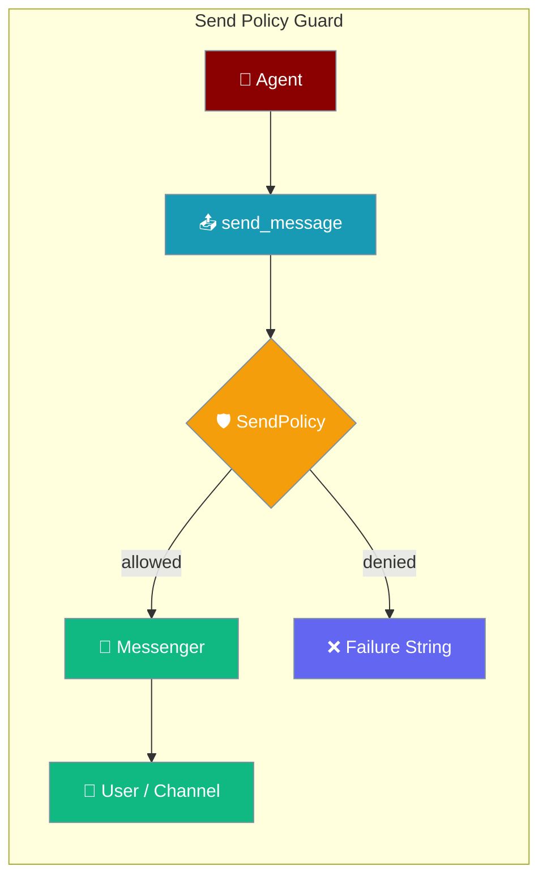
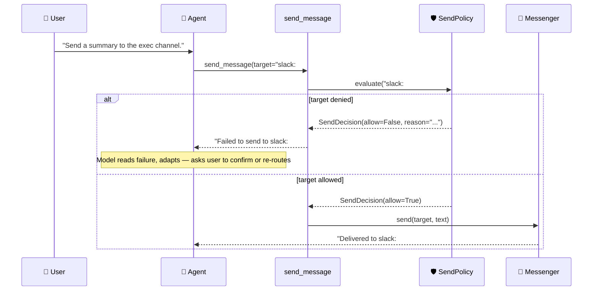

Send Policy controls which channels an agent is allowed to deliver messages to, blocking unauthorised sends before they reach any messenger.

```python
from praisonaiagents import Agent
from praisonai.bots import Bot
from praisonaiagents.gateway.protocols import SendPolicy

agent = Agent(name="Support Bot", instructions="Reply where you were asked.")
Bot(
    "telegram",
    agent=agent,
    send_policy=SendPolicy(default="deny", allow=["origin", "ops-alerts"]),
).start()
```



## Quick Start

<Steps>
<Step title="Default-Deny Allowlist">

Permit only specific targets — everything else is blocked.

```python
from praisonaiagents import Agent
from praisonai.bots import Bot
from praisonaiagents.gateway.protocols import SendPolicy

agent = Agent(
    name="Support Bot",
    instructions="Reply where you were asked. Escalate to ops-alerts if a user reports an outage.",
)

Bot(
    "telegram",
    agent=agent,
    send_policy=SendPolicy(
        default="deny",
        allow=["origin", "ops-alerts"],
    ),
).start()
```

The agent can only send to `origin` (the conversation it came from) or the `ops-alerts` alias. Any other target returns a clean denial string instead of delivering.

</Step>

<Step title="Default-Allow with Denylist">

Allow everything except specific channels you want to protect.

```python
from praisonaiagents import Agent
from praisonai.bots import Bot
from praisonaiagents.gateway.protocols import SendPolicy

agent = Agent(
    name="Assistant",
    instructions="Help the user with their questions.",
)

Bot(
    "slack",
    agent=agent,
    send_policy=SendPolicy(
        default="allow",
        deny=["slack:#exec", "slack:#board"],
    ),
).start()
```

The agent can send to any target except the protected executive channels.

</Step>

<Step title="YAML Configuration">

Set the policy in `gateway.yaml` without writing Python:

```yaml
channels:
  telegram:
    send_policy:
      default: deny
      allow:
        - origin
        - "slack:#ops"
        - ops-alerts
```

</Step>
</Steps>

---

## How It Works



<Note>
Denial is **model-readable**. A well-instructed agent reads the failure string and recovers gracefully — for example, routing to an allowed channel or asking the user to confirm before proceeding.
</Note>

| Component | Role |
|-----------|------|
| **SendPolicy** | Config-driven allow/deny evaluator registered per turn |
| **SendPolicyProtocol** | Interface for custom policy back-ends (RBAC, time-windows, audit) |
| **SendDecision** | Immutable result from `evaluate()` — `allow` bool + optional `reason` |
| **send_message tool** | Checks the active policy before invoking the messenger |

The check sits in **core** (`praisonaiagents`), so every messenger implementation is constrained — not just one adapter. Absent a policy, all sends are allowed (backwards compatible).

---

## Configuration Options

### `SendPolicy`

Import: `from praisonaiagents.gateway.protocols import SendPolicy`

| Argument | Type | Default | Description |
|----------|------|---------|-------------|
| `default` | `str` | `"allow"` | Posture for targets not listed. `"deny"` blocks all except `allow` list; `"allow"` permits all except `deny` list. |
| `allow` | `list[str] \| None` | `None` | Targets explicitly permitted. Active allowlist when `default="deny"`. |
| `deny` | `list[str] \| None` | `None` | Targets explicitly blocked. Takes precedence over `allow`. |

Matching uses **exact string comparison** against the symbolic target token (e.g. `"origin"`, `"slack:#ops"`, a friendly alias). Passing any value other than `"allow"` or `"deny"` for `default` raises `ValueError` at construction time.

### `SendDecision`

Import: `from praisonaiagents.gateway.protocols import SendDecision`

| Field | Type | Default | Description |
|-------|------|---------|-------------|
| `allow` | `bool` | — | `True` if the send is permitted; `False` blocks it. |
| `reason` | `str` | `""` | Optional explanation shown to the model when denied. |

`SendDecision` is a frozen dataclass — immutable once created.

### `SendPolicyProtocol`

Import: `from praisonaiagents.gateway.protocols import SendPolicyProtocol`

```python
class SendPolicyProtocol(Protocol):
    def evaluate(
        self,
        target: str,
        *,
        agent_id: str = "",
        session_id: str = "",
        origin: str | None = None,
    ) -> SendDecision: ...
```

Implement this protocol for richer back-ends. The keyword arguments are populated best-effort from the active `SessionContext`.

---

## Common Patterns

### Default-Deny Allowlist (Production)

Safest posture: only explicitly listed targets can receive messages.

```python
from praisonaiagents.gateway.protocols import SendPolicy

policy = SendPolicy(
    default="deny",
    allow=[
        "origin",       # Always reply where the conversation came from
        "ops-alerts",   # Named alias for the ops channel
    ],
)
```

### Default-Allow with Denylist

Lighter-weight for trusted environments where you only want to protect a few channels.

```python
from praisonaiagents.gateway.protocols import SendPolicy

policy = SendPolicy(
    default="allow",
    deny=["slack:#exec", "slack:#board", "slack:#payroll"],
)
```

### Custom Protocol — Time-Window Restriction

```python
import datetime
from praisonaiagents.gateway.protocols import SendDecision

class BusinessHoursPolicy:
    def evaluate(self, target, *, agent_id="", session_id="", origin=None):
        hour = datetime.datetime.now().hour
        if target.startswith("slack:#exec") and not (9 <= hour < 18):
            return SendDecision(
                allow=False,
                reason="exec channel restricted to business hours (9–18)",
            )
        return SendDecision(allow=True)
```

Register it the same way as `SendPolicy`:

```python
from praisonai.bots import Bot
from praisonaiagents import Agent

agent = Agent(name="Assistant", instructions="Help the user.")
Bot("slack", agent=agent, send_policy=BusinessHoursPolicy()).start()
```

### Custom Protocol — Per-Agent RBAC

```python
from praisonaiagents.gateway.protocols import SendDecision

ALLOWED_CHANNELS: dict[str, list[str]] = {
    "support-bot": ["origin", "slack:#support"],
    "ops-bot":     ["origin", "slack:#ops", "slack:#incidents"],
}

class RBACPolicy:
    def evaluate(self, target, *, agent_id="", session_id="", origin=None):
        allowed = ALLOWED_CHANNELS.get(agent_id, ["origin"])
        if target in allowed:
            return SendDecision(allow=True)
        return SendDecision(
            allow=False,
            reason=f"agent '{agent_id}' is not permitted to send to '{target}'",
        )
```

---

## Threat Model

<Warning>
`send_message` lets the model choose the target. Content reaching the model — including user messages and tool results — can steer an agent into delivering to a channel the operator never intended, exfiltrating conversation data or spamming privileged channels.

The send-policy guard blocks this at the core layer, **before** any messenger is invoked, so a steered or prompt-injected agent cannot bypass it.
</Warning>

Concretely:

1. **Prompt injection** in a retrieved document instructs the agent to `send_message("slack:#exec", "<sensitive data>")`.
2. Without a send policy, the message is delivered.
3. With `SendPolicy(default="deny", allow=["origin"])`, the call fails with a clean denial string. The agent reads it, cannot comply, and the data stays contained.

---

## Best Practices

<AccordionGroup>

<Accordion title="Prefer default='deny' for production deployments">
Start with the most restrictive posture and explicitly list every channel the agent legitimately needs. This gives you a clear audit trail and prevents unexpected delivery as new channels are added.

```python
SendPolicy(default="deny", allow=["origin", "ops-alerts"])
```
</Accordion>

<Accordion title="Always include 'origin' in the allowlist">
Unless you specifically want to prevent the agent from replying to the conversation it came from, include `"origin"` in the `allow` list. Without it, `default="deny"` will block even simple replies.

```python
# Don't forget origin!
SendPolicy(default="deny", allow=["origin", "slack:#ops"])
```
</Accordion>

<Accordion title="Keep policies in version control alongside gateway.yaml">
Whether you use Python or YAML config, commit your send policy alongside the rest of your gateway configuration. This ensures policy changes go through code review and are tracked in history.

```yaml
# gateway.yaml — commit this
channels:
  telegram:
    send_policy:
      default: deny
      allow:
        - origin
        - ops-alerts
```
</Accordion>

<Accordion title="Use SendPolicyProtocol for dynamic rules">
If your rules depend on runtime state (user roles, time of day, session metadata), implement `SendPolicyProtocol` rather than rebuilding a `SendPolicy` instance per request. The `agent_id`, `session_id`, and `origin` kwargs give you the context you need.
</Accordion>

</AccordionGroup>

---

## Behaviour Reference

| Scenario | Result |
|----------|--------|
| No policy registered | All sends permitted (backwards-compatible) |
| `default="deny"`, target not in `allow` | Blocked — `"Failed to send to <target>: target '<target>' is not permitted by send_policy"` |
| `default="allow"`, target in `deny` | Blocked — same format |
| Target in both `allow` and `deny` | `deny` takes precedence — blocked |
| `action="list"` | Always allowed — policy does not affect target listing |
| Policy `.evaluate()` raises an exception | Fails closed — send blocked, `"send_policy evaluation error"` |
| Policy returns something other than `SendDecision` | Fails closed — treated as denial |

---

## Related

<CardGroup cols={2}>
<Card title="Send Message Tool" icon="paper-plane" href="/docs/features/send-message-tool">
  Let agents proactively deliver messages to users mid-task.
</Card>
<Card title="Messaging Bots" icon="robot" href="/docs/features/messaging-bots">
  Deploy AI agents to Telegram, Discord, Slack, and WhatsApp.
</Card>
<Card title="Bot Rate Limiting" icon="gauge" href="/docs/features/bot-rate-limiting">
  Throttle how often agents can respond per user or channel.
</Card>
<Card title="Guardrails" icon="shield" href="/docs/features/guardrails">
  Add input and output safety checks to your agents.
</Card>
</CardGroup>
