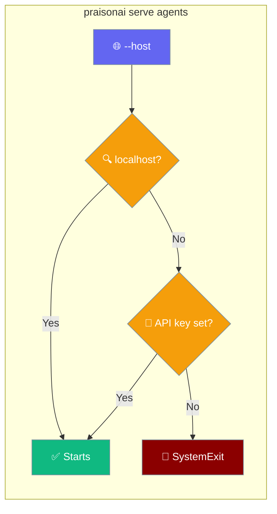

`praisonai serve agents` starts freely on localhost but requires an API key on any public bind, because `POST /agents` can execute YAML-defined tools.



## Quick Start

<Steps>
<Step title="Private mode (default)">
Localhost binds need no key:

```bash
praisonai serve agents --port 8000
```

Any of `127.0.0.1`, `localhost`, or `::1` starts without an API key.
</Step>

<Step title="Public mode (with key)">
Non-localhost binds require a key. Generate one and start:

```bash
export PRAISONAI_SERVE_API_KEY="$(openssl rand -hex 32)"
praisonai serve agents --port 8000 --host 0.0.0.0
```

Or pass it as a flag:

```bash
praisonai serve agents --port 8000 --host 0.0.0.0 --api-key "$PRAISONAI_SERVE_API_KEY"
```
</Step>

<Step title="Call a protected route">
Send the key with either header:

```bash
curl -H "Authorization: Bearer $PRAISONAI_SERVE_API_KEY" http://SERVER_IP:8000/agents/list
curl -H "X-API-Key: $PRAISONAI_SERVE_API_KEY" http://SERVER_IP:8000/agents/list
```
</Step>
</Steps>

---

## The Localhost Allowlist

The server treats these hosts as private and skips the key requirement:

| Host | Private? |
|------|----------|
| `127.0.0.1` | ✅ Yes |
| `localhost` | ✅ Yes |
| `::1` | ✅ Yes |
| `0.0.0.0` | ❌ No — key required |
| Any LAN / public IP | ❌ No — key required |

"Non-localhost" means any `--host` value outside the allowlist above.

---

## Configuration

Provide the key through either path — the flag wins if both are set.

| Source | Example |
|--------|---------|
| CLI flag | `--api-key "$KEY"` |
| Environment variable | `export PRAISONAI_SERVE_API_KEY="$KEY"` |

Generate a strong key with:

```bash
openssl rand -hex 32
```

---

## The SystemExit Error

Binding to a non-localhost host without a key exits immediately with:

```
praisonai serve agents: --api-key (or PRAISONAI_SERVE_API_KEY) is required when binding to a non-localhost host; POST /agents can execute YAML-defined tools.
```

Fix it by setting `PRAISONAI_SERVE_API_KEY` (or `--api-key`), or bind to `127.0.0.1` for a private-only server.

---

## Protected vs Public Routes

When a key is set, most routes require the header. A few stay public for health checks and discovery.

| Route | Auth |
|-------|------|
| `/health` | Public |
| `/` | Public |
| `/.well-known/agent.json` | Public |
| `/__praisonai__/*` | Public |
| `/agents` | Protected |
| `/agents/{agent_name}` | Protected |
| Everything else | Protected |

Both headers are equivalent and use constant-time comparison. Missing or wrong keys return `401 {"error": "Unauthorized"}`.

---

## Consistent YAML Lowering

Both `POST /agents` and `POST /agents/{agent_name}` flow through a single cached generator, so identical YAML gets identical treatment — `guardrails`, `approval`, `tool_timeout`, and retry settings now apply uniformly across both endpoints.

The generator is cached for the app's lifetime (built once at startup) instead of rebuilt per request, so requests share the same adapter, config list, and resolver.

---

## Best Practices

<AccordionGroup>
<Accordion title="Generate keys with openssl">
Use `openssl rand -hex 32` for a 256-bit key. Avoid short or guessable values.
</Accordion>

<Accordion title="Never commit the key">
Keep `PRAISONAI_SERVE_API_KEY` out of source control. Load it from your shell, a `.env` file that is git-ignored, or a secrets manager.
</Accordion>

<Accordion title="Use a secrets manager in production">
Inject the key from AWS Secrets Manager, Vault, or your platform's secret store rather than hard-coding it in deploy scripts.
</Accordion>

<Accordion title="Rotate the key">
Rotate periodically and after any suspected exposure. Update both the server env and every client header at the same time.
</Accordion>
</AccordionGroup>

---

## Related

<CardGroup cols={2}>
<Card title="Serve CLI" icon="server" href="/docs/cli/serve">
  All `praisonai serve` commands and options
</Card>
<Card title="Agents HTTP Server" icon="robot" href="/docs/deploy/servers/agents">
  Deploy agents as an HTTP REST API
</Card>
</CardGroup>
