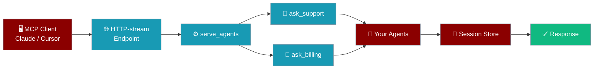
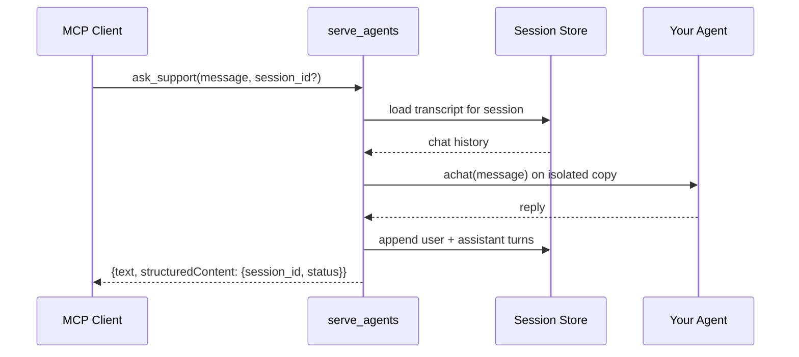
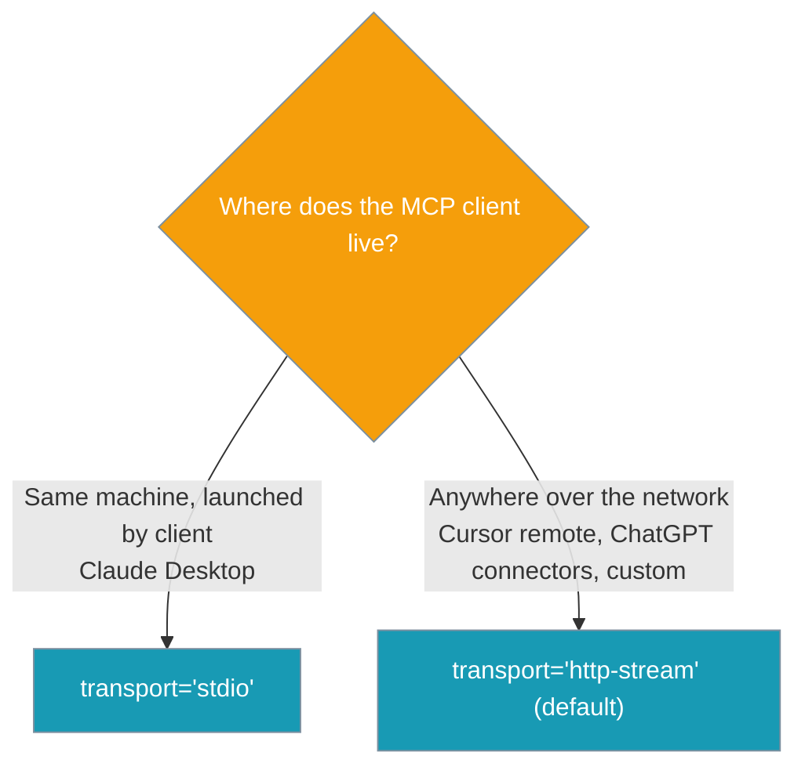

Publish one or more agents to any MCP client as `ask_{name}` tools with a single `serve_agents([...])` call.

```python
from praisonaiagents import Agent
from praisonai_mcp import serve_agents

support = Agent(name="Support", instructions="Help users with support tickets.")
billing = Agent(name="Billing", instructions="Answer billing questions.")

serve_agents([support, billing], port=7777)
```



## Quick Start

<Steps>
<Step title="Install">
```bash
pip install "praisonai-mcp[all]" praisonaiagents
```
</Step>

<Step title="Serve One Agent">
Pass a single agent — `serve_agents` wraps it in a list for you.

```python
from praisonaiagents import Agent
from praisonai_mcp import serve_agents

support = Agent(name="Support", instructions="Help users with support tickets.")

serve_agents(support, port=7777)
```
</Step>

<Step title="Serve Multiple Agents">
Pass a list to publish every agent on one endpoint.

```python
from praisonaiagents import Agent
from praisonai_mcp import serve_agents

support = Agent(name="Support", instructions="Help users with support tickets.")
billing = Agent(name="Billing", instructions="Answer billing questions.")

serve_agents([support, billing], port=7777)
```
</Step>

<Step title="Serve Over stdio">
Use `stdio` when the MCP client launches your process locally (Claude Desktop).

```python
from praisonaiagents import Agent
from praisonai_mcp import serve_agents

support = Agent(name="Support", instructions="Help users with support tickets.")

serve_agents([support], transport="stdio")
```
</Step>
</Steps>

---

## How It Works

Each `ask_*` call loads that session's transcript, runs one turn on an isolated copy of your agent, appends the turn, and returns the reply.



Pick a transport based on where the client runs.



---

## Configuration Options

| Parameter | Type | Default | Description |
|-----------|------|---------|-------------|
| `agents` | `Agent \| list[Agent] \| tuple[Agent, ...]` | *required* | A single `Agent` or a list/tuple of them. A single agent is silently wrapped in a list. |
| `host` | `str` | `"127.0.0.1"` | Bind host. Ignored under `stdio`. |
| `port` | `int` | `7777` | Bind port. Ignored under `stdio`. |
| `transport` | `str` | `"http-stream"` | Either `"http-stream"` (spec-compliant streamable HTTP) or `"stdio"`. Anything else raises `ValueError`. |
| `name` | `str` | `"praisonai-agents"` | MCP server name advertised to the client. |
| `**kwargs` | — | — | Forwarded verbatim to the underlying `MCPServer.run(...)` for the chosen transport (e.g. HTTP-only args like `api_key`, `cors_origins`, `session_ttl`). |

<Note>
Under `transport="stdio"`, `host` and `port` are ignored — the client owns the process over stdin/stdout. Any value other than `"http-stream"` or `"stdio"` raises `ValueError`.
</Note>

`serve_agents(...)` returns the underlying `MCPServer` instance, which is handy for tests and orchestration.

---

## Published Tools

`serve_agents([...])` registers one `ask_{agent_name}` tool per agent plus a single `list_agents()` discovery tool.

### ask_{agent_name}

Input schema:

```json
{
  "type": "object",
  "properties": {
    "message":    {"type": "string", "description": "Message for the agent."},
    "session_id": {"type": "string", "description": "Opaque session id for conversation continuity. Omit to start a new session."},
    "user_id":    {"type": "string", "description": "Optional caller id."}
  },
  "required": ["message"]
}
```

Return value:

```json
{
  "text": "<agent reply>",
  "structuredContent": {"session_id": "<echoed or minted id>", "status": "ok"}
}
```

### list_agents

Returns the agents available on the endpoint:

```json
{"agents": [{"name": "Support", "description": "..."}, {"name": "Billing", "description": "..."}]}
```

The `description` falls back through `agent.role` → the first line of `agent.instructions` → `"Ask the {name} agent."`.

---

## Session Model

Sessions are opaque, isolated, and server-owned — the client controls continuity by echoing back the `session_id`, nothing more.

- **`session_id` is opaque and client-supplied.** When present, the adapter loads that session's transcript, applies it to an isolated per-call agent copy, runs one turn, and appends the user + assistant turns.
- **Omitting `session_id` mints a fresh id per call.** It never falls back to a shared sticky session, so history never leaks across clients. Verified by `test_omitted_session_mints_fresh_id_and_no_shared_history`.
- **Transcripts are namespaced per tool.** The internal store key is `f"{tool_name}:{session_id}"`, so reusing one `session_id` across `ask_support` and `ask_billing` does not mix their histories. Verified by `test_same_session_id_across_agents_does_not_leak_history`.
- **Per-session serialization.** Each session holds a `threading.Lock`, so overlapping calls to the same session can't clobber each other's saved turn. Different sessions never contend.
- **Per-turn agent isolation.** Each turn runs on a shallow `copy.copy(agent)` with the session's history swapped in; the original `Agent` is never mutated by concurrent sessions.
- **Server-owned persona.** There is no tool parameter that lets the client set `instructions` or persona. Verified by `test_no_client_instructions_parameter`.

<Warning>
Omit `session_id` to start a fresh session — do not pass an empty string. Every call without the field gets a brand-new minted id.
</Warning>

Client-side continuity pattern — store the returned `session_id` and send it back on the next turn:

```python
first = call_tool("ask_support", {"message": "My order is late."})
session = first["structuredContent"]["session_id"]

follow_up = call_tool("ask_support", {"message": "Any update?", "session_id": session})
```

---

## Naming and Disambiguation

Agent names become tool suffixes deterministically. Collisions get a numeric suffix.

| Input `agent.name` | Published tool |
|--------------------|----------------|
| `"Support"` | `ask_support` |
| `"sup-port"` | `ask_sup_port` |
| `""` or `None` | `ask_agent` |
| Two agents normalising to `support` (`"Support"` and `"support"`) | `ask_support` + `ask_support_2` |
| Two unnamed agents | `ask_agent` + `ask_agent_2` |

Verified by `test_normalized_name_collision_registers_distinct_tools` and `test_unnamed_agents_do_not_collide`.

---

## What Clients See

With `support` and `billing` served, `list_agents()` returns:

```json
{"agents": [{"name": "Support", "description": "..."}, {"name": "Billing", "description": "..."}]}
```

and the tool list contains `ask_support`, `ask_billing`, and `list_agents`.

Call an agent over the http-stream endpoint:

```bash
curl -X POST http://127.0.0.1:7777/mcp \
  -H "Content-Type: application/json" \
  -d '{
    "jsonrpc": "2.0",
    "method": "tools/call",
    "params": {"name": "ask_support", "arguments": {"message": "My order is late."}},
    "id": 1
  }'
```

---

## Client Integration

<Tabs>
<Tab title="Claude Desktop (stdio)">
```json
{
  "mcpServers": {
    "praisonai-agents": {
      "command": "python",
      "args": ["serve_agents_app.py"]
    }
  }
}
```

`serve_agents_app.py`:

```python
from praisonaiagents import Agent
from praisonai_mcp import serve_agents

support = Agent(name="Support", instructions="Help users with support tickets.")

serve_agents([support], transport="stdio")
```
</Tab>
<Tab title="Cursor (http-stream)">
Start the server:

```python
from praisonaiagents import Agent
from praisonai_mcp import serve_agents

support = Agent(name="Support", instructions="Help users with support tickets.")
billing = Agent(name="Billing", instructions="Answer billing questions.")

serve_agents([support, billing], port=7777)
```

`.cursor/mcp.json`:

```json
{
  "mcpServers": {
    "praisonai-agents": {
      "url": "http://127.0.0.1:7777/mcp",
      "transport": "http-stream"
    }
  }
}
```
</Tab>
</Tabs>

---

## Best Practices

<AccordionGroup>
<Accordion title="Serve your own agents with serve_agents, not praisonai.agent.chat">
Use `serve_agents([...])` for your product agents. The `praisonai.agent.chat` tool is a generic, server-owned assistant proxy that intentionally cannot be repersonalised by the client.
</Accordion>

<Accordion title="Give every agent a name">
The name becomes the `ask_{name}` tool suffix the client sees. Unnamed agents collapse to `ask_agent`, `ask_agent_2`, and so on.
</Accordion>

<Accordion title="Store and resend the session_id">
Keep the returned `session_id` on the client side and pass it back on every follow-up turn for the same conversation. Omitting it always starts a fresh session — that is by design.
</Accordion>

<Accordion title="Match the transport to the deployment">
Prefer `transport='http-stream'` for shared deployments. Use `transport='stdio'` only when the MCP client launches your process (Claude Desktop).
</Accordion>
</AccordionGroup>

---

## Related

<CardGroup cols={2}>
<Card title="Agents MCP" icon="robot" href="/docs/deploy/servers/agents-mcp">
Per-agent `Agent.launch(protocol='mcp')`
</Card>
<Card title="PraisonAI MCP" icon="server" href="/docs/deploy/servers/praisonai-mcp">
Umbrella `praisonai mcp serve`
</Card>
<Card title="MCP" icon="plug" href="/docs/features/mcp">
Connect agents *to* MCP servers (client side)
</Card>
<Card title="praisonai-mcp Package" icon="box" href="/docs/features/praisonai-mcp-package">
Standalone host package guide
</Card>
<Card title="MCP Memory Tools" icon="brain" href="/docs/features/mcp-memory-tools">
Expose memory over MCP alongside your agents
</Card>
</CardGroup>
