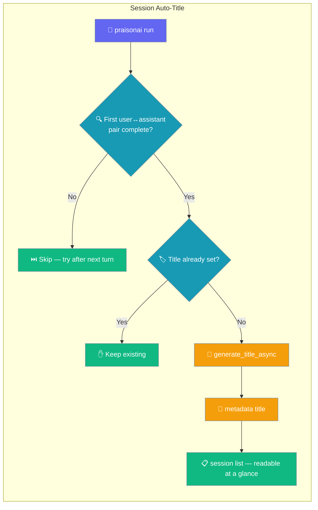
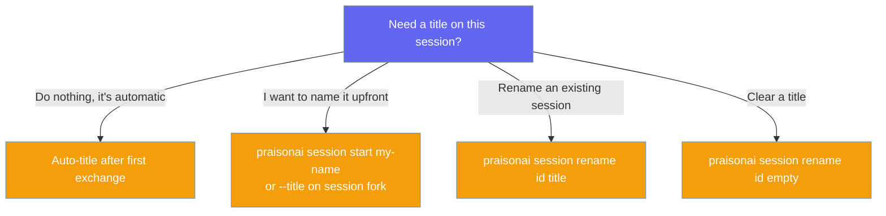

An unnamed session earns a human-readable title on its own after the first user↔assistant exchange, so `session list` reads like a menu instead of a wall of opaque ids.



## Quick Start

<Steps>
<Step title="Just start a run — no naming needed">

```bash
praisonai run "Help me debug this Python import error"
```

</Step>

<Step title="After the first assistant reply, the title appears automatically">

```bash
praisonai session list
# ID         Name                        Status   Events  Updated
# 4f9a8c72   Debug Python Import Error   active   2       10:15
```

</Step>

<Step title="Set your own name upfront to opt out">

```bash
praisonai session start my-feature
# An explicit title is never overwritten by auto-title
```

</Step>
</Steps>

---

## How It Works

Right after the run records usage, a post-run hook checks for the first exchange and generates a title only when one isn't already set.

```mermaid
sequenceDiagram
    participant User
    participant Run as praisonai run/chat/code
    participant Hook as maybe_auto_title_session
    participant Store as Session Store
    participant Title as generate_title_async

    User->>Run: prompt
    Run-->>User: assistant reply
    Run->>Hook: accumulate_session_usage() then hook
    Hook->>Store: get_chat_history()
    alt first user↔assistant pair present AND no existing title
        Hook->>Title: (user_msg, assistant_msg, primary_model)
        Title-->>Hook: "Debug Python Import Error"
        Hook->>Store: rename_session(id, title)
    else no-op — skipped silently
        Hook-->>Run: return None
    end
```

The hook fires on the CLI post-run boundary of `praisonai run`, `praisonai chat`, and `praisonai code` — right after `accumulate_session_usage()`. It reuses the SDK's `generate_title_async` and writes to the same `metadata["title"]` field that `session rename` writes and `session list` reads.

| Behaviour | Detail |
|-----------|--------|
| Precondition | Fires only after the first `user` → `assistant` pair lands in `store.get_chat_history()`. Before that, `session list` shows the fallback (id / agent name / message snippet). |
| No-op on existing title | An existing `metadata["title"]` (set by `session rename` or `--title`) is never overwritten. Whitespace-only titles are treated as unset. |
| Non-blocking | When the caller is already inside an event loop (e.g. the TUI), generation runs on a one-shot worker thread so it never blocks the run. |
| Safe under races | The helper re-reads `metadata["title"]` after the model call and before writing, so a concurrent `session rename` is never clobbered. |
| Best-effort | Any failure (import, model error, timeout, persistence) silently degrades to the existing id / agent-name / snippet fallback. The run is never blocked or errored. |

---

## User Interaction Flow

No user action is needed — the title appears on its own after the first assistant reply.

**Before (first exchange only — title job hasn't fired yet):**

```
ID         Name              Status   Events  Updated
4f9a8c72   4f9a8c72          active   1       10:14
```

**After (post-first-turn hook has run):**

```
ID         Name                          Status   Events  Updated
4f9a8c72   Debug Python Import Error     active   2       10:15
```

The id never changes — `session resume 4f9a8c72-...` still works. The title is display-only metadata.

---

## Choose Your Path

Pick how a session gets its name.



---

## Configuration Options

The auto-title path has no user-facing knobs — these signals govern it.

| Signal | Where it comes from | Effect |
|--------|---------------------|--------|
| First user↔assistant pair | `store.get_chat_history()` | Required precondition — hook no-ops before this |
| `metadata["title"]` | Set by `--title` or `session rename` | If non-empty, auto-title is skipped |
| `metadata["model"]` | Persisted session model | Passed as `primary_model` to `generate_title_async` for auxiliary-model resolution |
| `defaults.small_model` (config) | `~/.praisonai/config.yaml` | Preferred title-generation model |
| `PRAISONAI_AUXILIARY_MODEL` / `OPENAI_MODEL_NAME` (env) | Runtime env | Overrides at call time |

### Model resolution

`generate_title_async` resolves the auxiliary model in this order: an explicit `llm_model` argument → `defaults.small_model` (config) → the session's primary model → a cheap built-in default (`gpt-4o-mini`). The default resolves at call time, so env overrides set after import still take effect.

```python
from praisonaiagents.session import generate_title_async

title = await generate_title_async(
    "Help me debug this Python import error",
    "Let's check your PYTHONPATH and module layout...",
    primary_model="gpt-4o",
)
# -> "Debug Python Import Error"
```

---

## Best Practices

<AccordionGroup>
<Accordion title="You don't need to name new sessions">
Auto-title fires after the first assistant reply. Just start a run — the name appears on the next `session list`.
</Accordion>

<Accordion title="Set --title when you want a specific name">
An explicit title is never overwritten by the auto-title path. Use `praisonai session start my-name` or `--title` on `session fork` to lock in a name upfront.
</Accordion>

<Accordion title="Auto-title never blocks a run">
A slow or unavailable model degrades silently to the id / agent-name fallback. The run itself never waits on or fails from title generation.
</Accordion>

<Accordion title="Legacy sessions get titled on the next turn">
Sessions created before this fix that already have content but no title will earn one on their next `run` / `chat` / `code` turn.
</Accordion>
</AccordionGroup>

---

## Related

<CardGroup cols={2}>
  <Card title="Session" icon="clock-rotate-left" href="/cli/session">
    Full CLI reference for all `session` subcommands
  </Card>
  <Card title="Session Rename" icon="pen-to-square" href="/features/session-rename">
    Override an auto-generated title or set one manually
  </Card>
  <Card title="Project Sessions" icon="folder-tree" href="/features/project-sessions">
    Persisted usage shape and project scoping
  </Card>
</CardGroup>
