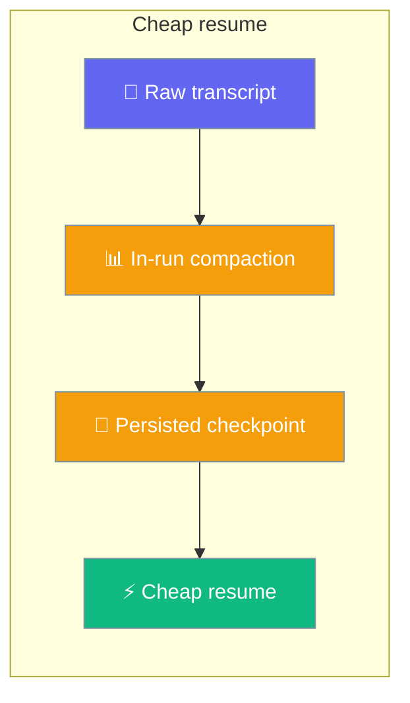

When context compaction runs mid-conversation, the summary is now persisted so a later resume replays the compacted working history (summary + tail) instead of the full raw transcript.

<Note>
Persistence now works for both sync and async agents. Prior versions silently no-op'd for async agents (`astart` / `achat` / `arun`) and for any sync agent whose `AFTER_COMPACTION` hook read `result.summary` — the persister was fed an empty string. Both fixed in `1.6.152+` ([PR #3081](https://github.com/MervinPraison/PraisonAI/pull/3081)).
</Note>



```python
from praisonaiagents import Agent, ExecutionConfig

agent = Agent(
    name="LongChat",
    instructions="Help across many sessions.",
    memory={"session_id": "user-42-chat"},
    execution=ExecutionConfig(context_compaction=True),
)
agent.start("Continue from yesterday.")  # resumes from summary + tail
```

## Quick Start

<Steps>
<Step title="Enable compaction on a session-bound agent">

Bind a `session_id` and turn on context compaction. When the window fills, the summary is written to the session automatically — no extra code.

```python
from praisonaiagents import Agent, ExecutionConfig

agent = Agent(
    name="LongChat",
    instructions="Help across many sessions.",
    memory={"session_id": "user-42-chat"},
    execution=ExecutionConfig(context_compaction=True),
)
agent.start("Let's keep chatting for hours.")
```

</Step>

<Step title="Resume later — cheaply">

Recreate the agent with the same `session_id`. Resume replays the persisted summary plus any turns appended after compaction, instead of the whole raw log.

```python
from praisonaiagents import Agent, ExecutionConfig

agent = Agent(
    name="LongChat",
    instructions="Help across many sessions.",
    memory={"session_id": "user-42-chat"},
    execution=ExecutionConfig(context_compaction=True),
)
agent.start("Pick up where we left off.")  # summary + tail, no window overflow
```

</Step>
</Steps>

---

## Async Agents

`agent.astart(...)` / `agent.achat(...)` / `agent.arun(...)` now persist checkpoints identically to the sync path (`1.6.152+`). Use the same `execution=ExecutionConfig(context_compaction=True)` and `memory={"session_id": ...}` setup.

```python
import asyncio
from praisonaiagents import Agent, ExecutionConfig

async def main():
    agent = Agent(
        name="LongChat",
        instructions="Help across many sessions.",
        memory={"session_id": "user-42-chat"},
        execution=ExecutionConfig(context_compaction=True),
    )
    # Prior versions silently skipped checkpoint persistence on this path.
    # 1.6.152+ persists via asyncio.to_thread so the event loop keeps flowing.
    await agent.astart("Let's keep chatting for hours.")

asyncio.run(main())
```

---

## How It Works

The compactor produces a summary during the run; the store anchors that summary to the current end of the transcript. On resume the store hands back the summary followed by the retained tail.

```mermaid
sequenceDiagram
    participant User
    participant Agent
    participant Compactor
    participant Loop as asyncio.to_thread
    participant Store

    User->>Agent: start / astart (long chat)
    Agent->>Compactor: Context near limit → compact
    Compactor-->>Agent: (compacted, result) — result.summary populated
    Agent->>Loop: async path offloads persistence
    Loop->>Store: append_compaction_checkpoint(summary)
    Store-->>Loop: OK
    User->>Agent: Later run — resume same session_id
    Agent->>Store: get_working_history()
    Store-->>Agent: [summary_message, *tail]
    Agent-->>User: Continues cheaply, no window overflow
```

The sync path calls `append_compaction_checkpoint` directly; the async path routes it through `asyncio.to_thread` so the locked JSON write never stalls the event loop.

The checkpoint records `message_index` — the length of the transcript at compaction time. Anything appended after that index is the **tail** that follows the summary on resume. If the head is later trimmed, the anchor shifts by the same amount so the tail stays aligned.

---

## What Gets Persisted

A single checkpoint is stored on `SessionData.last_compaction`. It carries the summary plus the anchor and observability counters.

| Field | Type | Default | Meaning |
|---|---|---|---|
| `summary` | `str` | *(required)* | The condensed history the compactor produced, read from [`CompactionResult.summary`](/docs/features/context-compaction#new-compactionresult-fields) (previously `""` for all real runs; populated for summarising strategies in `1.6.152+`) |
| `message_index` | `int` | `0` | Transcript length at compaction time; anything after this index is the tail |
| `role` | `str` | `"system"` | Role used when replaying the summary as an LLM message |
| `tokens_before` | `int` | `0` | Token count before compaction (observability) |
| `tokens_after` | `int` | `0` | Token count after compaction (observability) |
| `timestamp` | `float` | `time.time()` | When the checkpoint was written |
| `metadata` | `Dict[str, Any]` | `{}` | Free-form extension slot |

`SessionData` also gains two helpers:

| Method | What it does |
|---|---|
| `trim_messages(max_messages)` | Trims the transcript head, shifting the checkpoint anchor so the tail stays aligned |
| `get_working_history(max_messages=None)` | Reconstructs `[summary_message, *tail]`; falls back to `get_chat_history` when no checkpoint exists. The summary is always kept at the head — only the tail is truncated to `max_messages` |

---

## Advanced — Direct Store Access

Persist and read a checkpoint yourself via the store. `CompactionCheckpoint` is a top-level export.

```python
from praisonaiagents import CompactionCheckpoint
from praisonaiagents.session import DefaultSessionStore

store = DefaultSessionStore()
store.append_compaction_checkpoint("chat-42", "Earlier: we discussed X, Y, Z.")
history = store.get_working_history("chat-42")   # summary + tail

# Render a checkpoint as an LLM-compatible message
checkpoint = CompactionCheckpoint(summary="Earlier: we discussed X, Y, Z.")
message = checkpoint.as_message()   # {"role": "system", "content": "Earlier: ..."}
```

`append_compaction_checkpoint(session_id, summary, *, role="system", tokens_before=0, tokens_after=0, metadata=None)` returns `False` and is a no-op for a blank/whitespace summary, so an empty `{"role": "system", "content": ""}` is never replayed. See [Session Store](/docs/features/session-store#compaction-checkpoints) for the full method reference.

---

## Backward Compatibility

Sessions without a checkpoint resume from their raw messages exactly as before — `get_working_history` falls back to `get_chat_history`. Third-party stores that implement only the old protocol keep working; the agent checks for `get_working_history` / `append_compaction_checkpoint` with `hasattr` before using them.

---

## Best Practices

<AccordionGroup>
<Accordion title="Bind a session_id">
The checkpoint is persisted to the bound session. Without a `session_id`, compaction still runs in-memory but nothing is saved for a cheap resume.
</Accordion>

<Accordion title="Enable compaction on long-lived agents">
Turn on `execution=ExecutionConfig(context_compaction=True)` for agents that run for hours or across many sessions — that's where checkpoint-backed resume pays off.
</Accordion>

<Accordion title="Don't hand-edit the checkpoint anchor">
`message_index` is kept aligned by the store whenever the head is trimmed. Editing it by hand will misalign the retained tail on resume.
</Accordion>

<Accordion title="set_chat_history intentionally invalidates the checkpoint">
Replacing the whole transcript with `set_chat_history()` clears `last_compaction` — the old anchor no longer applies. `clear_session()` clears it too.
</Accordion>

<Accordion title="Which compaction strategies actually produce a summary?">
Only summarising strategies (LLM iterative / naive summarise) populate `result.summary` and therefore persist a checkpoint. `TRUNCATE`, `SLIDING`, and `PRUNE` leave `result.summary` as `""` and — by design — persist nothing. See [Context Compaction](/docs/features/context-compaction#new-compactionresult-fields).
</Accordion>

<Accordion title="Reusing a compactor across passes">
When you reuse a single `ContextCompactor` across mixed strategies, the checkpoint reflects only the current pass — not the last summarising pass. A later `TRUNCATE`/`SLIDING`/`PRUNE` pass persists `""` (nothing) rather than leaking a stale summary that would drop intervening turns on resume.
</Accordion>
</AccordionGroup>

---

## Related

<CardGroup cols={3}>
  <Card title="Session Persistence" icon="floppy-disk" href="/docs/features/session-persistence">
    Automatic session save and restore
  </Card>
  <Card title="Session Store" icon="database" href="/docs/features/session-store">
    Store methods and checkpoint API
  </Card>
  <Card title="Context Compaction" icon="compress" href="/docs/features/context-compaction">
    How summaries are produced in-run
  </Card>
  <Card title="Hook Events" icon="webhook" href="/docs/features/hook-events#system-events">
    Read the summary from an AFTER_COMPACTION hook
  </Card>
</CardGroup>
