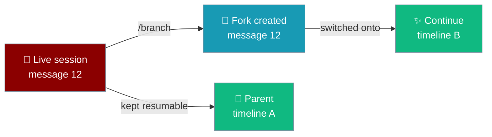
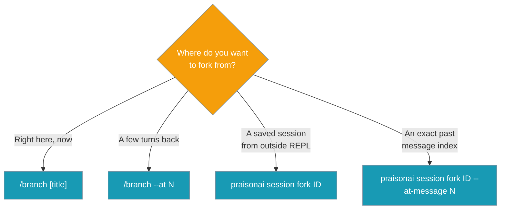

Forking splits the current conversation into a second timeline you can continue independently — try a second approach without losing the first.



You are mid-conversation with an agent, you want to try an alternative, and you fork instead of losing your place:

```bash
$ praisonai code
> Refactor auth.py to use JWT
… agent proposes a refactor …

> /branch jwt-attempt
✓ Branched: sess_abc12345 → sess_def67890
Now on fork sess_def67890 (14 messages). Parent sess_abc12345 kept.

> Actually try session cookies instead
… continues on the fork; parent timeline untouched …

# Later, jump back to the JWT timeline:
$ praisonai session resume sess_abc12345
```

## Quick Start

<Steps>
<Step title="Fork here, keep talking">

Type `/branch` mid-conversation to fork at the current point and switch onto the fork:

```bash
> /branch jwt-attempt
✓ Branched: sess_abc12345 → sess_def67890
Now on fork sess_def67890 (14 messages). Parent sess_abc12345 kept.
```

The next message continues on the fork; the parent stays resumable.

</Step>

<Step title="Fork from earlier">

Rewind before forking with `--at N` — `N` counts user turns back:

```bash
> /branch --at 3
```

Forks from 3 user turns back and switches onto that fork.

</Step>

<Step title="Fork a saved session (no REPL)">

Fork a session from the command line, then resume the fork:

```bash
praisonai session fork sess_abc12345
# Forked session: sess_abc12345 -> sess_def67890
# Resume the fork with: praisonai session resume sess_def67890

praisonai session resume sess_def67890
```

</Step>
</Steps>

---

## How It Works

Forking routes through the same `HierarchicalSessionStore.fork_session` substrate whether you branch in the REPL or from the CLI.

```mermaid
sequenceDiagram
    participant User
    participant REPL as praisonai code
    participant Store as HierarchicalSessionStore
    participant Fork as New session

    User->>REPL: /branch jwt-attempt
    REPL->>REPL: Check worker not busy
    REPL->>Store: fork_session(current_id, ...)
    Store->>Fork: Create with parent_id set
    Store-->>REPL: fork session object
    REPL->>REPL: Rebind session + reload history
    REPL-->>User: ✓ Branched: parent → fork
    User->>REPL: next message
    Note over REPL,Fork: Continues on fork timeline;<br/>parent stays resumable
```

| Step | What happens |
|------|--------------|
| Fork | The live session is copied at the current message index (or `--at N` turns back). |
| Switch | The REPL rebinds onto the fork and reloads its history. |
| Parent kept | The original timeline stays on disk, resumable by its id. |
| Lineage | The fork records `parent_id`; the parent records the fork in `children_ids`. |

---

## When to Fork

Pick the command that matches where you want to fork from.



| Situation | Command |
|---|---|
| "Let me try this a different way from here" | `/branch` |
| "Actually, back up 3 messages and try again" | `/branch --at 3` |
| "Name this exploration" | `/branch red-team review` |
| "Fork a saved session outside the REPL" | `praisonai session fork <id>` |
| "Fork from a specific past message" | `praisonai session fork <id> --at-message 8` |

---

## Options

`/branch` (REPL) and `praisonai session fork` (CLI) share the same substrate but differ in how the fork point is expressed.

**`/branch` — REPL command**

| Option | Type | Description |
|--------|------|-------------|
| `[title]` | `str` | Optional name for the fork (anything after the command that isn't `--at N`). |
| `--at N` / `-a N` | `int` | Fork from `N` **user turns** back. Must be `> 0` and `≤` total user turns. |

**`praisonai session fork` — CLI verb**

```bash
praisonai session fork <session_id> [--at-message N] [--title "..."]
```

| Argument / Flag | Type | Description |
|-----------------|------|-------------|
| `session_id` | `str` | Session to fork. Resolved project store first, then global. |
| `--at-message N` | `int` | Fork from this **0-based message index**. Valid range is `0..count-1`. |
| `--title "..."` | `str` | Optional title for the forked session. |

<Note>
`--at N` in the REPL counts **user turns** back from the end. `--at-message N` in the CLI is a **0-based message index** into the parent's full history. They are different units — pick the one that matches the surface you're on.
</Note>

---

## Lineage

Forking records parent/child links that surface everywhere sessions are shown.

The `/session` command prints lineage when set:

```bash
> /session
Session ID: sess_def67890
Messages: 14
Created: 2026-08-06 10:14:00
Updated: 2026-08-06 10:31:00
Total tokens: 12,345
Forked from: sess_abc12345
```

The parent shows its forks:

```bash
> /session
Session ID: sess_abc12345
...
Forks: sess_def67890
```

`session list` gains a **Parent** column — an 8-character parent id prefix, or `-` for a root session:

```
ID         Name          Status   Events   Tokens    Cost      Parent     Updated
abc12345   jwt-refactor  active   12       12,345    $0.0140   -          10:14
def67890   jwt-attempt   active   14       13,200    $0.0155   abc12345   10:31
```

The `--json` output includes `parent_id` per session:

```bash
praisonai session list --json
```

```json
[
  {
    "id": "def67890",
    "name": "jwt-attempt",
    "parent_id": "abc12345",
    "status": "active"
  }
]
```

---

## Guardrails

Forking refuses unsafe operations rather than producing a corrupted timeline.

<AccordionGroup>
<Accordion title="Refuses while a turn is in flight">

`/branch` refuses if a response is still processing — otherwise the parent's completed turn would land on the freshly-switched fork:

```
A response is still processing. Wait for it to finish before branching (see /status).
```

Wait for the turn to settle (check `/status`), then branch.

</Accordion>

<Accordion title="`/branch --at N` bounds">

`N` must be a positive integer no greater than the number of user turns:

```
> /branch --at 0
/branch --at expects a positive number.

> /branch --at 99
Only 5 user turns available; cannot go 99 back.
```

</Accordion>

<Accordion title="`session fork --at-message N` bounds">

`--at-message` is 0-based and validated up front against the parent's message count — no silent slice wrap:

```
--at-message 99 is out of range (session has 14 messages, valid 0..13)
```

</Accordion>

<Accordion title="Not-found handling">

A `session fork` on an unknown id exits `1` with a remediation hint:

```
Session not found: sess_missing
Use 'praisonai session list' to see available sessions
```

In the REPL, `/branch` with no active session prints `No active session to branch from.` and a store failure prints `Could not fork the current session.` — neither crashes the REPL.

</Accordion>
</AccordionGroup>

---

## JSON Output

`session fork --json` returns the fork result as a single object:

```bash
praisonai session fork sess_abc12345 --at-message 8 --title "cookie-path" --json
```

```json
{
  "forked": true,
  "parent_id": "sess_abc12345",
  "session_id": "sess_def67890",
  "from_message_index": 8,
  "title": "cookie-path"
}
```

`from_message_index` and `title` are `null` when not passed.

---

## Best Practices

<AccordionGroup>
<Accordion title="Name your branches">
Pass a title (`/branch jwt-attempt` or `--title "..."`) so `session list` reads like a menu of explorations instead of anonymous ids.
</Accordion>
<Accordion title="Wait for the turn to finish">
Branch only after the current response settles — `/branch` refuses mid-turn to keep the fork clean. Check `/status` if unsure.
</Accordion>
<Accordion title="Resume the parent later">
The parent timeline stays on disk. Note its id from the `✓ Branched:` line so you can `praisonai session resume <parent_id>` to jump back.
</Accordion>
<Accordion title="Fork from the right unit">
Use `/branch --at N` to count user turns in the REPL; use `session fork --at-message N` for an exact 0-based message index from the CLI.
</Accordion>
</AccordionGroup>

---

## Related

<CardGroup cols={2}>
  <Card title="Session Command" icon="clock-rotate-left" href="/cli/session">
    Full `session` sub-command reference, including `fork`
  </Card>
  <Card title="Interactive TUI" icon="terminal" href="/cli/interactive-tui">
    REPL slash commands, including `/branch`
  </Card>
</CardGroup>
