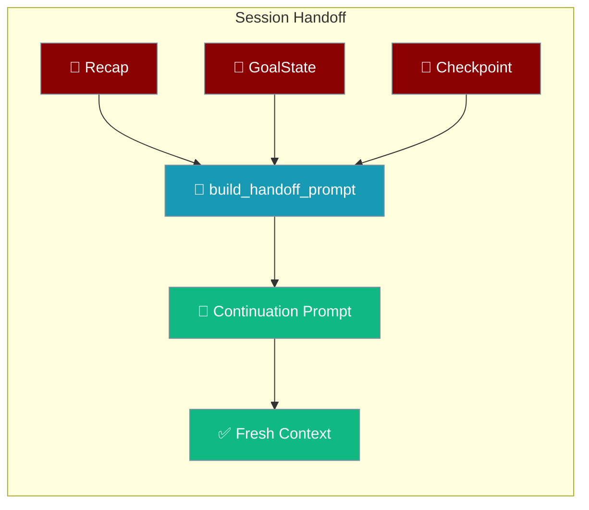
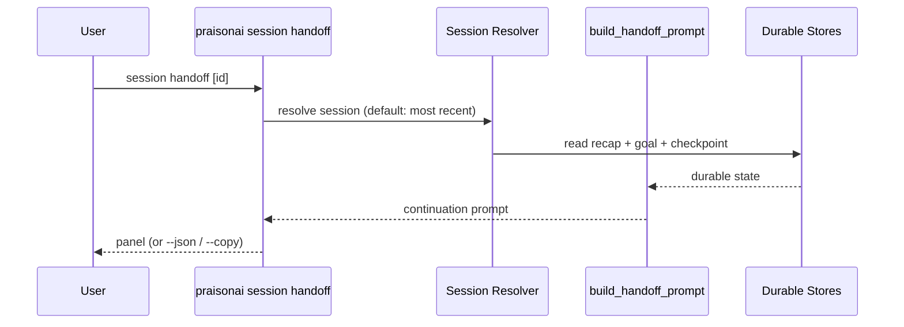
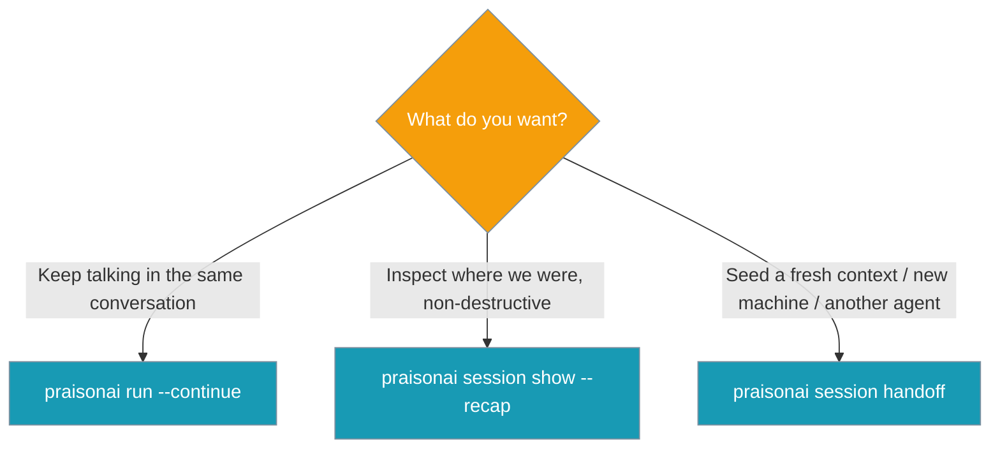

Session handoff assembles a continuation prompt from durable state so a fresh context can resume without scrolling.



<Note>
This is **not** the same as [agent-to-agent handoffs](/features/handoffs). Session handoff assembles a *continuation prompt from durable state* for a fresh context; agent-to-agent handoffs route control between agents mid-run.
</Note>

## Quick Start

<Steps>
<Step title="Hand off the most recent session">
```bash
praisonai session handoff
```
</Step>

<Step title="Hand off a specific session">
```bash
praisonai session handoff my-project --json
praisonai session handoff my-project --copy
```
</Step>

<Step title="Build a handoff prompt from Python">
```python
from praisonaiagents import Agent
from praisonaiagents.session import build_handoff_prompt

agent = Agent(
    name="ResumingAgent",
    instructions="Continue the interrupted work."
)

prompt = build_handoff_prompt(
    recap="Recap — where we were: refactored logging in main.py",
    goal_state={
        "goal": "Ship the logging refactor",
        "criteria": {
            "outcome": "All modules use structured logging",
            "verification": "pytest passes and logs are JSON",
            "constraints": ["do not change public API"],
        },
    },
    workflow_checkpoint={
        "completed_steps": 3,
        "total_steps": 5,
        "last_step": "wire logger",
    },
)

agent.start(prompt)
```
</Step>
</Steps>

---

## How It Works

The CLI resolves a session, reads its durable stores, and calls `build_handoff_prompt` to render the prompt — no LLM call, no state mutation.



Each section maps to one durable source and is omitted when that source has no data.

| Source | Section rendered | Omitted when |
|--------|------------------|--------------|
| Persisted recap | `RECENT ACTIONS (recap-derived):` | recap is empty |
| `GoalState` | `GOAL:` / `DEFINITION OF DONE:` / `CONSTRAINTS (never violate):` / `STATUS:` | goal_state missing |
| Workflow checkpoint | `PROGRESS: {n} of {m} workflow steps done; last completed: …` | checkpoint missing |
| Explicit `recent_actions=` | `RECENT ACTIONS:` bullet list | not supplied (falls back to recap) |
| Explicit `key_files=` | `KEY FILES: a, b, c` (de-duplicated) | not supplied |
| Always present | Preamble + `NEXT:` guidance tail | never |

---

## Example Output

The Quick Start inputs render this prompt verbatim:

```text
You are resuming an interrupted run. Recover from durable state; do not trust memory of a previous conversation.

GOAL: Ship the logging refactor
DEFINITION OF DONE: All modules use structured logging (verify: pytest passes and logs are JSON)
CONSTRAINTS (never violate): do not change public API
PROGRESS: 3 of 5 workflow steps done; last completed: wire logger
RECENT ACTIONS (recap-derived):
Recap — where we were: refactored logging in main.py
NEXT: continue toward the remaining work. First verify the current state on disk before acting.
```

Add a `STATUS:` line by setting `last_reason` on the goal state, and a `KEY FILES:` line by passing `key_files=`:

```python
prompt = build_handoff_prompt(
    recap="Recap — where we were: refactored logging in main.py",
    goal_state={
        "goal": "Ship the logging refactor",
        "criteria": {
            "outcome": "All modules use structured logging",
            "verification": "pytest passes and logs are JSON",
            "constraints": ["do not change public API"],
        },
        "last_reason": "tests still failing",
    },
    workflow_checkpoint={
        "completed_steps": 3,
        "total_steps": 5,
        "last_step": "wire logger",
    },
    key_files=["src/main.py", "tests/test_main.py"],
)
```

---

## Python Options

`build_handoff_prompt` is keyword-only. Every argument maps to a durable source.

| Option | Type | Default | Description |
|--------|------|---------|-------------|
| `recap` | `str` | `""` | Persisted compaction summary / recap string. |
| `goal_state` | `Optional[Dict]` | `None` | A persisted `GoalState.to_dict()` mapping. |
| `workflow_checkpoint` | `Optional[Dict]` | `None` | Workflow checkpoint dict. |
| `recent_actions` | `Optional[List[str]]` | `None` | Explicit recent-action lines; falls back to recap-derived when omitted. |
| `key_files` | `Optional[List[str]]` | `None` | File paths to surface under `KEY FILES:` (de-duplicated, order preserved). |
| `max_chars` | `int` | `4000` (`HANDOFF_MAX_CHARS`) | Upper bound on the rendered prompt. `0` disables the cap. |

---

## CLI Options

`praisonai session handoff` prints the continuation prompt for a session.

| Option | Description |
|--------|-------------|
| `[session-id]` | Session to hand off. Defaults to the most recent session. |
| `--json` | Structured output: `{session_id, handoff, has_goal, has_checkpoint}` (global JSON flag). |
| `--copy` | Best-effort clipboard copy; falls back to printing the panel. |

When the id can't be resolved the command exits with code `1`:

```text
Session not found: my-project
Use 'praisonai session list' to see available sessions
```

---

## Key Properties

<AccordionGroup>
<Accordion title="Deterministic">
No LLM call — the same durable state always renders the same prompt.
</Accordion>

<Accordion title="Offline-safe">
Assembly reads only local durable stores, so it never blocks the hot path and never raises into the loop.
</Accordion>

<Accordion title="Tail-biased cap">
The prompt is hard-capped at `max_chars` (default `4000`) by trimming the middle recap while preserving the actionable `NEXT:` line verbatim.
</Accordion>

<Accordion title="Additive, read-only">
Handoff assembles a prompt from durable state. It does not restore conversation (use `--continue` / `resume`) and does not mutate session state.
</Accordion>
</AccordionGroup>

---

## Choosing the Right Resume Path

Different goals call for different commands — pick the one that matches your intent.



---

## Related

<CardGroup cols={2}>
<Card title="Context Compaction" icon="compress" href="/features/context-compaction">
  Durable recap and structured summaries that feed the handoff prompt
</Card>
<Card title="Session CLI" icon="terminal" href="/cli/session">
  List, resume, recap, and hand off sessions from the terminal
</Card>
<Card title="/recap bot command" icon="robot" href="/features/bot-commands#recap">
  The chat counterpart of the read-only recap
</Card>
<Card title="Agent Handoffs" icon="right-left" href="/features/handoffs">
  Not to be confused — agent-to-agent control routing
</Card>
</CardGroup>
