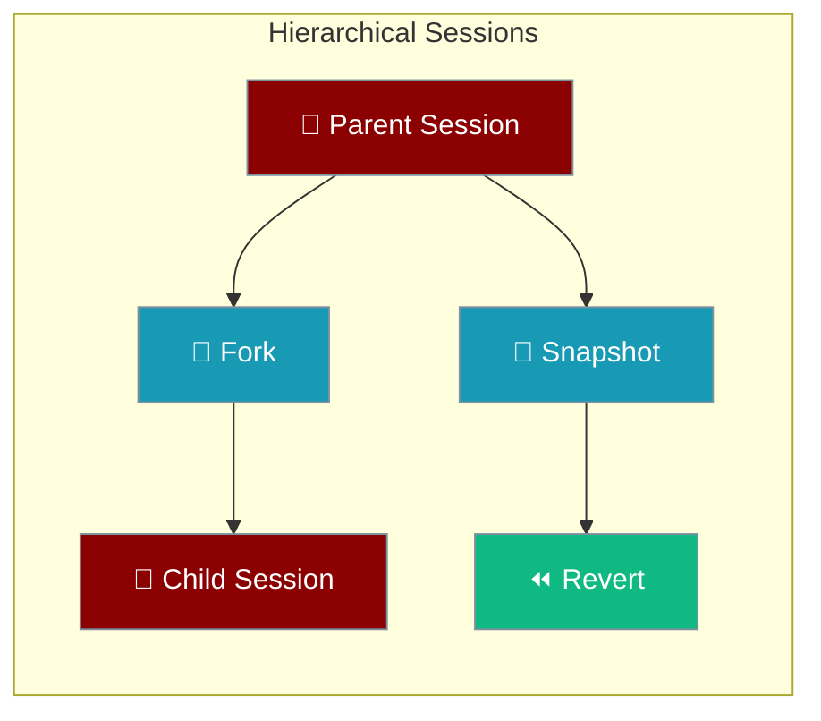
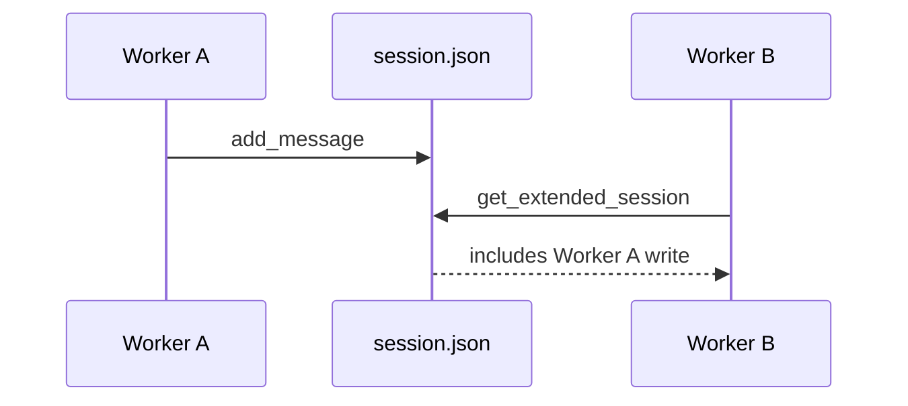

Session hierarchy adds forking, snapshots, and revert on top of file-backed sessions — safe when multiple workers share one directory.



<Note>
For basic persistence, use `Agent(memory={"session_id": "my-session"})`. See [Session Persistence](/features/session-persistence).
</Note>

## Quick Start

```python
from praisonaiagents import Agent
from praisonaiagents.session import get_hierarchical_session_store

store = get_hierarchical_session_store()
session_id = store.create_session(title="Planning chat")

agent = Agent(
    name="Assistant",
    instructions="Help me plan a trip",
    memory={"session_id": session_id},
)
agent.start("I want to visit Japan in spring")

snapshot_id = store.create_snapshot(session_id, label="Before branch")
fork_id = store.fork_session(session_id, message_index=2, title="Alternate plan")
```

## Multi-Worker Safety

Multiple processes can share one session directory — reads reload when the on-disk file changes.



| Operation | Safe under concurrency |
|---|---|
| `get_extended_session()` | Yes — mtime-checked cache |
| `add_message()` | Yes — locked read-modify-write |
| `fork_session()` | Yes — reloads parent first |
| `create_snapshot()` / `revert_to_snapshot()` | Yes — atomic under lock |

## Fork, Snapshot, Revert

```python
# Snapshot before a risky edit
snap = store.create_snapshot(session_id, label="checkpoint")

store.add_message(session_id, "user", "Try experimental option")

# Revert if needed
store.revert_to_snapshot(session_id, snap.snapshot_id)

# Or fork from a message index for parallel branches
child_id = store.fork_session(session_id, message_index=4, title="Branch B")
```

## Related

<CardGroup cols={2}>
  <Card title="Session Store" icon="database" href="/features/session-store">
    Default and hierarchical store APIs
  </Card>
  <Card title="Session Protocol" icon="plug" href="/features/session-protocol">
    Custom Redis/Postgres backends
  </Card>
</CardGroup>
