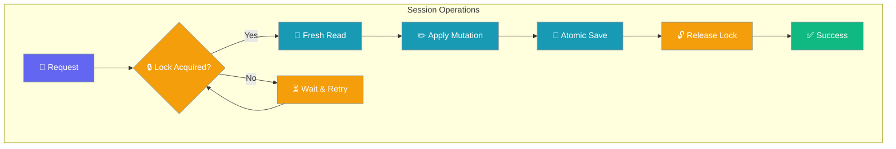

Session hierarchy enables parent-child relationships, forking from any message, and snapshot-based revert — all safe under concurrent message writes.

```mermaid
sequenceDiagram
    participant User
    participant Agent
    participant ForkWorker
    participant Store
    
    User->>Agent: "Continue conversation"
    Agent->>Store: add_message (locked)
    Note over Store: Locked read-modify-write
    
    par Concurrent Fork
        ForkWorker->>Store: fork_session (locked)
        Note over Store: Fresh reload + locked mutation
    end
    
    Store-->>Agent: Message saved
    Store-->>ForkWorker: Fork created with preserved messages
    Agent-->>User: "Response"
    
    classDef user fill:#8B0000,stroke:#7C90A0,color:#fff
    classDef agent fill:#189AB4,stroke:#7C90A0,color:#fff
    classDef store fill:#10B981,stroke:#7C90A0,color:#fff
    
    class User user
    class Agent,ForkWorker agent
    class Store store
```

## Quick Start

<Steps>
<Step title="Agent-Centric Usage">
```python
from praisonaiagents import Agent
from praisonaiagents.session.hierarchy import HierarchicalSessionStore

store = HierarchicalSessionStore(session_dir="./sessions")
session_id = store.create_session(title="My Project")

agent = Agent(
    name="Assistant",
    instructions="Help with the project",
    memory={"session_id": session_id, "store": store},
)

agent.start("Let's begin")
```
</Step>

<Step title="Direct Store Usage">

```python
from praisonaiagents.session.hierarchy import HierarchicalSessionStore

store = HierarchicalSessionStore(session_dir="./sessions")
session_id = store.create_session(title="My Project")

# Add messages
store.add_message(session_id, "user", "Hello!")
store.add_message(session_id, "assistant", "Hi there!")

# Create a snapshot
snapshot_id = store.create_snapshot(session_id, label="Checkpoint 1")

# Fork session
fork_id = store.fork_session(session_id, title="Experimental Branch")
```
</Step>
</Steps>

---

## Concurrency & Safety

Every mutation goes through a locked read-modify-write, so chat messages added in one process are never lost when another process forks, snapshots, reverts, shares, or retitles the same session.

| Operation | Safe with concurrent `add_message`? |
|---|---|
| `create_session(parent_id=...)` | Yes |
| `fork_session()` | Yes |
| `create_snapshot()` | Yes |
| `revert_to_snapshot()` | Yes |
| `revert_to_message()` | Yes |
| `share_session()` / `unshare_session()` | Yes |
| `set_title()` | Yes |
| `add_message()` | Yes (#1745) |

---

## User Interaction Flow

```python
from praisonaiagents import Agent
from praisonaiagents.session.hierarchy import HierarchicalSessionStore

store = HierarchicalSessionStore()
session_id = store.create_session(title="Gateway Session")

# User is mid-conversation
agent = Agent(name="Assistant", memory={"session_id": session_id, "store": store})
agent.start("What's the weather like?")
store.add_message(session_id, "assistant", "It's sunny today")

# Background job forks for experiment (concurrent with user)
import threading
def experiment():
    fork_id = store.fork_session(session_id, title="Weather Analysis")
    store.add_message(fork_id, "user", "Analyze historical patterns")

thread = threading.Thread(target=experiment)
thread.start()

# User sends another message during the fork
store.add_message(session_id, "user", "What about tomorrow?")

thread.join()
# Both messages survive: original session has both weather messages,
# fork has the pre-fork conversation only
```

---

## Features

- **Parent-Child Sessions** - Create hierarchical session relationships
- **Session Forking** - Fork sessions from any message point
- **Snapshots** - Create labeled checkpoints within sessions
- **Revert** - Restore sessions to previous states
- **Export/Import** - Transfer sessions between systems

---

## How It Works



| Operation | Behavior | Concurrency Safety |
|---|---|---|
| `add_message()` | Append message to session | Locked read-modify-write |
| `fork_session()` | Copy messages up to index | Fresh reload + locked mutation |
| `create_snapshot()` | Record current message count | Locked with fresh state |
| `revert_to_snapshot()` | Truncate messages to index | Locked revert operation |

---

## API Reference

### HierarchicalSessionStore

```python
class HierarchicalSessionStore(DefaultSessionStore):
    def create_session(
        self,
        title: Optional[str] = None,
        parent_id: Optional[str] = None
    ) -> str:
        """Create a new session, optionally as child of another."""
    
    def fork_session(
        self,
        session_id: str,
        from_message_index: Optional[int] = None,
        title: Optional[str] = None
    ) -> str:
        """Fork a session from a specific message point."""
    
    def create_snapshot(
        self,
        session_id: str,
        label: Optional[str] = None
    ) -> str:
        """Create a labeled snapshot of the current session state."""
    
    def revert_to_snapshot(
        self,
        session_id: str,
        snapshot_id: str
    ) -> bool:
        """Revert session to a previous snapshot."""
    
    def get_snapshots(self, session_id: str) -> List[SessionSnapshot]:
        """Get all snapshots for a session."""
    
    def export_session(self, session_id: str) -> Dict[str, Any]:
        """Export session data for transfer."""
    
    def import_session(self, data: Dict[str, Any]) -> str:
        """Import a session from exported data."""
```

## Examples

### Forking Sessions

```python
store = HierarchicalSessionStore()

# Create main session
main_id = store.create_session(title="Main Branch")
store.add_message(main_id, "user", "Start project")
store.add_message(main_id, "assistant", "Project initialized")

# Fork from message index 1
fork_id = store.fork_session(
    main_id,
    from_message_index=1,
    title="Experimental Branch"
)

# Fork has messages up to index 1
# Can now diverge independently
store.add_message(fork_id, "user", "Try experimental approach")
```

### Snapshot Management

```python
store = HierarchicalSessionStore()
session_id = store.create_session()

# Work and create snapshots
store.add_message(session_id, "user", "Phase 1")
snap1 = store.create_snapshot(session_id, label="After Phase 1")

store.add_message(session_id, "user", "Phase 2")
snap2 = store.create_snapshot(session_id, label="After Phase 2")

# List all snapshots
snapshots = store.get_snapshots(session_id)
for snap in snapshots:
    print(f"{snap.label}: {snap.message_index + 1} messages")

# Revert to Phase 1
store.revert_to_snapshot(session_id, snap1)
```

### Export/Import

```python
# Export from one store
store1 = HierarchicalSessionStore(session_dir="./store1")
session_id = store1.create_session(title="Portable Session")
store1.add_message(session_id, "user", "Important data")

exported = store1.export_session(session_id)

# Import to another store
store2 = HierarchicalSessionStore(session_dir="./store2")
new_id = store2.import_session(exported)
```

---

## Best Practices

<AccordionGroup>
<Accordion title="Use One Store Instance Per Process">
Create a single `HierarchicalSessionStore` instance and reuse it throughout your application to benefit from caching and avoid file lock contention.
</Accordion>

<Accordion title="Snapshot Before Risky Operations">
Create snapshots before experimental branches or potentially destructive operations. Forks are cheap — use them liberally for what-if scenarios.
</Accordion>

<Accordion title="Handle Concurrent Access Gracefully">
The store handles concurrent writes automatically, but your application logic should account for sessions being modified by other processes.
</Accordion>

<Accordion title="Use Meaningful Titles and Labels">
Set descriptive titles for sessions and snapshot labels to make navigation easier in multi-branch scenarios.
</Accordion>
</AccordionGroup>

---

## Related

<CardGroup cols={2}>
<Card title="Session Management" icon="brain" href="/concepts/session-management">
  Core session concepts and basic persistence
</Card>
<Card title="File Snapshot" icon="camera" href="/features/file-snapshot">
  File-level snapshot capabilities
</Card>
</CardGroup>
