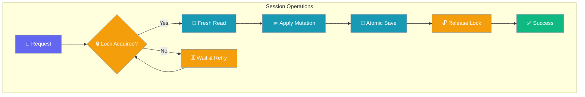
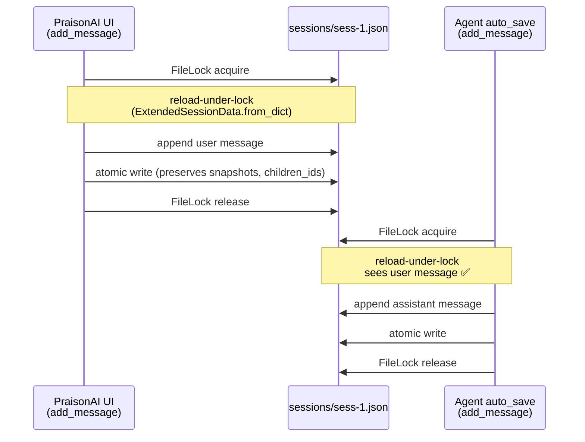

Session hierarchy enables parent-child relationships, forking from any message, and snapshot-based revert — all safe under concurrent message writes.

```mermaid
sequenceDiagram
    participant User
    participant Agent
    participant ForkWorker
    participant Store
    
    User->>Agent: "Continue conversation"
    Agent->>Store: add_message (locked)
    Note over Store: Locked read-modify-write
    
    par Concurrent Fork
        ForkWorker->>Store: fork_session (locked)
        Note over Store: Fresh reload + locked mutation
    end
    
    Store-->>Agent: Message saved
    Store-->>ForkWorker: Fork created with preserved messages
    Agent-->>User: "Response"
    
    classDef user fill:#8B0000,stroke:#7C90A0,color:#fff
    classDef agent fill:#189AB4,stroke:#7C90A0,color:#fff
    classDef store fill:#10B981,stroke:#7C90A0,color:#fff
    
    class User user
    class Agent,ForkWorker agent
    class Store store
=======
description: "Parent-child sessions, forking, snapshots, and revert capabilities with multi-process safety"
icon: "sitemap"
---

Advanced session management with forking, snapshots, and revert capabilities for complex conversation flows.

```mermaid
graph LR
    subgraph "Hierarchical Sessions"
        A[📝 Parent Session] --> B[🌿 Fork]
        A --> C[📸 Snapshot]
        B --> D[🔀 Child Session]
        C --> E[⏪ Revert]
    end
    
    classDef session fill:#8B0000,stroke:#7C90A0,color:#fff
    classDef operation fill:#189AB4,stroke:#7C90A0,color:#fff
    classDef result fill:#10B981,stroke:#7C90A0,color:#fff
    
    class A,D session
    class B,C operation
    class E result
>>>>>>> origin/main
```

## Quick Start

<Steps>
<Step title="Agent-Centric Usage">
<<<<<<< HEAD
```python
from praisonaiagents import Agent
from praisonaiagents.session.hierarchy import HierarchicalSessionStore

store = HierarchicalSessionStore(session_dir="./sessions")
session_id = store.create_session(title="My Project")

agent = Agent(
    name="Assistant",
    instructions="Help with the project",
    memory={"session_id": session_id, "store": store},
)

agent.start("Let's begin")
```
</Step>

<Step title="Direct Store Usage">
=======
Use HierarchicalSessionStore automatically when fork/snapshot operations are needed:
>>>>>>> origin/main

```python
from praisonaiagents import Agent
from praisonaiagents.session import get_hierarchical_session_store

# Agent with hierarchical session support
agent = Agent(
    name="Assistant",
    memory={"session_id": "project-alpha"},
)

response = agent.start("Let's plan the migration")

# Later - fork the conversation to explore alternatives
store = get_hierarchical_session_store()
fork_id = store.fork_session("project-alpha")
```
</Step>

<Step title="Direct Store Usage">
For advanced control, use the store directly:

```python
from praisonaiagents.session import HierarchicalSessionStore

store = HierarchicalSessionStore(session_dir="./sessions")
session_id = store.create_session(title="My Project")

# Add messages
store.add_message(session_id, "user", "Hello!")
store.add_message(session_id, "assistant", "Hi there!")

# Create a snapshot
snapshot_id = store.create_snapshot(session_id, label="Checkpoint 1")

# Fork session
fork_id = store.fork_session(session_id, title="Experimental Branch")
```
</Step>
</Steps>
<<<<<<< HEAD

---

## Concurrency & Safety

Every mutation goes through a locked read-modify-write, so chat messages added in one process are never lost when another process forks, snapshots, reverts, shares, or retitles the same session.

| Operation | Safe with concurrent `add_message`? |
|---|---|
| `create_session(parent_id=...)` | Yes |
| `fork_session()` | Yes |
| `create_snapshot()` | Yes |
| `revert_to_snapshot()` | Yes |
| `revert_to_message()` | Yes |
| `share_session()` / `unshare_session()` | Yes |
| `set_title()` | Yes |
| `add_message()` | Yes (#1745) |

---

## User Interaction Flow

```python
from praisonaiagents import Agent
from praisonaiagents.session.hierarchy import HierarchicalSessionStore

store = HierarchicalSessionStore()
session_id = store.create_session(title="Gateway Session")

# User is mid-conversation
agent = Agent(name="Assistant", memory={"session_id": session_id, "store": store})
agent.start("What's the weather like?")
store.add_message(session_id, "assistant", "It's sunny today")

# Background job forks for experiment (concurrent with user)
import threading
def experiment():
    fork_id = store.fork_session(session_id, title="Weather Analysis")
    store.add_message(fork_id, "user", "Analyze historical patterns")

thread = threading.Thread(target=experiment)
thread.start()

# User sends another message during the fork
store.add_message(session_id, "user", "What about tomorrow?")

thread.join()
# Both messages survive: original session has both weather messages,
# fork has the pre-fork conversation only
```

---

## Features

- **Parent-Child Sessions** - Create hierarchical session relationships
- **Session Forking** - Fork sessions from any message point
- **Snapshots** - Create labeled checkpoints within sessions
- **Revert** - Restore sessions to previous states
- **Export/Import** - Transfer sessions between systems

---

## How It Works



| Operation | Behavior | Concurrency Safety |
|---|---|---|
| `add_message()` | Append message to session | Locked read-modify-write |
| `fork_session()` | Copy messages up to index | Fresh reload + locked mutation |
| `create_snapshot()` | Record current message count | Locked with fresh state |
| `revert_to_snapshot()` | Truncate messages to index | Locked revert operation |

---
=======
>>>>>>> origin/main

---

## Multi-Process Safety

`HierarchicalSessionStore` is safe under concurrent multi-process and multi-instance use, with the same guarantees as `DefaultSessionStore` plus extended-field preservation:

- **File locking** — `fcntl.flock()` on Unix, `msvcrt.locking()` on Windows
- **Atomic writes** — temp file + `os.replace()` prevents partial-write corruption
- **Reload under lock** — every mutator (`add_message`, `update_session_metadata`, `clear_session`, `set_agent_info`, `set_gateway_info`) reloads the session from disk inside the `FileLock` before mutating, so two processes sharing the same session directory cannot drop each other's messages.
- **Extended-field preservation** — `parent_id`, `children_ids`, `snapshots`, and `forked_from_message_id` survive across `update_session_metadata` and `clear_session` calls (fixed in PR #1745). Earlier releases could silently wipe these fields on the next save after a metadata update.

<Note>
This matters most for the PraisonAI UI host, where the UI calls `add_message` from the request thread while the agent's `auto_save` writes assistant turns from a worker thread, and `_persist_session_stats()` runs `update_session_metadata` after every turn. PR #1745 closes the last remaining race in that path.
</Note>



---

## Configuration Options

<Card title="HierarchicalSessionStore API Reference" icon="code" href="/docs/sdk/reference/python/praisonaiagents.session.hierarchy">
  Complete API documentation with all parameters and return types
</Card>

### Extended fields preserved across mutators

| Field | Set by | Preserved by |
|---|---|---|
| `parent_id` | `create_session(parent_id=...)`, `fork_session(...)` | all mutators (PR #1745) |
| `children_ids` | `create_session(parent_id=...)`, `fork_session(...)` | all mutators (PR #1745) |
| `snapshots` | `create_snapshot(...)` | all mutators (PR #1745) |
| `forked_from_message_id` | `fork_session(from_message_index=...)` | all mutators (PR #1745) |

### Key Methods

```python
class HierarchicalSessionStore(DefaultSessionStore):
    def create_session(
        self,
        session_id: Optional[str] = None,
        title: Optional[str] = None,
        parent_id: Optional[str] = None,
        agent_name: Optional[str] = None,
        metadata: Optional[Dict[str, Any]] = None,
    ) -> str:
        """Create a new session, optionally as child of another."""
    
    def fork_session(
        self,
        session_id: str,
        from_message_index: Optional[int] = None,
        title: Optional[str] = None
    ) -> str:
        """Fork a session from a specific message point."""
    
    def create_snapshot(
        self,
        session_id: str,
        label: Optional[str] = None
    ) -> str:
        """Create a labeled snapshot of the current session state."""
    
    def revert_to_snapshot(
        self,
        session_id: str,
        snapshot_id: str
    ) -> bool:
        """Revert session to a previous snapshot."""
    
    def get_snapshots(self, session_id: str) -> List[SessionSnapshot]:
        """Get all snapshots for a session."""
    
    def export_session(self, session_id: str) -> Dict[str, Any]:
        """Export session data for transfer."""
    
    def import_session(self, data: Dict[str, Any]) -> str:
        """Import a session from exported data."""
```

---

## Common Patterns

### Forking Sessions

```python
store = HierarchicalSessionStore()

# Create main session
main_id = store.create_session(title="Main Branch")
store.add_message(main_id, "user", "Start project")
store.add_message(main_id, "assistant", "Project initialized")

# Fork from message index 1
fork_id = store.fork_session(
    main_id,
    from_message_index=1,
    title="Experimental Branch"
)

# Fork has messages up to index 1
# Can now diverge independently
store.add_message(fork_id, "user", "Try experimental approach")
```

### Snapshot Management

```python
store = HierarchicalSessionStore()
session_id = store.create_session()

# Work and create snapshots
store.add_message(session_id, "user", "Phase 1")
snap1 = store.create_snapshot(session_id, label="After Phase 1")

store.add_message(session_id, "user", "Phase 2")
snap2 = store.create_snapshot(session_id, label="After Phase 2")

# List all snapshots
snapshots = store.get_snapshots(session_id)
for snap in snapshots:
    print(f"{snap.label}: {snap.message_index + 1} messages")

# Revert to Phase 1
store.revert_to_snapshot(session_id, snap1)
```

### Export/Import

```python
# Export from one store
store1 = HierarchicalSessionStore(session_dir="./store1")
session_id = store1.create_session(title="Portable Session")
store1.add_message(session_id, "user", "Important data")

exported = store1.export_session(session_id)

# Import to another store
store2 = HierarchicalSessionStore(session_dir="./store2")
new_id = store2.import_session(exported)
```

---

## Best Practices

<AccordionGroup>
<<<<<<< HEAD
<Accordion title="Use One Store Instance Per Process">
Create a single `HierarchicalSessionStore` instance and reuse it throughout your application to benefit from caching and avoid file lock contention.
</Accordion>

<Accordion title="Snapshot Before Risky Operations">
Create snapshots before experimental branches or potentially destructive operations. Forks are cheap — use them liberally for what-if scenarios.
</Accordion>

<Accordion title="Handle Concurrent Access Gracefully">
The store handles concurrent writes automatically, but your application logic should account for sessions being modified by other processes.
</Accordion>

<Accordion title="Use Meaningful Titles and Labels">
Set descriptive titles for sessions and snapshot labels to make navigation easier in multi-branch scenarios.
=======
<Accordion title="Use meaningful session titles">
Provide descriptive titles to help identify sessions later:

```python
store.create_session(title="Project Alpha - Requirements Phase")
store.fork_session(session_id, title="Alternative Approach")
```
</Accordion>

<Accordion title="Create snapshots before risky operations">
Take snapshots before potentially destructive changes:

```python
# Before making experimental changes
snap_id = store.create_snapshot(session_id, label="Before refactor")
# ... make changes ...
# Revert if needed
store.revert_to_snapshot(session_id, snap_id)
```
</Accordion>

<Accordion title="Clean up old sessions">
Regularly remove unused sessions to save disk space:

```python
# List all sessions
sessions = store.list_sessions()
for session in sessions:
    if should_delete(session):
        store.delete_session(session.session_id)
```
</Accordion>

<Accordion title="Use forks for experimentation">
Fork sessions to explore different conversation paths:

```python
# Main conversation path
main_id = store.create_session(title="Main Discussion")
store.add_message(main_id, "user", "Let's solve this problem")

# Experimental path
experiment_id = store.fork_session(main_id, title="Experimental Solution")
store.add_message(experiment_id, "user", "What if we try a different approach?")
```
>>>>>>> origin/main
</Accordion>
</AccordionGroup>

---

## Related

<CardGroup cols={2}>
<<<<<<< HEAD
<Card title="Session Management" icon="brain" href="/concepts/session-management">
  Core session concepts and basic persistence
</Card>
<Card title="File Snapshot" icon="camera" href="/features/file-snapshot">
  File-level snapshot capabilities
=======
<Card title="Session Persistence" icon="floppy-disk" href="/features/session-persistence">
  Basic session persistence with zero configuration
</Card>
<Card title="Session Protocol" icon="plug" href="/features/session-protocol">
  Custom session store implementation guide
>>>>>>> origin/main
</Card>
</CardGroup>
