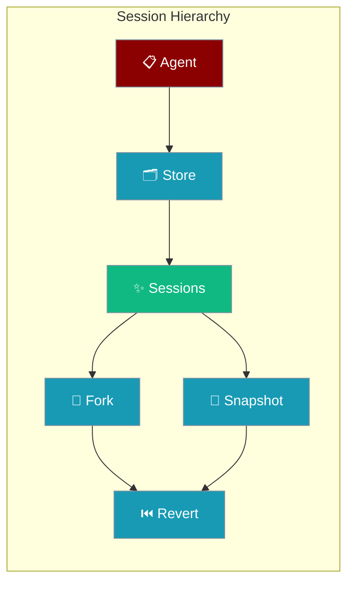
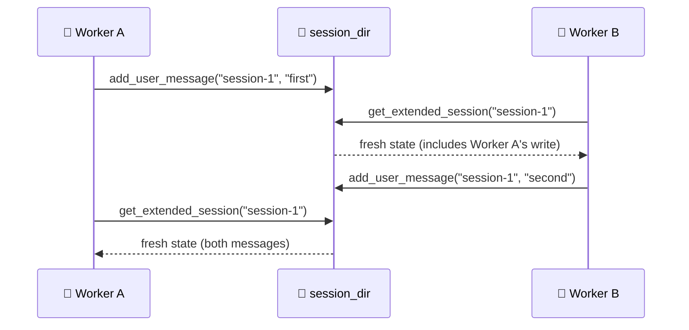

Advanced session management with forking, snapshots, and revert capabilities.



<Note>
**For basic session persistence**, use the Agent's `memory` parameter:
```python
agent = Agent(name="Assistant", memory={"session_id": "my-session"})
```
See [Session Management](/concepts/session-management) for details.
</Note>

## Features

- **Parent-Child Sessions** - Create hierarchical session relationships
- **Session Forking** - Fork sessions from any message point
- **Snapshots** - Create labeled checkpoints within sessions
- **Revert** - Restore sessions to previous states
- **Export/Import** - Transfer sessions between systems
- **Multi-Worker Safety** - Share sessions across multiple processes securely

## Multi-Worker Safety

Multiple workers can share one session directory safely — reads always see the latest disk state.



```python
from praisonaiagents.session.hierarchy import HierarchicalSessionStore

# Two workers sharing the same session directory
worker_a = HierarchicalSessionStore(session_dir="./shared_sessions")
worker_b = HierarchicalSessionStore(session_dir="./shared_sessions")

# Worker A creates session and adds message
session_id = worker_a.create_session(title="Shared Session")
worker_a.add_user_message(session_id, "Hello from Worker A")

# Worker B immediately sees Worker A's write
session = worker_b.get_extended_session(session_id)
print(len(session.messages))  # 1 - sees Worker A's message

# Worker B adds message
worker_b.add_assistant_message(session_id, "Hello from Worker B")

# Worker A sees Worker B's update
session = worker_a.get_extended_session(session_id) 
print(len(session.messages))  # 2 - sees both messages
```

If you keep references to extended session objects across requests, call `store.invalidate_cache(session_id)` to drop in-process copies.

## Cache Invalidation

Clear in-process caches when you need to force a reload.

```python
# Invalidate cache for a specific session
store.invalidate_cache(session_id="my-session")

# Invalidate all cached sessions
store.invalidate_cache()

# Force fresh reload after manual file changes
store.invalidate_cache("session-1")
session = store.get_extended_session("session-1")  # Always fresh from disk
```

<Note>
Most users will never need manual cache invalidation — `get_extended_session()`, `get_chat_history()`, `fork_session()`, and `revert_to_*` already read fresh from disk. Manual invalidation only matters if user code is holding on to `ExtendedSessionData` references loaded directly via internal APIs.
</Note>

## Quick Start

<Steps>
<Step title="Simple Usage with Agent">
Enable hierarchical sessions for an agent to support forking and snapshots:

```python
from praisonaiagents import Agent
from praisonaiagents.session.hierarchy import HierarchicalSessionStore

# Create agent with hierarchical session store
store = HierarchicalSessionStore(session_dir="./sessions")
agent = Agent(
    name="Assistant",
    instructions="You can fork conversations and create snapshots",
    session_store=store
)

# Start conversation
result = agent.start("Help me plan a project")
session_id = agent.session_id

# Create a snapshot before experimental changes
snapshot_id = store.create_snapshot(session_id, label="Initial plan")
```
</Step>

<Step title="With Multi-Worker Setup">
Share sessions across multiple agent instances or workers:

```python
from praisonaiagents import Agent
from praisonaiagents.session.hierarchy import HierarchicalSessionStore

# Shared store across workers
shared_dir = "./shared_sessions"

# Worker 1
agent1 = Agent(
    name="Assistant",
    session_store=HierarchicalSessionStore(session_dir=shared_dir)
)

# Worker 2 
agent2 = Agent(
    name="Assistant", 
    session_store=HierarchicalSessionStore(session_dir=shared_dir)
)

# Both agents see each other's session updates immediately
```
</Step>
</Steps>

## API Reference

### HierarchicalSessionStore

```python
class HierarchicalSessionStore(DefaultSessionStore):
    def create_session(
        self,
        title: Optional[str] = None,
        parent_id: Optional[str] = None
    ) -> str:
        """Create a new session, optionally as child of another."""
    
    def fork_session(
        self,
        session_id: str,
        from_message_index: Optional[int] = None,
        title: Optional[str] = None
    ) -> str:
        """Fork a session from a specific message point."""
    
    def get_extended_session(self, session_id: str) -> ExtendedSessionData:
        """Get extended session data (always reloaded from disk)."""
    
    def invalidate_cache(self, session_id: Optional[str] = None) -> None:
        """Clear in-memory caches. Pass session_id for one session, omit for all."""
    
    def create_snapshot(
        self,
        session_id: str,
        label: Optional[str] = None
    ) -> str:
        """Create a labeled snapshot of the current session state."""
    
    def revert_to_snapshot(
        self,
        session_id: str,
        snapshot_id: str
    ) -> bool:
        """Revert session to a previous snapshot."""
    
    def get_snapshots(self, session_id: str) -> List[SessionSnapshot]:
        """Get all snapshots for a session."""
    
    def export_session(self, session_id: str) -> Dict[str, Any]:
        """Export session data for transfer."""
    
    def import_session(self, data: Dict[str, Any]) -> str:
        """Import a session from exported data."""
```

## Examples

### Forking Sessions

```python
store = HierarchicalSessionStore()

# Create main session
main_id = store.create_session(title="Main Branch")
store.add_message(main_id, "user", "Start project")
store.add_message(main_id, "assistant", "Project initialized")

# Fork from message index 1
fork_id = store.fork_session(
    main_id,
    from_message_index=1,
    title="Experimental Branch"
)

# Fork has messages up to index 1
# Can now diverge independently
store.add_message(fork_id, "user", "Try experimental approach")
```

### Snapshot Management

```python
store = HierarchicalSessionStore()
session_id = store.create_session()

# Work and create snapshots
store.add_message(session_id, "user", "Phase 1")
snap1 = store.create_snapshot(session_id, label="After Phase 1")

store.add_message(session_id, "user", "Phase 2")
snap2 = store.create_snapshot(session_id, label="After Phase 2")

# List all snapshots
snapshots = store.get_snapshots(session_id)
for snap in snapshots:
    print(f"{snap.label}: {snap.message_count} messages")

# Revert to Phase 1
store.revert_to_snapshot(session_id, snap1)
```

### Export/Import

```python
# Export from one store
store1 = HierarchicalSessionStore(session_dir="./store1")
session_id = store1.create_session(title="Portable Session")
store1.add_message(session_id, "user", "Important data")

exported = store1.export_session(session_id)

# Import to another store
store2 = HierarchicalSessionStore(session_dir="./store2")
new_id = store2.import_session(exported)
```

## Best Practices

<AccordionGroup>
<Accordion title="Share one session_dir across workers">
The store handles file locking and fresh reads for you. Multiple `HierarchicalSessionStore` instances pointing to the same `session_dir` stay consistent via `FileLock` and disk-fresh reads.

```python
# Multiple workers sharing sessions
worker1 = HierarchicalSessionStore(session_dir="/shared/sessions")
worker2 = HierarchicalSessionStore(session_dir="/shared/sessions")
# Both see each other's writes immediately
```
</Accordion>

<Accordion title="Use invalidate_cache() only when caching ExtendedSessionData">
Regular methods like `get_extended_session()` already read fresh from disk. Only use manual cache invalidation if you cache `ExtendedSessionData` objects yourself.

```python
# Manual caching scenario
session = store.get_extended_session("session-1")
# ... later, if another process modified the session ...
store.invalidate_cache("session-1")  # Force fresh read
```
</Accordion>

<Accordion title="Avoid per-request HierarchicalSessionStore instances">
Creating new stores for each request is inefficient. Instead, create one store instance and reuse it, or share one `session_dir` across multiple instances.

```python
# Good: Reuse store instance
store = HierarchicalSessionStore(session_dir="./sessions")

# Bad: New instance per request
def handle_request():
    store = HierarchicalSessionStore()  # Creates new temp dir each time
```
</Accordion>

<Accordion title="Use snapshots for risky operations">
Create snapshots before experimental changes so you can revert if needed.

```python
# Before risky operation
snapshot_id = store.create_snapshot(session_id, label="Before experiment")

# Try risky operation
store.add_message(session_id, "user", "Experimental command")

# Revert if needed
if operation_failed:
    store.revert_to_snapshot(session_id, snapshot_id)
```
</Accordion>
</AccordionGroup>

## Related

<CardGroup cols={2}>
<Card title="Session Management" icon="database" href="/concepts/session-management">
  Basic session persistence and management concepts
</Card>
<Card title="Session Persistence" icon="floppy-disk" href="/features/session-persistence">
  File-based session storage and configuration
</Card>
</CardGroup>
