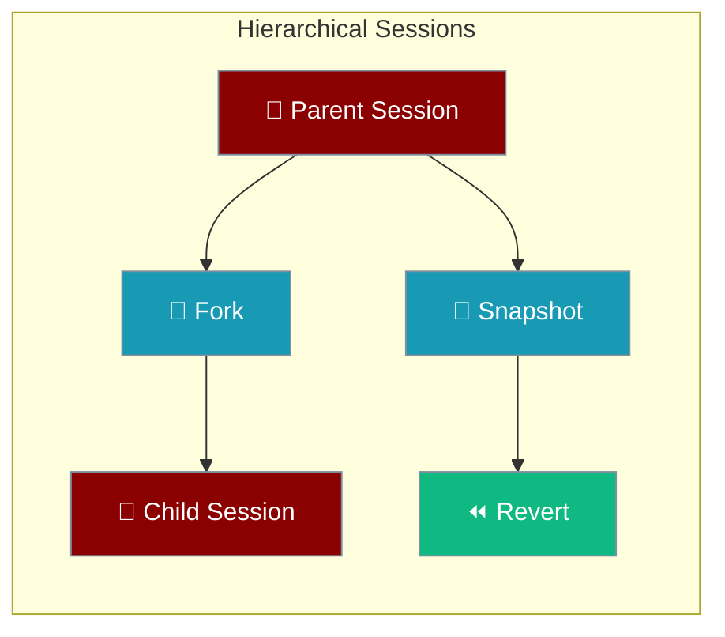
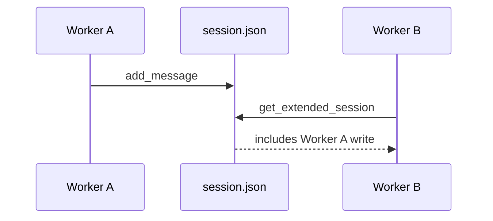

Session hierarchy adds forking, snapshots, and revert on top of file-backed sessions — safe when multiple workers share one directory.

```python
from praisonaiagents import Agent
from praisonaiagents.session import get_hierarchical_session_store

store = get_hierarchical_session_store()
session_id = store.create_session(title="Planning chat")

agent = Agent(
    name="Assistant",
    instructions="Help me plan a trip",
    memory={"session_id": session_id},
)
agent.start("I want to visit Japan in spring")
```



<Note>
For basic persistence, use `Agent(memory={"session_id": "my-session"})`. See [Session Persistence](/features/session-persistence).
</Note>

## Quick Start

<Steps>
<Step title="Create a session and chat">

```python
from praisonaiagents import Agent
from praisonaiagents.session import get_hierarchical_session_store

store = get_hierarchical_session_store()
session_id = store.create_session(title="Planning chat")

agent = Agent(
    name="Assistant",
    instructions="Help me plan a trip",
    memory={"session_id": session_id},
)
agent.start("I want to visit Japan in spring")
```

</Step>

<Step title="Snapshot, fork, or revert">

```python
snapshot_id = store.create_snapshot(session_id, label="Before branch")
fork_id = store.fork_session(session_id, from_message_index=2, title="Alternate plan")

# Revert if the experimental path fails
store.revert_to_snapshot(session_id, snapshot_id)
```

</Step>
</Steps>

---

## Multi-Worker Safety

Multiple processes can share one session directory — reads reload when the on-disk file changes.



| Operation | Safe under concurrency |
|---|---|
| `get_extended_session()` | Yes — mtime-checked cache |
| `add_message()` | Yes — locked read-modify-write |
| `fork_session()` | Yes — reloads parent first |
| `create_snapshot()` / `revert_to_snapshot()` | Yes — atomic under lock |

---

## Configuration Options

| Method | Parameters | Returns | Description |
|--------|-----------|---------|-------------|
| `create_session(session_id, title, parent_id, agent_name, metadata)` | All optional | `str` (session ID) | Create a new session |
| `fork_session(session_id, from_message_index, title)` | `session_id` required | `str` (fork ID) | Fork from a message index |
| `create_snapshot(session_id, label, metadata)` | `session_id` required | `str` (snapshot ID) | Snapshot the current state |
| `revert_to_snapshot(session_id, snapshot_id)` | Both required | `bool` | Restore to a snapshot |

---

## Best Practices

<AccordionGroup>
<Accordion title="Snapshot before risky edits">
Call `create_snapshot()` before experimental branches or bulk rewrites. `revert_to_snapshot()` restores the parent in one step.
</Accordion>

<Accordion title="Fork for parallel exploration">
Use `fork_session(..., from_message_index=N)` to branch from a specific turn without losing the parent transcript.
</Accordion>

<Accordion title="Share one store directory across workers">
Point every worker at the same `session_dir`. The hierarchical store reloads from disk under lock before fork or revert.
</Accordion>
</AccordionGroup>

---

## Related

<CardGroup cols={2}>
  <Card title="Session Store" icon="database" href="/docs/features/session-store">
    Default and hierarchical store APIs
  </Card>
  <Card title="Session Protocol" icon="plug" href="/docs/features/session-protocol">
    Custom Redis/Postgres backends
  </Card>
</CardGroup>
