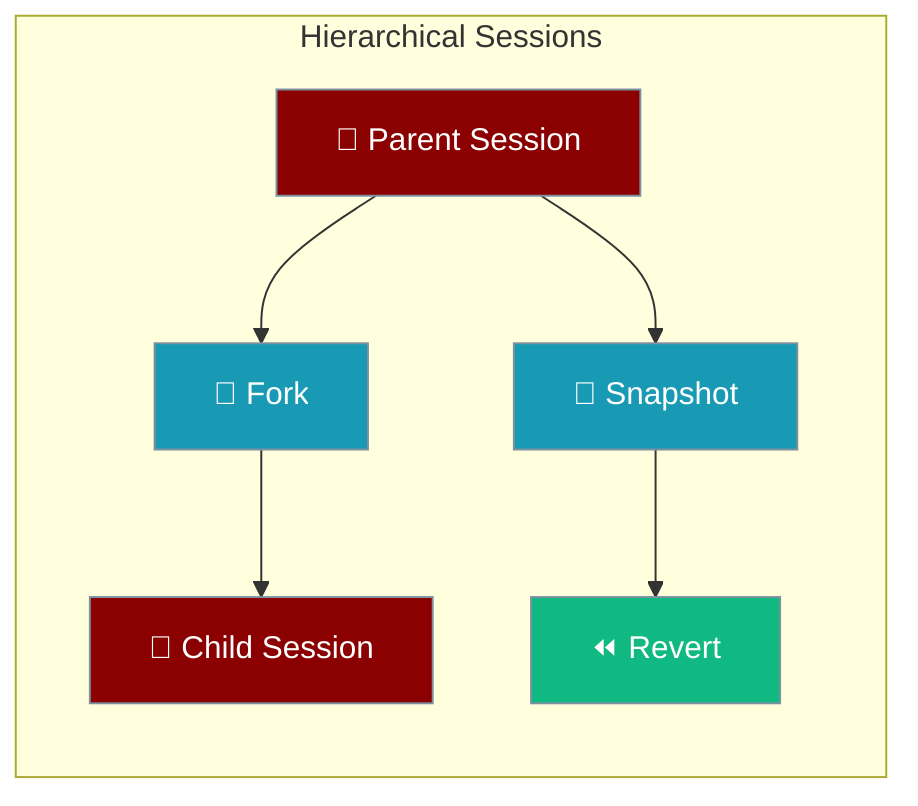

Session hierarchy adds forking, snapshots, and revert on top of file-backed sessions — safe when multiple workers share one directory.



<Note>
For basic persistence, use `Agent(memory={"session_id": "my-session"})`. See [Session Persistence](/features/session-persistence).
</Note>

## Quick Start


<Steps>
<Step title="Quick Start">
```python
from praisonaiagents import Agent
from praisonaiagents.session import get_hierarchical_session_store

store = get_hierarchical_session_store()
session_id = store.create_session(title="Planning chat")

agent = Agent(
    name="Assistant",
    instructions="Help me plan a trip",
    memory={"session_id": session_id},
)
agent.start("I want to visit Japan in spring")

snapshot_id = store.create_snapshot(session_id, label="Before branch")
fork_id = store.fork_session(session_id, message_index=2, title="Alternate plan")
```
</Step>
</Steps>


## Best Practices

<AccordionGroup>
  <Accordion title="Start simple">
    Enable the feature with a single parameter before adding configuration. Verify it works, then layer in options.
  </Accordion>
  <Accordion title="Use environment variables for secrets">
    Never hardcode API keys or tokens. Use `os.getenv("KEY_NAME")` to read from environment variables.
  </Accordion>
  <Accordion title="Test with minimal examples first">
    Copy the Quick Start example, run it, then extend it. This confirms your environment is set up correctly.
  </Accordion>
  <Accordion title="Check the logs">
    Set `verbose=True` on your agent to see detailed execution logs when debugging unexpected behavior.
  </Accordion>
</AccordionGroup>

## Related

<CardGroup cols={2}>
  <Card title="Features Overview" icon="grid-2" href="/docs/features">
    Browse all PraisonAI features
  </Card>
  <Card title="Quick Start" icon="rocket" href="/docs/introduction">
    Get started with PraisonAI agents
  </Card>
</CardGroup>
