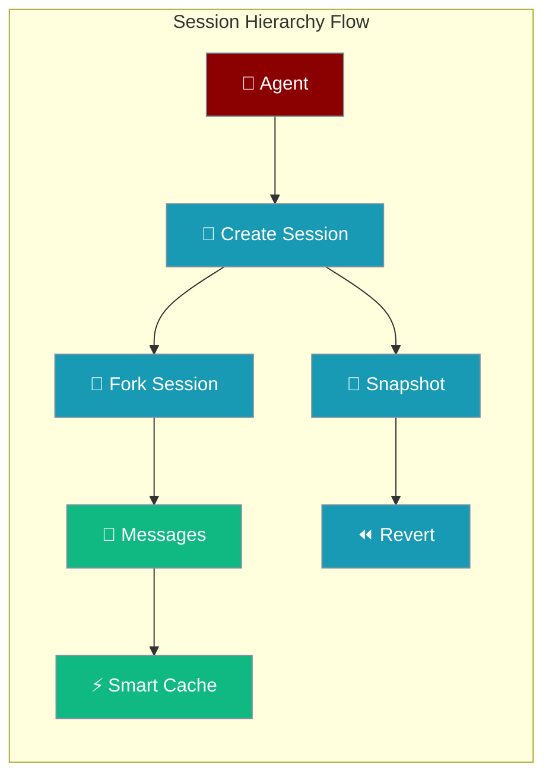
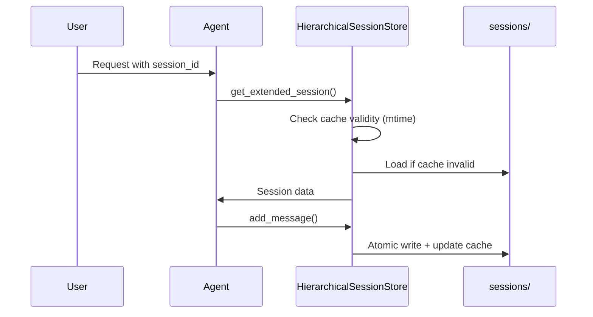
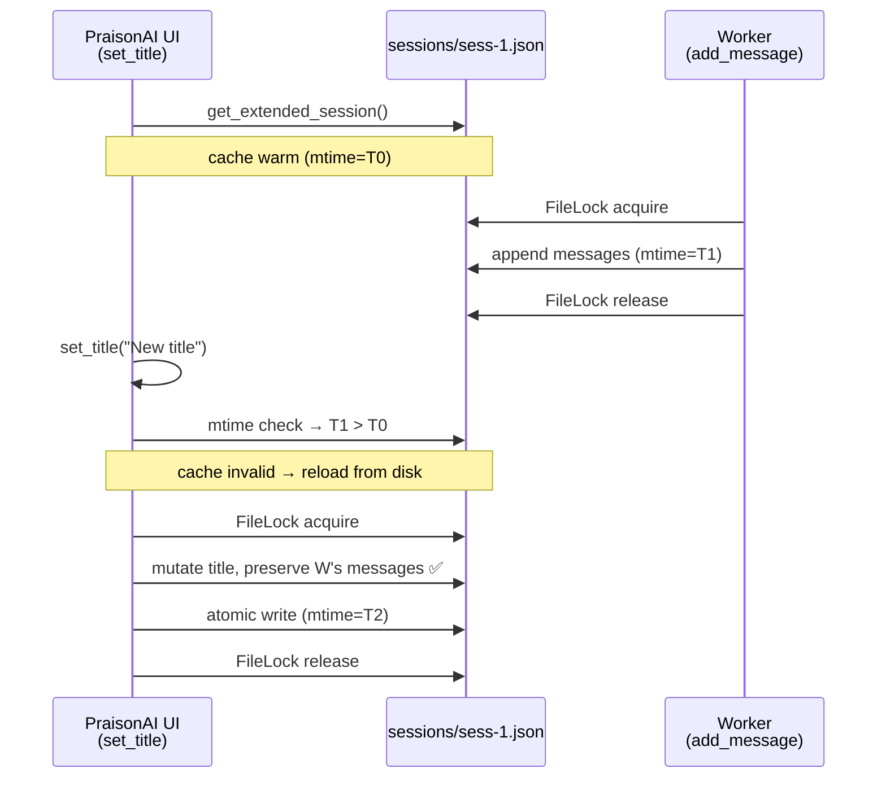

Advanced session management with hierarchical relationships, forking, snapshots, and smart cache invalidation for concurrent environments.



## Quick Start

<Steps>
<Step title="Agent with Session">
```python
from praisonaiagents import Agent
from praisonaiagents.session import get_hierarchical_session_store

store = get_hierarchical_session_store()
session_id = store.create_session(title="AI Assistant Chat")

agent = Agent(
    name="Assistant",
    instructions="You are a helpful AI assistant",
    memory={"session_id": session_id}
)

result = agent.start("Help me plan a project")
```
</Step>

<Step title="Fork and Snapshot">
```python
# Create a snapshot before experimenting
snapshot_id = store.create_snapshot(session_id, label="Before experiment")

# Fork the session to try different approaches
experimental_id = store.fork_session(
    session_id, 
    from_message_index=2,
    title="Experimental Approach"
)

# Use forked session with new agent
experimental_agent = Agent(
    name="Experimenter", 
    memory={"session_id": experimental_id}
)
```
</Step>
</Steps>

---

## How It Works



| Feature | Description |
|---------|-------------|
| **Parent-Child** | Sessions can have hierarchical relationships |
| **Forking** | Branch from any message point |
| **Snapshots** | Create labeled checkpoints |
| **Smart Cache** | File-mtime based cache invalidation |

---

## Concurrency & Safety

Operations are safe across multiple processes through file locking and smart cache invalidation.

| Operation | Concurrency Safety | Cache Behavior |
|-----------|-------------------|----------------|
| `get_extended_session()` | ✅ Reads with cache validation | Checks file mtime, reloads if changed |
| `add_message()` | ✅ Locked read-modify-write | Updates cache after write |
| `set_title()` | ✅ Reloads before modify | Detects external writes |
| `fork_session()` | ✅ Force reload parent | Always gets latest data |
| `create_snapshot()` | ✅ Force reload session | Preserves concurrent updates |
| `revert_to_snapshot()` | ✅ Atomic revert | Cache updated after revert |

### Smart cache invalidation

`HierarchicalSessionStore` caches sessions in memory but checks the session file's modification time before serving a cached copy. This gives you both performance and correctness:

- **Cache hit** — file mtime unchanged since last read; return the cached object directly (zero disk I/O)
- **Cache miss** — file mtime newer than the cached mtime; reload from disk under `FileLock`, then refresh the cache
- **After local write** — the cache and the tracked mtime are updated atomically after `os.replace()` succeeds, so the writing process stays on a hot cache

You don't need to call `invalidate_cache()` after an external write — the next read will detect the newer mtime and reload automatically.

### Concurrent Write Scenario



```python
from praisonaiagents import Agent
from praisonaiagents.session import get_hierarchical_session_store

store = get_hierarchical_session_store()
session_id = store.create_session(title="Untitled")

# UI/owner process
agent = Agent(
    name="Assistant",
    instructions="Help me plan a trip",
    memory={"session_id": session_id}
)
agent.start("I want to visit Japan in spring")

# Meanwhile a sidecar process appends a status message...
# (simulated here in one process for clarity)
store.add_message(session_id, "system", "Sidecar: trip planning started")

# Now retitle the session from the UI — the sidecar's message survives
store.set_title(session_id, "Japan Spring Trip")

# All messages are still on disk
final = store.get_extended_session(session_id)
print(len(final.messages))  # includes the sidecar's message
```

<Note>
Repeated calls to `get_extended_session()` on an unchanged session return the same cached object (zero disk I/O). After an external write, the next call detects the newer file mtime and reloads exactly once. You do not need to manage cache invalidation manually.
</Note>

---

## Configuration Options

<Card title="Session Hierarchy API Reference" icon="code" href="/docs/sdk/reference/praisonaiagents/classes/HierarchicalSessionStore">
  Python configuration options and methods
</Card>

---

## Common Patterns

### Multi-Agent Session Sharing

```python
from praisonaiagents import Agent
from praisonaiagents.session import get_hierarchical_session_store

store = get_hierarchical_session_store()

# Create shared session
session_id = store.create_session(title="Multi-Agent Collaboration")
store.share_session(session_id)

# Multiple agents can use the same session
researcher = Agent(
    name="Researcher",
    instructions="Research and analyze data",
    memory={"session_id": session_id}
)

writer = Agent(
    name="Writer", 
    instructions="Create content based on research",
    memory={"session_id": session_id}
)
```

### Experimental Branching

```python
# Main conversation
main_session = store.create_session(title="Main Discussion")
agent = Agent(name="Assistant", memory={"session_id": main_session})
agent.start("Help me solve a complex problem")

# Create experimental branch at decision point
experimental_session = store.fork_session(
    main_session,
    from_message_index=3,
    title="Alternative Approach"
)

# Test different approach
experimental_agent = Agent(
    name="Experimenter",
    memory={"session_id": experimental_session}
)
experimental_agent.start("Try a different solution method")
```

### Checkpoint and Rollback

```python
# Create checkpoint before risky operation
checkpoint = store.create_snapshot(session_id, label="Before risky change")

# Attempt risky operation
agent.start("Make a complex change that might fail")

# Rollback if needed
if something_went_wrong:
    store.revert_to_snapshot(session_id, checkpoint)
    print("Rolled back to safe state")
```

---

## Best Practices

<AccordionGroup>
<Accordion title="Use descriptive titles and labels">
Always provide meaningful titles for sessions and labels for snapshots. This makes it easier to navigate hierarchies and understand the purpose of each branch.

```python
# Good
session_id = store.create_session(title="Customer Support - Billing Issue #1234")
snapshot_id = store.create_snapshot(session_id, label="Before policy explanation")

# Avoid
session_id = store.create_session()  # No title
snapshot_id = store.create_snapshot(session_id)  # No label
```
</Accordion>

<Accordion title="Fork at decision points">
Create forks when you need to explore different approaches without losing the original conversation path.

```python
# Good: Fork before exploring alternatives
main_conversation_complete = len(session.messages) >= 10
if main_conversation_complete:
    experimental_id = store.fork_session(session_id, title="Alternative Solution")
```
</Accordion>

<Accordion title="Clean up old sessions">
Regularly export important sessions and clean up test/experimental sessions to keep your session store organized.

```python
# Export important sessions
important_data = store.export_session(session_id)

# Clean up test sessions
if session.title.startswith("Test-"):
    store.delete_session(session_id)
```
</Accordion>

<Accordion title="Share sessions appropriately">
Only mark sessions as shared when they genuinely need to be accessed by multiple users or processes.

```python
# Good: Share sessions for collaboration
store.share_session(collaborative_session_id)

# Avoid: Sharing personal sessions unnecessarily
# store.share_session(personal_session_id)  # Don't share unless needed
```
</Accordion>
</AccordionGroup>

---

## Related

<CardGroup cols={2}>
<Card title="Session Persistence" icon="database" href="/docs/features/session-persistence">
  Basic session storage and management
</Card>
<Card title="Agent Memory" icon="brain" href="/docs/concepts/agents">
  How agents use session memory
</Card>
</CardGroup>