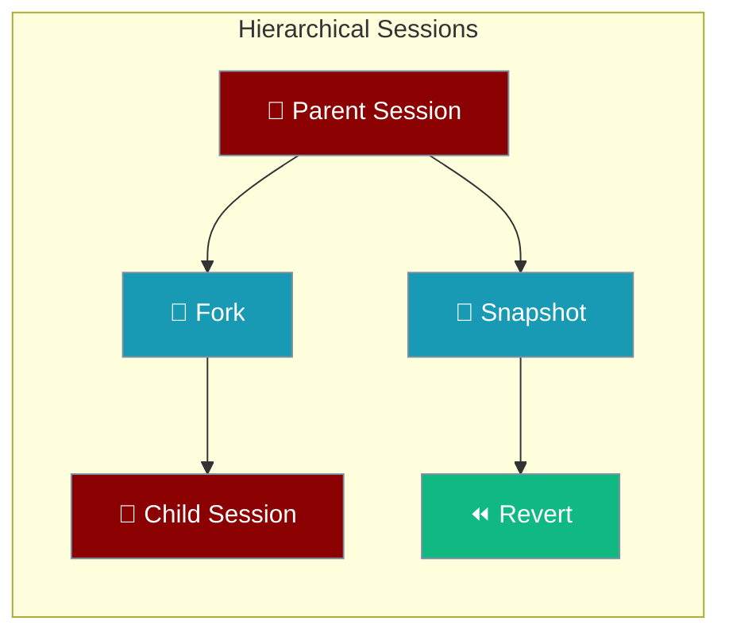
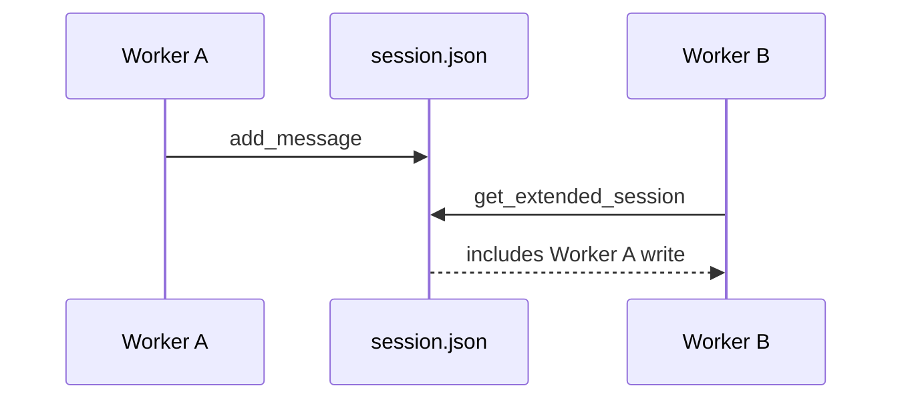

Session hierarchy adds forking, snapshots, and revert on top of file-backed sessions — safe when multiple workers share one directory.

```python
from praisonaiagents import Agent
from praisonaiagents.session import get_hierarchical_session_store

store = get_hierarchical_session_store()
session_id = store.create_session(title="Planning chat")

agent = Agent(
    name="Assistant",
    instructions="Help me plan a trip",
    memory={"session_id": session_id},
)
agent.start("I want to visit Japan in spring")
```


The user forks or snapshots a chat session; hierarchical stores keep branches safe across workers.



```mermaid
graph LR
    subgraph "Hierarchical Sessions"
        P[📝 Parent Session] --> F[🌿 Fork]
        P --> S[📸 Snapshot]
        F --> C[🔀 Child Session]
        S --> R[⏪ Revert]
    end

    classDef session fill:#8B0000,stroke:#7C90A0,color:#fff
    classDef op fill:#189AB4,stroke:#7C90A0,color:#fff
    classDef result fill:#10B981,stroke:#7C90A0,color:#fff

    class P,C session
    class F,S op
    class R result
```

<Note>
For basic persistence, use `Agent(memory={"session_id": "my-session"})`. See [Session Persistence](/features/session-persistence).
</Note>

## Quick Start

<Steps>
<Step title="Create a session and chat">

```python
from praisonaiagents import Agent
from praisonaiagents.session import get_hierarchical_session_store

store = get_hierarchical_session_store()
session_id = store.create_session(title="Planning chat")

agent = Agent(
    name="Assistant",
    instructions="Help me plan a trip",
    memory={"session_id": session_id},
)
agent.start("I want to visit Japan in spring")
```

</Step>

<Step title="Snapshot, fork, or revert">

```python
snapshot_id = store.create_snapshot(session_id, label="Before branch")
fork_id = store.fork_session(session_id, from_message_index=2, title="Alternate plan")

# Revert if the experimental path fails
store.revert_to_snapshot(session_id, snapshot_id)
```

</Step>
</Steps>

---

## Multi-Worker Safety

Multiple processes can share one session directory — reads use an mtime-checked cache, so a write that changes the file on disk is visible on the next read.


```mermaid
sequenceDiagram
    participant A as Worker A
    participant D as session.json
    participant B as Worker B

    A->>D: add_message
    B->>D: get_extended_session
    D-->>B: includes Worker A write
```

| Operation | Safe under concurrency |
|---|---|
| `get_extended_session()` | Yes — mtime-checked cache; a changed file is re-read, so cross-instance writes are visible on the next read |
| `add_message()` | Yes — locked read-modify-write |
| `fork_session()` | Yes — reloads parent first |
| `create_snapshot()` / `revert_to_snapshot()` | Yes — atomic under lock |

<Note>
Object identity is not a stable API — expect either a fresh `ExtendedSessionData` object or a cached one. When the file on disk is unchanged, consecutive `get_extended_session()` calls can return the same cached object; when it has changed, you get a fresh one. Use the returned data, not `session_a is session_b`. Changed in [PR #4958](https://github.com/MervinPraison/PraisonAI/pull/4958).
</Note>

Pass `force_reload=True` for the rare case a caller needs the old unconditional-reread behaviour:

```python
from praisonaiagents.session import get_hierarchical_session_store

store = get_hierarchical_session_store()
session = store.get_extended_session(session_id, force_reload=True)  # bypass cache
```

---

## Cache Semantics

`get_extended_session()` now shares the same mtime-checked cache as the internal helpers — a read hits the cache when the file is unchanged and re-reads when its mtime bumps.

| Method | Cache behaviour |
|---|---|
| `get_extended_session(force_reload=False)` / `get_chat_history()` / `get_session()` | mtime-checked cache — cached when the file is unchanged, re-read when it changes; pass `force_reload=True` to always re-read |
| `_load_extended_session()` (used internally by `fork_session`, `revert_to_snapshot`, `get_children`) | Same mtime-checked cache, safe because the caller holds a `FileLock` |
| `invalidate_cache(session_id=None)` | Clears both in-memory caches — rarely needed on the read path |

`invalidate_cache()` only matters if your own code caches `ExtendedSessionData` references; the read path never needs it.

### Cross-instance reads

A write from a second store instance on the same directory changes the file's mtime, so it is seen by the first store's next read — no manual `invalidate_cache()` required.

```python
from praisonaiagents.session import get_hierarchical_session_store, HierarchicalSessionStore

store = get_hierarchical_session_store()
session_id = store.create_session(title="Cross-worker")
store.add_message(session_id, "user", "first")

# A second store instance pointing at the same session_dir
other = HierarchicalSessionStore(session_dir=store.session_dir)
other.add_message(session_id, "user", "second")

seen = store.get_extended_session(session_id)
assert [m.content for m in seen.messages] == ["first", "second"]
```

---

## Best Practices

<AccordionGroup>
<Accordion title="Snapshot before risky edits">
Call `create_snapshot()` before experimental branches or bulk rewrites. `revert_to_snapshot()` restores the parent in one step.
</Accordion>

<Accordion title="Fork for parallel exploration">
Use `fork_session(..., from_message_index=N)` to branch from a specific turn without losing the parent transcript.
</Accordion>

<Accordion title="Share one store directory across workers">
Point every worker at the same `session_dir`. The hierarchical store reloads from disk under lock before fork or revert.
</Accordion>
</AccordionGroup>

---

## Related

<CardGroup cols={2}>
  <Card title="Session Store" icon="database" href="/features/session-store">
    Default and hierarchical store APIs
  </Card>
  <Card title="Session Protocol" icon="plug" href="/features/session-protocol">
    Custom Redis/Postgres backends
  </Card>
</CardGroup>
