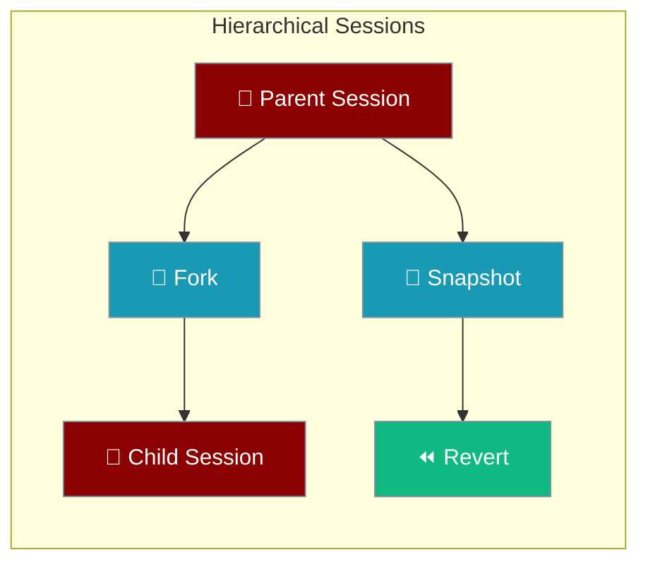
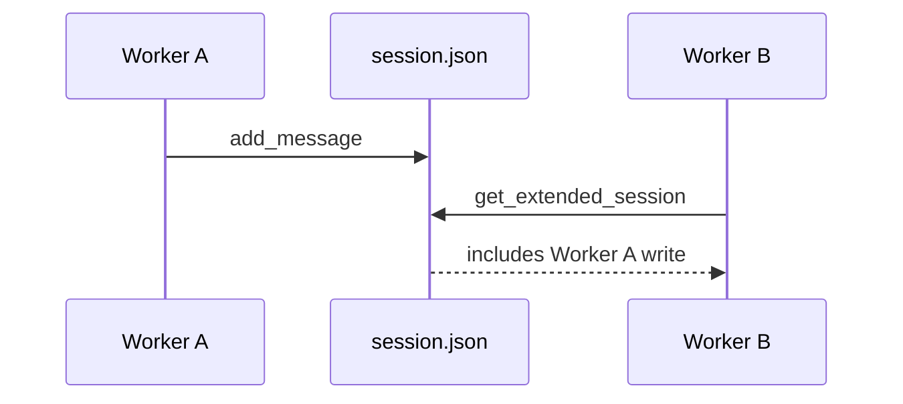
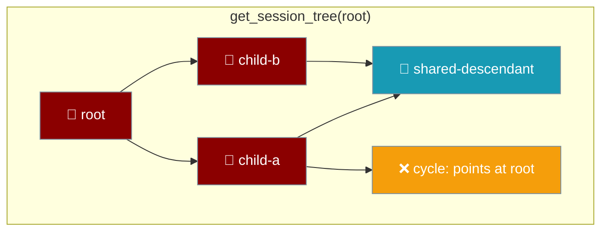
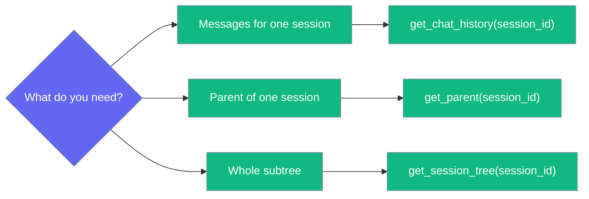
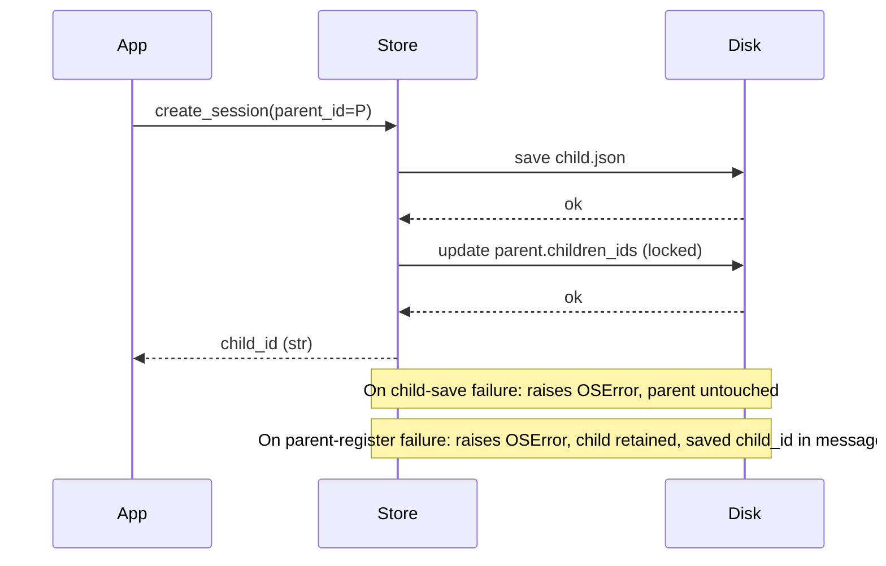

Session hierarchy adds forking, snapshots, and revert on top of file-backed sessions — safe when multiple workers share one directory.

```python
from praisonaiagents import Agent
from praisonaiagents.session import get_hierarchical_session_store

store = get_hierarchical_session_store()
session_id = store.create_session(title="Planning chat")

agent = Agent(
    name="Assistant",
    instructions="Help me plan a trip",
    memory={"session_id": session_id},
)
agent.start("I want to visit Japan in spring")
```


The user forks or snapshots a chat session; hierarchical stores keep branches safe across workers.



```mermaid
graph LR
    subgraph "Hierarchical Sessions"
        P[📝 Parent Session] --> F[🌿 Fork]
        P --> S[📸 Snapshot]
        F --> C[🔀 Child Session]
        S --> R[⏪ Revert]
    end

    classDef session fill:#8B0000,stroke:#7C90A0,color:#fff
    classDef op fill:#189AB4,stroke:#7C90A0,color:#fff
    classDef result fill:#10B981,stroke:#7C90A0,color:#fff

    class P,C session
    class F,S op
    class R result
```

<Note>
For basic persistence, use `Agent(memory={"session_id": "my-session"})`. See [Session Persistence](/features/session-persistence).
</Note>

## Quick Start

<Steps>
<Step title="Create a session and chat">

```python
from praisonaiagents import Agent
from praisonaiagents.session import get_hierarchical_session_store

store = get_hierarchical_session_store()
session_id = store.create_session(title="Planning chat")

agent = Agent(
    name="Assistant",
    instructions="Help me plan a trip",
    memory={"session_id": session_id},
)
agent.start("I want to visit Japan in spring")
```

</Step>

<Step title="Snapshot, fork, or revert">

```python
snapshot_id = store.create_snapshot(session_id, label="Before branch")
fork_id = store.fork_session(session_id, from_message_index=2, title="Alternate plan")

# Revert if the experimental path fails
store.revert_to_snapshot(session_id, snapshot_id)
```

</Step>

<Step title="Inspect the whole hierarchy">

```python
# After forking a few times, inspect the whole hierarchy as a nested dict
tree = store.get_session_tree(session_id)
print(tree["title"], "has", len(tree["children"]), "forks")
for child in tree["children"]:
    print(" ├─", child["title"], f"({child['message_count']} messages)")
```

</Step>
</Steps>

---

## Multi-Worker Safety

Multiple processes can share one session directory — reads use an mtime-checked cache, so a write that changes the file on disk is visible on the next read.


```mermaid
sequenceDiagram
    participant A as Worker A
    participant D as session.json
    participant B as Worker B

    A->>D: add_message
    B->>D: get_extended_session
    D-->>B: includes Worker A write
```

| Operation | Safe under concurrency |
|---|---|
| `get_extended_session()` | Yes — mtime-checked cache; a changed file is re-read, so cross-instance writes are visible on the next read |
| `add_message()` | Yes — locked read-modify-write |
| `fork_session()` | Yes — reloads parent first |
| `create_snapshot()` / `revert_to_snapshot()` | Yes — atomic under lock |

Writes are no longer silent on failure — see [Error Handling](#error-handling) for the APIs that now raise `OSError`.

<Note>
Object identity is not a stable API — expect either a fresh `ExtendedSessionData` object or a cached one. When the file on disk is unchanged, consecutive `get_extended_session()` calls can return the same cached object; when it has changed, you get a fresh one. Use the returned data, not `session_a is session_b`. Changed in [PR #4958](https://github.com/MervinPraison/PraisonAI/pull/4958).
</Note>

Pass `force_reload=True` for the rare case a caller needs the old unconditional-reread behaviour:

```python
from praisonaiagents.session import get_hierarchical_session_store

store = get_hierarchical_session_store()
session = store.get_extended_session(session_id, force_reload=True)  # bypass cache
```

---

## Inspecting the Session Tree

`get_session_tree(session_id)` returns the full parent-child subtree as a nested dictionary, safe for arbitrarily deep hierarchies.

```python
tree = store.get_session_tree(root_session_id)
# {
#   "session_id": "root-123",
#   "title": "Planning chat",
#   "message_count": 8,
#   "children": [
#     {"session_id": "fork-a", "title": "Alternative plan",
#      "message_count": 3, "children": [...]},
#     ...
#   ],
# }
```


```mermaid
graph TB
    subgraph "get_session_tree(root)"
        R[📝 root] --> A[🌿 child-a]
        R --> B[🌿 child-b]
        A --> S[📄 shared-descendant]
        B --> S
        A --> C[❌ cycle: points at root]
    end

    classDef session fill:#8B0000,stroke:#7C90A0,color:#fff
    classDef shared fill:#189AB4,stroke:#7C90A0,color:#fff
    classDef bad fill:#F59E0B,stroke:#7C90A0,color:#fff

    class R,A,B session
    class S shared
    class C bad
```

*Shared descendants are preserved (traversed on both branches). A child that repeats an ancestor on the current path raises `ValueError`.*

| Property | Behaviour |
|---|---|
| Traversal | Iterative with an explicit stack — no `RecursionError` on deep chains, whatever `sys.getrecursionlimit()` is set to |
| Cycle detection | Raises `ValueError("Cycle detected in session tree at '<id>'")` when a persisted `children_ids` list points at an ancestor on the current path |
| Shared descendant | A session referenced from two sibling branches is preserved on both — only a repeat on the active ancestor path is treated as a cycle |
| Missing child | Silently skipped (unchanged from earlier releases) |
| Return shape | Nested `dict` with `session_id`, `title`, `message_count`, `children` on every node — unchanged from earlier releases |

<Note>
Earlier releases raised `RecursionError` on deep chains built via `create_session(parent_id=...)` and on persisted child-reference cycles. Fixed in [PR #5680](https://github.com/MervinPraison/PraisonAI/pull/5680) — iterative traversal + per-path cycle detection.
</Note>

### Which read API to use

Pick the read method by what you need back — one session's messages, its parent, or the whole subtree.


```mermaid
graph LR
    Q{What do you need?} --> M[Messages for one session]
    Q --> P[Parent of one session]
    Q --> T[Whole subtree]

    M --> GH["get_chat_history(session_id)"]
    P --> GP["get_parent(session_id)"]
    T --> GT["get_session_tree(session_id)"]

    classDef q fill:#6366F1,stroke:#7C90A0,color:#fff
    classDef out fill:#10B981,stroke:#7C90A0,color:#fff

    class Q q
    class M,P,T,GH,GP,GT out
```

### Migration from `RecursionError`

Callers that special-cased `RecursionError` should catch `ValueError` instead — deep chains no longer need any guard.

```python
# Before PR #5680
try:
    tree = store.get_session_tree(root_id)
except RecursionError:
    # had to flatten manually or raise recursion limit
    ...

# After PR #5680
try:
    tree = store.get_session_tree(root_id)
except ValueError as e:
    # Only raised for persisted child-reference cycles.
    # Deep chains no longer need special-casing.
    print(e)  # "Cycle detected in session tree at 'node-42'"
```

---

## Error Handling

Creation APIs raise `OSError` when a durable write or parent registration fails — they never return a success-shaped ID after a silent failure.

```python
from praisonaiagents import Agent
from praisonaiagents.session import get_hierarchical_session_store

store = get_hierarchical_session_store()

try:
    session_id = store.create_session(title="Trip plan")
except OSError as e:
    # Disk failure; nothing was saved — safe to retry or report.
    raise

agent = Agent(
    name="Planner",
    instructions="Plan a trip",
    memory={"session_id": session_id},
)
agent.start("Visit Japan in spring")
```

When forking under a parent, catch `OSError` and recover with the saved ID the message carries:

```python
from praisonaiagents.session import get_hierarchical_session_store

store = get_hierarchical_session_store()

try:
    session_id = store.create_session(title="New plan", parent_id="parent-123")
except OSError as e:
    # The write to disk or the parent-registration step failed.
    # If the message contains an ID, the child was saved but its parent
    # was not updated — retry with that same ID to recover.
    print(f"Could not create session: {e}")
```

| API | Raises | On |
|---|---|---|
| `create_session()` | `OSError` | Child save failed, or child saved but parent registration failed |
| `create_session()` | `ValueError` | `parent_id == session_id` |
| `fork_session()` | `OSError` | Fork save failed, or fork saved but parent registration failed |
| `fork_session()` | `ValueError` | `from_message_index` out of range |
| `create_snapshot()` | `OSError` | Snapshot persistence failed |
| `import_session()` | `OSError` | Imported session persistence failed |
| `get_session_tree()` | `ValueError` | A persisted `children_ids` entry points at an ancestor on the current traversal path (cycle). The message carries the offending id: `"Cycle detected in session tree at '<id>'"`. |

<Warning>
`get_session_tree()` previously raised `RecursionError` for both deep chains and
cyclic child references. After [PR #5680](https://github.com/MervinPraison/PraisonAI/pull/5680),
deep chains return normally and cycles raise `ValueError("Cycle detected ...")`.
Replace any existing `except RecursionError` around this call with `except ValueError`.
</Warning>

<Note>
If a child/fork is persisted but parent registration fails, the saved child ID is surfaced in the `OSError` message. Retry with that same `session_id` to recover the existing child rather than creating a duplicate.
</Note>

A persisted two-node cycle raises `ValueError` the moment a child repeats an ancestor on the current path.

```python
from praisonaiagents.session import HierarchicalSessionStore, ExtendedSessionData

store = HierarchicalSessionStore(session_dir="/tmp/example")
store._save_extended_session(ExtendedSessionData(session_id="a", children_ids=["b"]))
store._save_extended_session(ExtendedSessionData(session_id="b", children_ids=["a"]))

try:
    store.get_session_tree("a")
except ValueError as e:
    print(e)  # Cycle detected in session tree at 'a'
```

A session shared across two sibling branches is not a cycle — it appears under both.

```python
from praisonaiagents.session import HierarchicalSessionStore, ExtendedSessionData

store = HierarchicalSessionStore(session_dir="/tmp/example")
store._save_extended_session(ExtendedSessionData(session_id="root", children_ids=["b1", "b2"]))
store._save_extended_session(ExtendedSessionData(session_id="b1", children_ids=["shared"]))
store._save_extended_session(ExtendedSessionData(session_id="b2", children_ids=["shared"]))
store._save_extended_session(ExtendedSessionData(session_id="shared"))

tree = store.get_session_tree("root")
assert [c["session_id"] for c in tree["children"]] == ["b1", "b2"]
for branch in tree["children"]:
    assert branch["children"][0]["session_id"] == "shared"
```

<Note>
These two snippets use `_save_extended_session` to build fixtures that `create_session` would reject — use it only for reproducing cycle and shared-descendant shapes, never in normal code.
</Note>

### Save order guarantees

For `create_session` and `fork_session`, the child is written to disk before the parent's `children_ids` list is updated — a parent never references a child JSON that was never written.


```mermaid
sequenceDiagram
    participant App
    participant Store
    participant Disk

    App->>Store: create_session(parent_id=P)
    Store->>Disk: save child.json
    Disk-->>Store: ok
    Store->>Disk: update parent.children_ids (locked)
    Disk-->>Store: ok
    Store-->>App: child_id (str)

    Note over Store,Disk: On child-save failure: raises OSError, parent untouched
    Note over Store,Disk: On parent-register failure: raises OSError, child retained, saved child_id in message
```

A crash between the two steps leaves an orphan child on disk, not a phantom reference.

---

## Cache Semantics

`get_extended_session()` now shares the same mtime-checked cache as the internal helpers — a read hits the cache when the file is unchanged and re-reads when its mtime bumps.

| Method | Cache behaviour |
|---|---|
| `get_extended_session(force_reload=False)` / `get_chat_history()` / `get_session()` | mtime-checked cache — cached when the file is unchanged, re-read when it changes; pass `force_reload=True` to always re-read |
| `_load_extended_session()` (used internally by `fork_session`, `revert_to_snapshot`, `get_children`) | Same mtime-checked cache, safe because the caller holds a `FileLock` |
| `invalidate_cache(session_id=None)` | Clears both in-memory caches — rarely needed on the read path |

`invalidate_cache()` only matters if your own code caches `ExtendedSessionData` references; the read path never needs it.

### Cross-instance reads

A write from a second store instance on the same directory changes the file's mtime, so it is seen by the first store's next read — no manual `invalidate_cache()` required.

```python
from praisonaiagents.session import get_hierarchical_session_store, HierarchicalSessionStore

store = get_hierarchical_session_store()
session_id = store.create_session(title="Cross-worker")
store.add_message(session_id, "user", "first")

# A second store instance pointing at the same session_dir
other = HierarchicalSessionStore(session_dir=store.session_dir)
other.add_message(session_id, "user", "second")

seen = store.get_extended_session(session_id)
assert [m.content for m in seen.messages] == ["first", "second"]
```

---

## Best Practices

<AccordionGroup>
<Accordion title="Snapshot before risky edits">
Call `create_snapshot()` before experimental branches or bulk rewrites. `revert_to_snapshot()` restores the parent in one step.
</Accordion>

<Accordion title="Fork for parallel exploration">
Use `fork_session(..., from_message_index=N)` to branch from a specific turn without losing the parent transcript.
</Accordion>

<Accordion title="Share one store directory across workers">
Point every worker at the same `session_dir`. The hierarchical store reloads from disk under lock before fork or revert.
</Accordion>
</AccordionGroup>

---

## Related

<CardGroup cols={2}>
  <Card title="Session Store" icon="database" href="/features/session-store">
    Default and hierarchical store APIs
  </Card>
  <Card title="Session Protocol" icon="plug" href="/features/session-protocol">
    Custom Redis/Postgres backends
  </Card>
</CardGroup>
