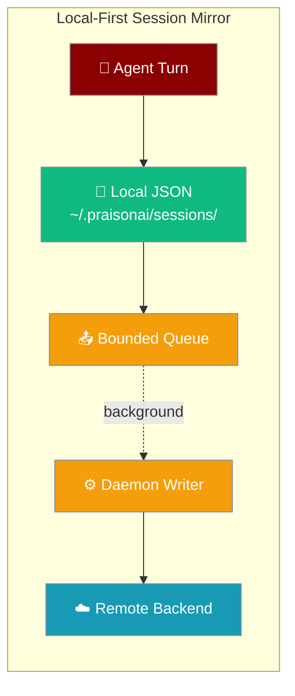
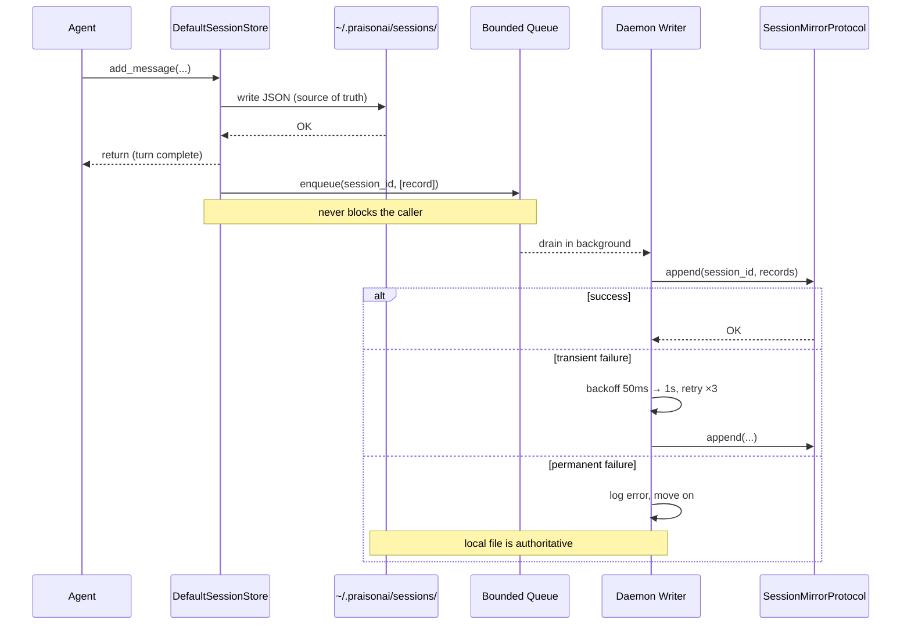
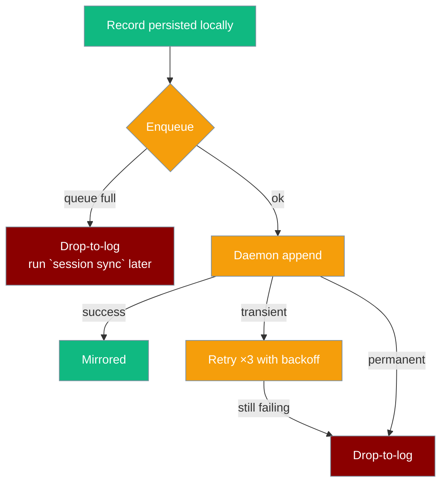

A mirror replicates each persisted turn to a remote backend on a background thread, so a session can follow the user across machines — local disk stays the source of truth.



## Quick Start

<Steps>
<Step title="Plug a mirror into DefaultSessionStore">

```python
from typing import Any, Dict, List

from praisonaiagents import Agent
from praisonaiagents.session import DefaultSessionStore, SessionMirrorProtocol


class LoggingMirror:
    """Minimal SessionMirrorProtocol implementation — keeps records in memory."""

    def __init__(self):
        self._store: Dict[str, List[Dict[str, Any]]] = {}

    def append(self, session_id: str, records: List[Dict[str, Any]]) -> None:
        self._store.setdefault(session_id, []).extend(records)
        print(f"[mirror] +{len(records)} record(s) for {session_id}")

    def load(self, session_id: str) -> List[Dict[str, Any]]:
        return list(self._store.get(session_id, []))


store = DefaultSessionStore(mirror=LoggingMirror())
agent = Agent(
    name="Assistant",
    instructions="Be concise.",
    memory={"session_id": "user-42", "session_store": store},
)
agent.start("Remember I like green tea.")
```

The local file at `~/.praisonai/sessions/user-42.json` **and** the mirror both receive the turn.

</Step>

<Step title="Continue on another machine">

```python
store = DefaultSessionStore(mirror=LoggingMirror())
records = store._mirror.load("user-42")  # hydrate a session never seen locally
```

A configured mirror's `load(session_id)` returns the full transcript, so a fresh install can pick up the conversation.

</Step>
</Steps>

## How It Works

The store writes local disk first and returns; the record is then handed to a bounded queue drained by a daemon thread that calls `mirror.append`.



The failure modes never touch the local write:



## Configuration Options

### `SessionMirrorProtocol` methods

The `runtime_checkable` protocol lives at `praisonaiagents.session.SessionMirrorProtocol`.

| Method | Required? | Signature | Contract |
|--------|-----------|-----------|----------|
| `append` | ✅ | `(session_id: str, records: List[Dict[str, Any]]) -> None` | Persist the newly-produced turn records. Each record is already timestamped and id-tagged, so a re-append is idempotent (last-writer per record id) — no merge logic required. |
| `load` | ✅ | `(session_id: str) -> List[Dict[str, Any]]` | Full ordered transcript for a session (empty list if unknown). Used to hydrate a session-id that was never seen locally. |
| `list_sessions` | ⚪ optional | `(*, user_id: Optional[str] = None) -> List[Dict[str, Any]]` | Enumerate mirrored sessions for a future `session list --remote` surface. |

### `DefaultSessionStore(mirror=…)`

| Symbol | Type / Default | Description |
|--------|----------------|-------------|
| `mirror` | `Optional[SessionMirrorProtocol]` / `None` | Wire any mirror into the default store. Left `None` → **zero overhead, no background thread**. |
| `flush_mirror(timeout=None)` | `bool` | Block until queued mirror records are processed. Returns `True` immediately when `mirror is None`. |
| `close_mirror()` | `None` | Stop the daemon writer, draining queued records first. |
| `DEFAULT_MIRROR_QUEUE_SIZE` | `1000` | Bound of the background `queue.Queue`. On overflow, records are dropped-to-log. |
| `DEFAULT_MIRROR_MAX_RETRIES` | `3` | `append` retries per record with 50ms → 1s exponential backoff before logging and moving on. |

## Writing a Mirror

A mirror is three tiny methods — the `LoggingMirror` from Quick Start is the whole story.

```python
from typing import Any, Dict, List


class LoggingMirror:
    def __init__(self):
        self._store: Dict[str, List[Dict[str, Any]]] = {}

    def append(self, session_id: str, records: List[Dict[str, Any]]) -> None:
        self._store.setdefault(session_id, []).extend(records)

    def load(self, session_id: str) -> List[Dict[str, Any]]:
        return list(self._store.get(session_id, []))
```

<Note>
Concrete wrapper-side adapters (postgres/supabase/turso/sqlite) land in `praisonai.persistence.conversation.*` alongside store-unification (#3645). Until then, implement the protocol directly against your backend.
</Note>

## Local-First Guarantees

<AccordionGroup>
<Accordion title="Local disk write always happens first">
The mirror is fed *after* the message is persisted to the session file, off the lock. A mirror outage never reaches the caller as a failure.
</Accordion>
<Accordion title="A slow/broken mirror never blocks a turn">
Records are enqueued onto a bounded `queue.Queue` (`DEFAULT_MIRROR_QUEUE_SIZE = 1000`) drained by a daemon thread (`praisonai-session-mirror`).
</Accordion>
<Accordion title="Queue overflow is drop-to-log, not deadlock">
On `Queue.Full`, records are dropped with a warning pointing operators at the (future) `session sync` reconciler; the local file is unaffected.
</Accordion>
<Accordion title="Transient failures retry with backoff">
`_SessionMirrorWriter._flush_one` retries `DEFAULT_MIRROR_MAX_RETRIES = 3` times with 50ms → 1s exponential backoff before logging and moving on.
</Accordion>
<Accordion title="mirror=None is byte-for-byte the old store">
The writer is only instantiated when `mirror is not None` — no queue, no thread, no import cost.
</Accordion>
<Accordion title="Post-close appends are rejected">
After `close_mirror()`, further enqueues drop-to-log rather than leaving records stranded with no consumer.
</Accordion>
</AccordionGroup>

## Testing & Reconciliation

Use `flush_mirror(timeout=…)` to make mirroring deterministic in a test and `close_mirror()` to drain in a teardown.

```python
store = DefaultSessionStore(mirror=my_mirror)
# ... run turns ...
assert store.flush_mirror(timeout=2.0), "mirror did not drain in time"
store.close_mirror()   # stops the daemon writer after draining
```

<Note>
The CLI-facing `session sync` reconciler is not yet shipped (blocked on #3645). Until then, `flush_mirror` is the deterministic seam for reconciliation and tests.
</Note>

## Backward Compatibility

`mirror=None` is the default — existing `DefaultSessionStore(...)` call sites are byte-for-byte unchanged, with no daemon thread spawned and no dependency added.

## Best Practices

<AccordionGroup>
<Accordion title="Keep append idempotent">
Records carry stable ids, so re-appending the same record is last-writer-wins. Don't add merge logic — rely on the id.
</Accordion>
<Accordion title="Don't raise on transient failure">
The writer retries with backoff and drops-to-log on permanent failure. Let it — raising in `append` just burns a retry.
</Accordion>
<Accordion title="Never do heavy work in append">
`append` runs on the single writer thread. Keep it a fast network/DB write so the queue drains and doesn't back up.
</Accordion>
<Accordion title="Always call close_mirror() on shutdown">
`close_mirror()` drains in-flight records before stopping the daemon writer. Skipping it can drop the last queued turns.
</Accordion>
</AccordionGroup>

## Related

<CardGroup cols={2}>
  <Card title="Session Store" icon="database" href="/features/session-store">
    The default JSON store the mirror wires into
  </Card>
  <Card title="Cross-Session Recall" icon="magnifying-glass-clock" href="/features/cross-session-recall">
    Search past sessions — hydrate non-local ids from a mirror
  </Card>
  <Card title="Sessions & Remote Agents" icon="clock-rotate-left" href="/features/sessions">
    Stateful conversations across restarts
  </Card>
  <Card title="Gateway Session Persistence" icon="floppy-disk" href="/features/gateway-session-persistence">
    Persist gateway sessions across restarts
  </Card>
</CardGroup>
