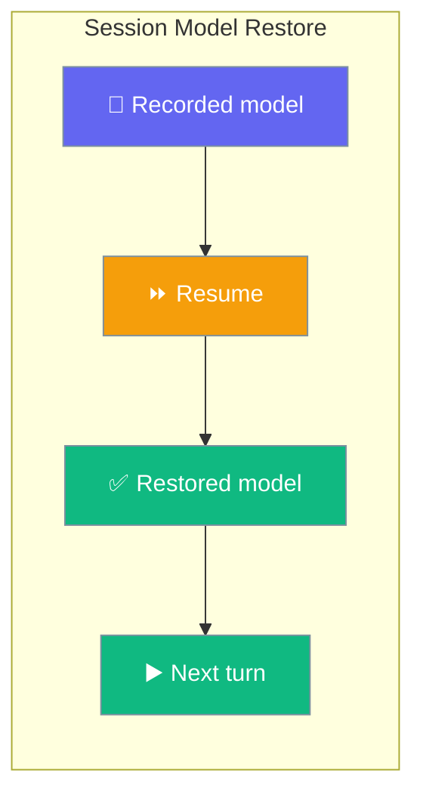
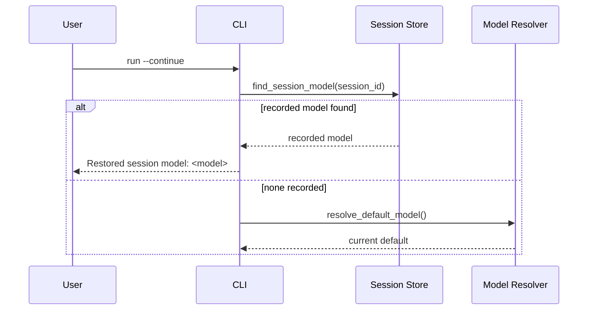
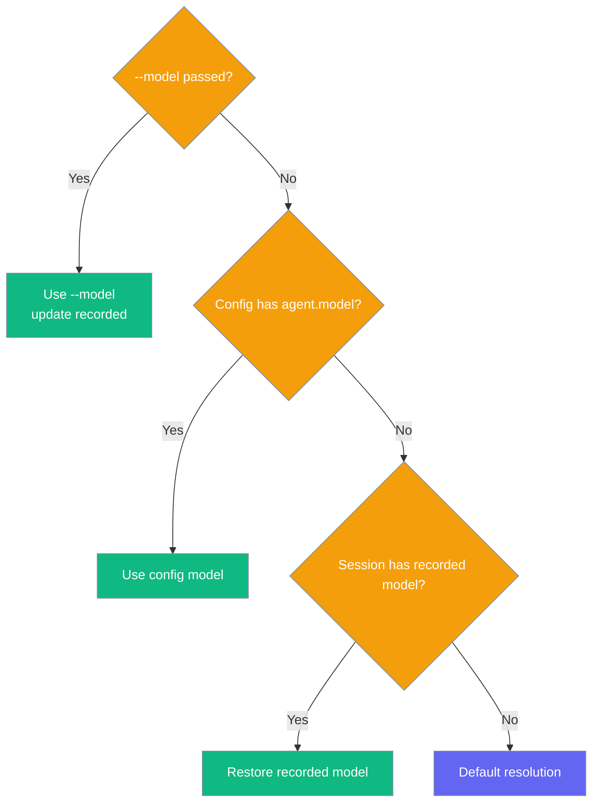

Resuming a session runs it on the model it was recorded with — a later change to your default model does not silently rewrite an ongoing conversation.



## Quick Start

<Steps>
<Step title="Start a session on a model">

```bash
praisonai run "What is the capital of France?" --model anthropic/claude-3-5-sonnet-latest
```

</Step>

<Step title="Change your default — resume still uses the original">

```bash
praisonai config set default_model gpt-4o
praisonai run "What about Germany?" --continue
# → Restored session model: anthropic/claude-3-5-sonnet-latest
```

</Step>

<Step title="Override on resume when you want a different model">

```bash
praisonai run "Try again with a smaller model" --continue --model gpt-4o-mini
# The recorded model is now gpt-4o-mini for subsequent turns.
```

</Step>
</Steps>

---

## How It Works

The wrapper reads the recorded model from the session store before the credential gate, so a resumed cloud session is never shadowed by a reachable local endpoint.



The store resolves the recorded model from the session-level `metadata["model"]` first, then from the most recent turn that recorded its own `model`. When neither exists it returns `None`, so the caller falls back to normal default resolution.

---

## Precedence

The model that wins on resume is the first non-empty entry in this order.



| Step | Source | Wins when |
|------|--------|-----------|
| 1 | Explicit `--model` flag | Always, when passed |
| 2 | Config `agent.model` | No `--model` and config sets a model |
| 3 | Recorded session model | Resuming and steps 1–2 are unset |
| 4 | Keyless local-first fallback | All above unset and no cloud key present |
| 5 | Default resolution | Nothing else resolved a model |

---

## Legacy Session Files

Older PraisonAI versions stored `model` / `llm` as top-level fields rather than under `metadata`. On load, the store folds those legacy fields back into metadata so historical sessions recover their recorded model without any migration.

```python
from praisonaiagents.session.store import SessionData

restored = SessionData.from_dict(
    {"session_id": "legacy", "messages": [], "model": "gpt-4o"}
)
restored.metadata["model"]  # → "gpt-4o"
```

Existing `metadata` values always win over the mirrored top-level value.

---

## Best Practices

<AccordionGroup>
<Accordion title="Let resume pick the model — don't re-pass --model">

Resuming without `--model` keeps the conversation on its original model. Only pass `--model` when you deliberately want to switch mid-thread.

</Accordion>

<Accordion title="Switch models intentionally with --model">

Passing `--model` on resume both overrides the recorded model and records the new one for subsequent turns, so the switch persists.

```bash
praisonai run "continue" --continue --model gpt-4o-mini
```

</Accordion>

<Accordion title="Resume cloud sessions on machines with local endpoints">

The recorded-model lookup runs before the keyless local-first gate, so a resumed cloud session is not switched to a local model just because Ollama or LM Studio is reachable.

</Accordion>

<Accordion title="Trust legacy sessions to restore correctly">

Sessions created by older versions recover their recorded model automatically — no export/re-import step is needed.

</Accordion>
</AccordionGroup>

---

## Related

<CardGroup cols={2}>
  <Card title="Session Resume" icon="play" href="/cli/session-resume">
    Continue previous conversations
  </Card>
  <Card title="Keyless Local-First Run" icon="server" href="/features/keyless-local-first-run">
    Auto-detect local endpoints when no cloud key is set
  </Card>
</CardGroup>
