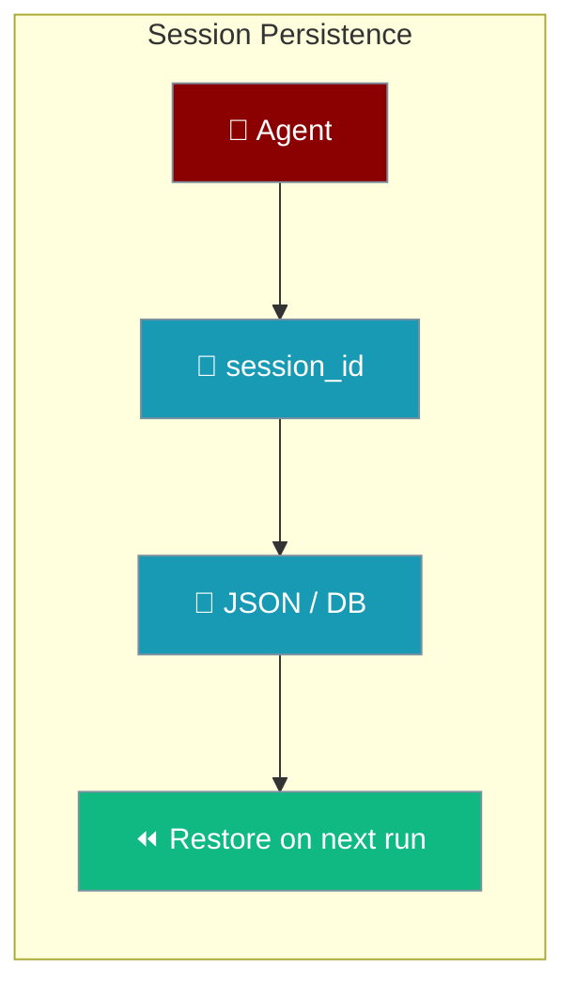
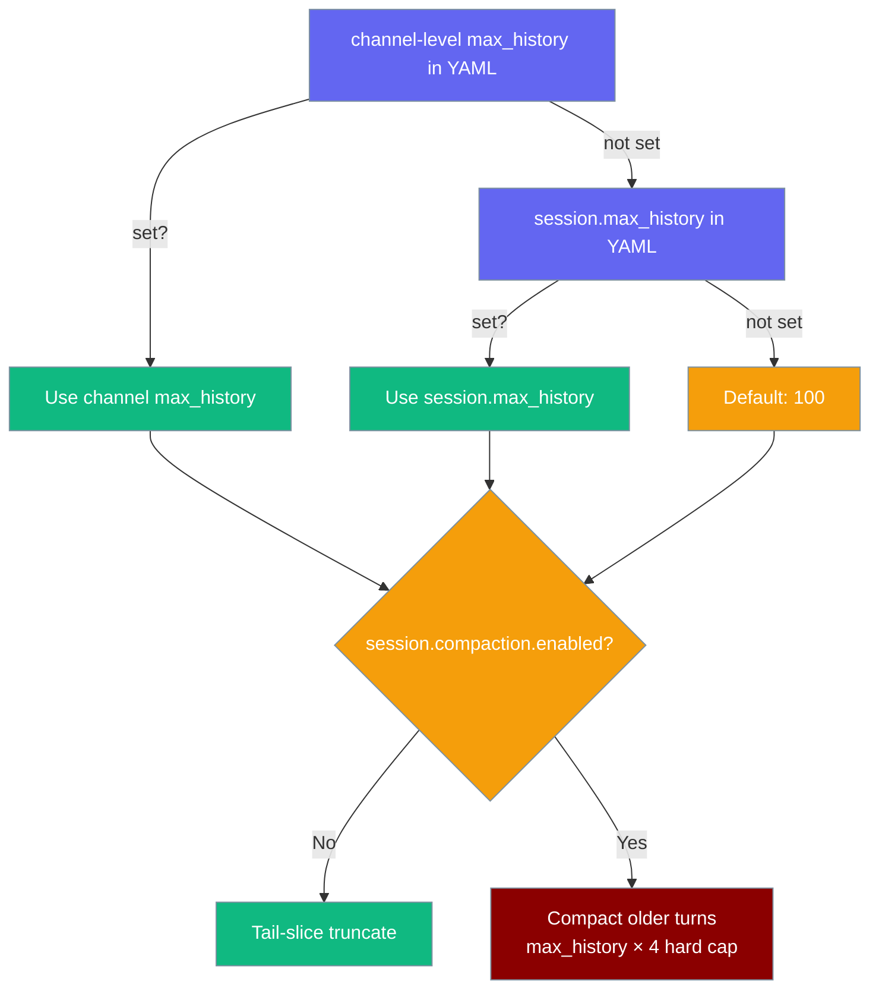

Provide a `session_id` on your agent and conversation history is saved and restored automatically — no database setup required.

```python
from praisonaiagents import Agent

agent = Agent(
    name="Reviewer",
    instructions="Review the codebase and answer follow-ups",
    memory={"session_id": "review-2026-06-25"},
)
agent.start("Summarise the auth module")
```



<Note>
Upgrade if you rely on multi-process saves, gateway resume, or idempotent `save_state()` — fixes landed in PRs #1709, #1897, #1972, and #2102.
</Note>

## Quick Start

<Steps>
<Step title="Start with a session_id">

```python
from praisonaiagents import Agent

agent = Agent(
    name="Reviewer",
    instructions="Review the codebase and answer follow-ups",
    memory={"session_id": "review-2026-06-25"},
)
agent.start("Summarise the auth module")
```

</Step>

<Step title="Resume from the CLI">

```bash
praisonai session resume review-2026-06-25 "Now suggest test cases for the same module"
```

History, model, and agent name are restored — not just the transcript.

</Step>
</Steps>

---

## Agent Session Persistence

```python
from praisonaiagents import Agent

# First conversation
agent = Agent(
    name="Assistant",
    memory={"session_id": "my-session-123"}
)
agent.start("My name is Alice and I love pizza")

# Later, in a new process - history is restored automatically
agent = Agent(
    name="Assistant", 
    memory={"session_id": "my-session-123"}
)
agent.start("What is my name?")  # Agent remembers: "Alice"
```

## Deterministic Resume

As of [PR #2277](https://github.com/MervinPraison/PraisonAI/pull/2277), `praisonai session resume` is a first-class restore — not a transcript display.

What is restored:
- **Chat history** — full conversation messages
- **Model** — the LLM used in the session (read from `metadata["model"]`, falls back to `metadata["llm"]`)
- **Agent name** — the name of the agent that ran the session

New CLI options:
- `praisonai session resume <id>` — restores state and shows a "Session Resumed" panel
- `praisonai session resume <id> "<prompt>"` — restores state and continues with a new prompt
- `praisonai session resume <id> --transcript` — opt-in to the old transcript-only view (panel title: "Session Transcript")

Session lookup checks the project store first, then falls back to the global default store — so sessions created via `praisonai run --continue` or via the gateway/TUI are all reachable.

For the full CLI reference, see [Session Command](/docs/cli/session#resume-a-session).

---

## How It Works

When you provide a `session_id` to an Agent:

1. **Automatic Persistence**: Conversation history is automatically saved to disk after each message
2. **Automatic Restoration**: When a new Agent is created with the same `session_id`, history is restored
3. **Zero Configuration**: No database setup required - uses JSON files by default

### Default Storage Location

Sessions are stored in: `~/.praisonai/sessions/{session_id}.json`

## Behavior Matrix

<Note>
**Session expiry / cleanup.** This page covers the low-level `session_id` + `DefaultSessionStore` path used by `Agent(memory={"session_id": ...})`. If you instead use the high-level `Session(...)` wrapper, it supports `session_ttl`, `is_expired()`, `time_to_expiry()`, and `close()` — see [Sessions & Remote Agents → Session Expiry & Cleanup](/features/sessions#session-expiry--cleanup).
</Note>

| Scenario | Behavior |
|----------|----------|
| `session_id` provided, no DB | JSON persistence (automatic) |
| `session_id` provided, with DB | DB adapter used |
| No `session_id`, same Agent instance | In-memory only |
| No `session_id`, new Agent instance | No history |

## In-Memory Memory (Default)

Even without `session_id`, the same Agent instance remembers previous messages:

```python
from praisonaiagents import Agent

agent = Agent(name="Assistant")

# First message
agent.chat("My favorite number is 42")

# Second message - agent remembers
agent.chat("What is my favorite number?")  # Agent responds: "42"
```

<Note>
In-memory memory is lost when the Agent instance is garbage collected or the process ends.
Use `session_id` for persistence across processes.
</Note>

## Persistent Sessions

### Basic Usage

```python
from praisonaiagents import Agent

# Create agent with session_id
agent = Agent(
    name="Assistant",
    instructions="You are a helpful assistant.",
    memory={"session_id": "user-123-chat"}
)

# Conversation is automatically persisted
response = agent.chat("Remember that my birthday is January 15th")
```

### Resuming Sessions

```python
# In a new Python process or after restart
from praisonaiagents import Agent

# Same session_id restores history
agent = Agent(
    name="Assistant",
    instructions="You are a helpful assistant.",
    memory={"session_id": "user-123-chat"}
)

# Agent remembers previous conversation
response = agent.chat("When is my birthday?")
# Agent responds: "Your birthday is January 15th"
```

### Session File Format

Sessions are stored as JSON files with automatic metadata tracking:

```json
{
  "session_id": "user-123-chat",
  "messages": [
    {"role": "user", "content": "Remember my birthday is January 15th", "timestamp": 1704153600.0},
    {"role": "assistant", "content": "I'll remember that!", "timestamp": 1704153601.5}
  ],
  "created_at": "2026-01-02T04:00:00+00:00",
  "updated_at": "2026-01-02T04:01:00+00:00",
  "agent_name": "Assistant",
  "model": "gpt-4o",
  "total_tokens": 125,
  "cost": 0.0032,
  "agent_id": "assistant-001",
  "source": "chat"
}
```

### Session Metadata Fields

The following metadata is automatically populated after each assistant turn:

| Field | Type | Description |
|-------|------|-------------|
| `model` | `string` | LLM model used in the session |
| `total_tokens` | `int` | Cumulative input+output tokens |
| `cost` | `float` | Estimated USD cost |
| `agent_id` | `string` | Gateway or registry agent id |
| `source` | `string` | Origin: `chat`, `gateway`, `cli`, `api` |
| `agent_name` | `string` | Human-readable agent name |

These fields enable cost tracking and usage analytics across sessions.

#### How metadata is populated

After every assistant turn, `praisonaiagents/agent/memory_mixin.py::_persist_session_stats()` calls `store.update_session_metadata(session_id, model=..., total_tokens=..., cost=..., source=..., agent_id=...)`. You normally don't call this directly — but you **can** call it to record custom metadata on a session:

```python
from praisonaiagents.session import get_default_session_store

store = get_default_session_store()
store.update_session_metadata(
    "user-123-chat",
    custom_field="my value",
    model="gpt-4o-mini",
    total_tokens=125,
)
```

## Idempotent saves

`Session._save_agent_chat_histories()` uses `set_chat_history(session_id, messages)` to atomically replace the persisted history rather than appending. This means:

- Repeated `session.save_state()` calls do not duplicate messages.
- The per-turn `_persist_message()` path and the `_auto_save_session()` flush share `_auto_save_last_index`, so each message is written exactly once.

Custom session stores that do not implement `set_chat_history` fall back to `add_message()` with a logged warning — those stores may produce duplicates on repeated `save_state()` calls until they add `set_chat_history`.

## Multi-Process Safety

The session store is safe under concurrent multi-process and multi-instance use on **both reads and writes**:

- **Atomic writes** — every mutator (`add_message`, `set_agent_info`, `set_gateway_info`, `clear_session`, `update_session_metadata`) reloads the session from disk inside `FileLock`, mutates, then atomically writes (temp file + `os.replace`). Concurrent writers cannot drop each other's messages.
- **Fresh reads** — `get_chat_history`, `get_session`, and `get_sessions_by_agent` reload from disk under `FileLock` on every call and refresh the in-process cache. Two store instances pointing at the same `session_dir` will always see each other's writes.
- **Cross-platform locks** — `fcntl.flock` on Unix/macOS, `msvcrt.locking` on Windows.

<Note>
The `praisonai session` CLI has its own session store (`praisonai.cli.session.UnifiedSessionStore`, separate from `praisonaiagents.session.DefaultSessionStore` documented above). Both stores use the same cross-platform locking strategy as of [PR #1837](https://github.com/MervinPraison/PraisonAI/pull/1837). `UnifiedSessionStore` now reloads and merges under exclusive lock — shared message-prefix merge + delta-based stats merge — as of [PR #1885](https://github.com/MervinPraison/PraisonAI/pull/1885). Updated in [PR #1892](https://github.com/MervinPraison/PraisonAI/pull/1892): `UnifiedSessionStore.save()` reloads under lock and merges concurrent writes (previously it overwrote with the in-process cache, dropping messages from a second process that wrote between load and save). `UnifiedSessionStore.load()` always reads from disk. The Windows code path locks the entire file (`max(file_size, 1)` bytes via `msvcrt.locking`) instead of only the first byte, matching Unix `fcntl.flock` semantics. Concurrent writers from a TUI + `--interactive` session, or from two terminals sharing `~/.praisonai/sessions/`, no longer drop each other's messages. See [CLI Sessions](/docs/cli/session#cross-platform-support) for the CLI-side details.
</Note>

```mermaid
sequenceDiagram
    participant CLI_A as Process A (save)
    participant Disk as session-1.json
    participant CLI_B as Process B (save)

    CLI_A->>Disk: FileLock acquire
    CLI_A->>Disk: reload, merge ["hi from A"]
    CLI_A->>Disk: atomic write
    CLI_A->>Disk: FileLock release
    CLI_B->>Disk: FileLock acquire
    CLI_B->>Disk: reload (sees "hi from A"), merge ["hi from B"]
    CLI_B->>Disk: atomic write
    CLI_B->>Disk: FileLock release
    Note over Disk: Final file contains both messages
    
    classDef process fill:#8B0000,stroke:#7C90A0,color:#fff
    classDef file fill:#189AB4,stroke:#7C90A0,color:#fff
    
    class CLI_A,CLI_B process
    class Disk file
```

<Note>
Multiple processes (a gateway worker and a bot worker, several uvicorn workers, a CLI alongside a server) can safely share the same `session_dir`. Each call to `get_chat_history` returns the latest committed state on disk — there is no stale-cache window.
</Note>

<Note>
`store.invalidate_cache(session_id)` still exists for backwards compatibility, but since reads always reload from disk it is effectively a no-op on the read path. You no longer need to call it before `get_chat_history` / `get_session`.
</Note>

## Direct Session Store Access

For advanced use cases, you can access the session store directly:

```python
from praisonaiagents.session import get_default_session_store

store = get_default_session_store()

# Add messages
store.add_user_message("session-123", "Hello")
store.add_assistant_message("session-123", "Hi there!")

# Get history
history = store.get_chat_history("session-123")
# [{"role": "user", "content": "Hello"}, {"role": "assistant", "content": "Hi there!"}]

# List all sessions
sessions = store.list_sessions()

# Delete a session
store.delete_session("session-123")
```

### Custom Session Directory

```python
from praisonaiagents.session import DefaultSessionStore

store = DefaultSessionStore(
    session_dir="/custom/path/sessions",
    max_messages=200,  # Default: 100
    lock_timeout=10.0,  # Default: 5.0 seconds
)
```

## Using with DB Adapter

When a DB adapter is provided, it takes precedence over JSON persistence. The `DbSessionAdapter` now persists both messages and metadata to the conversation store, ensuring session metadata survives process restarts.

```python
from praisonaiagents import Agent

# Custom DB adapter (e.g., PostgreSQL, MongoDB)
class MyDbAdapter:
    def on_agent_start(self, agent_name, session_id, user_id=None, metadata=None):
        # Load history from database
        return []
    
    def on_user_message(self, session_id, content):
        # Save user message to database
        pass
    
    def on_agent_message(self, session_id, content):
        # Save agent message to database
        pass

agent = Agent(
    name="Assistant",
    memory={"session_id": "my-session"},
    db=MyDbAdapter()
)
```

<Note>
For DB-backed sessions, `clear_session()` and `delete_session()` now purge persisted messages from the database via the conversation store's `delete_messages()` method, ensuring that cleared history does not reappear after restarts.

When using the built-in `DbSessionAdapter` (via `praisonai.db`), both messages and metadata are automatically persisted to your database. The `set_metadata()` and `get_metadata()` methods now round-trip through the conversation store, so metadata survives process restarts without additional configuration. For complete examples, see the [HostedAgent persistence guide](/docs/features/managed-agent-persistence).
</Note>

## Context Caching

For cost optimization with Anthropic models, use `caching=True`:

```python
agent = Agent(
    name="Assistant",
    memory={"session_id": "my-session"},
    caching=True,  # Enables Anthropic prompt caching
)
```

This caches the system prompt, reducing token costs for repeated conversations.

## Bot Session Persistence

Bots use the **same session store** as agents. Each user gets a persistent session that survives bot restarts.

Configure via `bot.yaml`:

```yaml
channels:
  telegram:
    token: ${TELEGRAM_TOKEN}
    session:
      max_history: 50
      reset:
        mode: idle
        idle_minutes: 30
```

Run your bot:

```python
from praisonaiagents import Agent
from praisonai.bots import TelegramBot

bot = TelegramBot(
    token="YOUR_BOT_TOKEN",
    agent=Agent(name="Assistant", instructions="Help users."),
)
bot.run()
```

### max_history Resolution

When a bot starts, it resolves `max_history` using this precedence ladder:



### Bot Session Configuration

Configure these settings in your `bot.yaml` under each channel:

| Setting | YAML key | Type | Default | Description |
|---|---|---|---|---|
| Per-channel history limit | `max_history` | `int` | `100` | Highest precedence. Caps messages kept per user. |
| Session-scoped history limit | `session.max_history` | `int` | `100` | Used when `max_history` is not set. |
| Session reset mode | `session.reset.mode` | `string` | `"none"` | `none`, `idle`, `daily`, or `both`. |
| Idle reset threshold | `session.reset.idle_minutes` | `int` | `60` | Minutes of inactivity before reset (when mode includes `idle`). |
| Daily reset hour | `session.reset.at_hour` | `int` | — | Hour (0–23) for daily reset (required when mode includes `daily`). |
| Compaction enabled | `session.compaction.enabled` | `bool` | `false` | Master switch for summarising older turns. |
| Compaction strategy | `session.compaction.strategy` | `string` | `"summarize"` | `truncate`, `sliding`, `summarize`, `smart`, `prune`, `llm_summarize`. |
| Compaction message threshold | `session.compaction.max_messages` | `int` | `100` | Approximate threshold (converted to a token budget). |
| Compaction token budget | `session.compaction.max_tokens` | `int` | — | Optional explicit budget. Overrides `max_messages`. |
| Recent tail kept verbatim | `session.compaction.keep_recent` | `int` | `10` | Most-recent messages kept un-summarised. |

<Note>
When compaction is enabled, `max_history` becomes a hard upper bound (`max_history × 4`) instead of the primary trim mechanism. See [Bot Session Compaction](/features/bot-session-compaction) for the full flow.
</Note>

<Note>
`max_history` at the channel level takes precedence over `session.max_history`. Use `session.max_history` for new configs — it is the preferred form.
</Note>

### Session Reset Policies

| Mode | Behavior |
|---|---|
| `none` | Sessions never auto-reset (default). |
| `idle` | Resets after `idle_minutes` of inactivity. |
| `daily` | Resets once per day at `at_hour` (0–23). |
| `both` | Resets on idle **or** on daily schedule, whichever comes first. |

<Note>
Without a `store` parameter, `BotSessionManager` falls back to in-memory-only mode for backward compatibility.
</Note>

### Bounded lock caches

Long-running bots keep concurrency safe without unbounded memory growth:

| Lock type | Scope | Cleanup |
|---|---|---|
| Agent locks | One lock per agent instance | Tied to agent lifetime — auto-removed when the agent is garbage-collected |
| Per-user locks | Debounce, session, and run-control paths | Bounded LRU cache (max 10,000 entries, 1 hour TTL) — idle entries evict automatically |

Recreating agents per request is safe: locks no longer share stale `id(agent)` keys across unrelated users.

## Session Store Protocol

All session stores implement `SessionStoreProtocol` — a lightweight interface that enables swapping backends:

```python
from praisonaiagents.session import SessionStoreProtocol

# Any class with these 5 methods satisfies the protocol:
# add_message(), get_chat_history(), clear_session(),
# delete_session(), session_exists()

assert isinstance(get_default_session_store(), SessionStoreProtocol)
```

## Best Practices

<AccordionGroup>
<Accordion title="Use meaningful session IDs">
Include user or context in the id: `f"user-{user_id}-{conversation_type}"`.
</Accordion>

<Accordion title="Respect the default message limit">
Default `max_messages` is 100. Older turns are trimmed unless compaction is enabled on bots.
</Accordion>

<Accordion title="Clean up unused sessions">
Call `store.delete_session()` to remove stale sessions and purge DB rows when using a DB adapter.
</Accordion>

<Accordion title="Enable prompt caching for Anthropic">
Set `caching=True` on the agent to reduce token cost on repeated conversations.
</Accordion>
</AccordionGroup>

## API Reference

### Agent Parameters

| Parameter | Type | Description |
|-----------|------|-------------|
| `session_id` | `str` | Session identifier for persistence |
| `db` | `DbAdapter` | Optional database adapter (overrides JSON) |
| `prompt_caching` | `bool` | Enable Anthropic prompt caching |

### DefaultSessionStore Methods

| Method | Description |
|--------|-------------|
| `add_message(session_id, role, content, metadata)` | Add a message (reload-under-lock) |
| `add_user_message(session_id, content)` | Convenience wrapper for `add_message(role="user", ...)` |
| `add_assistant_message(session_id, content)` | Convenience wrapper for `add_message(role="assistant", ...)` |
| `get_chat_history(session_id, max_messages)` | Get chat history (disk-fresh on every call) |
| `get_session(session_id)` | Get full session data (disk-fresh on every call) |
| `set_agent_info(session_id, agent_name, user_id)` | Attach agent name / user id (reload-under-lock) |
| `set_gateway_info(session_id, gateway_session_id, agent_id)` | Link a session to a gateway session id and agent id |
| `update_session_metadata(session_id, **fields)` | Merge run stats / metadata fields. Safe concurrently across processes. Skips `None` values. |
| `get_by_gateway_session(gateway_session_id)` | Look up a session by its gateway session id |
| `get_sessions_by_agent(agent_name, limit)` | List sessions belonging to an agent (each loaded disk-fresh) |
| `clear_session(session_id)` | Clear all messages (reload-under-lock) |
| `delete_session(session_id)` | Delete session completely |
| `list_sessions(limit)` | List all sessions |
| `session_exists(session_id)` | Check if session exists |
| `invalidate_cache(session_id)` | Drop the in-memory cache entry (no-op for reads; reads always reload) |

---

## Related

<CardGroup cols={2}>
<Card title="Session Protocol" icon="plug" href="/docs/features/session-protocol">
  Build custom session backends
</Card>
<Card title="Bot Session Compaction" icon="compress" href="/docs/features/bot-session-compaction">
  Summarise older bot turns instead of dropping them
</Card>
</CardGroup>
