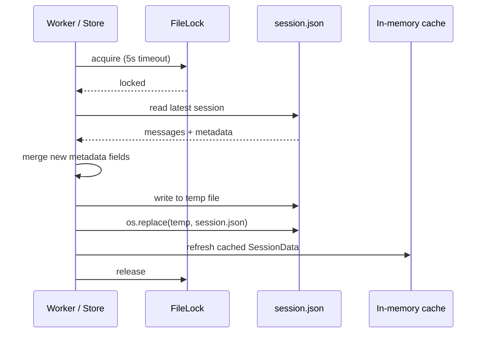
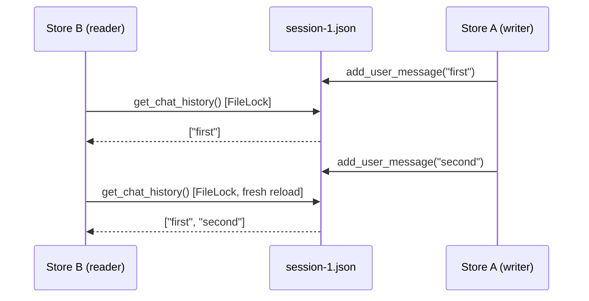

# Session Persistence

PraisonAI Agents provides automatic session persistence with zero configuration. Simply provide a `session_id` to your Agent and conversation history is automatically saved and restored.

<Info>
**Released in PR #1709** — Earlier versions could silently drop the latest messages when `update_session_metadata()` ran concurrently with `add_message()` across processes or store instances. Upgrade to pick up the fix.
</Info>

## Quick Start

```python
from praisonaiagents import Agent

# First conversation
agent = Agent(
    name="Assistant",
    memory={"session_id": "my-session-123"}
)
agent.start("My name is Alice and I love pizza")

# Later, in a new process - history is restored automatically
agent = Agent(
    name="Assistant", 
    memory={"session_id": "my-session-123"}
)
agent.start("What is my name?")  # Agent remembers: "Alice"
```

## How It Works

When you provide a `session_id` to an Agent:

1. **Automatic Persistence**: Conversation history is automatically saved to disk after each message
2. **Automatic Restoration**: When a new Agent is created with the same `session_id`, history is restored
3. **Zero Configuration**: No database setup required - uses JSON files by default

### Default Storage Location

Sessions are stored in: `~/.praisonai/sessions/{session_id}.json`

## Behavior Matrix

| Scenario | Behavior |
|----------|----------|
| `session_id` provided, no DB | JSON persistence (automatic) |
| `session_id` provided, with DB | DB adapter used |
| No `session_id`, same Agent instance | In-memory only |
| No `session_id`, new Agent instance | No history |

## In-Memory Memory (Default)

Even without `session_id`, the same Agent instance remembers previous messages:

```python
from praisonaiagents import Agent

agent = Agent(name="Assistant")

# First message
agent.chat("My favorite number is 42")

# Second message - agent remembers
agent.chat("What is my favorite number?")  # Agent responds: "42"
```

<Note>
In-memory memory is lost when the Agent instance is garbage collected or the process ends.
Use `session_id` for persistence across processes.
</Note>

## Persistent Sessions

### Basic Usage

```python
from praisonaiagents import Agent

# Create agent with session_id
agent = Agent(
    name="Assistant",
    instructions="You are a helpful assistant.",
    memory={"session_id": "user-123-chat"}
)

# Conversation is automatically persisted
response = agent.chat("Remember that my birthday is January 15th")
```

### Resuming Sessions

```python
# In a new Python process or after restart
from praisonaiagents import Agent

# Same session_id restores history
agent = Agent(
    name="Assistant",
    instructions="You are a helpful assistant.",
    memory={"session_id": "user-123-chat"}
)

# Agent remembers previous conversation
response = agent.chat("When is my birthday?")
# Agent responds: "Your birthday is January 15th"
```

### Session File Format

Sessions are stored as JSON files with automatic metadata tracking:

```json
{
  "session_id": "user-123-chat",
  "messages": [
    {"role": "user", "content": "Remember my birthday is January 15th", "timestamp": 1704153600.0},
    {"role": "assistant", "content": "I'll remember that!", "timestamp": 1704153601.5}
  ],
  "created_at": "2026-01-02T04:00:00+00:00",
  "updated_at": "2026-01-02T04:01:00+00:00",
  "agent_name": "Assistant",
  "model": "gpt-4o",
  "total_tokens": 125,
  "cost": 0.0032,
  "agent_id": "assistant-001",
  "source": "chat"
}
```

### Session Metadata Fields

The following metadata is automatically populated after each assistant turn:

| Field | Type | Description |
|-------|------|-------------|
| `model` | `string` | LLM model used in the session |
| `total_tokens` | `int` | Cumulative input+output tokens |
| `cost` | `float` | Estimated USD cost |
| `agent_id` | `string` | Gateway or registry agent id |
| `source` | `string` | Origin: `chat`, `gateway`, `cli`, `api` |
| `agent_name` | `string` | Human-readable agent name |

These fields enable cost tracking and usage analytics across sessions.

#### How metadata is populated

After every assistant turn, `praisonaiagents/agent/memory_mixin.py::_persist_session_stats()` calls `store.update_session_metadata(session_id, model=..., total_tokens=..., cost=..., source=..., agent_id=...)`. You normally don't call this directly — but you **can** call it to record custom metadata on a session:

```python
from praisonaiagents.session import get_default_session_store

store = get_default_session_store()
store.update_session_metadata(
    "user-123-chat",
    custom_field="my value",
    model="gpt-4o-mini",
    total_tokens=125,
)
```

## Multi-Process Safety

The session store is safe under concurrent multi-process and multi-instance use on **both reads and writes**:

- **Atomic writes** — every mutator (`add_message`, `set_agent_info`, `set_gateway_info`, `clear_session`, `update_session_metadata`) reloads the session from disk inside `FileLock`, mutates, then atomically writes (temp file + `os.replace`). Concurrent writers cannot drop each other's messages.
- **Fresh reads** — `get_chat_history`, `get_session`, and `get_sessions_by_agent` reload from disk under `FileLock` on every call and refresh the in-process cache. Two store instances pointing at the same `session_dir` will always see each other's writes.
- **Cross-platform locks** — `fcntl.flock` on Unix/macOS, `msvcrt.locking` on Windows.

```mermaid
sequenceDiagram
    participant Reader as Store B (reader)
    participant Disk as session-1.json
    participant Writer as Store A (writer)

    Writer->>Disk: add_user_message("first") [FileLock]
    Reader->>Disk: get_chat_history() [FileLock]
    Disk-->>Reader: ["first"]
    Writer->>Disk: add_user_message("second") [FileLock]
    Reader->>Disk: get_chat_history() [FileLock, fresh reload]
    Disk-->>Reader: ["first", "second"]
    
    classDef writer fill:#8B0000,stroke:#7C90A0,color:#fff
    classDef reader fill:#8B0000,stroke:#7C90A0,color:#fff
    classDef file fill:#189AB4,stroke:#7C90A0,color:#fff
    
    class Writer writer
    class Reader reader
    class Disk file
```

<Note>
Multiple processes (a gateway worker and a bot worker, several uvicorn workers, a CLI alongside a server) can safely share the same `session_dir`. Each call to `get_chat_history` returns the latest committed state on disk — there is no stale-cache window.
</Note>

<Note>
`store.invalidate_cache(session_id)` still exists for backwards compatibility, but since reads always reload from disk it is effectively a no-op on the read path. You no longer need to call it before `get_chat_history` / `get_session`.
</Note>

The session store is safe under concurrent multi-process and multi-instance use:

- **File locking** — `fcntl.flock()` on Unix, `msvcrt.locking()` on Windows
- **Atomic writes** — temp file + `os.replace()` prevents partial-write corruption
- **Reload under lock** — every mutator (`add_message`, `set_agent_info`, `set_gateway_info`,
  `clear_session`, `update_session_metadata`) reloads the session from disk inside the
  `FileLock` before mutating, so two processes sharing the same session directory cannot
  drop each other's messages.

<Note>
The reload-under-lock guarantee was completed in PraisonAI PR #1709 (metadata) and PR #1724
(agent info, gateway info, clear). Earlier releases could silently drop messages if
`set_agent_info` / `clear_session` / `set_gateway_info` raced with `add_message` across
two `DefaultSessionStore` instances pointed at the same directory.
</Note>

The session store uses file locking to ensure safe concurrent access on **both reads and writes**:

- **Atomic writes**: `add_message` and friends reload under `FileLock`, mutate, then atomically write (temp file + rename) so concurrent writers cannot corrupt a session file.
- **Fresh reads**: `get_chat_history`, `get_session`, and `get_sessions_by_agent` reload from disk under `FileLock` on every call and refresh the in-process cache. Two store instances pointing at the same `session_dir` will always see each other's writes.
- **Cross-platform locks**: `fcntl.flock` on Unix/macOS, `msvcrt.locking` on Windows.

All write methods — `add_message()`, `add_user_message()`, `add_assistant_message()`, `clear_session()`, **`update_session_metadata()`**, `set_agent_info()`, and `delete_session()` — acquire a cross-process file lock, reload the session from disk inside the lock, mutate it, and write atomically via a temp file + `os.replace()`. It is safe to share a session directory across multiple workers, containers, or store instances; concurrent metadata updates and message appends from different workers will both be preserved.

If the lock cannot be acquired within `lock_timeout` (default 5.0s), the operation raises `IOError` — previously this was silent. Increase `lock_timeout` for slow / network filesystems:

```python
from praisonaiagents.session import DefaultSessionStore

store = DefaultSessionStore(lock_timeout=30.0)
```

<Note>
Multiple processes (e.g. a gateway worker and a bot worker, or multiple uvicorn workers) can safely share the same `session_dir`. Each call to `get_chat_history` returns the latest committed state on disk — there is no stale-cache window.
</Note>

<Note>
`store.invalidate_cache(session_id)` still exists for backwards compatibility, but since reads always reload from disk it is effectively a no-op on the read path. You no longer need to call it before `get_chat_history` / `get_session`.
</Note>

```mermaid
sequenceDiagram
    participant W as Worker A<br/>(add_message)
    participant D as sessions/sess-1.json
    participant R as Worker B<br/>(set_agent_info)

    W->>D: FileLock acquire
    W->>D: reload from disk
    W->>D: append "hello"
    W->>D: atomic write
    W->>D: FileLock release

    R->>D: FileLock acquire
    Note over R,D: reload-under-lock<br/>sees "hello"
    R->>D: set agent_name
    R->>D: atomic write (preserves "hello")
    R->>D: FileLock release

    classDef worker fill:#8B0000,stroke:#7C90A0,color:#fff
    classDef file fill:#189AB4,stroke:#7C90A0,color:#fff
    
    class W,R worker
    class D file
```





The same guarantees apply to `HierarchicalSessionStore`, which adds extended-field preservation (`parent_id`, `children_ids`, `snapshots`, `forked_from_message_id`) across all mutators as of PR #1745.

<<<<<<< HEAD
Multiple processes can safely read/write to the same session. `HierarchicalSessionStore` adds an mtime-based cache validity check on top of these guarantees (PR #1781): cached reads stay fast when the file hasn't changed, and the cache is automatically invalidated when another process writes to the same session file.
=======
>>>>>>> origin/main

## Direct Session Store Access

For advanced use cases, you can access the session store directly:

```python
from praisonaiagents.session import get_default_session_store

store = get_default_session_store()

# Add messages
store.add_user_message("session-123", "Hello")
store.add_assistant_message("session-123", "Hi there!")

# Get history
history = store.get_chat_history("session-123")
# [{"role": "user", "content": "Hello"}, {"role": "assistant", "content": "Hi there!"}]

# List all sessions
sessions = store.list_sessions()

# Delete a session
store.delete_session("session-123")
```

### Custom Session Directory

```python
from praisonaiagents.session import DefaultSessionStore

store = DefaultSessionStore(
    session_dir="/custom/path/sessions",
    max_messages=200,  # Default: 100
    lock_timeout=10.0,  # Default: 5.0 seconds
)
```

## Using with DB Adapter

When a DB adapter is provided, it takes precedence over JSON persistence. The `DbSessionAdapter` now persists both messages and metadata to the conversation store, ensuring session metadata survives process restarts.

```python
from praisonaiagents import Agent

# Custom DB adapter (e.g., PostgreSQL, MongoDB)
class MyDbAdapter:
    def on_agent_start(self, agent_name, session_id, user_id=None, metadata=None):
        # Load history from database
        return []
    
    def on_user_message(self, session_id, content):
        # Save user message to database
        pass
    
    def on_agent_message(self, session_id, content):
        # Save agent message to database
        pass

agent = Agent(
    name="Assistant",
    memory={"session_id": "my-session"},
    db=MyDbAdapter()
)
```

<Note>
For DB-backed sessions, `clear_session()` and `delete_session()` now purge persisted messages from the database via the conversation store's `delete_messages()` method, ensuring that cleared history does not reappear after restarts.

When using the built-in `DbSessionAdapter` (via `praisonai.db`), both messages and metadata are automatically persisted to your database. The `set_metadata()` and `get_metadata()` methods now round-trip through the conversation store, so metadata survives process restarts without additional configuration. For complete examples, see the [HostedAgent persistence guide](/docs/features/managed-agent-persistence).
</Note>

## Context Caching

For cost optimization with Anthropic models, use `caching=True`:

```python
agent = Agent(
    name="Assistant",
    memory={"session_id": "my-session"},
    caching=True,  # Enables Anthropic prompt caching
)
```

This caches the system prompt, reducing token costs for repeated conversations.

## Bot Session Persistence

Bots now use the **same session store** as agents. Each user gets a persistent session that survives bot restarts:

```python
from praisonaiagents.session import get_default_session_store

# BotSessionManager with persistent store
from praisonai.bots._session import BotSessionManager

mgr = BotSessionManager(
    store=get_default_session_store(),
    platform="telegram",
)

# Each user gets a unique session key: bot_telegram_{user_id}
response = await mgr.chat(agent, "user123", "Hello!")
# Session persisted to ~/.praisonai/sessions/bot_telegram_user123.json
```

<Note>
Without a `store` parameter, `BotSessionManager` falls back to in-memory-only mode for backward compatibility.
</Note>

## Session Store Protocol

All session stores implement `SessionStoreProtocol` — a lightweight interface that enables swapping backends:

```python
from praisonaiagents.session import SessionStoreProtocol

# Any class with these 5 methods satisfies the protocol:
# add_message(), get_chat_history(), clear_session(),
# delete_session(), session_exists()

assert isinstance(get_default_session_store(), SessionStoreProtocol)
```

<Card icon="plug" href="/features/session-protocol">
  Learn more about building custom session stores
</Card>

## Best Practices

1. **Use meaningful session IDs**: Include user ID or context in the session ID
   ```python
   session_id = f"user-{user_id}-{conversation_type}"
   ```

2. **Handle session limits**: Default max messages is 100. Older messages are trimmed.

3. **Clean up old sessions**: Use `store.delete_session()` to remove unused sessions, which also purges persisted DB rows.

4. **Use prompt caching**: Enable `caching=True` for Anthropic models to reduce costs.

## API Reference

### Agent Parameters

| Parameter | Type | Description |
|-----------|------|-------------|
| `session_id` | `str` | Session identifier for persistence |
| `db` | `DbAdapter` | Optional database adapter (overrides JSON) |
| `prompt_caching` | `bool` | Enable Anthropic prompt caching |

### DefaultSessionStore Methods

| Method | Description |
|--------|-------------|
| `add_message(session_id, role, content)` | Add a message |
| `add_user_message(session_id, content)` | Convenience wrapper for `add_message(role="user", ...)` |
| `add_assistant_message(session_id, content)` | Convenience wrapper for `add_message(role="assistant", ...)` |
| `get_chat_history(session_id, max_messages)` | Get chat history (disk-fresh on every call) |
| `get_session(session_id)` | Get full session data (disk-fresh on every call) |
| `set_agent_info(session_id, agent_name, user_id)` | Attach agent name / user id (reload-under-lock) |
| `set_gateway_info(session_id, gateway_session_id, agent_id)` | Link a session to a gateway session id and agent id |
| `update_session_metadata(session_id, **fields)` | Merge run stats / metadata; `agent_id` / `agent_name` / `user_id` also update top-level fields |
| `get_by_gateway_session(gateway_session_id)` | Look up a session by its gateway session id |
| `get_sessions_by_agent(agent_name, limit)` | List sessions belonging to an agent (each loaded disk-fresh) |
| `clear_session(session_id)` | Clear all messages |

| `add_message(session_id, role, content, metadata)` | Add a message (reload-under-lock) |
| `add_user_message(session_id, content)` | Convenience wrapper for `add_message(role="user", ...)` |
| `add_assistant_message(session_id, content)` | Convenience wrapper for `add_message(role="assistant", ...)` |
| `get_chat_history(session_id, max_messages)` | Get chat history (reload-under-lock on every call) |
| `get_session(session_id)` | Get full session data |
| `update_session_metadata(session_id, **fields)` | Merge run stats / metadata fields. Safe concurrently across processes. Skips `None` values. |
| `set_agent_info(session_id, agent_name=None, user_id=None)` | Set or update agent info (reload-under-lock). |
| `clear_session(session_id)` | Clear all messages (reload-under-lock) |

| `delete_session(session_id)` | Delete session completely |
| `list_sessions(limit)` | List all sessions |
| `invalidate_cache(session_id)` | Drop the in-memory cache entry (no-op for reads; reads always reload) |
| `session_exists(session_id)` | Check if session exists |
| `set_agent_info(session_id, agent_name, user_id)` | Attach agent name / user id to a session (reload-under-lock) |
| `set_gateway_info(session_id, gateway_session_id, agent_id)` | Link a session to a gateway session id and agent id |
| `update_session_metadata(session_id, **fields)` | Merge run stats / metadata into a session; `agent_id` / `agent_name` / `user_id` keys also update the top-level fields |
| `get_by_gateway_session(gateway_session_id)` | Look up a session by its gateway session id |
| `invalidate_cache(session_id)` | Drop the in-memory cache entry; next read will hit disk |
