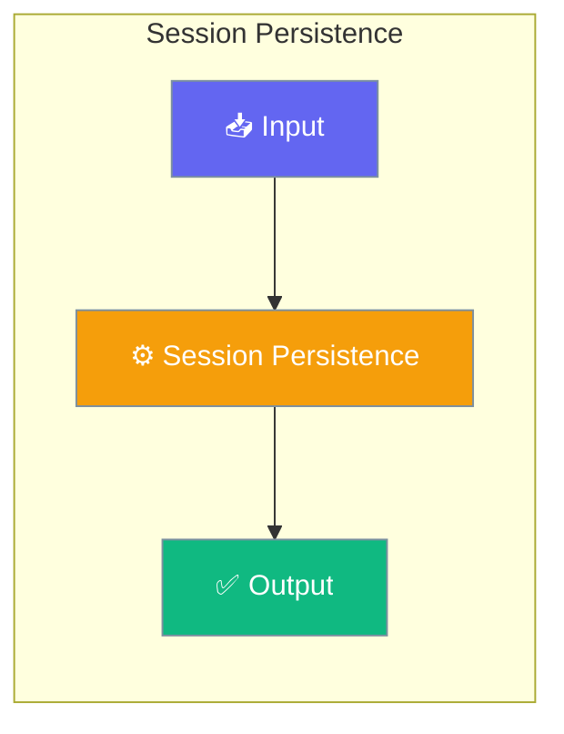

# Session Persistence

PraisonAI Agents provides automatic session persistence with zero configuration. Simply provide a `session_id` to your Agent and conversation history is automatically saved and restored.

<Info>
**Released in PR #1897** — Earlier versions wrote duplicate messages when `memory="history"` was combined with `auto_save` (one turn produced 4 messages instead of 2), and `Session.save_state()` re-appended full history on every call. Both paths are now exact and idempotent.
</Info>

<Info>
**Released in PR #1709** — Earlier versions could silently drop the latest messages when `update_session_metadata()` ran concurrently with `add_message()` across processes or store instances. Upgrade to pick up the fix.
</Info>

<Info>
**Released in PR #2102** — Earlier versions of the gateway session-resume path used the **first** `session_data` system message it found, which was the empty snapshot written at session create. Reconnecting always restored an empty history. Resume now iterates all system messages and keeps the latest snapshot. Also: `WebSocketGateway.stop()` previously called `session.close()` directly, bypassing persistence; it now goes through `close_session()`, so graceful shutdown (SIGTERM) persists in-flight sessions identically to a WebSocket disconnect.
</Info>

<Info>
**Released in PR #1972** — Earlier versions of `BotSessionManager` keyed agent locks on `id(agent)`, which CPython is free to reuse once an agent is garbage-collected. In long-running gateways that recreated agents per request, two unrelated users could silently serialize on the same lock — or worse, swap histories. Agent locks now use a `WeakKeyDictionary`, so they auto-clean when the agent is GC'd. Per-user locks are bounded by an LRU+TTL cache. Upgrade to pick up the fix.
</Info>




## Quick Start


<Steps>
<Step title="Simple Usage">
Start an agent with a session, then resume from the CLI with a follow-up prompt:

```python
from praisonaiagents import Agent

agent = Agent(
    name="Reviewer",
    instructions="Review the codebase and answer follow-ups",
    memory={"session_id": "review-2026-06-25"},
)

agent.start("Summarise the auth module")
```
</Step>

<Step title="With Configuration">
Continue the session from the terminal without writing any more Python:

```bash
praisonai session resume review-2026-06-25 "Now suggest test cases for the same module"
```

---
</Step>
</Steps>


## Best Practices

<AccordionGroup>
  <Accordion title="Start simple">
    Enable the feature with a single parameter before adding configuration. Verify it works, then layer in options.
  </Accordion>
  <Accordion title="Use environment variables for secrets">
    Never hardcode API keys or tokens. Use `os.getenv("KEY_NAME")` to read from environment variables.
  </Accordion>
  <Accordion title="Test with minimal examples first">
    Copy the Quick Start example, run it, then extend it. This confirms your environment is set up correctly.
  </Accordion>
  <Accordion title="Check the logs">
    Set `verbose=True` on your agent to see detailed execution logs when debugging unexpected behavior.
  </Accordion>
</AccordionGroup>

## Related

<CardGroup cols={2}>
  <Card title="Features Overview" icon="grid-2" href="/docs/features">
    Browse all PraisonAI features
  </Card>
  <Card title="Quick Start" icon="rocket" href="/docs/introduction">
    Get started with PraisonAI agents
  </Card>
</CardGroup>
