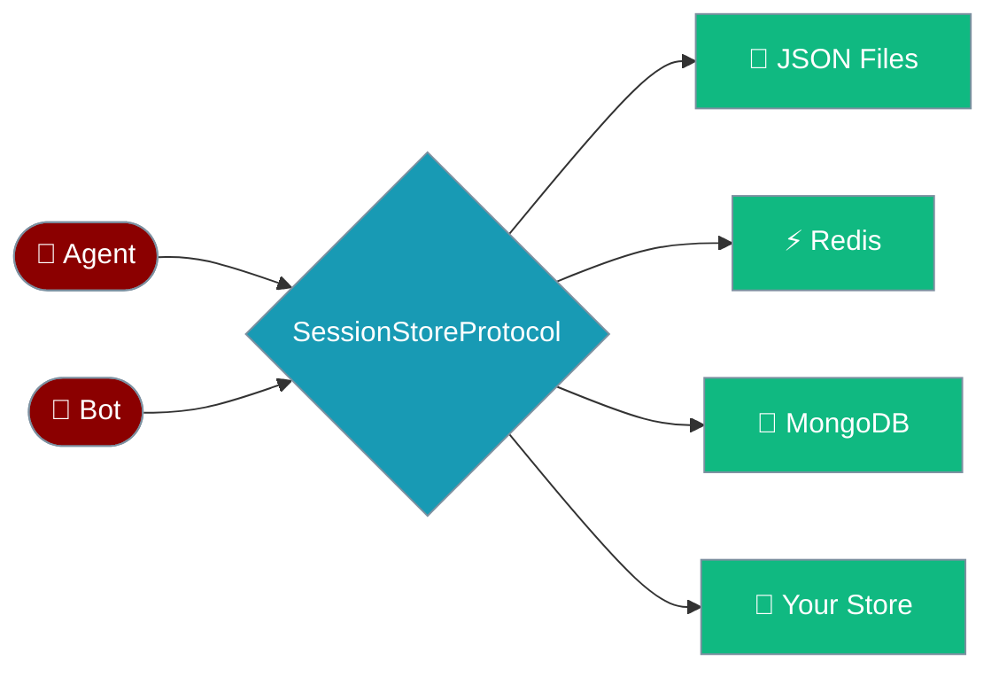
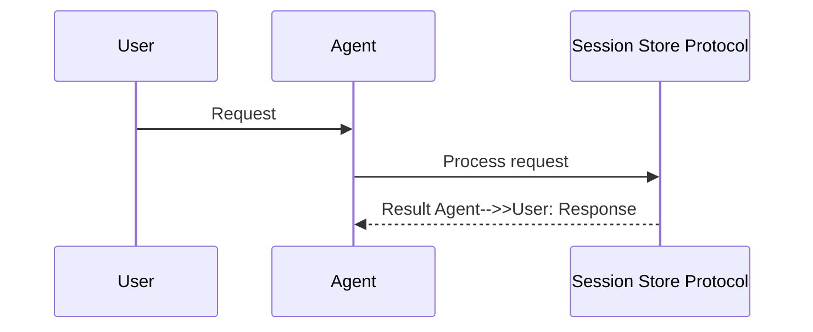
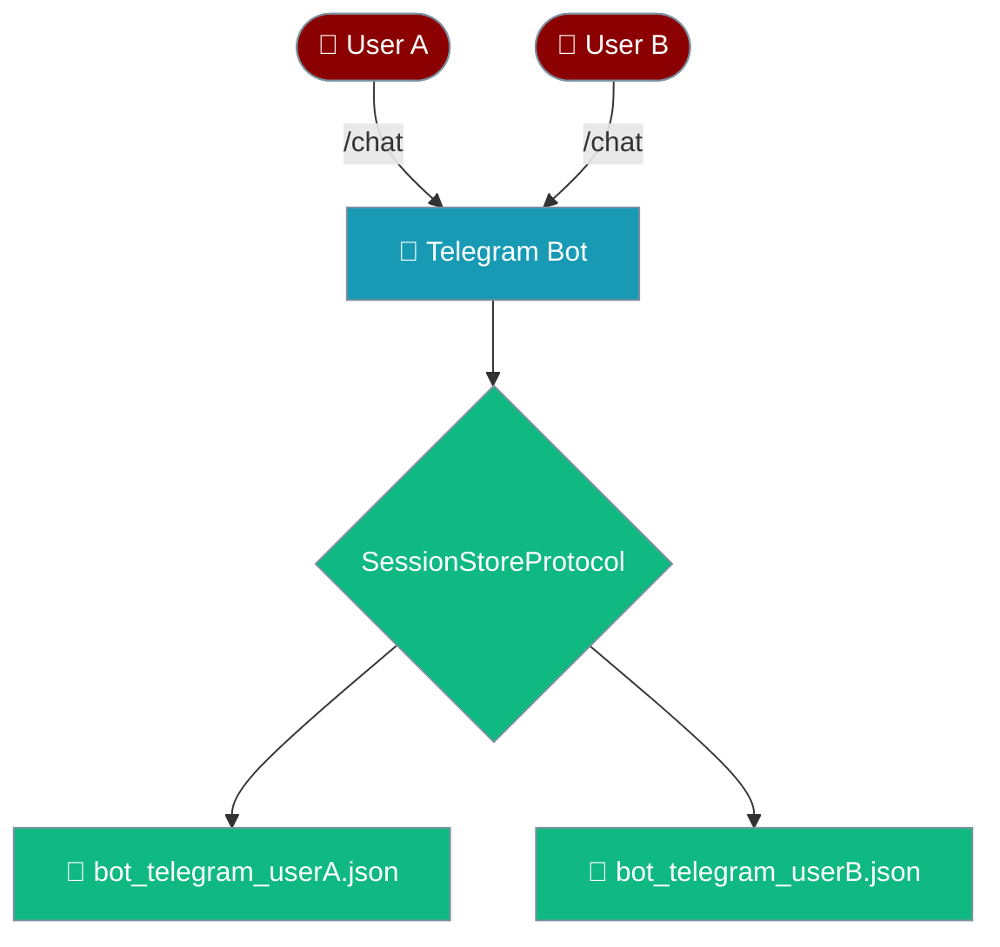

The `SessionStoreProtocol` defines the methods any session backend must implement — swap JSON files, Redis, or your own store without changing agent code.

```python
from praisonaiagents import Agent

agent = Agent(
    name="Assistant",
    memory={"session_id": "chat-123"},
)
agent.start("Hello!")
```


The user plugs in a custom session backend; agents call the same protocol methods regardless of storage.



```mermaid
graph LR
    Agent([🤖 Agent]) --> Protocol{SessionStoreProtocol}
    Bot([💬 Bot]) --> Protocol
    Protocol --> JSON[📁 JSON Files]
    Protocol --> Redis[⚡ Redis]
    Protocol --> Mongo[🍃 MongoDB]
    Protocol --> Custom[🔧 Your Store]

    classDef agent fill:#8B0000,stroke:#7C90A0,color:#fff
    classDef proto fill:#189AB4,stroke:#7C90A0,color:#fff
    classDef store fill:#10B981,stroke:#7C90A0,color:#fff

    class Agent,Bot agent
    class Protocol proto
    class JSON,Redis,Mongo,Custom store
```

## How It Works


```mermaid
sequenceDiagram
    participant User
    participant Agent
    participant Feature as Session Store Protocol

    User->>Agent: Request
    Agent->>Feature: Process request
    Feature-->>Agent: Result    Agent-->>User: Response
```


## Quick Start

<Steps>
  <Step title="Use the built-in JSON store (zero config)">
    ```python
    from praisonaiagents import Agent

    agent = Agent(
        name="Assistant",
        memory={"session_id": "chat-123"}
    )
    agent.start("Hello!")
    ```
    Sessions are automatically persisted to `~/.praisonai/sessions/chat-123.json`.
  </Step>

  <Step title="Swap to a custom store">
    ```python
    from praisonaiagents.session import SessionStoreProtocol

    class RedisSessionStore:
        """Your custom Redis-backed session store."""

        def add_message(self, session_id, role, content, metadata=None):
            # Save to Redis
            ...
            return True

        def get_chat_history(self, session_id, max_messages=None):
            # Load from Redis
            return [{"role": "user", "content": "Hi"}]

        def clear_session(self, session_id):
            return True

        def delete_session(self, session_id):
            return True

        def session_exists(self, session_id):
            return False

    # Verify at runtime
    store = RedisSessionStore()
    assert isinstance(store, SessionStoreProtocol)  # ✅ True
    ```
  </Step>
</Steps>

## Protocol Methods

The protocol requires exactly **five methods**:

| Method | Returns | Purpose |
|--------|---------|---------|
| `add_message(session_id, role, content, metadata)` | `bool` | Store a single message |
| `get_chat_history(session_id, max_messages)` | `list[dict]` | Retrieve messages in LLM format |
| `clear_session(session_id)` | `bool` | Remove all messages (keep metadata) |
| `delete_session(session_id)` | `bool` | Delete session completely |
| `session_exists(session_id)` | `bool` | Check if a session exists |
| `set_chat_history(session_id, messages)` | `bool` | **Recommended.** Atomically replace chat history for idempotent saves |
| `update_session_metadata(session_id, **fields)` | `bool` | Merge metadata fields without touching messages |
| `get_working_history(session_id, max_messages=None)` | `list[dict]` | **Optional.** Compacted resume path — summary + tail when a checkpoint exists, else raw history |

<Note>
For **persistent backends (DB / JSON)**, `clear_session()` and `delete_session()` remove the underlying stored messages too, not just in-memory data. This ensures cleared history does not reappear after a reload or restart.
</Note>

<Note>
**Backward compatible resume.** On resume the agent prefers `get_working_history(...)` when the store implements it (checked via `hasattr`), so it can replay a compacted summary + tail. Stores that implement only `get_chat_history` continue to work unchanged — they simply resume from the raw transcript. See [Compacted Session Resume](/docs/features/session-compaction-checkpoint).
</Note>

<Tip>
The protocol uses Python's `typing.Protocol` with `@runtime_checkable`, so any class with matching method signatures automatically satisfies it — no inheritance needed.
</Tip>

### set_chat_history (Recommended)

**`set_chat_history(session_id, messages)` (recommended).** Atomically replaces the chat history for a session. If your store omits this method, `Session.save_state()` falls back to `add_message()` per message and may produce duplicates when called repeatedly. The built-in `DefaultSessionStore` implements this with reload-under-lock atomic-write semantics.

```python
class MyStore:
    def set_chat_history(self, session_id: str, messages: list[dict]) -> bool:
        """Replace the chat history for a session atomically.
        
        Args:
            session_id: Session identifier
            messages: list of {"role": str, "content": str}
            
        Returns:
            True if successful
        """
        with self._lock:
            self._data[session_id] = list(messages)
            self._flush()
        return True
```

<Tip>
If your custom store backs onto shared storage (Redis, Postgres, S3), reload from that backing store on every read — do not rely on in-process caches. `DefaultSessionStore` and `BotSessionManager._load_history` assume this.
</Tip>

## update_session_metadata() API

The `update_session_metadata()` method enables safe metadata updates across processes without touching messages:

### Parameters

| Parameter | Type | Description |
|-----------|------|-------------|
| `session_id` | `str` | Unique session identifier |
| `**fields` | `Any` | Metadata fields to merge (e.g., `model`, `total_tokens`, `cost`) |

### Reserved Metadata Fields

The SDK uses these reserved fields internally:

| Field | Type | Description | Auto-populated |
|-------|------|-------------|----------------|
| `model` | `str` | LLM model name (e.g., "gpt-4o-mini") | ✅ |
| `total_tokens` | `int` | Cumulative input + output tokens | ✅ |
| `cost` | `float` | Estimated USD cost | ✅ |
| `agent_id` | `str` | Gateway or registry agent ID | ✅ |
| `source` | `str` | Origin: "chat", "gateway", "cli", "api" | ✅ |

### Example Usage

```python
from praisonaiagents.session import get_default_session_store

store = get_default_session_store()

# Merge metadata into an existing session without touching messages
store.update_session_metadata(
    "user-123-chat",
    model="gpt-4o-mini",
    total_tokens=125,
    cost=0.0032,
    source="chat",
    agent_id="assistant-001",
)

# None values are skipped
store.update_session_metadata(
    "user-123-chat",
    cost=None,  # Ignored, doesn't overwrite existing cost
    custom_field="my value"
)
```

### Concurrency Safety

In `DefaultSessionStore`, `update_session_metadata()` reloads under a cross-process file lock so concurrent metadata updates and message appends are both preserved.

## Built-in Implementations

<CardGroup cols={2}>
  <Card icon="file" title="DefaultSessionStore">
    JSON file-based persistence with atomic writes and file locking. Mutating and read methods reload from disk under lock so multiple processes can share one directory.

    ```python
    from praisonaiagents.session import DefaultSessionStore

    store = DefaultSessionStore(
        session_dir="/custom/path",
        max_messages=200,
    )
    ```
  </Card>
  <Card icon="sitemap" title="HierarchicalSessionStore">
    Extends `DefaultSessionStore` with forking, snapshots, and revert.

    ```python
    from praisonaiagents.session import get_hierarchical_session_store

    store = get_hierarchical_session_store()
    parent = store.create_session(title="Main")
    child = store.fork_session(parent, from_message_index=5)
    ```
  </Card>
  <Card icon="database" title="SqliteSessionStore">
    Extends `DefaultSessionStore` with a stdlib `sqlite3` + FTS5 index for scalable cross-session recall (Issue #2927). A drop-in implementation of `SearchableSessionStoreProtocol`.

    ```python
    from praisonaiagents.session import SqliteSessionStore

    store = SqliteSessionStore(db_path="~/.praisonai/sessions.db")
    ```

    See [SqliteSessionStore](/docs/features/session-store#sqlitesessionstore).
  </Card>
</CardGroup>

<Note>
`SessionHit` gained a `bookends` field (`Dict[str, List[Dict]]`) carrying the first/last user+assistant turns of a matched session. It is backward compatible — `as_dict()` only emits the key when populated. See [Cross-Session Recall](/docs/features/cross-session-recall#anchored-demoted-deduped-results).
</Note>

## Using with Bots

Bots use the same `SessionStoreProtocol` for persistent per-user sessions:

```python
from praisonaiagents.session import get_default_session_store

# Bot sessions persist automatically
from praisonai.bots import Bot

bot = Bot(
    "telegram",
    agent=my_agent,
    session_store=get_default_session_store(),
)
```

Each user gets a deterministic session key like `bot_telegram_12345`, stored in the same `~/.praisonai/sessions/` directory as agent sessions.


```mermaid
graph TD
    U1([👤 User A]) -->|/chat| Bot[💬 Telegram Bot]
    U2([👤 User B]) -->|/chat| Bot
    Bot --> Store{SessionStoreProtocol}
    Store --> F1[📁 bot_telegram_userA.json]
    Store --> F2[📁 bot_telegram_userB.json]

    classDef user fill:#8B0000,stroke:#7C90A0,color:#fff
    classDef bot fill:#189AB4,stroke:#7C90A0,color:#fff
    classDef store fill:#10B981,stroke:#7C90A0,color:#fff

    class U1,U2 user
    class Bot bot
    class Store,F1,F2 store
```

## Building a Custom Store

<AccordionGroup>
<Accordion title="Full example: In-memory store for testing">
```python
from typing import Any, Dict, List, Optional

class InMemorySessionStore:
    """Fast in-memory store for unit tests."""

    def __init__(self):
        self._data: Dict[str, List[Dict]] = {}

    def add_message(
        self, session_id: str, role: str, content: str,
        metadata: Optional[Dict[str, Any]] = None,
    ) -> bool:
        self._data.setdefault(session_id, []).append(
            {"role": role, "content": content}
        )
        return True

    def get_chat_history(
        self, session_id: str, max_messages: Optional[int] = None,
    ) -> List[Dict[str, str]]:
        msgs = self._data.get(session_id, [])
        return msgs[-max_messages:] if max_messages else list(msgs)

    def clear_session(self, session_id: str) -> bool:
        self._data[session_id] = []
        return True

    def delete_session(self, session_id: str) -> bool:
        self._data.pop(session_id, None)
        return True

    def session_exists(self, session_id: str) -> bool:
        return session_id in self._data
```
</Accordion>

<Accordion title="Verifying protocol conformance">
```python
from praisonaiagents.session import SessionStoreProtocol

store = InMemorySessionStore()

# Runtime check — no registration needed
assert isinstance(store, SessionStoreProtocol)

# Use it anywhere a SessionStoreProtocol is expected
store.add_message("test", "user", "Hello")
history = store.get_chat_history("test")
assert history == [{"role": "user", "content": "Hello"}]
```
</Accordion>
</AccordionGroup>

## Checkpoint Query Protocol

For session stores that support checkpoints and rollback functionality:

```python
from praisonaiagents.session.protocols import CheckpointQueryProtocol

class CheckpointEnabledStore:
    """Session store with checkpoint support."""
    
    def list_checkpoints(self, session_id: str) -> List[Dict[str, Any]]:
        """Return checkpoint metadata for a session."""
        return [
            {
                "checkpoint_id": "checkpoint_001",
                "created_at": "2026-01-01T12:00:00Z",
                "message_count": 10,
                "description": "Before complex task"
            }
        ]
    
    def get_checkpoint(self, session_id: str, checkpoint_id: str) -> Optional[Dict[str, Any]]:
        """Return full checkpoint data."""
        return {
            "checkpoint_id": checkpoint_id,
            "session_id": session_id,
            "messages": [...],  # Full message history at checkpoint
            "metadata": {...}
        }

# Verify checkpoint protocol
store = CheckpointEnabledStore()
assert isinstance(store, CheckpointQueryProtocol)
```

### Checkpoint Usage

```python
from praisonaiagents.session import get_hierarchical_session_store

store = get_hierarchical_session_store()

snapshot_id = store.create_snapshot("session-123", label="Before complex task")
store.revert_to_snapshot("session-123", snapshot_id)
```

---

## Best Practices

<AccordionGroup>
<Accordion title="Implement set_chat_history for idempotent saves">
Without it, repeated `Session.save_state()` calls may duplicate messages via the `add_message` fallback.
</Accordion>

<Accordion title="Reload shared storage on every read">
Redis, Postgres, and multi-worker file stores must not serve stale in-process caches.
</Accordion>

<Accordion title="Use runtime isinstance checks">
`SessionStoreProtocol` is `@runtime_checkable` — verify custom stores with `isinstance(store, SessionStoreProtocol)`.
</Accordion>
</AccordionGroup>

---

## Related

<CardGroup cols={2}>
  <Card title="Session Persistence" icon="floppy-disk" href="/docs/features/session-persistence">
    Automatic session save and restore
  </Card>
  <Card title="Sessions Overview" icon="clock-rotate-left" href="/docs/features/sessions">
    Sessions and remote agents
  </Card>
</CardGroup>
