The `SessionStoreProtocol` defines **five methods** that any session backend must implement. This lets you swap between JSON files, Redis, MongoDB, or your own custom store — without changing any agent or bot code.

```mermaid
graph LR
    Agent([🤖 Agent]) --> Protocol{SessionStoreProtocol}
    Bot([💬 Bot]) --> Protocol
    Protocol --> JSON[📁 JSON Files]
    Protocol --> Redis[⚡ Redis]
    Protocol --> Mongo[🍃 MongoDB]
    Protocol --> Custom[🔧 Your Store]

    classDef agent fill:#8B0000,stroke:#7C90A0,color:#fff
    classDef proto fill:#189AB4,stroke:#7C90A0,color:#fff
    classDef store fill:#2E8B57,stroke:#7C90A0,color:#fff

    class Agent,Bot agent
    class Protocol proto
    class JSON,Redis,Mongo,Custom store
```



## Quick Start

<Steps>
  <Step title="Use the built-in JSON store (zero config)">
    ```python
    from praisonaiagents import Agent

    agent = Agent(
        name="Assistant",
        memory={"session_id": "chat-123"}
    )
    agent.start("Hello!")
    ```
    Sessions are automatically persisted to `~/.praisonai/sessions/chat-123.json`.
  </Step>

  <Step title="Swap to a custom store">
    ```python
    from praisonaiagents.session import SessionStoreProtocol

    class RedisSessionStore:
        """Your custom Redis-backed session store."""

        def add_message(self, session_id, role, content, metadata=None):
            # Save to Redis
            ...
            return True

        def get_chat_history(self, session_id, max_messages=None):
            # Load from Redis
            return [{"role": "user", "content": "Hi"}]

        def clear_session(self, session_id):
            return True

        def delete_session(self, session_id):
            return True

        def session_exists(self, session_id):
            return False

    # Verify at runtime
    store = RedisSessionStore()
    assert isinstance(store, SessionStoreProtocol)  # ✅ True
    ```
  </Step>
</Steps>

## Protocol Methods

The protocol requires exactly **five methods**:

| Method | Returns | Purpose |
|--------|---------|---------|
| `add_message(session_id, role, content, metadata)` | `bool` | Store a single message |
| `get_chat_history(session_id, max_messages)` | `list[dict]` | Retrieve messages in LLM format |
| `clear_session(session_id)` | `bool` | Remove all messages (keep metadata) |
| `delete_session(session_id)` | `bool` | Delete session completely |
| `session_exists(session_id)` | `bool` | Check if a session exists |

<Tip>
The protocol uses Python's `typing.Protocol` with `@runtime_checkable`, so any class with matching method signatures automatically satisfies it — no inheritance needed.
</Tip>

## Built-in Implementations

<CardGroup cols={2}>
  <Card icon="file" title="DefaultSessionStore">
    JSON file-based persistence with atomic writes and file locking. Zero dependencies.

    ```python
    from praisonaiagents.session import DefaultSessionStore

    store = DefaultSessionStore(
        session_dir="/custom/path",
        max_messages=200,
    )
    ```
  </Card>
  <Card icon="sitemap" title="HierarchicalSessionStore">
    Extends `DefaultSessionStore` with session forking, snapshots, and revert.

    ```python
    from praisonaiagents.session import HierarchicalSessionStore

    store = HierarchicalSessionStore()
    parent = store.create_session(title="Main")
    child = store.fork_session(parent, from_message_index=5)
    ```
  </Card>
</CardGroup>

## Using with Bots

Bots use the same `SessionStoreProtocol` for persistent per-user sessions:

```python
from praisonaiagents.session import get_default_session_store

# Bot sessions persist automatically
from praisonai.bots import Bot

bot = Bot(
    "telegram",
    agent=my_agent,
    session_store=get_default_session_store(),
)
```

Each user gets a deterministic session key like `bot_telegram_12345`, stored in the same `~/.praisonai/sessions/` directory as agent sessions.

```mermaid
graph TD
    U1([👤 User A]) -->|/chat| Bot[💬 Telegram Bot]
    U2([👤 User B]) -->|/chat| Bot
    Bot --> Store{SessionStoreProtocol}
    Store --> F1[📁 bot_telegram_userA.json]
    Store --> F2[📁 bot_telegram_userB.json]

    classDef user fill:#8B0000,stroke:#7C90A0,color:#fff
    classDef bot fill:#189AB4,stroke:#7C90A0,color:#fff
    classDef store fill:#2E8B57,stroke:#7C90A0,color:#fff

    class U1,U2 user
    class Bot bot
    class Store,F1,F2 store
```



## Building a Custom Store

<Accordion title="Full example: In-memory store for testing">
```python
from typing import Any, Dict, List, Optional

class InMemorySessionStore:
    """Fast in-memory store for unit tests."""

    def __init__(self):
        self._data: Dict[str, List[Dict]] = {}

    def add_message(
        self, session_id: str, role: str, content: str,
        metadata: Optional[Dict[str, Any]] = None,
    ) -> bool:
        self._data.setdefault(session_id, []).append(
            {"role": role, "content": content}
        )
        return True

    def get_chat_history(
        self, session_id: str, max_messages: Optional[int] = None,
    ) -> List[Dict[str, str]]:
        msgs = self._data.get(session_id, [])
        return msgs[-max_messages:] if max_messages else list(msgs)

    def clear_session(self, session_id: str) -> bool:
        self._data[session_id] = []
        return True

    def delete_session(self, session_id: str) -> bool:
        self._data.pop(session_id, None)
        return True

    def session_exists(self, session_id: str) -> bool:
        return session_id in self._data
```
</Accordion>

<Accordion title="Verifying protocol conformance">
```python
from praisonaiagents.session import SessionStoreProtocol

store = InMemorySessionStore()

# Runtime check — no registration needed
assert isinstance(store, SessionStoreProtocol)

# Use it anywhere a SessionStoreProtocol is expected
store.add_message("test", "user", "Hello")
history = store.get_chat_history("test")
assert history == [{"role": "user", "content": "Hello"}]
```
</Accordion>

## Architecture Overview


## Next Steps

<CardGroup cols={2}>
  <Card icon="floppy-disk" href="/features/session-persistence">
    Learn about session persistence details
  </Card>
  <Card icon="clock-rotate-left" href="/features/sessions">
    Sessions & remote agents overview
  </Card>
</CardGroup>
