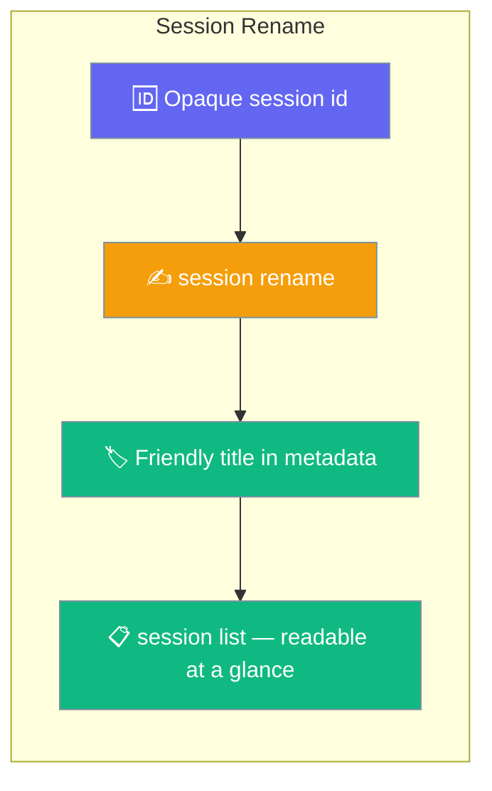
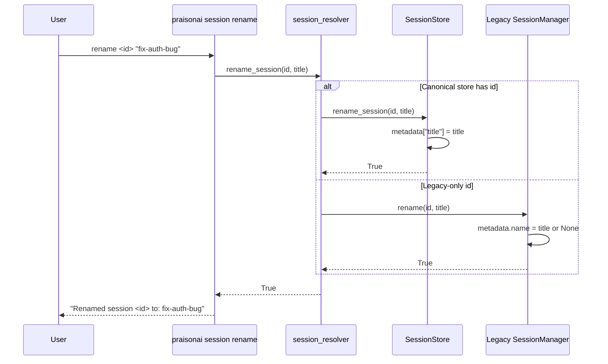
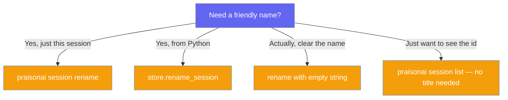

Rename a session with a friendly title so `session list` reads like a menu of tasks instead of a wall of ids.



## Quick Start

<Steps>
<Step title="Rename from the CLI">

```bash
praisonai session rename 4f9a8c72-... "fix-auth-bug"
```

</Step>

<Step title="Rename from Python">

```python
from praisonaiagents.session import get_default_session_store

store = get_default_session_store()
store.rename_session("4f9a8c72-...", "fix-auth-bug")
```

</Step>

<Step title="List — the friendly title now shows">

```bash
praisonai session list
# Now shows: fix-auth-bug   (instead of 4f9a8c72-...)
```

</Step>

<Step title="Clear the title later">

```bash
praisonai session rename 4f9a8c72-... ""
```

</Step>
</Steps>

---

## How It Works

The CLI resolves the id, then writes the title into session metadata — canonical store first, legacy store as fallback.



The title lands in `metadata["title"]` via the same locked read-modify-write path as `update_session_metadata`, and surfaces in each `list_sessions()` row under the `"title"` key (`None` when never renamed).

---

## User Interaction Flow

Three sessions today, three UUIDs — no idea which is which. Rename each one and the next `session list` becomes a menu you can scan.

**Before:**

```
ID         Name       Status   Events  Updated
4f9a8c72   4f9a8c72   active   12      10:14
9b1d3e04   9b1d3e04   active   3       09:58
c72a18ff   c72a18ff   paused   7       09:40
```

```bash
praisonai session rename 4f9a8c72-... "fix-auth-bug"
praisonai session rename 9b1d3e04-... "blog-post-draft"
praisonai session rename c72a18ff-... "data-migration"
```

**After:**

```
ID         Name              Status   Events  Updated
4f9a8c72   fix-auth-bug      active   12      10:14
9b1d3e04   blog-post-draft   active   3       09:58
c72a18ff   data-migration    paused   7       09:40
```

The id never changes — `session resume 4f9a8c72-...` still works. The title is display-only metadata.

---

## Choose Your Path

Pick the entry point that matches what you need.



---

## Configuration Options

| Option | Type | Default | Description |
|--------|------|---------|-------------|
| `session_id` (positional) | `str` | required | The session's opaque id (from `session list`). |
| `title` (positional) | `str` | required | New human-readable title. `""` or whitespace-only clears the title. |
| `--json` (global flag) | `bool` | `false` | Print `{"renamed": bool, "session_id": str, "title": str}` instead of human-readable output. |

### SDK — `rename_session`

```python
from praisonaiagents.session import get_default_session_store

store = get_default_session_store()
renamed = store.rename_session("4f9a8c72-...", "fix-auth-bug")  # -> True
```

| Param | Type | Description |
|-------|------|-------------|
| `session_id` | `str` | Session id (as returned by `list_sessions()`). |
| `title` | `str` | New title. `""` / whitespace-only clears any existing title. |

**Returns:** `bool` — `True` when the metadata write succeeded.

Title precedence when rendering a name: explicit `metadata["title"]` → `agent_name` → first user-message snippet → id. Sessions without a title stay fully resolvable and resumable by id — this change is purely additive display metadata.

### Reading the title back

```python
from praisonaiagents.session import get_default_session_store

store = get_default_session_store()

for row in store.list_sessions():
    display = row["title"] or row["session_id"]
    print(display)
```

---

## Best Practices

<AccordionGroup>
<Accordion title="Name for future-you">
Prefer `fix-auth-bug` or `blog-post-draft` over `test` / `session 2`. The title is what future-you will scan for in `session list`.
</Accordion>

<Accordion title="The id never changes">
Renaming does not change the session id. Any `praisonai session resume <id>` invocation, script, or bookmark keeps working. The title is metadata, not a new address.
</Accordion>

<Accordion title="Clear a title with an empty string">
`praisonai session rename <id> ""` removes the title. `session list` falls back to the agent name, then the first user-message snippet, then the id.
</Accordion>

<Accordion title="Legacy sessions rename too">
If `praisonai session list` shows a session but it lives only in the legacy store, `session rename` still works — it falls back to `SessionManager.rename` and persists the title in the legacy `metadata.name` field.
</Accordion>
</AccordionGroup>

---

## Related

<CardGroup cols={2}>
  <Card title="Session" icon="clock-rotate-left" href="/cli/session">
    Full CLI reference for all `session` subcommands
  </Card>
  <Card title="Session Resume" icon="play" href="/cli/session-resume">
    Continue a previous conversation by id
  </Card>
</CardGroup>
