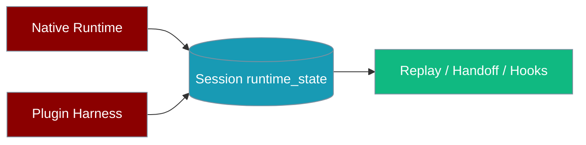
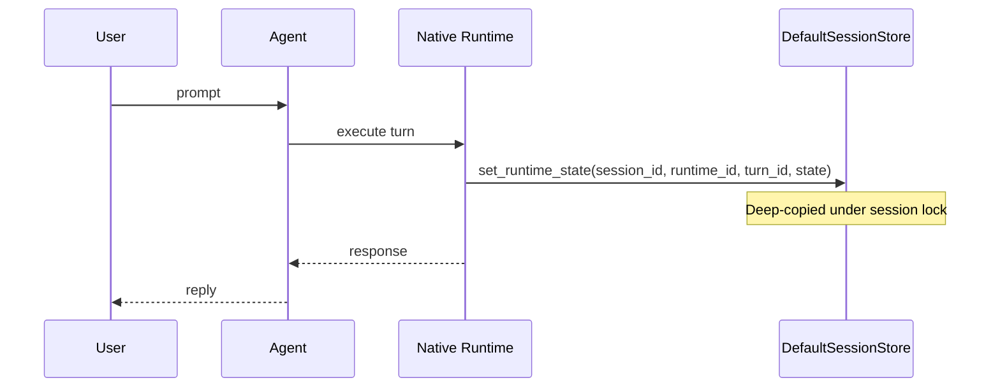

Runtime state mirroring lets sessions remember lightweight per-turn execution artefacts (tool call IDs, transcript slices) so the native runtime and plugin harnesses can hand off, replay, or debug each other's turns.



## Quick Start

<Steps>
<Step title="Enable mirroring">
```python
from praisonaiagents import GatewayConfig, SessionConfig

config = GatewayConfig(
    session_config=SessionConfig(
        persist=True,
        mirror_runtime_state=True,
    )
)
```
</Step>

<Step title="Read what was mirrored">
```python
from praisonaiagents.session.store import DefaultSessionStore

store = DefaultSessionStore()
turns = store.get_runtime_state(session_id="my-session", runtime_id="native")
for turn_id, state in turns.items():
    print(turn_id, state.get("tool_calls", []))
```
</Step>
</Steps>

## How It Works



## Configuration

| Option | Type | Default | Description |
|--------|------|---------|-------------|
| `mirror_runtime_state` | `bool` | `False` | Opt in to persist lightweight per-turn runtime artefacts on the session |

Set on [`SessionConfig`](/sdk/reference/praisonaiagents/classes/SessionConfig) — typically via `GatewayConfig(session_config=...)`.

## Store API

| Method | Description |
|--------|-------------|
| `set_runtime_state(session_id, runtime_id, turn_id, state, mirror_enabled=True)` | Save state for one turn. Returns `True` when saved or when `mirror_enabled=False` (no-op). |
| `get_runtime_state(session_id, runtime_id, turn_id=None)` | One turn when `turn_id` is set; all turns for the runtime when `turn_id` is `None`; `{}` if missing. |
| `clear_runtime_state(session_id, runtime_id=None)` | Drop one runtime's state, or all runtime state when `runtime_id` is omitted. |

## On-disk shape

```json
{
  "session_id": "my-session",
  "messages": [],
  "runtime_state": {
    "native": { "turn-1": { "tool_calls": ["call-1"] } },
    "plugin_harness": { "turn-1": { "transcript": "..." } }
  }
}
```

Shape: `{runtime_id: {turn_id: state}}`.

## Common patterns

<Tabs>
<Tab title="Replay a turn">
```python
state = store.get_runtime_state("my-session", "native", "turn-1")
tool_calls = state.get("tool_calls", [])
# Feed IDs into a follow-up run or debugger
```
</Tab>

<Tab title="Cross-runtime handoff">
```python
native = store.get_runtime_state("my-session", "native", "turn-1")
store.set_runtime_state(
    "my-session", "plugin_harness", "turn-2",
    {"prior_tool_calls": native.get("tool_calls", [])},
    mirror_enabled=True,
)
```
</Tab>

<Tab title="after_turn export">
```python
from praisonaiagents.hooks import after_turn

@after_turn
def export_runtime_state(event):
    store = DefaultSessionStore()
    turns = store.get_runtime_state(event.session_id, "native")
    # Push lightweight slices to your observability backend
    return event
```
</Tab>
</Tabs>

## Best practices

<AccordionGroup>
<Accordion title="Keep state lightweight">
Aim for **≤1 KB per turn** and **≤10 KB per runtime**. Store IDs and transcript slices — not full tool outputs or full conversation history.
</Accordion>

<Accordion title="Redact before storing">
Remove API keys, credentials, and PII before calling `set_runtime_state`.
</Accordion>

<Accordion title="Opt in deliberately">
Leave `mirror_runtime_state=False` unless something reads the data — mirroring is off by default to avoid session file bloat.
</Accordion>

<Accordion title="Garbage-collect per runtime">
Use `clear_runtime_state(session_id, runtime_id="...")` instead of letting unbounded turn maps grow.
</Accordion>
</AccordionGroup>

<Note>
Older session files without `runtime_state` load as `{}`. A JSON `null` value is also coerced to `{}`.
</Note>

## Related

<CardGroup cols={2}>
  <Card title="Gateway" icon="network-wired" href="/features/gateway">
    Configure `SessionConfig` on the gateway
  </Card>
  <Card title="Persistence overview" icon="database" href="/persistence/overview">
    Session storage and resume
  </Card>
</CardGroup>
