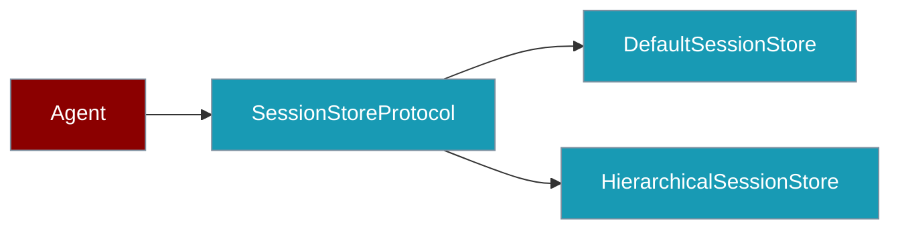

Session stores persist chat history and metadata — swap the default JSON backend or use hierarchical forks without changing your agent code.



## Quick Start


<Steps>
<Step title="Quick Start">
```python
from praisonaiagents import Agent
from praisonaiagents.session import get_default_session_store

store = get_default_session_store()
session_id = "user-42-chat"

agent = Agent(
    name="Assistant",
    memory={"session_id": session_id},
)
agent.start("Remember I like tea.")

store.add_message(session_id, "assistant", agent.start("What do I like?"))
```

Default files live at `~/.praisonai/sessions/{session_id}.json`.
</Step>
</Steps>


## Best Practices

<AccordionGroup>
  <Accordion title="Start simple">
    Enable the feature with a single parameter before adding configuration. Verify it works, then layer in options.
  </Accordion>
  <Accordion title="Use environment variables for secrets">
    Never hardcode API keys or tokens. Use `os.getenv("KEY_NAME")` to read from environment variables.
  </Accordion>
  <Accordion title="Test with minimal examples first">
    Copy the Quick Start example, run it, then extend it. This confirms your environment is set up correctly.
  </Accordion>
  <Accordion title="Check the logs">
    Set `verbose=True` on your agent to see detailed execution logs when debugging unexpected behavior.
  </Accordion>
</AccordionGroup>

## Related

<CardGroup cols={2}>
  <Card title="Features Overview" icon="grid-2" href="/docs/features">
    Browse all PraisonAI features
  </Card>
  <Card title="Quick Start" icon="rocket" href="/docs/introduction">
    Get started with PraisonAI agents
  </Card>
</CardGroup>
