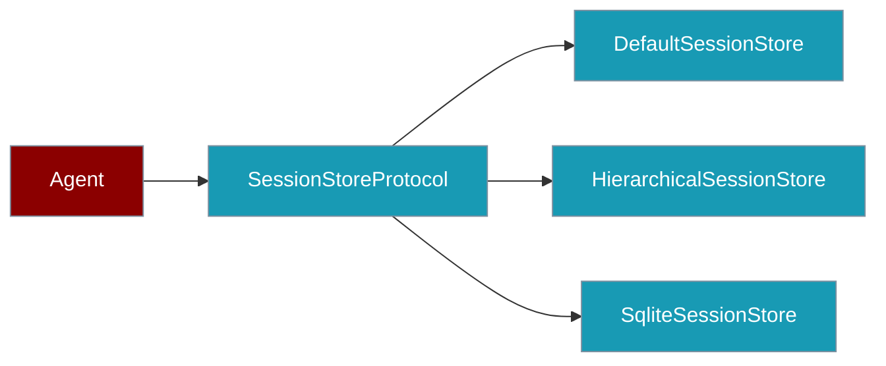
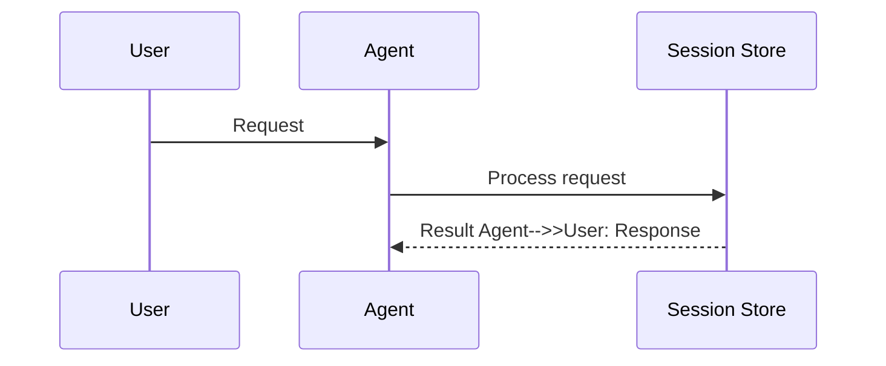
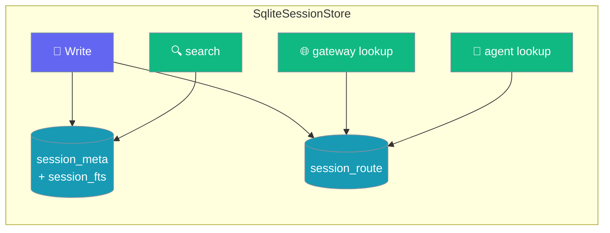

Session stores persist chat history and metadata — swap the default JSON backend or use hierarchical forks without changing your agent code.

```python
from praisonaiagents import Agent

agent = Agent(
    name="Assistant",
    memory={"session_id": "user-42-chat"},
)
agent.start("Remember I like tea.")
agent.start("What do I like?")  # History restored from ~/.praisonai/sessions/
```


The user chats across restarts; the session store persists history under `~/.praisonai/sessions/`.




## How It Works




## Quick Start

<Steps>
<Step title="Persist with session_id">

```python
from praisonaiagents import Agent

agent = Agent(
    name="Assistant",
    memory={"session_id": "user-42-chat"},
)
agent.start("Remember I like tea.")
agent.start("What do I like?")
```

Default files live at `~/.praisonai/sessions/{session_id}.json`.

</Step>

<Step title="Use the store directly">

```python
from praisonaiagents import Agent
from praisonaiagents.session import get_default_session_store

store = get_default_session_store()
session_id = "user-42-chat"

agent = Agent(name="Assistant", memory={"session_id": session_id})
store.add_message(session_id, "assistant", agent.start("Summarise our chat"))
```

</Step>
</Steps>

## Core Exports

| Export | Purpose |
|---|---|
| `DefaultSessionStore` | JSON-on-disk default backend |
| `SqliteSessionStore` | Indexed variant of the default store — stdlib `sqlite3` + FTS5 for scalable cross-session recall (Issue #2927). See [SqliteSessionStore](#sqlitesessionstore). |
| `SessionMessage`, `SessionData` | Typed message and session payloads |
| `CompactionCheckpoint` | Persisted compaction summary + resume anchor — see [Compaction Checkpoints](#compaction-checkpoints) |
| `get_default_session_store()` | Process-wide store accessor |
| `SessionStoreProtocol` | Implement for Redis, Postgres, S3 — see [Session Protocol](/features/session-protocol) |
| `HierarchicalSessionStore`, `get_hierarchical_session_store()` | Forks, snapshots, parent-child — see [Session Hierarchy](/features/session-hierarchy) |
| `IdentityResolverProtocol`, `FileIdentityResolver` | Map anonymous → known user IDs across sessions |
| `SessionContext`, `set_session_context()`, `get_session_context()` | Task-local session context for async flows |

## SqliteSessionStore

`SqliteSessionStore` is a drop-in subclass of `DefaultSessionStore` that keeps JSON transcripts as the durable record and maintains a stdlib `sqlite3` index alongside them. It gives you two indexed hot paths instead of directory scans:

- **Cross-session search** — FTS5 index of message content, used by `search()` (Issue #2927).
- **Gateway/agent routing** — `session_route` index of `gateway_session_id` and `agent_id`, used by `get_by_gateway_session()` and `list_sessions_by_gateway_agent()` (Issue #2956).

Both stay independent of the number of stored sessions, so a long-lived gateway bot with thousands of sessions still routes an inbound message in a single indexed lookup.

```python
from praisonaiagents import Agent
from praisonaiagents.session import SqliteSessionStore

store = SqliteSessionStore(db_path="~/.praisonai/sessions.db")
agent = Agent(name="Gateway", session_store=store)
```

```python
from praisonaiagents import Agent
from praisonaiagents.session import SqliteSessionStore

store = SqliteSessionStore(db_path="~/.praisonai/sessions.db")

# Long-lived gateway bot: inbound message arrives tagged with a gateway_session_id.
# Routing back to the right session is an indexed lookup, not a directory scan.
agent = Agent(name="Gateway", session_store=store)
agent.start("Handle inbound message", session_id="chat-42")

# Later — resolve the local session for an inbound gateway event:
session = store.get_by_gateway_session("gw-abc-123")
recent = store.list_sessions_by_gateway_agent("agent-support", limit=20)
```



### Constructor

| Parameter | Type | Default | Description |
|-----------|------|---------|-------------|
| `session_dir` | `Optional[str]` | `None` | Directory for session JSON files (as in `DefaultSessionStore`). |
| `db_path` | `Optional[str]` | `<session_dir>/sessions_index.db` | Path to the SQLite index file. Use `":memory:"` for an ephemeral in-process index. Supports `~` expansion. |
| `**kwargs` | — | — | Forwarded to `DefaultSessionStore(...)`. |

### Behaviour

| Aspect | Detail |
|--------|--------|
| Backend | Stdlib `sqlite3` (lazy-imported). Content index: FTS5 virtual table `session_fts(session_id UNINDEXED, content)` + `session_meta(session_id, updated_at)`. Routing index: `session_route(session_id PRIMARY KEY, gateway_session_id, agent_id)` with `idx_route_gateway` and `idx_route_agent`. |
| Search query | `SELECT session_id FROM session_fts WHERE session_fts MATCH ? ORDER BY bm25(session_fts) LIMIT ?` |
| Gateway lookup | `SELECT session_id FROM session_route WHERE gateway_session_id = ?` (overrides parent's O(N) directory scan) |
| Agent lookup | `SELECT session_id FROM session_route WHERE agent_id = ? LIMIT ?` (overrides parent's O(N) directory scan) |
| Fallback | If FTS5 is unavailable → plain `LIKE` table. If the routing query fails or `sqlite3` is unavailable → transparent fallback to `DefaultSessionStore.get_by_gateway_session` / `list_sessions_by_gateway_agent` scan. |
| Backfill | Legacy JSON transcripts are indexed once, on first `search()` **or** first routing lookup. A session is treated as indexed only if it appears in **both** `session_meta` **and** `session_route`, so stores upgraded from a prior release re-populate route rows on first read. |
| Write sync | `_save_session`, `add_message`, `_modify_session_locked` (covers `set_chat_history`, `set_gateway_info`, `append_compaction_checkpoint`), `clear_session`, and `delete_session` all keep both indexes in sync. Route rows are `INSERT OR REPLACE`d when either `gateway_session_id` or `agent_id` is set, and `DELETE`d when both are cleared. |
| Query rewrite | Free text is tokenised on alphanumerics into an `OR` of quoted terms for a safe FTS5 `MATCH` expression. |
| Candidate fan-out | Over-fetches `max(limit * 5, limit)` candidates so lineage dedup / automated demotion can still promote the right sessions into the final `limit`. |

### Fallback matrix

| Environment | Behaviour |
|-------------|-----------|
| `sqlite3` + FTS5 present (default) | Bounded FTS5 `MATCH` lookup for search, indexed `SELECT` on `session_route` for gateway/agent routing |
| `sqlite3` present, FTS5 unavailable | Bounded `LIKE` lookup for search; routing index still active |
| `sqlite3` unavailable or index open fails | Transparent fallback to `DefaultSessionStore.search` and `DefaultSessionStore.get_by_gateway_session` / `list_sessions_by_gateway_agent` full-directory scans |

### Sizing

- Each row in `session_fts` holds the flattened concatenation of a session's message content (newline-joined). Large transcripts increase index size roughly linearly.
- Use `":memory:"` for ephemeral tests; use the default disk path for gateway bots that need durability across restarts.

Bookends, automated demotion, and lineage dedup apply to results from both stores — see [Cross-Session Recall](/docs/features/cross-session-recall#anchored-demoted-deduped-results).

## Compaction Checkpoints

When context compaction runs during a conversation, the store can persist the summary so a later resume replays the compacted working history (summary + retained tail) instead of the full raw transcript. See [Compacted Session Resume](/docs/features/session-compaction-checkpoint) for the end-to-end agent flow.

```python
from praisonaiagents import CompactionCheckpoint
from praisonaiagents.session import DefaultSessionStore

store = DefaultSessionStore()
store.append_compaction_checkpoint("chat-42", "Earlier: we discussed X, Y, Z.")
history = store.get_working_history("chat-42")   # summary + tail
```

### Store Methods

| Method | Description |
|---|---|
| `append_compaction_checkpoint(session_id, summary, *, role="system", tokens_before=0, tokens_after=0, metadata=None)` | Persist a checkpoint anchored to the current end of the transcript. Returns `bool`; a blank/whitespace summary is a no-op returning `False`. |
| `get_working_history(session_id, max_messages=None)` | Canonical read path — uses the checkpoint when present (summary + tail), falls back to raw chat history when not. |

### SessionData additions

`SessionData.last_compaction` holds the latest `CompactionCheckpoint` (or `None`). Two helpers support cheap resume:

| Member | Description |
|---|---|
| `last_compaction` | `Optional[CompactionCheckpoint]` — the persisted checkpoint, serialised into the session JSON |
| `trim_messages(max_messages)` | Trim the transcript head, shifting the checkpoint anchor so the retained tail stays aligned |
| `get_working_history(max_messages=None)` | Reconstruct `[summary_message, *tail]`; falls back to `get_chat_history` with no checkpoint |

<Note>
`set_chat_history()` and `clear_session()` both clear `last_compaction` — replacing or clearing the transcript invalidates the anchor.
</Note>

## Task-Local Context

```python
from praisonaiagents.session import set_session_context, get_session_context

set_session_context(session_id="batch-job-1", user_id="operator")

ctx = get_session_context()
print(ctx.session_id)
```

## Best Practices

<AccordionGroup>
<Accordion title="Prefer session_id on Agent over manual store calls">
Let `Agent(memory={"session_id": "..."})` handle persistence — use the store directly only for admin, migration, or custom backends.
</Accordion>

<Accordion title="Use hierarchical store for forks and snapshots">
Switch to `get_hierarchical_session_store()` when you need branching conversations or revert — see [Session Hierarchy](/features/session-hierarchy).
</Accordion>

<Accordion title="Set task-local context in async workers">
Call `set_session_context()` at the start of each async task so downstream code reads the correct session without threading IDs through every call.
</Accordion>
</AccordionGroup>

## Related

<CardGroup cols={2}>
  <Card title="Session Persistence" icon="floppy-disk" href="/docs/features/session-persistence">
    Agent-centric session_id usage
  </Card>
  <Card title="Session Hierarchy" icon="sitemap" href="/docs/features/session-hierarchy">
    Forking and snapshots
  </Card>
  <Card title="Cross-Session Recall" icon="magnifying-glass-clock" href="/docs/features/cross-session-recall">
    Search past sessions — anchored, demoted, deduped results
  </Card>
</CardGroup>
