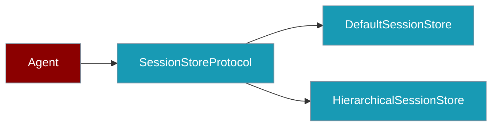

Session stores persist chat history and metadata — swap the default JSON backend or use hierarchical forks without changing your agent code.

```python
from praisonaiagents import Agent

agent = Agent(
    name="Assistant",
    memory={"session_id": "user-42-chat"},
)
agent.start("Remember I like tea.")
agent.start("What do I like?")  # History restored from ~/.praisonai/sessions/
```



## Quick Start

<Steps>
<Step title="Persist with session_id">

```python
from praisonaiagents import Agent

agent = Agent(
    name="Assistant",
    memory={"session_id": "user-42-chat"},
)
agent.start("Remember I like tea.")
agent.start("What do I like?")
```

Default files live at `~/.praisonai/sessions/{session_id}.json`.

</Step>

<Step title="Use the store directly">

```python
from praisonaiagents import Agent
from praisonaiagents.session import get_default_session_store

store = get_default_session_store()
session_id = "user-42-chat"

agent = Agent(name="Assistant", memory={"session_id": session_id})
store.add_message(session_id, "assistant", agent.start("Summarise our chat"))
```

</Step>
</Steps>

## Core Exports

| Export | Purpose |
|---|---|
| `DefaultSessionStore` | JSON-on-disk default backend |
| `SessionMessage`, `SessionData` | Typed message and session payloads |
| `get_default_session_store()` | Process-wide store accessor |
| `SessionStoreProtocol` | Implement for Redis, Postgres, S3 — see [Session Protocol](/features/session-protocol) |
| `HierarchicalSessionStore`, `get_hierarchical_session_store()` | Forks, snapshots, parent-child — see [Session Hierarchy](/features/session-hierarchy) |
| `IdentityResolverProtocol`, `FileIdentityResolver` | Map anonymous → known user IDs across sessions |
| `SessionContext`, `set_session_context()`, `get_session_context()` | Task-local session context for async flows |

## Task-Local Context

```python
from praisonaiagents.session import set_session_context, get_session_context

set_session_context(session_id="batch-job-1", user_id="operator")

ctx = get_session_context()
print(ctx.session_id)
```

## Best Practices

<AccordionGroup>
<Accordion title="Prefer session_id on Agent over manual store calls">
Let `Agent(memory={"session_id": "..."})` handle persistence — use the store directly only for admin, migration, or custom backends.
</Accordion>

<Accordion title="Use hierarchical store for forks and snapshots">
Switch to `get_hierarchical_session_store()` when you need branching conversations or revert — see [Session Hierarchy](/features/session-hierarchy).
</Accordion>

<Accordion title="Set task-local context in async workers">
Call `set_session_context()` at the start of each async task so downstream code reads the correct session without threading IDs through every call.
</Accordion>
</AccordionGroup>

## Related

<CardGroup cols={2}>
  <Card title="Session Persistence" icon="floppy-disk" href="/docs/features/session-persistence">
    Agent-centric session_id usage
  </Card>
  <Card title="Session Hierarchy" icon="sitemap" href="/docs/features/session-hierarchy">
    Forking and snapshots
  </Card>
</CardGroup>
