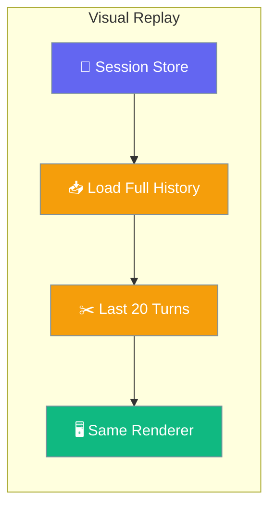
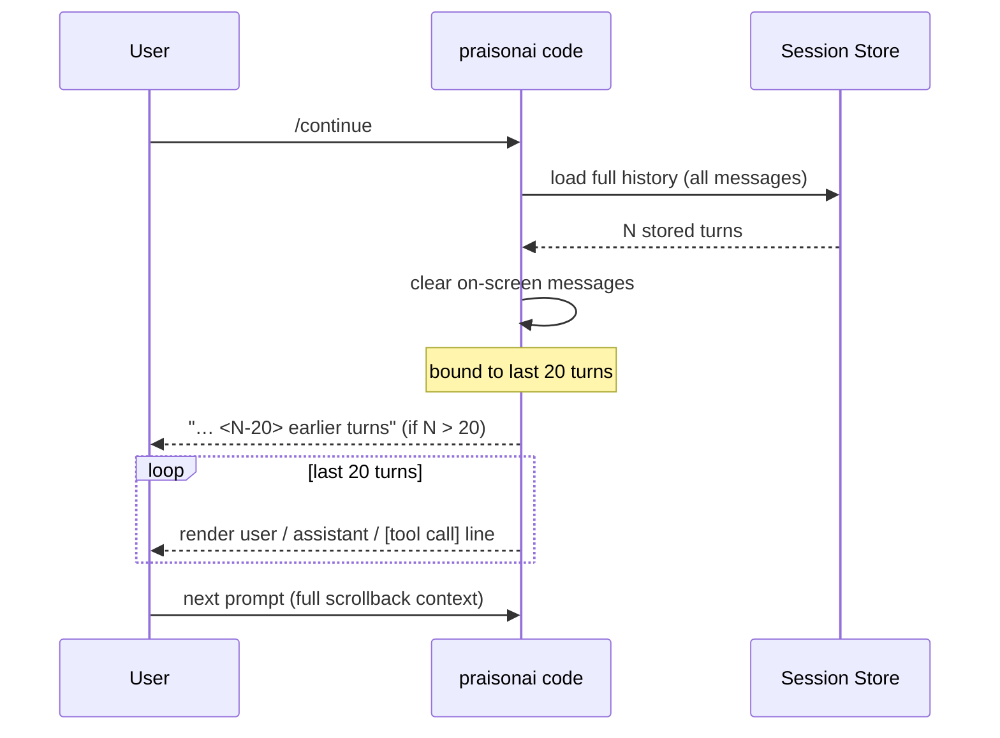

Resuming a `praisonai code` session with `/continue` redraws your prior conversation through the same renderer live turns use, so scrollback shows what was actually said — bounded to the last 20 turns.



## Quick Start

<Steps>
<Step title="Start a session">
Run `praisonai code` and have a conversation — every turn is saved to disk.

```bash
praisonai code

> Help me refactor auth.py to use JWT
● Sure — here's the plan: …
> Run the tests
● 3 failing, all in test_login.py …
```
</Step>

<Step title="Resume it later">
From the same project directory, run `praisonai code` again and type `/continue`. Your earlier turns redraw on screen.

```bash
praisonai code
> /continue

# Terminal shows:
#   Continued session: 019... (14 messages)
#   … 12 earlier turns
#   [user]       Help me refactor auth.py to use JWT
#   [assistant]  Sure — here's the plan: …
#   [system]     [tool call] run_tests
#   [user]       Run the tests
#   [assistant]  3 failing, all in test_login.py …
#   (ready for your next prompt)
```
</Step>
</Steps>

---

## How It Works

`/continue` loads the full stored history, clears the on-screen messages, then re-draws the last 20 turns as real chat messages.



| Behaviour | What happens |
|:--|:--|
| Turn window | Last **20** turns by default; earlier turns collapse to `… <N> earlier turns` |
| Tool calls | Empty-content assistant messages render as `[tool call] <fn names>` |
| Tool results | `role="tool"` messages render as `[system] <content>` |
| Empty messages | Skipped — no blank lines in scrollback |
| Repeated `/continue` | Message list is cleared first — no duplicate or stale on-screen turns |
| Fallback renderer | Works even without `prompt_toolkit`: user → `›`, assistant → `●`, system → `  ` |

---

## Non-Interactive Resume

`praisonai code session resume` renders the same bounded replay without entering interactive mode.

```bash
praisonai code session resume 019abc...

# Renders "--- Restored Conversation ---",
# then the same bounded 20-turn replay with tool-call surfaces.
```

<Note>
Without `--transcript`, `session resume` shows the last 20 turns with the earlier-turns note and tool-call surfaces — the same view you get from interactive `/continue`.
</Note>

---

## Best Practices

<AccordionGroup>
<Accordion title="Older turns are still in play">
Only the last 20 turns render on `/continue`. The earlier ones aren't lost — they're still in the store and still influence the next model turn — you just don't have to scroll through days of history.
</Accordion>

<Accordion title="Repeated /continue won't duplicate">
Running `/continue` again (or after some live activity) doesn't duplicate what's on screen — the display is cleared and re-drawn from the store each time.
</Accordion>

<Accordion title="You see what the agent did, not just what it said">
Assistant messages that only ran tools show as `[tool call] <name>`; tool results show as system lines. You can see what the agent did between your prompts, not just what it said.
</Accordion>

<Accordion title="Works without prompt_toolkit">
The fallback renderer replays user and assistant turns too — user lines as `›`, assistant lines as `●`, system lines as indented text — so resume stays readable in a minimal terminal.
</Accordion>
</AccordionGroup>

---

## Related

<CardGroup cols={2}>
<Card title="Session Resume" icon="rotate" href="/persistence/session-resume">
What gets restored when you resume a session
</Card>
<Card title="Interactive Runtime" icon="terminal" href="/cli/interactive-runtime">
The runtime powering interactive `praisonai code` modes
</Card>
</CardGroup>
