Sessions enable agents to remember conversations across restarts and connect to remote agents.

## Quick Start with Agent

The simplest way to use sessions is with the `Agent` class:

```python
from praisonaiagents import Agent

# Create agent with session persistence
agent = Agent(
    name="Assistant",
    instructions="You are a helpful assistant",
    memory={"session_id": "my-session-123"}
)

# First conversation
agent.start("My name is Alice")

# Later, in a new process - history restored automatically!
agent = Agent(
    name="Assistant",
    instructions="You are a helpful assistant",
    memory={"session_id": "my-session-123"}
)
agent.start("What's my name?")  # Remembers: "Alice"
```



```mermaid
graph LR
    User([👤 User]) --> Agent[🤖 Agent]
    Agent --> Memory{memory=}
    Memory -->|session_id| Store[📁 Session Store]
    Store --> Resume([🔄 Resume Later])
    
    classDef user fill:#8B0000,stroke:#7C90A0,color:#fff
    classDef agent fill:#189AB4,stroke:#7C90A0,color:#fff
    classDef store fill:#2E8B57,stroke:#7C90A0,color:#fff
    
    class User,Resume user
    class Agent,Memory agent
    class Store store
```

## Using the Session Class

For advanced control over memory and knowledge, use the `Session` class:

<CodeGroup>
```python Creating Sessions
from praisonaiagents import Session

# Create a session
session = Session(
    session_id="chat_123",
    user_id="user_456"
)

# Create agent within session context
agent = session.Agent(
    name="Assistant",
    instructions="You are a helpful assistant"
)
```

```python Conversation Continuity
# First conversation
response1 = agent.start("My name is John")

# Later conversation (remembers context)
response2 = agent.start("What's my name?")
# Agent responds: "Your name is John"
```

```python State Persistence
# Save custom state
session.save_state({"topic": "Python", "level": "beginner"})

# Later, restore state
state = session.restore_state()
print(state["topic"])  # "Python"
```
</CodeGroup>

### Memory Integration

Sessions can maintain memory across conversations:

```python
# Session with memory configuration
session = Session(
    session_id="chat_123",
    user_id="user_456",
    memory=True  # Enable memory with defaults
)

# Add memories directly
session.add_memory("User prefers technical explanations")

# Search memories
memories = session.search_memory("preferences")

# Agent automatically uses session memory
agent = session.Agent(name="Assistant", memory=True)
```

### Knowledge Integration

Attach knowledge bases to sessions:

```python
# Session with knowledge
session = Session(
    session_id="research_session",
    user_id="researcher_1",
    knowledge={
        "vector_store": {
            "provider": "chroma",
            "config": {"collection_name": "research_docs"}
        }
    }
)

# Add knowledge to session
session.add_knowledge("research_paper.pdf")
session.add_knowledge("Important finding: AI improves efficiency by 40%")

# Search knowledge
results = session.search_knowledge("efficiency improvements")

# Agents use session knowledge
agent = session.Agent(
    name="Research Assistant",
    knowledge=True
)
```

## Remote Agents

### Connecting to Remote Agents

<Note>
Remote agents follow the Google ADK (Agent Development Kit) pattern for standardised communication.
</Note>

<CodeGroup>
```python Basic Connection
from praisonaiagents import Session

# Connect to remote agent
session = Session(
    agent_url="http://192.168.1.10:8000/agent"
)
```

```python Send Messages
# Send message to remote agent
response = session.chat("Hello remote agent!")

# Response includes full context
print(response['content'])
print(response['metadata'])
```

```python Error Handling
try:
    response = session.chat("Process this data")
except TimeoutError:
    print("Remote agent timeout")
except ConnectionError:
    print("Could not connect to remote agent")
```
</CodeGroup>

### Remote Agent Server

Create an agent server for remote access:

```python
# remote_agent_server.py
from flask import Flask, request, jsonify
from praisonaiagents import Agent

app = Flask(__name__)

# Create your agent
agent = Agent(
    name="Remote Assistant",
    instructions="You are a helpful remote assistant.",
    tools=[...],  # Your tools
    memory=True
)

@app.route('/agent', methods=['POST'])
def handle_message():
    data = request.json
    message = data.get('message', '')
    session_id = data.get('session_id')
    
    # Process message
    response = agent.chat(message, session_id=session_id)
    
    return jsonify({
        'content': response,
        'session_id': session_id,
        'metadata': {
            'agent_name': agent.name,
            'timestamp': datetime.now().isoformat()
        }
    })

if __name__ == '__main__':
    app.run(host='0.0.0.0', port=8000)
```

## Session Configuration

### Local Session Options

```python
session = Session(
    # Required
    session_id="unique_session_id",
    
    # Optional
    user_id="user_identifier",
    
    # Memory configuration (use memory= consolidated param)
    memory=True,  # Enable memory with defaults
    
    # Knowledge configuration
    knowledge={
        "vector_store": {
            "provider": "chroma",
            "config": {
                "collection_name": "session_knowledge",
                "path": ".sessions/knowledge"
            }
        }
    }
)
```

### Remote Session Options

```python
session = Session(
    # Remote agent URL
    agent_url="https://api.example.com/agent",
    
    # Optional timeout (default: 30 seconds)
    timeout=60,
    
    # Optional headers for authentication
    headers={
        "Authorization": "Bearer token",
        "X-API-Key": "api_key"
    }
)
```

## State Management

### Saving Session State

```python
# Save current state
session.save_state()

# State includes:
# - Session metadata
# - Memory contents
# - Knowledge references
# - Agent configurations
```

### Restoring Session State

```python
# Create new session instance
session = Session(session_id="chat_123")

# Restore previous state
session.restore_state()

# Continue where you left off
agent = session.Agent(name="Assistant")
response = agent.chat("What were we discussing?")
```

### State Persistence Location

By default, session state is saved to:

* `.sessions/{session_id}/state.json` - Session metadata
* `.sessions/{session_id}/memory/` - Memory databases
* `.sessions/{session_id}/knowledge/` - Knowledge databases

## Advanced Features

### Session Context

Access session context programmatically:

```python
# Get session context
context = session.get_context()
print(f"Session ID: {context['session_id']}")
print(f"User ID: {context['user_id']}")
print(f"Created: {context['created_at']}")
print(f"Messages: {context['message_count']}")
```

### Multi-Agent Sessions

Use multiple agents within a session:

```python
session = Session(session_id="team_session")

# Create multiple agents in session
researcher = session.Agent(
    name="Researcher",
    instructions="You research topics"
)

writer = session.Agent(
    name="Writer", 
    instructions="You write content"
)

# Agents share session memory and knowledge
research = researcher.chat("Research AI trends")
article = writer.chat("Write an article about the research")
```

### Session Middleware

Add custom middleware to sessions:

```python
def logging_middleware(message, response):
    print(f"[{datetime.now()}] Message: {message}")
    print(f"[{datetime.now()}] Response: {response[:100]}...")
    return response

session = Session(
    session_id="logged_session",
    middleware=[logging_middleware]
)
```

## Use Cases

<CardGroup cols={2}>
  <Card icon="headset" title="Customer Support">
    Maintain conversation history across support interactions
    ```python
    session = Session(
        session_id=f"support_{ticket_id}",
        user_id=customer_id
    )
    ```
  </Card>
  <Card icon="user-robot" title="Personal Assistants">
    Remember user preferences and past interactions
    ```python
    session = Session(
        session_id=f"assistant_{user_id}",
        memory={"provider": "rag"}
    )
    ```
  </Card>
  <Card icon="users" title="Collaborative Work">
    Share context between team members
    ```python
    session = Session(
        session_id=f"project_{project_id}",
        knowledge={...}
    )
    ```
  </Card>
  <Card icon="cloud" title="Distributed Systems">
    Deploy agents across multiple servers
    ```python
    session = Session(
        agent_url="https://agent.region.example.com"
    )
    ```
  </Card>
</CardGroup>

## Complete Example

<CodeGroup>
```python Stateful Local Assistant
from praisonaiagents import Session, Task, AgentTeam

# Create or restore session
session = Session(
    session_id="personal_assistant",
    user_id="john_doe",
    memory={
        "provider": "rag",
        "use_embedding": True
    },
    knowledge={
        "vector_store": {
            "provider": "chroma",
            "config": {"collection_name": "personal_docs"}
        }
    }
)

# Try to restore previous state
try:
    session.restore_state()
    print("Restored previous session")
except:
    print("Starting new session")

# Create session agent
assistant = session.Agent(
    name="Personal Assistant",
    instructions="""You are a personal assistant that remembers everything.
    Use your memory and knowledge to provide personalised help.""",
    memory=True,
    knowledge=True
)

# Add some knowledge
session.add_knowledge("calendar.pdf")
session.add_memory("User prefers morning meetings")

# Have a conversation
response = assistant.chat("Schedule a meeting for tomorrow")
print(response)

# Save state for next time
session.save_state()
```

```python Remote Agent Client
from praisonaiagents import Session
import asyncio

# Connect to remote agents
async def connect_to_agents():
    # Connect to different remote agents
    research_session = Session(
        agent_url="http://research-server:8000/agent"
    )
    
    analysis_session = Session(
        agent_url="http://analysis-server:8000/agent"
    )
    
    # Send tasks in parallel
    research_task = research_session.chat_async("Research market trends")
    analysis_task = analysis_session.chat_async("Analyse competitor data")
    
    # Wait for results
    research_result = await research_task
    analysis_result = await analysis_task
    
    return research_result, analysis_result

# Run the distributed system
results = asyncio.run(connect_to_agents())
```
</CodeGroup>

## Best Practices

<CardGroup cols={2}>
  <Card icon="id-card" title="Session Management">
    - Use meaningful session IDs
    - Clean up old sessions periodically
    - Implement session expiry policies
  </Card>
  <Card icon="save" title="State Handling">
    - Save state after important interactions
    - Implement regular auto-save
    - Handle restore failures gracefully
  </Card>
  <Card icon="shield-check" title="Remote Connections">
    - Implement proper error handling
    - Use timeouts for remote calls
    - Add retry logic for failures
  </Card>
  <Card icon="lock" title="Security">
    - Validate session IDs
    - Implement authentication for remote agents
    - Encrypt sensitive session data
  </Card>
</CardGroup>

## Next Steps

<CardGroup cols={2}>
  <Card icon="brain" href="/features/advanced-memory">
    Deep dive into memory capabilities
  </Card>
  <Card icon="cloud" href="/deploy/deploy">
    Deploy agents for remote access
  </Card>
</CardGroup>