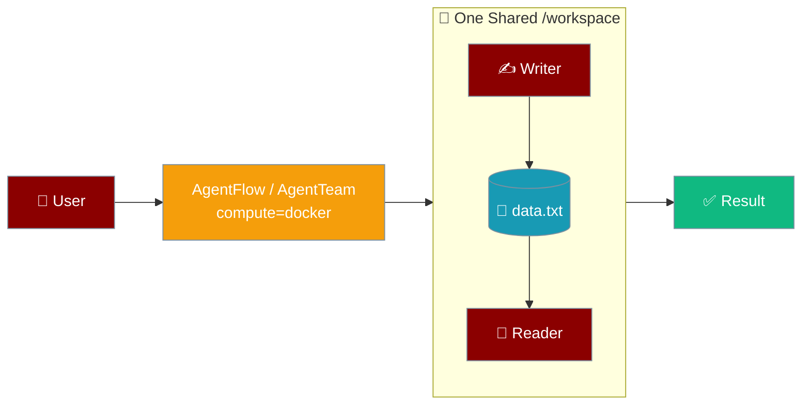
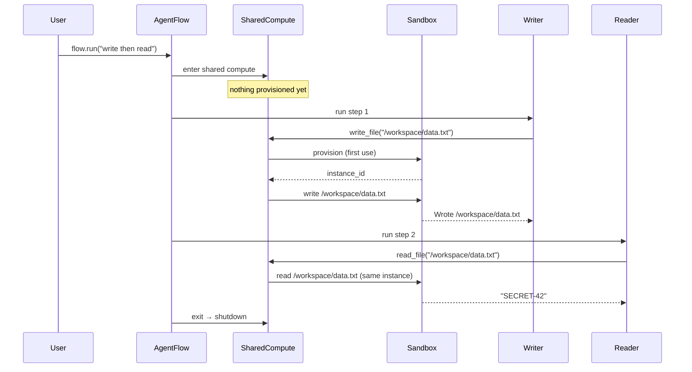

Give every agent in a team or workflow one shared `/workspace` so a file written by step 1 is visible to step 2.



Without a shared sandbox, each agent provisions its own isolated instance, so agents cannot hand files to each other. Set `compute=` once on the flow or team and every agent shares the same filesystem.

## Quick Start

<Steps>
<Step title="Simplest Usage (AgentFlow)">
Set `compute="docker"` on the flow — every step runs its shell and file tools in one sandbox.

```python
from praisonaiagents import Agent, AgentFlow

writer = Agent(name="Writer", instructions="Write files")
reader = Agent(name="Reader", instructions="Read files")

flow = AgentFlow(compute="docker", steps=[writer, reader])
flow.run("Step 1: write 'SECRET-42' to /workspace/data.txt. Step 2: read it back.")
```
</Step>

<Step title="AgentTeam">
The same `compute=` kwarg works on a team.

```python
from praisonaiagents import Agent, Task, AgentTeam

writer = Agent(name="Writer", instructions="Write files")
reader = Agent(name="Reader", instructions="Read files")

team = AgentTeam(
    agents=[writer, reader],
    tasks=[
        Task(description="Write 'SECRET-42' to /workspace/data.txt", agent=writer),
        Task(description="Read /workspace/data.txt and report it", agent=reader),
    ],
    compute="docker",
)
team.start()
```
</Step>

<Step title="Pick a Provider">
Pass a provider name. To customise the image, packages, CPU, or memory, drive `SharedCompute` directly (see the [custom image or resources](#custom-image-or-resources) pattern).

<Tabs>
<Tab title="docker">
```python
flow = AgentFlow(compute="docker", steps=[writer, reader])
```
</Tab>
<Tab title="e2b">
```python
flow = AgentFlow(compute="e2b", steps=[writer, reader])
```
</Tab>
<Tab title="modal">
```python
flow = AgentFlow(compute="modal", steps=[writer, reader])
```
</Tab>
<Tab title="daytona">
```python
flow = AgentFlow(compute="daytona", steps=[writer, reader])
```
</Tab>
<Tab title="flyio">
```python
flow = AgentFlow(compute="flyio", steps=[writer, reader])
```
</Tab>
<Tab title="tenki">
```python
flow = AgentFlow(compute="tenki", steps=[writer, reader])
```
</Tab>
<Tab title="local">
```python
flow = AgentFlow(compute="local", steps=[writer, reader])
```
</Tab>
</Tabs>
</Step>
</Steps>

---

## How It Works

The sandbox is provisioned lazily on first tool use and torn down when the run ends.



| Behaviour | What actually happens |
|:--|:--|
| Lazy | Nothing is provisioned until the first tool call. A run that never touches the sandbox costs nothing. |
| Single instance | Concurrent first-use calls from parallel branches share one sandbox, not several — provisioning is guarded by a lock with double-checked locking. |
| Safe file writes | Any content is written verbatim, including bodies that contain heredoc-terminator-looking text — every `write_file` uses a fresh randomised delimiter, so file content can never terminate the write early or leak into the shell. |
| Shared filesystem | Every attached agent's `/workspace` is the same directory in the same instance. |
| Guaranteed teardown | The instance is released on exit even if a step raises. Agents are restored to their original tools and backstory. |
| Backend-owning agents skipped | Agents that already carry their own `backend=` are left alone. |
| Same-name tool replacement | Local `execute_command` / `read_file` / `write_file` / `list_files` are replaced; unrelated tools are kept. |
| Empty result guard | A silent-but-successful command returns `"(command succeeded with no output)"` so the loop guard never reports no progress. |

---

## Configuration Options

Set `compute=` on `AgentFlow` (or its `Workflow` / `Pipeline` aliases) or on `AgentTeam`. Orchestration (`route`, `parallel`, `repeat`, `when`) stays local — only shell and file tools follow the sandbox.

| Value | Meaning |
|:--|:--|
| `None` (default) | No shared sandbox. Existing per-agent behaviour is unchanged. |
| `"local"` | Run inside a local subprocess (no isolation). Useful for tests. |
| `"docker"` | Local Docker container. Requires Docker running. |
| `"e2b"` | E2B cloud sandbox. Requires `E2B_API_KEY` and `pip install praisonai[e2b]`. |
| `"modal"` | Modal cloud compute. Requires `MODAL_TOKEN` and `pip install praisonai[modal]`. |
| `"daytona"` | Daytona workspace. Requires `pip install praisonai[daytona]`. |
| `"flyio"` | Fly.io machine. |
| `"tenki"` | Tenki Cloud microVM. Requires `TENKI_API_KEY`. |
| Provider instance | Any object implementing `ComputeProviderProtocol` (`provision`, `execute`, `shutdown`). Swaps the provider implementation. |

Any other string raises `ValueError`.

<Note>
Passing a name or a provider instance to `compute=` uses `SharedCompute`'s defaults: `working_dir="/workspace"`, `auto_shutdown=True`, `idle_timeout_s=300`, and each provider's default image (`python:3.12-slim` for Docker). To set a custom image, packages, CPU, or memory, drive `SharedCompute` directly with a `ComputeConfig` — see [Custom image or resources](#custom-image-or-resources).
</Note>

| Path | What you can change |
|:--|:--|
| `AgentFlow(compute="docker")` (name) | Provider only. Uses the defaults above. |
| `AgentFlow(compute=DockerCompute())` (instance) | Swaps the provider implementation; `ComputeConfig` still comes from the defaults above. |
| `SharedCompute(provider, config=ComputeConfig(...))` + `attach([...])` | Full `ComputeConfig` control (image, packages, cpu, memory_mb, env, working_dir). |

<CardGroup cols={2}>
<Card title="AgentFlow API Reference" icon="code" href="/concepts/agentflow">
  The workflow orchestrator that accepts `compute=`.
</Card>
<Card title="Managed Agents (Docker)" icon="docker" href="/concepts/managed-agents-docker">
  Docker daemon setup and provider details.
</Card>
<Card title="Managed Agents (E2B)" icon="cloud" href="/concepts/managed-agents-e2b">
  E2B cloud sandbox and `E2B_API_KEY` setup.
</Card>
<Card title="Managed Agents (Tenki)" icon="server" href="/features/managed-agents-tenki">
  Tenki microVM and `TENKI_API_KEY` setup.
</Card>
</CardGroup>

---

## Common Patterns

Hand a file between two agents — step 1 writes, step 2 reads the same `/workspace`.

```python
from praisonaiagents import Agent, AgentFlow

writer = Agent(name="Writer", instructions="Write files")
reader = Agent(name="Reader", instructions="Read files")

flow = AgentFlow(compute="docker", steps=[writer, reader])
flow.run("Step 1: write /workspace/data.txt. Step 2: read it back.")
```

Run one shared sandbox across a parallel fan-out — three branches, one sandbox.

```python
from praisonaiagents import Agent, AgentFlow, parallel

a = Agent(name="A", instructions="Work on /workspace")
b = Agent(name="B", instructions="Work on /workspace")
c = Agent(name="C", instructions="Work on /workspace")

flow = AgentFlow(compute="docker", steps=[parallel([a, b, c])])
flow.run("Each branch appends a line to /workspace/log.txt")
```

Agents inside nested containers — `route`, `repeat`, `when`, `loop`, `if` — all bind to the same sandbox automatically.

```python
from praisonaiagents import Agent, AgentFlow, parallel, repeat, when

writer = Agent(name="Writer", instructions="Write to /workspace")
reader = Agent(name="Reader", instructions="Read from /workspace")

flow = AgentFlow(
    compute="docker",
    steps=[
        writer,
        parallel([writer, reader]),
        when("{{ready}}", [reader], [writer]),
        repeat(reader, until=lambda ctx: ctx.get("done")),
    ],
)
flow.run("Coordinate writer and reader through /workspace")
```

Each agent is attached exactly once, even if it appears in multiple containers.

### Custom image or resources

To pick a custom image, packages, CPU, or memory, drive `SharedCompute` directly with a `ComputeConfig` and attach the agents yourself.

```python
from praisonaiagents import Agent
from praisonaiagents.managed import ComputeConfig
from praisonaiagents.managed.shared_compute import SharedCompute
from praisonai.integrations.compute import DockerCompute

writer = Agent(name="Writer", instructions="Write files")
reader = Agent(name="Reader", instructions="Read files")

provider = DockerCompute()
config = ComputeConfig(
    image="python:3.12-slim",
    packages={"pip": ["pandas"]},
    cpu=2,
    memory_mb=4096,
    working_dir="/workspace",
)

with SharedCompute(provider, config=config) as shared:
    shared.attach([writer, reader])
    writer.start("Write /workspace/data.csv")
    reader.start("Read /workspace/data.csv and describe it")
```

---

## Best Practices

<AccordionGroup>
<Accordion title="Use compute= on the flow or team when agents share files">
Per-agent compute (`LocalAgent(compute=...)`) gives each agent its own isolated instance, so files written by one agent are invisible to the next. Set `compute=` on `AgentFlow` or `AgentTeam` when agents need the same `/workspace`.
</Accordion>

<Accordion title="Leave compute=None unless you need shared execution">
The default is zero-overhead — nothing is provisioned. Only set `compute=` when a run actually shares files or shell state across agents.
</Accordion>

<Accordion title="Give the sandbox enough resources for the biggest step">
All steps share the same instance. Size the image, CPU, and memory for the heaviest step, since it affects the whole run.
</Accordion>

<Accordion title="Don't mix compute= with agents that carry their own backend=">
Backend-owning agents are deliberately skipped by the shared sandbox — they keep pointing at their own runtime. Use one approach or the other per agent.
</Accordion>

<Accordion title="Write any content with write_file — no escaping needed">
Every call to `write_file` uses a fresh random heredoc delimiter, so file bodies containing quotes, heredoc terminators, or shell fragments are written verbatim and never leak into the shell. You do not need to escape, quote, or sanitise `content` yourself.
</Accordion>
</AccordionGroup>

---

## Related

<CardGroup cols={2}>
<Card title="Local Agent" icon="desktop" href="/features/local-agent">
  Per-agent compute — one agent's tools in a sandbox.
</Card>
<Card title="Sandboxed Agent" icon="box" href="/features/sandboxed-agent">
  Per-agent compute — isolate a single agent's tools.
</Card>
<Card title="AgentFlow" icon="diagram-project" href="/concepts/agentflow">
  The workflow orchestrator.
</Card>
<Card title="AgentTeam" icon="users" href="/concepts/agentteam">
  The team orchestrator.
</Card>
</CardGroup>
