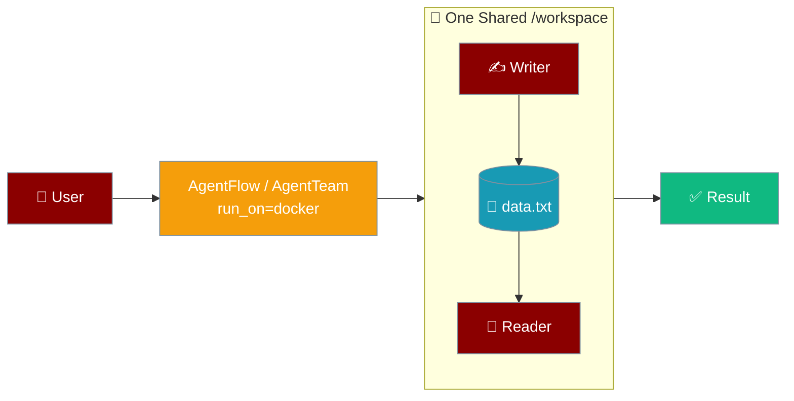
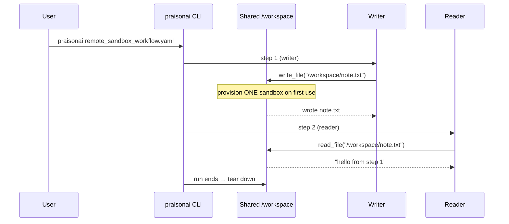
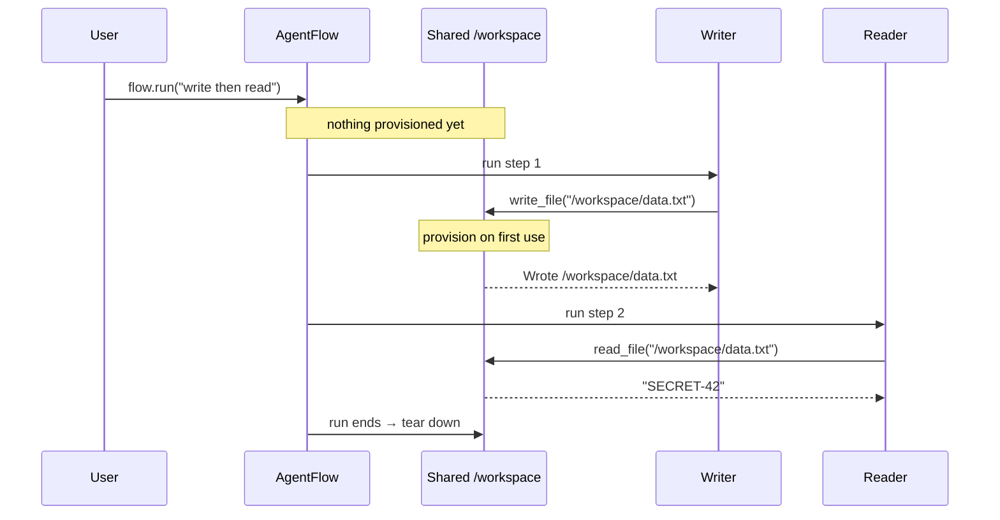
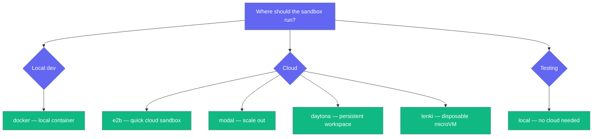

Set `run_on=` (Python) or `run_on:` (YAML) once on a flow, team, or workflow and every agent shares one remote sandbox, so a file written by one step is visible to the next.

```python
from praisonaiagents import Agent, AgentFlow

writer = Agent(name="writer", instructions="Write 'SECRET-42' to /workspace/data.txt")
reader = Agent(name="reader", instructions="Read /workspace/data.txt and print the contents")

flow = AgentFlow(run_on="docker", steps=[writer, reader])
flow.run("Step 1: write. Step 2: read it back.")
```

<Tip>
Confirm the topology of a flow before you run it — `print(repr(flow))` names both places. See [Where Your Agent Runs](/features/where-does-it-run).
</Tip>



Without a shared sandbox, each agent provisions its own isolated instance, so agents cannot hand files to each other. `run_on=` gives them all the same `/workspace`.

## Quick Start

<Steps>
<Step title="Share one sandbox across a workflow">
Set `run_on` once — every step runs its shell and file tools in one sandbox. Python uses `run_on=`; no-code YAML uses the same `run_on:` key.

<Tabs>
<Tab title="Python">
```python
from praisonaiagents import Agent, AgentFlow

writer = Agent(name="writer", instructions="Write 'SECRET-42' to /workspace/data.txt")
reader = Agent(name="reader", instructions="Read /workspace/data.txt and print the contents")

flow = AgentFlow(run_on="docker", steps=[writer, reader])
flow.run("Step 1: write. Step 2: read it back.")
```
</Tab>
<Tab title="YAML">
```yaml
name: remote-sandbox-demo
run_on: docker            # every step shares one sandbox

agents:
  writer:
    role: File Writer
    goal: Write files into the shared workspace
  reader:
    role: File Reader
    goal: Read files back from the shared workspace

steps:
  - agent: writer
    action: "Write 'hello from step 1' to /workspace/note.txt"
  - agent: reader
    action: "Read /workspace/note.txt and report its exact contents"
```

Run it:

```bash
praisonai examples/yaml/workflows/remote_sandbox_workflow.yaml
```
</Tab>
</Tabs>
</Step>

<Step title="Share one sandbox across a team">
The same `run_on=` kwarg works on a team.

```python
from praisonaiagents import Agent, Task, AgentTeam

writer = Agent(name="writer", instructions="Write 'SECRET-42' to /workspace/data.txt")
reader = Agent(name="reader", instructions="Read /workspace/data.txt and print the contents")

write_task = Task(description="Write 'SECRET-42' to /workspace/data.txt", agent=writer)
read_task = Task(description="Read /workspace/data.txt and report it", agent=reader)

team = AgentTeam(
    agents=[writer, reader],
    tasks=[write_task, read_task],
    run_on="docker",
)
team.start()
```
</Step>

<Step title="From workflow YAML — no Python">
Add one line — `run_on: docker` — to any workflow YAML and every step shares the same sandbox. The rest of the file is a normal workflow.

```yaml
name: remote-sandbox-demo
run_on: docker            # every step shares ONE sandbox

agents:
  writer:
    role: File Writer
    goal: Write files into the shared workspace
    instructions: >
      You have write_file and execute_command running on a remote Linux
      sandbox. Use them; never say you cannot run commands.

  reader:
    role: File Reader
    goal: Read files back out of the shared workspace
    instructions: >
      You have read_file and execute_command running on the same remote
      sandbox the writer used. Use them.

steps:
  - agent: writer
    action: "Use write_file to put exactly 'hello from step 1' in /workspace/note.txt"

  - agent: reader
    action: "Use read_file on /workspace/note.txt and report its exact contents"
```

Run it with the standard CLI — no Python needed:

```bash
praisonai examples/yaml/workflows/remote_sandbox_workflow.yaml
```



The accepted values are identical to the Python API — `docker | e2b | modal | daytona | flyio | tenki | local`, or omit `run_on:` entirely for the default local behaviour (see the [Configuration Options](#configuration-options) table below). Action-only steps like `- agent: X; action: "..."` share the same sandbox as regular steps, so the writer/reader pattern above works exactly as shown.

<Tip>
A typo fails **when the file loads**, before any container starts, with the list of valid names — you are never surprised mid-run:

```
ValueError: Unknown run_on provider 'dokcer'. Available: docker, e2b, modal, daytona, flyio, tenki, local
```

The value is case- and whitespace-insensitive — `RUN_ON: DOCKER` and `run_on: "  docker  "` both normalise to `docker`. Omitting `run_on:` leaves every existing workflow YAML behaving exactly as before — nothing is provisioned.
</Tip>
</Step>

<Step title="Pick a provider">
Pass any provider name, or a pre-configured provider instance to customise the image and resources. The provider name is identical for Python and YAML.

<Tabs>
<Tab title="Python">
<Tabs>
<Tab title="docker">
```python
flow = AgentFlow(run_on="docker", steps=[writer, reader])
```
</Tab>
<Tab title="e2b">
```python
flow = AgentFlow(run_on="e2b", steps=[writer, reader])
```
</Tab>
<Tab title="modal">
```python
flow = AgentFlow(run_on="modal", steps=[writer, reader])
```
</Tab>
<Tab title="daytona">
```python
flow = AgentFlow(run_on="daytona", steps=[writer, reader])
```
</Tab>
<Tab title="flyio">
```python
flow = AgentFlow(run_on="flyio", steps=[writer, reader])
```
</Tab>
<Tab title="tenki">
```python
flow = AgentFlow(run_on="tenki", steps=[writer, reader])
```
</Tab>
<Tab title="local">
```python
flow = AgentFlow(run_on="local", steps=[writer, reader])
```
</Tab>
</Tabs>
</Tab>
<Tab title="YAML">
<Tabs>
<Tab title="docker">
```yaml
run_on: docker
```
</Tab>
<Tab title="e2b">
```yaml
run_on: e2b
```
</Tab>
<Tab title="modal">
```yaml
run_on: modal
```
</Tab>
<Tab title="daytona">
```yaml
run_on: daytona
```
</Tab>
<Tab title="flyio">
```yaml
run_on: flyio
```
</Tab>
<Tab title="tenki">
```yaml
run_on: tenki
```
</Tab>
<Tab title="local">
```yaml
run_on: local
```
</Tab>
</Tabs>
</Tab>
</Tabs>
</Step>
</Steps>

---

## How It Works

One sandbox is provisioned lazily on first tool use and torn down when the run ends, even if a step raises.



| Behaviour | What actually happens |
|:--|:--|
| One sandbox per run | `run_on=` provisions a single sandbox for the whole run and binds every agent's shell and file tools to it. |
| Shared `/workspace` | Files a writer step drops there are visible to a later reader step — they run in the same container. |
| Orchestration stays local | Routing, parallel, and repeat run on this machine; only shell and file tools follow the sandbox. |
| Opt-in and lazy | No `run_on=` means nothing changes, and nothing is provisioned until a tool actually runs. |
| Guaranteed teardown | The sandbox is released on exit even if a step raises. |
| Backend-owning agents skipped | Agents that already carry their own `backend=` are left alone — they stay pointed at their own runtime. |

<Tip>
**Action-only steps join the sandbox too.** A step with `action:` but no matching `agent:` builds a temporary agent during the run — that temp agent shares the same sandbox, so no shell or file tool escapes to the host.
</Tip>

---

## Load-time Validation

A typo in `run_on:` fails **when the YAML loads**, not halfway through a paid run.

The provider name is checked against the registry at parse time. An unknown provider raises with the full list of valid names:

```
ValueError: Unknown run_on provider 'dokcer'.
Available: daytona, docker, e2b, flyio, local, modal, tenki
```

A non-string value raises immediately too:

```
ValueError: 'run_on' must be a provider name string, got int
```

The value is case- and whitespace-insensitive — `DOCKER` and `"  docker  "` both normalise to `docker`.

---

## Configuration Options

`run_on=` accepts a provider name or a pre-configured provider instance. The accepted values are identical for Python (`run_on="docker"`) and YAML (`run_on: docker`).

| Value | Meaning |
|:--|:--|
| `None` (default) | No shared sandbox. Existing per-agent behaviour is unchanged. |
| `"local"` | Run inside a local subprocess (no isolation). Useful for testing without cloud. |
| `"docker"` | Local Docker container. Requires Docker running. |
| `"e2b"` | E2B cloud sandbox. Requires `E2B_API_KEY`. |
| `"modal"` | Modal cloud compute. Requires `MODAL_TOKEN`. |
| `"daytona"` | Daytona workspace. |
| `"flyio"` | Fly.io machine. |
| `"tenki"` | Tenki Cloud microVM. Requires `TENKI_API_KEY`. |
| Provider instance | Any object implementing `ComputeProviderProtocol`. Pass this to customise image, packages, CPU, or memory. |

### Which param goes where

The shared-sandbox knob is `run_on=` on the flow, the team, or the top-level YAML key. Individual agents that need their own remote sandbox use `compute=`.

| Parameter | Level | Effect |
|:--|:--|:--|
| `AgentFlow(run_on=...)` / `AgentTeam(run_on=...)` | Team / workflow | ONE shared sandbox for every agent in the run. |
| `run_on:` (YAML top-level key) | Workflow | Same key — one shared sandbox for every step in `agents.yaml` / `workflow.yaml`. |
| `LocalAgent(compute=...)` | Per-agent | That single agent runs its tools on the named provider. |

<Note>
`run_on=` shares one sandbox across a whole flow or team. A single `LocalAgent` uses `compute=` for its own remote provider. See [Placement](/features/placement) for how these fit together.
</Note>

---

## Common Patterns

Hand a file between two agents — step 1 writes, step 2 reads the same `/workspace`.

```python
from praisonaiagents import Agent, AgentFlow

writer = Agent(name="writer", instructions="Write files to /workspace")
reader = Agent(name="reader", instructions="Read files from /workspace")

flow = AgentFlow(run_on="docker", steps=[writer, reader])
flow.run("Step 1: write /workspace/data.txt. Step 2: read it back.")
```

Share one sandbox across a team where one agent's output file is another agent's input.

```python
from praisonaiagents import Agent, Task, AgentTeam

writer = Agent(name="writer", instructions="Write files to /workspace")
reader = Agent(name="reader", instructions="Read files from /workspace")

team = AgentTeam(
    agents=[writer, reader],
    tasks=[
        Task(description="Write /workspace/report.md", agent=writer),
        Task(description="Read /workspace/report.md and summarise it", agent=reader),
    ],
    run_on="docker",
)
team.start()
```

---

## Choosing a Provider

Pick the provider that matches where you want the sandbox to live.



| Scenario | Provider |
|:--|:--|
| Local development | `"docker"` |
| Quick cloud sandbox | `"e2b"` |
| Scale out | `"modal"` |
| Persistent workspace | `"daytona"` |
| Disposable microVM | `"tenki"` |
| Testing without cloud | `"local"` |

---

## Best Practices

<AccordionGroup>
<Accordion title="Use run_on= when agents share files">
Per-agent `compute=` gives each agent its own isolated instance, so files written by one agent are invisible to the next. Set `run_on=` on the flow or team when agents need the same `/workspace`.
</Accordion>

<Accordion title="Leave run_on unset unless you need shared execution">
The default is zero-overhead — nothing is provisioned. Only set `run_on=` when a run actually shares files or shell state across agents.
</Accordion>

<Accordion title="Size the sandbox for the heaviest step">
All steps share one instance. Pass a configured provider instance to size the image, CPU, and memory for the biggest step, since it affects the whole run.
</Accordion>

<Accordion title="Don't mix run_on= with agents that carry their own backend=">
Agents that already carry their own `backend=` are deliberately skipped — they keep pointing at their own runtime. Use one approach or the other per agent.
</Accordion>
</AccordionGroup>

---

## Related

<CardGroup cols={2}>
<Card title="YAML Workflows" icon="file-code" href="/features/yaml-workflows">
  Full no-code workflow reference — including the top-level `run_on:` key.
</Card>
<Card title="Managed Agents" icon="cloud" href="/concepts/managed-agents">
  Per-agent managed execution and providers.
</Card>
<Card title="Managed CLI" icon="terminal" href="/features/managed-cli">
  Use `managed ps` / `stop` to find and reclaim stray sandboxes.
</Card>
<Card title="Managed Agents (Docker)" icon="docker" href="/concepts/managed-agents-docker">
  Docker daemon setup and provider details.
</Card>
<Card title="Managed Agents (E2B)" icon="cloud-bolt" href="/concepts/managed-agents-e2b">
  E2B cloud sandbox and `E2B_API_KEY` setup.
</Card>
<Card title="Managed Agents (Modal)" icon="server" href="/concepts/managed-agents-modal">
  Modal cloud compute setup.
</Card>
<Card title="Tenki Cloud" icon="cloud" href="/features/managed-agents-tenki">
  Tenki microVM and `TENKI_API_KEY` setup.
</Card>
</CardGroup>
