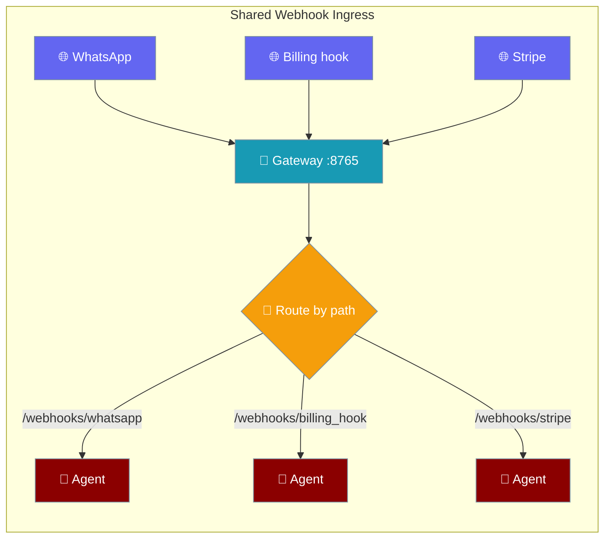
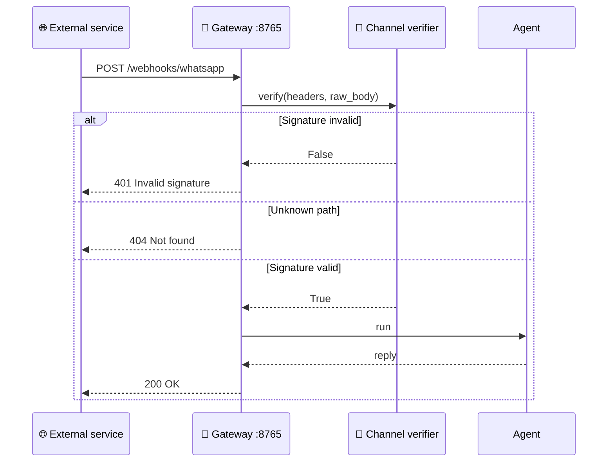
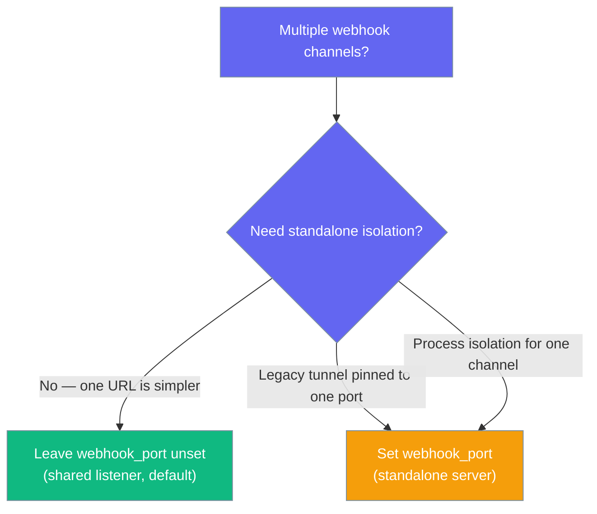

Every `mode: webhook` channel is served through the gateway's single listener at `/webhooks/<channel>` — one port, one public URL, routed by path.



## Quick Start

<Steps>
<Step title="Declare webhook channels — no port on any">

Leave `webhook_port` unset and every `mode: webhook` channel shares `gateway.port`.

```yaml
# gateway.yaml
gateway:
  port: 8765                  # the only public endpoint

channels:
  whatsapp:
    platform: whatsapp
    mode: webhook             # served at /webhooks/whatsapp
  billing_hook:
    platform: webhook
    mode: webhook             # served at /webhooks/billing_hook
```

```bash
praisonai gateway start --config gateway.yaml
```

</Step>

<Step title="Opt out — pin one channel to its own port">

Set `webhook_port` on a channel to restore a standalone server for just that channel.

```yaml
# gateway.yaml
channels:
  legacy_hook:
    platform: webhook
    mode: webhook
    webhook_port: 9090        # standalone server on :9090 (opt-out)
```

</Step>
</Steps>

---

## How It Works

An external service POSTs to `/webhooks/<channel>`; the gateway verifies the signature per-channel, then dispatches to the agent.



Each channel keeps its own verifier — a bad signature on one channel returns `401` without touching the others. An unknown path returns `404` with no cross-channel fallthrough. Hot-reloading a channel re-mounts `/webhooks/<channel>` automatically; removing a channel clears its mount — no process restart.

### When do I set `webhook_port`?



---

## Configuration Options

`webhook_port` selects shared vs. standalone mode on any `mode: webhook` channel.

| Option | Type | Default | Description |
|--------|------|---------|-------------|
| `webhook_port` | `Optional[int]` | `None` | `None` → served through the gateway's shared listener at `/webhooks/<channel>`. An `int` → binds a private standalone server (opt-out, backward-compatible) |

---

## Common Patterns

### Multi-provider on one URL

Point GitHub, Stripe, and a generic billing hook at one public URL — the path picks the channel.

```yaml
# gateway.yaml
gateway:
  port: 8765

channels:
  github:
    platform: webhook
    mode: webhook             # /webhooks/github
  stripe:
    platform: webhook
    mode: webhook             # /webhooks/stripe
  billing_hook:
    platform: webhook
    mode: webhook             # /webhooks/billing_hook
```

Provider dashboards get `https://bots.example.com/webhooks/github`, `.../webhooks/stripe`, `.../webhooks/billing_hook`.

### Reverse-proxy termination for one HTTPS URL

Terminate TLS at your proxy and forward one path prefix to the gateway.

```nginx
# nginx
location /webhooks/ {
    proxy_pass http://127.0.0.1:8765;
}
```

### Explicit-port opt-out for a legacy tunnel

A tunnel already pinned to a fixed port keeps working — set `webhook_port` on that one channel.

```yaml
# gateway.yaml
channels:
  legacy_hook:
    platform: webhook
    mode: webhook
    webhook_port: 8080        # standalone server for a pinned tunnel
```

---

## Best Practices

<AccordionGroup>
<Accordion title="Prefer the shared listener">
One public URL is simpler to secure, monitor, and put behind a reverse proxy. Leave `webhook_port` unset unless you have a specific reason not to.
</Accordion>

<Accordion title="Set an HMAC secret per channel">
The gateway delegates verification to each channel's own verifier, fail-closed — a bad signature returns `401`. Give every webhook channel its own `verify.hmac.secret`.
</Accordion>

<Accordion title="Don't set webhook_port unless you need isolation">
An explicit port opts a channel out of the shared listener and back onto a standalone server. Use it only for a legacy tunnel pinned to one port, or when one channel needs process isolation.
</Accordion>

<Accordion title="Rely on automatic re-mount after hot-reload">
After a hot-reload, `/webhooks/<channel>` re-mounts automatically and a removed channel's mount is cleared — no restart required.
</Accordion>
</AccordionGroup>

---

## Related

<CardGroup cols={2}>
<Card title="Webhook Channel" icon="webhook" href="/features/webhook-channel">
  Route any HTTP webhook to an agent with a YAML route
</Card>
<Card title="Webhook Verification" icon="shield-check" href="/features/webhook-verification">
  The HMAC signature primitive each channel verifies fail-closed
</Card>
<Card title="Gateway Overview" icon="tower-broadcast" href="/features/gateway-overview">
  Gateway architecture and the single listener
</Card>
<Card title="Gateway Inbound Hooks" icon="bolt" href="/features/gateway-inbound-hooks">
  `/hooks/<path>` generic triggers — the ad-hoc counterpart to `/webhooks/<channel>`
</Card>
</CardGroup>
