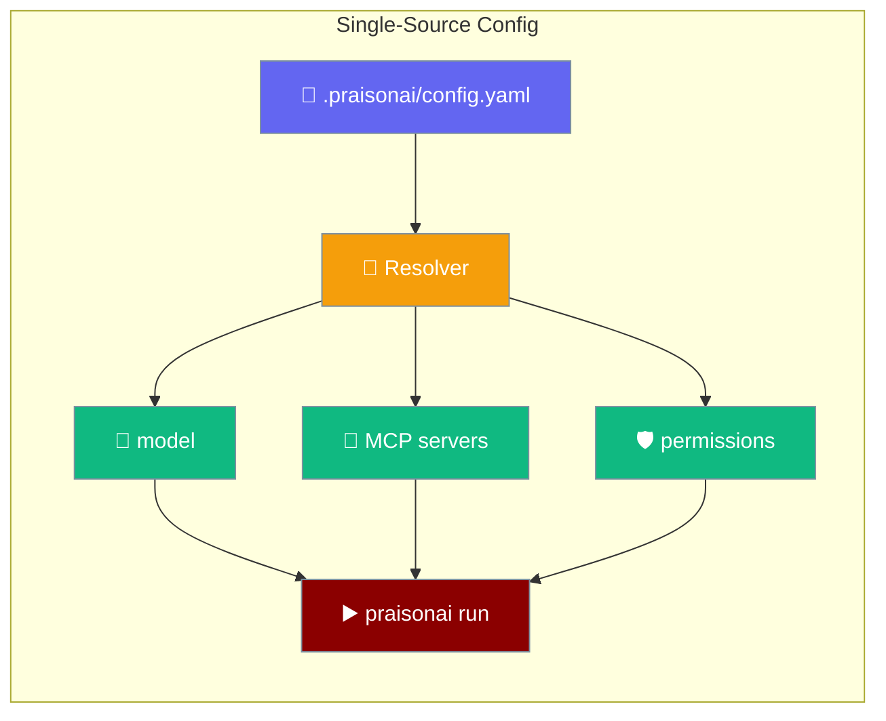
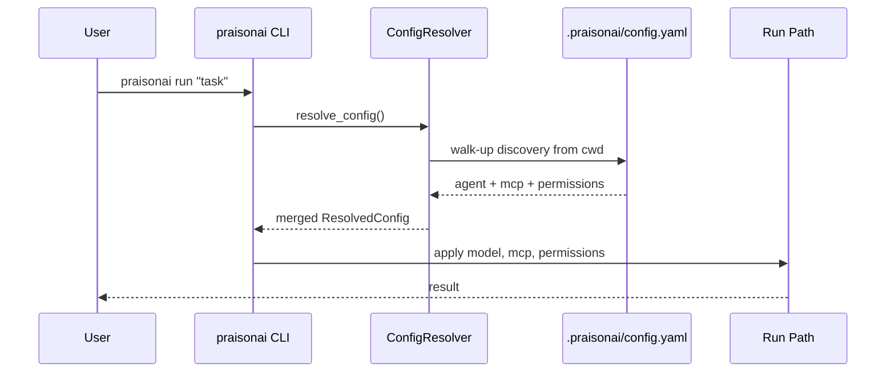
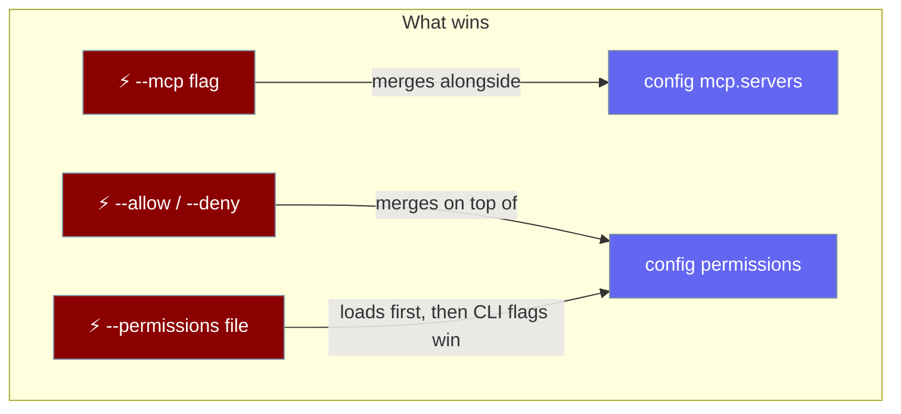

```python
from praisonaiagents import Agent

agent = Agent(name="config-agent", instructions="Load all settings from a single config file.")
agent.start("Use praison.toml as the single source of truth for all settings.")
```


One `.praisonai/config.yaml` wires your project's full agent runtime — model, MCP servers, permissions — for every `praisonai run` in the directory.

```bash
praisonai run "Open the docs site and screenshot the home page"
```


The user keeps settings in `.praisonai/config.yaml`; every `praisonai run` in the project loads that single source.




## Quick Start

<Steps>
<Step title="Drop a config file">

Create `.praisonai/config.yaml` in your project root:

```yaml
# .praisonai/config.yaml
agent:
  model: gpt-4o

mcp:
  servers:
    playwright:
      command: ["npx", "-y", "@playwright/mcp"]

permissions:
  default: ask
  rules:
    - { pattern: "bash:git *", action: allow }
    - { pattern: "bash:rm *",  action: deny }
```

</Step>

<Step title="Run anywhere in the project">

```bash
praisonai run "Open the docs site and screenshot the home page"
```

Model, MCP server, and permission rules are picked up automatically — no flags needed.

</Step>

<Step title="Verify resolution">

```bash
praisonai config show --sources
```

Shows which layers contributed (defaults, global, project, env, CLI).

</Step>
</Steps>

---

## How It Works



The resolver deep-merges five layers (highest wins):

| Layer | Source | Precedence |
|-------|--------|------------|
| 1 | Built-in defaults | Lowest |
| 2 | `~/.praisonai/config.yaml` (global) | |
| 3 | `.praisonai/config.yaml` (project, walk-up) | |
| 4 | Environment variables | |
| 5 | CLI flags | Highest |

CLI flags always win. Config fills the gaps.

---

## Configuration Schema

### `mcp.servers.<name>`

| Key | Type | Default | Description |
|-----|------|---------|-------------|
| `command` | `list[str]` or `str` | — | Local (stdio) server launch command. List form preferred. Required for local servers; ignored for remote. |
| `args` | `list[str]` | `[]` | Extra args appended to `command`. Local servers only. |
| `env` | `dict[str, str]` | `{}` | Env vars for the server process. Local servers only. |
| `enabled` | `bool` | `true` | Set `false` to declare-but-not-wire a server. |
| `type` | `"remote"` | — | Marks a remote server. Optional — a non-empty `url` also implies remote. |
| `url` | `str` | — | Remote endpoint (HTTP-stream, SSE, or WebSocket). Presence implies remote. |
| `headers` | `dict[str, str]` | `{}` | HTTP headers for remote servers. **Ignored** for legacy SSE URLs ending in `/sse` (a warning is printed). |
| `timeout` | `int` (milliseconds) | `30000` | Per-server connect timeout. Converted to seconds before being passed to the SDK `MCP(...)`. |

<Note>
`praisonai run` wires **every enabled server** under `mcp.servers.*` — multiple local (stdio) servers and remote (`url:` / `type: remote`) servers are all aggregated and exposed to the agent. Servers with `enabled: false` are skipped silently. If `--mcp "<command>"` is also given on the command line, its tools are **added on top of** the config servers, not in place of them.
</Note>

### `permissions`

Two equivalent forms:

**Structured (rule list):**

```yaml
permissions:
  default: ask
  rules:
    - { pattern: "bash:git *", action: allow }
    - { pattern: "bash:rm *",  action: deny }
```

**Flat mapping:**

```yaml
permissions:
  "read:*": allow
  "bash:rm *": deny
  "*": ask
```

| Key | Type | Default | Description |
|-----|------|---------|-------------|
| `default` | `"allow"` \| `"deny"` \| `"ask"` | — | Fallback action when no rule matches. Equivalent to `"*": <default>` in flat form. |
| `rules` | `list[{pattern, action}]` | `[]` | Structured rule list. `action` must be `allow`, `deny`, or `ask`. Invalid actions are silently dropped. |
| `<pattern>` | `"allow"` \| `"deny"` \| `"ask"` | — | Flat shorthand. Can be combined with `rules` and `default`. |

---

## Precedence



- `--mcp`, if present, **merges** with config-declared servers — CLI ad-hoc tools are added alongside every enabled config server.
- `--allow` / `--deny` / `--permissions` are merged **on top of** config rules — CLI wins per-pattern.
- `--permission-default` sets the fallback action, overriding `permissions.default` from config.

---

## Common Patterns

### Pin a model + a single MCP server

```yaml
# .praisonai/config.yaml
agent:
  model: gpt-4o-mini

mcp:
  servers:
    filesystem:
      command: ["npx", "-y", "@modelcontextprotocol/server-filesystem", "."]
```

```bash
praisonai run "List all Python files in the project"
```

### CI-safe defaults

```yaml
# .praisonai/config.yaml
agent:
  model: gpt-4o

permissions:
  default: deny
  rules:
    - { pattern: "read:*",    action: allow }
    - { pattern: "bash:git *", action: allow }
```

All tool calls are denied unless explicitly allowed — safe for unattended CI runs.

### Mix with CLI flags

Config gives the base; flags override per-run:

```bash
# Override MCP server for this run only
praisonai run "Scrape the homepage" --mcp "npx -y @playwright/mcp"

# Add an extra allow rule on top of config
praisonai run "Deploy" --allow 'bash:kubectl *'
```

### Declare-but-not-wire a server

```yaml
mcp:
  servers:
    experimental:
      command: ["node", "my-mcp-server.js"]
      enabled: false   # declared but not activated
```

---

## Best Practices

<AccordionGroup>
<Accordion title="Commit .praisonai/config.yaml for team alignment">
Checked-in config ensures every teammate and CI runner uses the same model, MCP servers, and permission defaults automatically.
</Accordion>

<Accordion title="Keep secrets out of env in config">
`mcp.servers.<x>.env` is fine for non-secret config values (paths, flags). For API tokens, use shell environment variables — they are read by the server process at runtime without being stored in YAML.
</Accordion>

<Accordion title="Use praisonai config show --sources to debug">
When behaviour is unexpected, `praisonai config show --sources` prints exactly which layer won for each key.
</Accordion>

<Accordion title="Prefer the structured rules form when ordering matters">
The `rules:` list is evaluated in order; `priority` fields are respected. The flat mapping form is convenient for simple deny lists but gives no ordering guarantees.
</Accordion>
</AccordionGroup>

---

## Related

<CardGroup cols={2}>
<Card title="CLI Configuration" icon="gear" href="/docs/features/cli-configuration">
  Full cascade reference for the praisonai CLI config layers
</Card>
<Card title="Declarative Permissions" icon="shield-halved" href="/docs/features/declarative-permissions">
  All surfaces for pre-declaring allow/deny rules
</Card>
<Card title="MCP Transports" icon="plug" href="/docs/mcp/mcp-remote">
  Remote MCP server configuration
</Card>
<Card title="Config CLI Reference" icon="terminal" href="/docs/cli/config">
  `praisonai config` subcommand reference
</Card>
</CardGroup>
