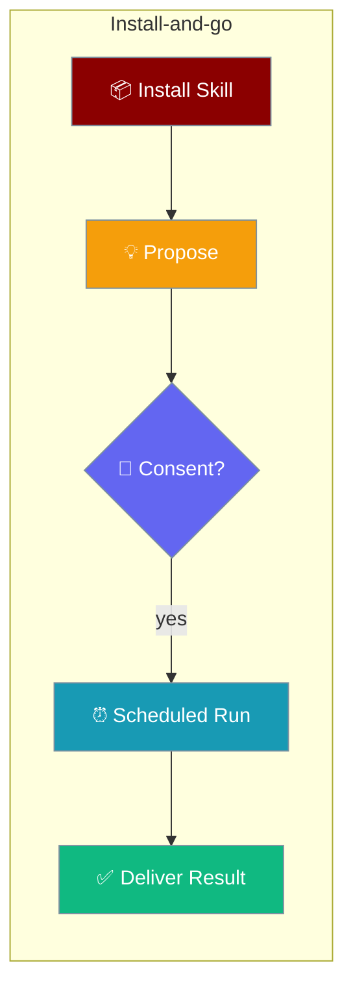
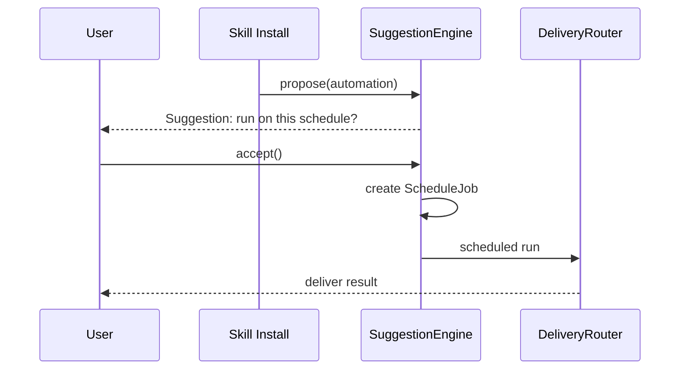
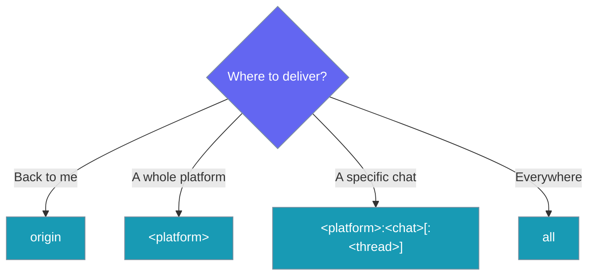

Skills can declare an optional schedule so an installed skill runs itself on that schedule and delivers the result where you want it.



A skill carrying an automation block loads like any other skill, then offers to schedule itself the moment you install it.

```python
from praisonaiagents import Agent

agent = Agent(
    name="Personal Assistant",
    instructions="You help with daily briefings",
    skills=["./morning-brief"]
)

agent.start("Set up my daily brief")
```

The `morning-brief` skill declares a schedule, so on install you are asked whether to run it every weekday and where to deliver the result.

<Note>
This is a **parse-only frontmatter contract**. Declaring an automation block does not create a schedule or run anything by itself — a skill is **never auto-scheduled**. Materialisation happens consent-first through the wrapper's existing `SuggestionEngine` and `DeliveryRouter`.
</Note>

## Quick Start

<Steps>
<Step title="Minimal — schedule only">
The only required field is `schedule`. Add it under the namespaced `metadata.praisonai.automation` block:

```yaml
---
name: morning-brief
description: Summarise my day.
metadata:
  praisonai:
    automation:
      schedule: "daily"
---

Summarise my calendar, unread priorities, and any blockers.
```
</Step>

<Step title="Full — schedule, deliver, and prompt">
Add a delivery target and a prompt to describe what each scheduled run should do:

```yaml
---
name: morning-brief
description: Summarise my day.
metadata:
  praisonai:
    automation:
      schedule: "cron:0 8 * * mon-fri"
      deliver: "origin"
      prompt: "Give me today's brief."
---

Summarise my calendar, unread priorities, and any blockers.
```
</Step>

<Step title="Install and consent">
Installing a skill with an automation block proposes a schedule you accept or decline:

```
$ praisonai skills add git+https://example.com/morning-brief-skill
✓ installed skill 'morning-brief'
Suggestion: run 'morning-brief' every weekday 08:00, deliver to origin?  [y/N]
> y
✓ scheduled (delivered via the existing DeliveryRouter; consent-first via SuggestionEngine)
```
</Step>
</Steps>

---

## How It Works

Installing a skill proposes the automation; you consent, and only then is a job created and delivered.



| Stage | What happens |
|-------|--------------|
| Install | The skill's `automation` block is parsed onto `SkillProperties.automation`. |
| Propose | `SuggestionEngine` surfaces a consent-first suggestion — never auto-scheduled. |
| Accept | On consent, a schedule job is materialised. |
| Deliver | `DeliveryRouter` runs the job and delivers the result with idempotency + rate limiting. |

---

## The Automation Block

Three fields live under `metadata.praisonai.automation` — one required, two optional.

| Field | Type | Default | Description |
|-------|------|---------|-------------|
| `schedule` | `str` | *(required)* | When to run, e.g. `"cron:0 8 * * mon-fri"`, `"daily"`, `"*/30m"`, `"at:<iso>"`. A missing, empty, or non-string value means no automation is parsed. |
| `deliver` | `str` | `None` | Where to send the result: `"origin"`, `"<platform>"`, `"<platform>:<chat>[:<thread>]"`, or `"all"`. |
| `prompt` | `str` | `None` | The task each scheduled run should perform. |

<Note>
`metadata.praisonai.automation` is the **only** parsed location. The `praisonai` namespace means older parsers ignore the block — a skill without it parses to `automation=None`, fully backward compatible.
</Note>

---

## Choosing a Delivery Target

Pick a `deliver` value based on where the result should land.



| Value | Delivers to |
|-------|-------------|
| `origin` | The chat where the skill was installed — best for personal skills. |
| `<platform>` | A named platform, e.g. `telegram`. |
| `<platform>:<chat>[:<thread>]` | A specific chat, and optionally a thread, e.g. `telegram:12345`. |
| `all` | Every connected delivery target. |

---

## Schedule Expressions

The `schedule` string accepts four forms.

| Form | Example | Runs |
|------|---------|------|
| `cron:<expr>` | `cron:0 8 * * mon-fri` | Weekdays at 08:00 (cron precision). |
| `daily` | `daily` | Once per day. |
| `*/<n>m` | `*/30m` | Every 30 minutes. |
| `at:<iso>` | `at:2026-01-01T09:00:00` | Once, at an ISO timestamp. |

---

## Reading the Parsed Value

Read `SkillProperties.automation` after parsing a skill to introspect its schedule.

```python
from praisonaiagents.skills.parser import read_properties

props = read_properties("./morning-brief")
if props.automation:
    print(props.automation.schedule)   # "cron:0 8 * * mon-fri"
    print(props.automation.deliver)    # "origin"
    print(props.automation.prompt)     # "Give me today's brief."
```

`automation` is `None` when the skill declares no block, so guard access with a truthiness check.

---

## Installing a Skill With Automation

A skill with an automation block is **never** scheduled silently.

On install, `SuggestionEngine` proposes the schedule and delivery target. You accept or decline; only on acceptance is a job created and later delivered by `DeliveryRouter`. Decline, and the skill still works — it simply carries an unused schedule.

---

## Backward Compatibility

Skills without an automation block work exactly as before — `automation` parses to `None` and older PraisonAI installs silently ignore the field.

---

## Best Practices

<AccordionGroup>
<Accordion title="Prefer origin for personal skills">
Use `deliver: "origin"` so results return to the chat where you installed the skill. It needs no chat IDs and travels with the skill unchanged.
</Accordion>

<Accordion title="Keep the prompt short">
The schedule is the trigger, not the whole task. Put durable instructions in the SKILL.md body and keep `prompt` to a one-line nudge like `"Give me today's brief."`.
</Accordion>

<Accordion title="Use cron: for precise timing">
Reach for `cron:` when you need weekday-only runs or a specific hour, e.g. `cron:0 8 * * mon-fri`. Use `daily` or `*/30m` for simpler cadences.
</Accordion>

<Accordion title="Ship the automation block with the skill">
Include the block in the shared SKILL.md so recipients install-and-go — they accept the suggestion once instead of hand-authoring a schedule.
</Accordion>
</AccordionGroup>

---

## Related

<CardGroup cols={2}>
  <Card title="Agent Skills" icon="puzzle-piece" href="/features/skills">
    Give agents modular capabilities through SKILL.md files.
  </Card>
  <Card title="Bot Commands" icon="terminal" href="/features/bot-commands">
    Accept automation suggestions and manage schedules from chat with `/automations`.
  </Card>
</CardGroup>
