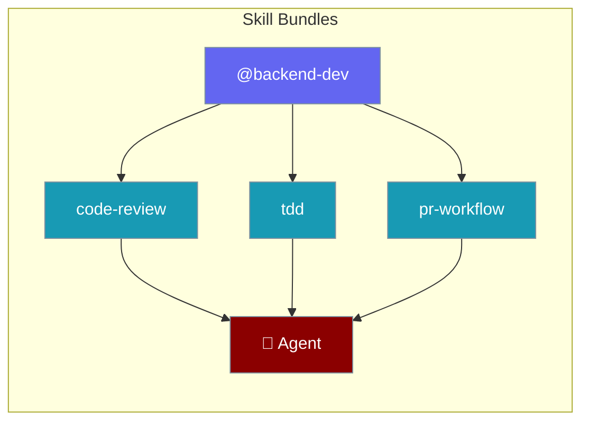
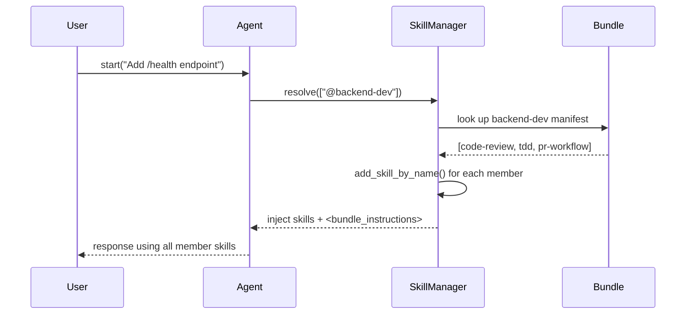
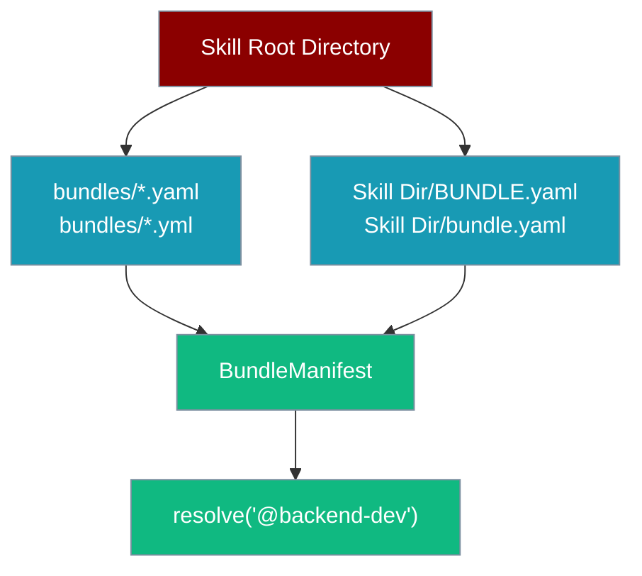

A **skill bundle** is a named set of skills you select all at once with a single `@bundle` marker — `skills=["@backend-dev"]` expands to every member skill automatically.



## Quick Start

<Steps>
<Step title="Create a bundle YAML">
Create a `bundles/` directory inside any skill root and add a YAML file:

```yaml
# ./skills/bundles/backend-dev.yaml
name: backend-dev
description: Backend feature work.
skills: [code-review, tdd, pr-workflow]
instruction: Prefer small, reviewable commits.
```
</Step>

<Step title="Reference it from an Agent">
Use the `@` prefix to select the whole bundle in one entry:

```python
from praisonaiagents import Agent

agent = Agent(
    name="Backend Engineer",
    instructions="Help with backend feature work.",
    skills=["@backend-dev"],
)

agent.start("Add a /health endpoint and tests.")
```
</Step>
</Steps>

---

## How It Works



The `@` prefix is the only opt-in marker. Everything else — loading, context injection, token budgets — works exactly as with regular skills. No new execution path, no new dependencies.

---

## Bundle Manifest Format

<Tabs>
  <Tab title="Centralised (recommended)">
    Place bundles in a `bundles/` subdirectory of any skill root:

    ```yaml
    # ./skills/bundles/backend-dev.yaml
    name: backend-dev
    description: Backend feature work.
    skills: [code-review, tdd, pr-workflow]
    instruction: Prefer small, reviewable commits.
    ```

    All agents sharing the same skill root can reference `@backend-dev`.
  </Tab>
  <Tab title="Co-located">
    Place a `BUNDLE.yaml` directly inside a skill directory:

    ```yaml
    # ./skills/backend-dev/BUNDLE.yaml
    name: backend-dev
    description: Backend feature work.
    skills: [code-review, tdd, pr-workflow]
    ```

    Useful when the bundle is tightly coupled to one existing skill directory.
  </Tab>
</Tabs>

### Manifest Fields

| Field | Type | Required | Description |
|-------|------|----------|-------------|
| `name` | `str` | ✅ Yes | Bundle name in kebab-case. Missing `name` skips the manifest with a warning. |
| `skills` | `list[str]` | ✅ Yes | Member skill names. Also accepted as `members:` synonym, or as a comma/space-separated string. |
| `description` | `str` | No | Human-readable summary, shown in `bundle list` output. |
| `instruction` | `str` | No | Surfaced in the agent's prompt as `<bundle_instructions>` when the bundle is selected. |

---

## Discovery Rules

Bundles are discovered alongside skills under the same skill-root directories.



Discovery sources (same roots as plain skills):
1. Any `*.yaml` / `*.yml` file inside a `bundles/` subdirectory of a skill root
2. A top-level `BUNDLE.yaml` / `BUNDLE.yml` inside any individual skill directory

Default skill roots inherit from `get_default_skill_dirs()` — the same directories plain skills already use.

---

## Nested Bundles

A bundle's `skills:` list can include other `@bundle` selectors:

```yaml
# ./skills/bundles/common.yaml
name: common
skills: [linting, formatting]

# ./skills/bundles/backend.yaml
name: backend
skills: ["@common", code-review, tdd]
```

Cycles are detected and skipped with a warning. The resolved list is order-preserving and deduplicated across all referenced bundles.

---

## CLI

```bash
praisonai skills bundle list                    # list all discovered bundles
praisonai skills bundle list --dirs dir1,dir2   # custom skill directories
praisonai skills bundle show backend-dev        # show members + description + instruction
praisonai skills bundle show @backend-dev       # @ marker is optional for show
```

`list` output is a Rich table with columns: **Name | Skills | Description**.

---

## Common Patterns

### Per-role bundles

Different agents, each pre-loaded with the right skill set for their role:

```python
from praisonaiagents import Agent

backend = Agent(
    name="Backend Engineer",
    instructions="Focus on server-side feature work.",
    skills=["@backend-dev"],
)

frontend = Agent(
    name="Frontend Engineer",
    instructions="Focus on UI and accessibility.",
    skills=["@frontend-dev"],
)
```

### Per-task bundle

Group skills by task type rather than role:

```python
from praisonaiagents import Agent

reviewer = Agent(
    name="Code Reviewer",
    instructions="Review PRs for quality and correctness.",
    skills=["@code-review-flow"],
)
```

### Mix bundles and individual skills

Bundles and plain skill paths work side by side:

```python
from praisonaiagents import Agent

agent = Agent(
    name="Full-Stack Engineer",
    instructions="Handle both backend and frontend tasks.",
    skills=["@backend-dev", "./skills/design-tokens"],
)
```

---

## Behaviour Reference

| Behaviour | What happens |
|-----------|-------------|
| **Forgiving membership** | Unknown bundle → logged warning, other selectors continue. |
| **Precedence** | First registration wins; later duplicates are shadowed with a log. |
| **Budget-aware** | Expanded member skills flow through the unchanged `apply_budget` + XML path. |
| **Backward compatible** | `skills:` entries without `@` behave exactly as today. |
| **Nested bundles** | `@bundle` selectors inside `skills:` are resolved recursively, cycles skipped. |
| **Dedup** | Resolved list is order-preserving and deduplicated. |
| **Bundle instructions** | `instruction:` fields are prepended as `<bundle_instructions>` in the prompt. |

---

## Best Practices

<AccordionGroup>
  <Accordion title="Prefer bundles/ over BUNDLE.yaml for shared bundles">
    A centralised `bundles/` directory makes it easy to see all available bundles at a glance and share them across multiple agents. Use `BUNDLE.yaml` only when the bundle is tightly co-located with a single skill and not intended for reuse elsewhere.
  </Accordion>
  <Accordion title="Keep instruction short">
    The `instruction:` field injects into every prompt where the bundle is selected. Keep it to one or two sentences focused on behaviour the LLM wouldn't apply by default — not general knowledge it already has.
  </Accordion>
  <Accordion title="Reuse skills across bundles freely">
    The same skill can appear in multiple bundles. When an agent references several bundles that share members, each member skill loads only once — deduplication is automatic.
  </Accordion>
  <Accordion title="Avoid deep nesting">
    Nested bundles are supported, but deep chains (`@a` → `@b` → `@c` → …) are harder to reason about. If you find yourself nesting more than two levels, consider flattening the member list into one top-level bundle.
  </Accordion>
</AccordionGroup>

---

## Related

<CardGroup cols={2}>
  <Card title="Agent Skills" icon="puzzle-piece" href="/docs/features/skills">
    Load and configure SKILL.md skills on agents
  </Card>
  <Card title="Skill Capability Gates" icon="shield-check" href="/docs/features/skill-capability-gates">
    Capability requirements and enforcement for skills
  </Card>
  <Card title="Skill Manage" icon="wand-magic-sparkles" href="/docs/features/skill-manage">
    Let agents create and edit skills with human approval
  </Card>
  <Card title="Skill Lifecycle" icon="rotate" href="/docs/features/skill-lifecycle">
    Provenance, telemetry, archive/restore, and rollback
  </Card>
</CardGroup>
