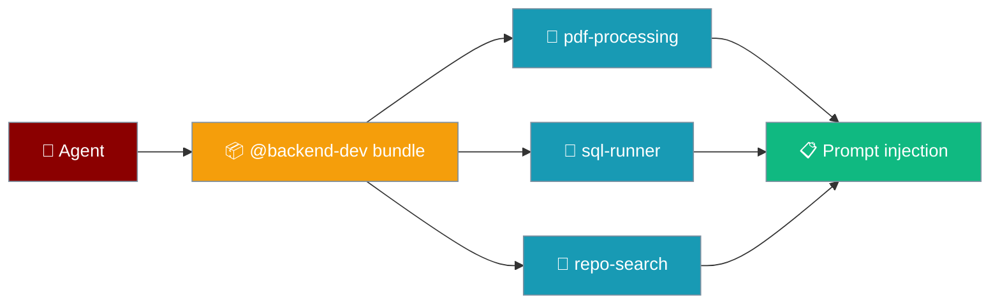
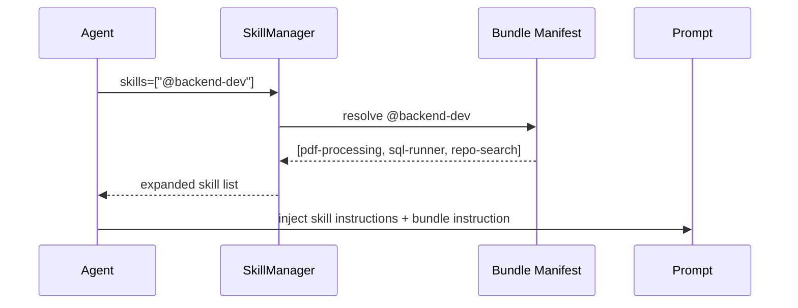
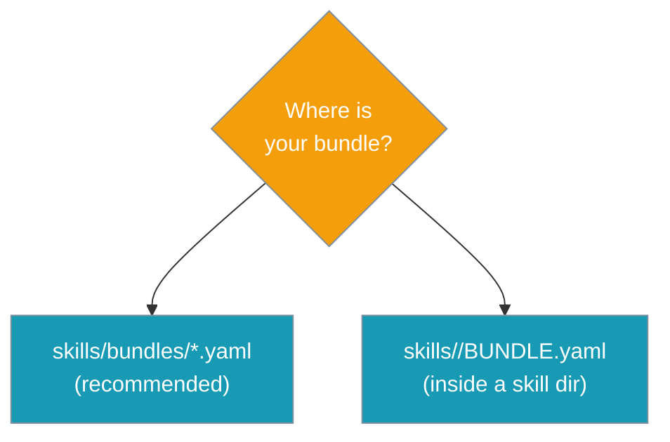

A bundle is a named set of skills. Select the bundle with `@name` and all its member skills load together — no need to list each one.

```python
from praisonaiagents import Agent

agent = Agent(
    name="Backend Dev",
    instructions="Help with backend engineering tasks.",
    skills=["@backend-dev"],
)
agent.start("Refactor the users table migration.")
```



## Quick Start

<Steps>
<Step title="Author a bundle manifest">
Create a YAML file in a `bundles/` subdirectory of your skills directory:

```yaml
# ./skills/bundles/backend-dev.yaml
name: backend-dev
description: Everything a backend engineer needs
skills:
  - pdf-processing
  - sql-runner
  - repo-search
instruction: |
  When responding as a backend dev, prefer explicit types and quote sources.
```
</Step>

<Step title="Select the bundle">
Use `@bundle-name` anywhere you'd normally list a skill:

```python
from praisonaiagents import Agent

agent = Agent(
    name="Backend Dev",
    instructions="Help with backend engineering tasks.",
    skills=["@backend-dev"],
)

agent.start("Refactor the users table migration.")
```
</Step>

<Step title="Mix bundles with individual skills">
Bundles and plain skill paths can be combined freely:

```python
from praisonaiagents import Agent

agent = Agent(
    name="Full Stack Dev",
    instructions="Help with both frontend and backend.",
    skills=["@backend-dev", "./skills/custom-linter"],
)
agent.start("Review this pull request.")
```
</Step>
</Steps>

---

## How It Works



---

## Bundle Manifest Schema

Bundles are discovered from YAML files in two locations:

1. `./skills/bundles/*.yaml` — any YAML file inside a `bundles/` subdirectory
2. `./skills/<skill-name>/BUNDLE.yaml` — a top-level file inside a skill directory

### Fields

| Field | Type | Required | Description |
|-------|------|----------|-------------|
| `name` | `str` | ✅ | Bundle name in kebab-case (used as `@name`) |
| `description` | `str` | — | What the bundle is for |
| `skills` | `list[str]` | — | Member skill names to expand |
| `instruction` | `str` | — | Extra guidance injected into the prompt for this bundle |

<Note>
Both `skills` and `members` are accepted as the list key. Members can be a plain string (space/comma-separated) or a YAML list.
</Note>

### Example manifest

```yaml
name: backend-dev
description: Everything a backend engineer needs
skills:
  - pdf-processing
  - sql-runner
  - repo-search
instruction: |
  When responding as a backend dev, prefer explicit types and quote sources.
```

---

## Common Patterns

### Role bundles

```python
from praisonaiagents import Agent

researcher = Agent(
    name="Researcher",
    instructions="Research and summarize topics.",
    skills=["@researcher"],
)

backend_dev = Agent(
    name="Backend Dev",
    instructions="Write backend code.",
    skills=["@backend-dev"],
)
```

### Mix bundles and one-off paths

```python
from praisonaiagents import Agent

agent = Agent(
    name="Custom Dev",
    instructions="Help with development tasks.",
    skills=["@backend-dev", "./skills/my-private-tool"],
)
```

### Multiple bundles

```python
from praisonaiagents import Agent

agent = Agent(
    name="Full Stack Dev",
    instructions="Help with all development tasks.",
    skills=["@backend-dev", "@frontend-dev"],
)
```

---

## Bundle Discovery

The SDK scans skill directories for bundle manifests automatically. Discovery mirrors skill discovery — same roots, same auto-discover setting.



**Name collision**: first bundle found wins. Later duplicates are shadowed and logged at `INFO` level.

**Unknown bundle**: a warning is logged and the selector is skipped — agent continues with remaining skills.

**Unknown member skill**: a warning is logged and the member is skipped — bundle continues expanding remaining members.

**Cycle protection**: circular bundle references are detected, warned, and skipped.

---

## Best Practices

<AccordionGroup>
  <Accordion title="Use kebab-case names">
    Bundle names should be in kebab-case (`backend-dev`, not `backendDev` or `backend_dev`). The `@` selector strips the marker and looks up the exact name.
  </Accordion>
  <Accordion title="Keep bundles focused">
    A bundle should represent one role or capability domain. Small, focused bundles are easier to reason about and combine than large monolithic ones.
  </Accordion>
  <Accordion title="Put role guidance in the instruction field">
    The `instruction` field injects extra context into the prompt for every selected bundle. Use it for role-level behavioral guidance rather than duplicating it in each member skill.
  </Accordion>
  <Accordion title="Avoid cycles">
    Bundle members should be skill names, not other bundle selectors. Circular references are detected and logged, but they result in the cycle being skipped — causing unexpected skill gaps.
  </Accordion>
</AccordionGroup>

---

## Related

<CardGroup cols={2}>
  <Card title="Agent Skills" icon="puzzle-piece" href="/docs/features/skills">
    Core skills system — how skills are loaded and injected
  </Card>
  <Card title="Learn a Skill" icon="graduation-cap" href="/docs/features/agent-learn-skill">
    Generate a skill from code, docs, or PDFs
  </Card>
  <Card title="Skill Manage" icon="wand-magic-sparkles" href="/docs/features/skill-manage">
    Let agents create and edit skills with human approval
  </Card>
  <Card title="Skills vs Tools" icon="scale" href="/docs/features/skills-vs-tools">
    When to use skills versus executable tools
  </Card>
</CardGroup>
