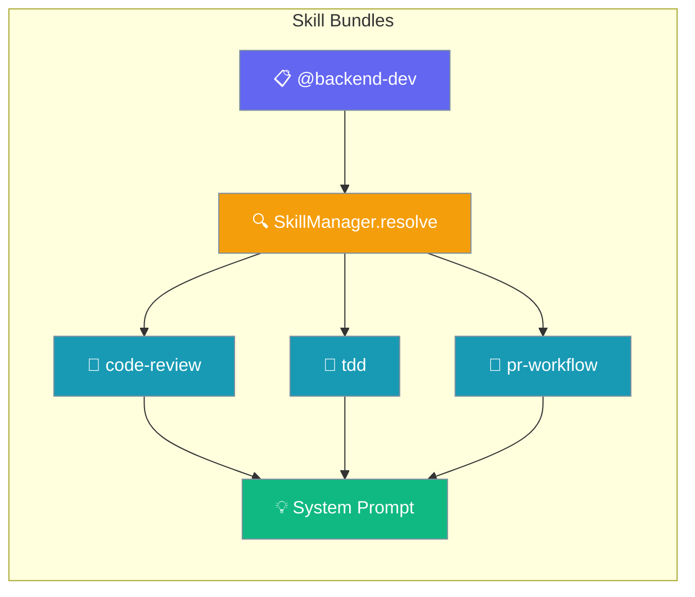
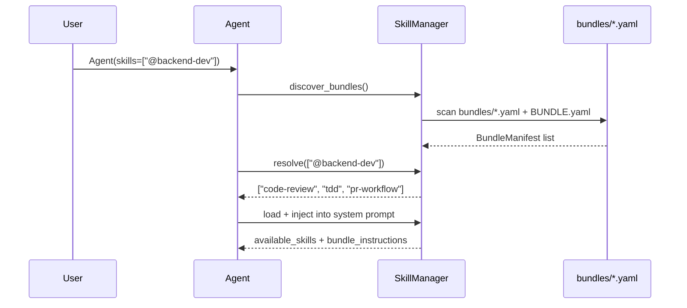
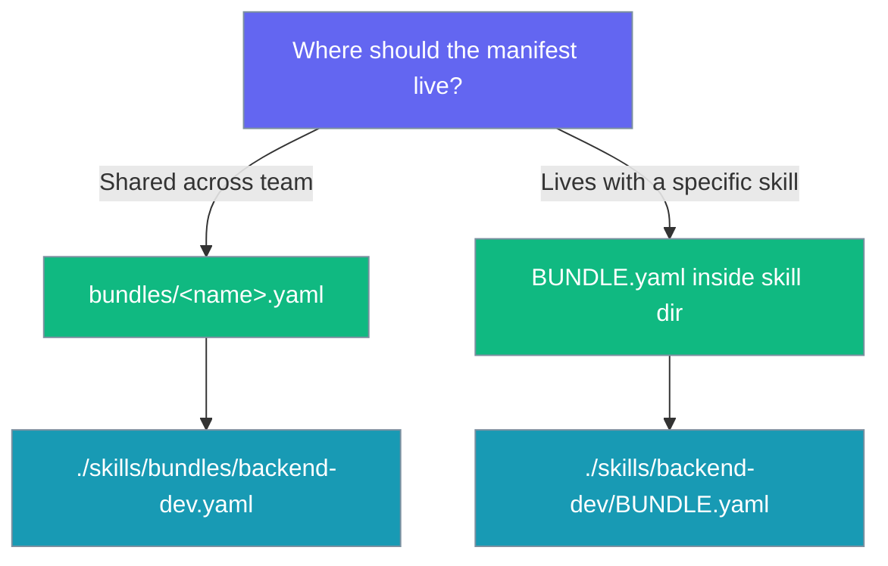

Bundle related skills into a single `@selector` your agent can load as one unit — no code changes, just a YAML manifest.



## Quick Start

<Steps>
<Step title="Use a bundle in your agent">
Select a bundle by prefixing its name with `@` in the `skills` list.

```python
from praisonaiagents import Agent

agent = Agent(
    name="Backend Dev",
    instructions="You work on backend features.",
    skills=["@backend-dev"],
)

agent.start("Add a /health endpoint and write tests for it.")
```
</Step>

<Step title="Create the bundle manifest">
Create a YAML file in your `skills/bundles/` directory listing the member skills.

```yaml
# ./skills/bundles/backend-dev.yaml
name: backend-dev
description: Backend feature work — code review, TDD, PR workflow.
skills:
  - code-review
  - tdd
  - pr-workflow
instruction: Prefer small, reviewable commits.
```
</Step>

<Step title="Inspect bundles via CLI">
List and inspect discovered bundles without writing any code.

```bash
praisonai skills bundle list
praisonai skills bundle show backend-dev
```
</Step>
</Steps>

---

## How It Works

`@bundle` selectors expand to member skills at agent init — the members then flow through the same budget + prompt-injection path as individually selected skills.



| Stage | What happens |
|-------|-------------|
| **Discover** | `SkillManager` scans `bundles/*.yaml` and `BUNDLE.yaml` files under skill roots |
| **Register** | Manifests are registered (first registration wins) |
| **Resolve** | `@bundle` selectors expand recursively to member skill names |
| **Inject** | Members flow through the existing skills path into the system prompt |

---

## Two Manifest Layouts

Both layouts are scanned under the same skill roots (`./skills`, `~/.praisonai/skills`, etc.).



**Form A — `bundles/` subdirectory** (recommended for team-shared bundles):

```
skills/
└── bundles/
    ├── backend-dev.yaml
    └── data-science.yml
```

```yaml
# skills/bundles/backend-dev.yaml
name: backend-dev
description: Backend feature work.
skills:
  - code-review
  - tdd
  - pr-workflow
instruction: Prefer small, reviewable commits.
```

**Form B — `BUNDLE.yaml` inside a skill directory** (when the bundle is skill-centric):

```
skills/
└── backend-dev/
    ├── SKILL.md
    └── BUNDLE.yaml
```

```yaml
# skills/backend-dev/BUNDLE.yaml
name: backend-dev
skills: [code-review, tdd, pr-workflow]
```

<Note>
Accepted filenames for Form B: `BUNDLE.yaml`, `BUNDLE.yml`, `bundle.yaml`, `bundle.yml`.
</Note>

---

## Manifest Fields

| Field | Type | Default | Description |
|-------|------|---------|-------------|
| `name` | `str` | *(required)* | Bundle name in kebab-case. Used as `@<name>` selector. |
| `description` | `str` | `""` | What the bundle is for. |
| `skills` | `List[str]` | `[]` | Member skill names. Accepts a list or a comma/space-separated string. |
| `instruction` | `str` | `None` | Optional extra guidance prepended above member skills in `<bundle_instructions>` block. |

<Tip>
The `skills:` field is tolerant: `skills: "code-review, tdd, pr-workflow"` and `members: [code-review, tdd, pr-workflow]` are both accepted.
</Tip>

---

## Common Patterns

### Mix `@bundle` with individual skills

```python
agent = Agent(
    name="Backend Dev",
    skills=["@backend-dev", "./skills/security-review"],
)
```

### YAML agent config

```yaml
agent:
  name: backend-dev
  skills:
    - "@backend-dev"
    - ./skills/security-review
```

### Bundle-level `instruction:`

Add an `instruction:` field to your manifest to prepend guidance above the member skills in the system prompt:

```yaml
name: backend-dev
skills: [code-review, tdd, pr-workflow]
instruction: Prefer small, reviewable commits. Always add tests.
```

The instruction appears in a `<bundle_instructions>` block before `<available_skills>` in the prompt.

### Programmatic discovery

```python
from praisonaiagents.skills import SkillManager

manager = SkillManager()
manager.discover(["./skills"])
manager.discover_bundles(["./skills"])

print(manager.bundle_names)
print(manager.resolve(["@backend-dev"]))
```

---

## Key Behaviours

<AccordionGroup>
<Accordion title="Forgiving membership">
A missing bundle member or unknown `@bundle` selector is logged and skipped — it's never fatal. Your agent starts normally even if a bundle name is mistyped.
</Accordion>

<Accordion title="First registration wins">
If two manifests share the same `name`, the first one discovered is used. Later entries are shadowed and logged. This mirrors the existing skills precedence behaviour.
</Accordion>

<Accordion title="Cycle detection">
Nested `@bundle` references in a bundle's `skills:` list are expanded recursively. Cycles are detected and broken with a warning — no infinite loops.
</Accordion>

<Accordion title="Budget-aware">
Bundle members flow through the unchanged `apply_budget` + XML injection path. Bundles add no new budget surface.
</Accordion>

<Accordion title="No new Agent parameters">
Bundles use the existing `skills=` parameter. The only change is that `@bundle` strings are expanded before injection — fully backward compatible.
</Accordion>
</AccordionGroup>

---

## Best Practices

<AccordionGroup>
<Accordion title="Keep bundles focused (3–6 skills, single concern)">
A bundle named `backend-dev` should contain backend skills only. Split `fullstack-dev` into `backend-dev` + `frontend-dev` instead.
</Accordion>

<Accordion title="Use kebab-case names">
Bundle names follow the same convention as skill names: `backend-dev`, `data-science`, `pr-workflow`. The `@` marker is always lowercase.
</Accordion>

<Accordion title="Prefer bundles/ subdirectory for shared bundles">
Team-wide bundles belong in `skills/bundles/`. Use `BUNDLE.yaml` inside a skill directory only when the bundle is tightly coupled to that specific skill.
</Accordion>

<Accordion title="Nest bundles sparingly">
Nesting is supported (and cycle-protected), but it makes discovery harder to reason about. Prefer flat bundles with explicit member lists.
</Accordion>
</AccordionGroup>

---

## Related

<CardGroup cols={2}>
  <Card title="Agent Skills" icon="puzzle-piece" href="/docs/features/skills">
    Learn how individual skills work and how to create them.
  </Card>
  <Card title="Skill Capability Gates" icon="shield-check" href="/docs/features/skill-capability-gates">
    Control which skills are available based on agent capabilities.
  </Card>
  <Card title="Skill Management" icon="sliders" href="/docs/features/skill-manage">
    Manage skill discovery, activation, and lifecycle.
  </Card>
  <Card title="Skill Lifecycle" icon="rotate" href="/docs/features/skill-lifecycle">
    Understand how skills are loaded, activated, and retired.
  </Card>
</CardGroup>
