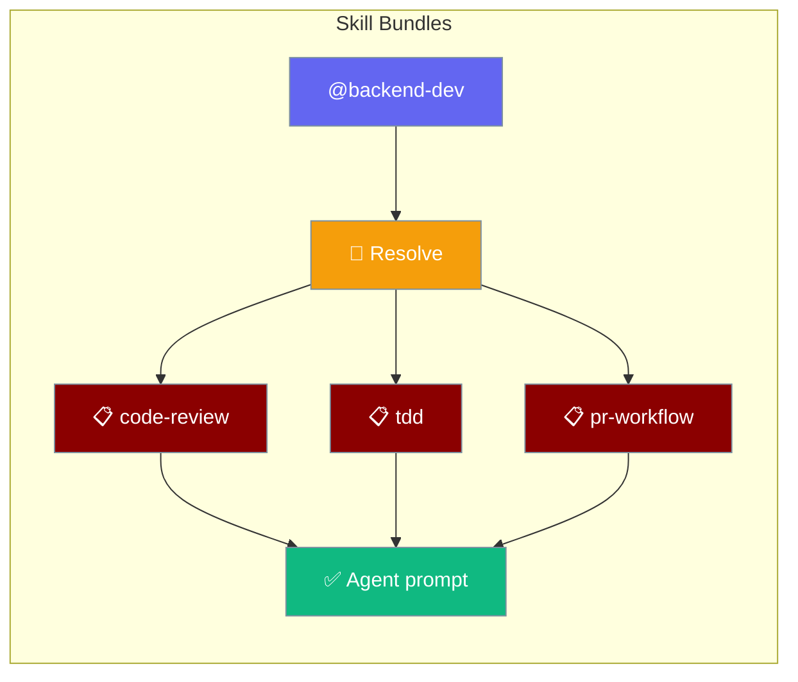
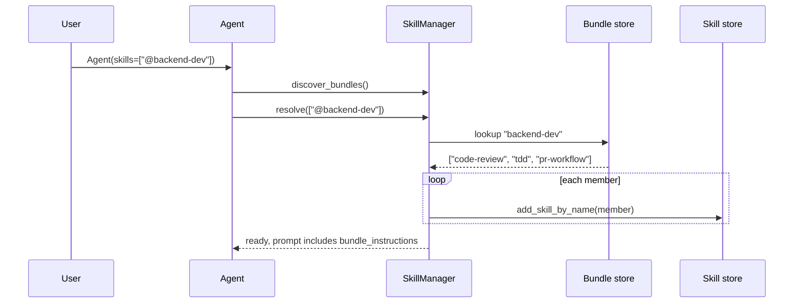

Skill bundles let one `@name` reference pull in a whole set of skills at once.



## Quick Start

<Steps>
<Step title="Define a bundle (YAML)">
Create a manifest file in your skills directory:

```yaml
# ./.praisonai/skills/bundles/backend-dev.yaml
name: backend-dev
description: Backend feature work.
skills: [code-review, tdd, pr-workflow]
instruction: Prefer small, reviewable commits.
```
</Step>

<Step title="Select the bundle from an Agent">
Pass the `@bundle-name` selector in `skills`:

```python
from praisonaiagents import Agent

agent = Agent(
    name="Backend Helper",
    instructions="Help me ship backend features.",
    skills=["@backend-dev"],
)

agent.start("Add a /health endpoint")
```
</Step>

<Step title="Or use YAML / CLI">
```yaml
# agents.yaml
agents:
  helper:
    role: Helper
    goal: Ship features
    backstory: You are helpful.
    skills:
      - "@backend-dev"
```

```bash
praisonai skills bundle list
praisonai skills bundle show backend-dev
```
</Step>
</Steps>

---

## How It Works



| Entry | What the Agent does |
|-------|---------------------|
| `"./skills/code-review"` | Loads the skill at that path (unchanged behaviour). |
| `"@backend-dev"` | Resolves the bundle, loads each member skill by name. |
| `"@unknown"` | Logs a WARNING and continues. The Agent does not crash. |

---

## Manifest Format

Two layouts are supported — choose the one that fits your structure.

**Layout A — bundles/ folder (recommended for shared sets):**

```yaml
# ./.praisonai/skills/bundles/backend-dev.yaml
name: backend-dev
description: Backend feature work.
skills: [code-review, tdd, pr-workflow]
instruction: Prefer small, reviewable commits.
```

**Layout B — BUNDLE.yaml inside a skill directory:**

```yaml
# ./.praisonai/skills/frontend/BUNDLE.yaml
name: frontend
skills:
  - ui-review
  - storybook
```

### Manifest Fields

| Field | Type | Default | Description |
|-------|------|---------|-------------|
| `name` | `str` | required | Bundle name (kebab-case). Empty or missing raises `ValueError`. |
| `description` | `str` | `""` | Free-text description of the bundle's purpose. |
| `skills` | `List[str]` | `[]` | Member skill names or nested `@bundle` selectors. |
| `instruction` | `str \| None` | `None` | Bundle-level guidance injected above the member skills. |
| `path` | `Path \| None` | `None` | Path to the manifest file (set on discovery; not user-supplied). |

<Note>
`BundleManifest.from_dict()` accepts both `skills:` (preferred) and `members:` keys, and handles both string (`"a, b c"`) and list forms.
</Note>

---

## Discovery Locations

`discover_bundles()` scans each skill root for:

1. `bundles/*.yaml` and `bundles/*.yml` (sorted; first-registration-wins on collision)
2. Per-skill-dir: `BUNDLE.yaml`, `BUNDLE.yml`, `bundle.yaml`, `bundle.yml`

Default roots follow the same precedence as skill discovery:

<Steps>
  <Step title="Project">`./.praisonai/skills/` or `./.claude/skills/`</Step>
  <Step title="Ancestors">Every `.praisonai/skills` or `.claude/skills` in a parent directory</Step>
  <Step title="User">`~/.praisonai/skills/`</Step>
  <Step title="System">`/etc/praison/skills/`</Step>
</Steps>

---

## Nested Bundles

Bundles can reference other bundles with `@` selectors:

```yaml
# bundles/common.yaml
name: common
skills: [log, cfg]

# bundles/backend.yaml
name: backend
skills:
  - "@common"
  - api
```

```python
from praisonaiagents.skills import SkillManager

mgr = SkillManager()
mgr.resolve(["@backend"])  # → ["log", "cfg", "api"]
```

Cycle protection is built in — a bundle that directly or indirectly references itself is logged and skipped, so there is no infinite recursion.

---

## Bundle Instructions

When a bundle has an `instruction:` field, it is surfaced to the LLM in a `<bundle_instructions>` block above the regular `<available_skills>` block:

```xml
<bundle_instructions>
Prefer small, reviewable commits.
</bundle_instructions>

<available_skills>
...
</available_skills>
```

Nested bundles contribute their instructions too, in selection order. See `SkillManager.to_prompt()` for the full XML shape.

---

## CLI Reference

```bash
praisonai skills bundle list

praisonai skills bundle list --dirs ./.praisonai/skills

praisonai skills bundle show backend-dev
praisonai skills bundle show @backend-dev
```

Exit code `1` if `show` cannot find the named bundle.

---

## Choosing Between Options

```mermaid
flowchart TD
    Q{Pick one or many skills?}
    Q -->|one specific skill| P[Use a path: skills=['./skills/x']]
    Q -->|a fixed, named set used in many agents| B[Use a bundle: skills=['@team-defaults']]
    Q -->|skills selected dynamically by an LLM| A[Use auto-discovery + LLM activation]

    classDef opt fill:#189AB4,stroke:#7C90A0,color:#fff
    classDef pick fill:#F59E0B,stroke:#7C90A0,color:#fff
    class Q pick
    class P,B,A opt
```

---

## Best Practices

<AccordionGroup>
  <Accordion title="Name bundles by intent, not by team">
    Use names like `backend-dev`, `pr-author`, not `team-A`. Bundles represent a capability set, not an org chart — other teams can adopt the same bundle without renaming.
  </Accordion>
  <Accordion title="Keep bundles small (3–7 skills)">
    Large bundles consume more of the agent's context budget. When a bundle grows beyond 7 skills, split it into composable sub-bundles and reference them with `@` selectors.
  </Accordion>
  <Accordion title="Use instruction: for cross-cutting guidance">
    Anything that applies to all member skills — like "Prefer small commits" — belongs at bundle level. Avoid duplicating the same instruction across every `SKILL.md`.
  </Accordion>
  <Accordion title="Bundles are forgiving by design">
    A typo in `@bundle` or a missing member skill logs a warning and continues — the agent does not crash. Watch logs in CI; do not rely on a crash to catch typos.
  </Accordion>
</AccordionGroup>

---

## Related

<CardGroup cols={2}>
  <Card title="Agent Skills" icon="puzzle-piece" href="/docs/features/skills">
    Author SKILL.md files and configure skills on agents
  </Card>
  <Card title="Skill Invocation" icon="slash" href="/docs/features/skills-invocation">
    How skills are invoked via slash commands, auto-trigger, and programmatic API
  </Card>
  <Card title="Skills Config" icon="gear" href="/docs/configuration/skills-config">
    `SkillsConfig` discovery options
  </Card>
  <Card title="Skills CLI" icon="terminal" href="/docs/cli/skills">
    `praisonai skills` CLI overview
  </Card>
</CardGroup>
