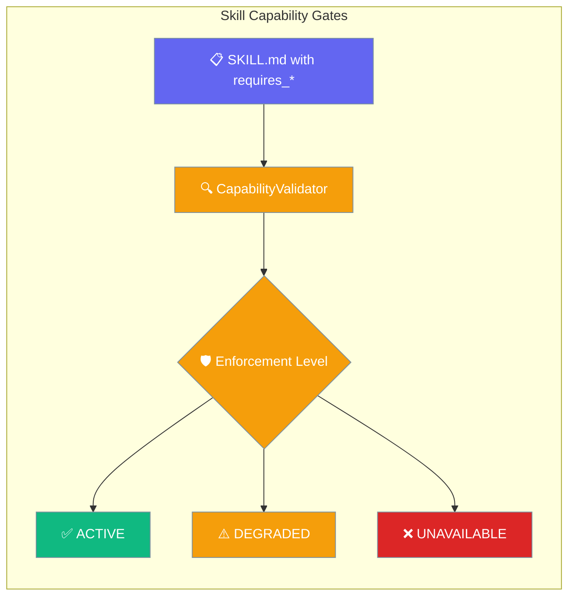
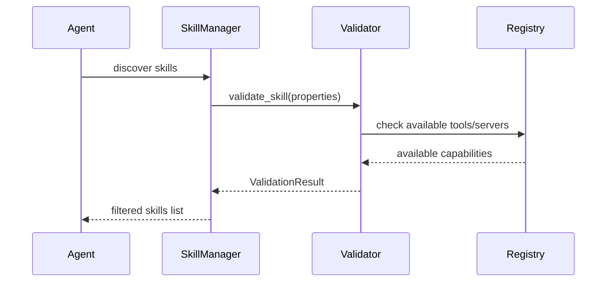
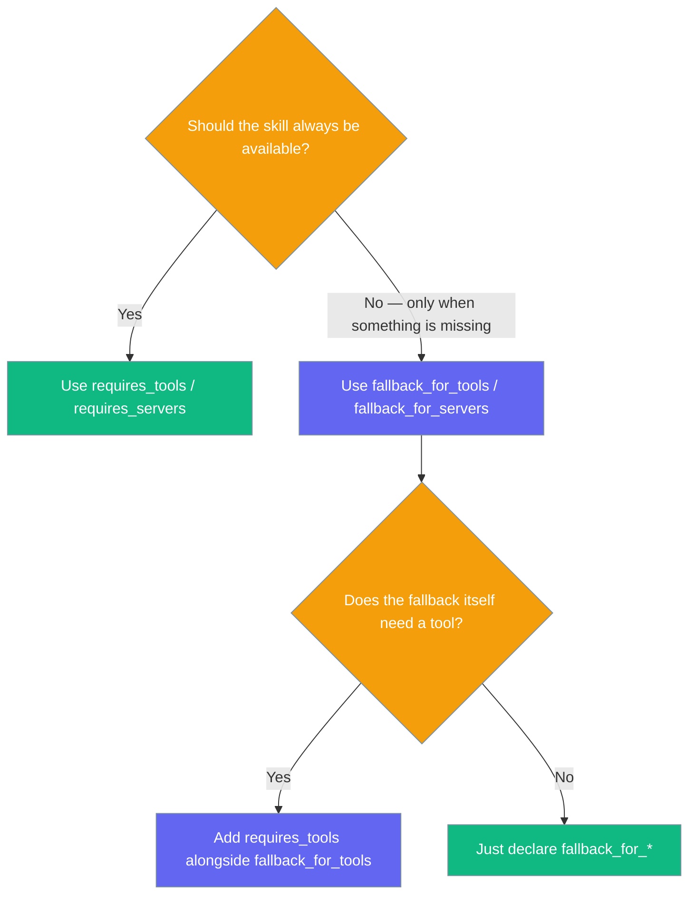
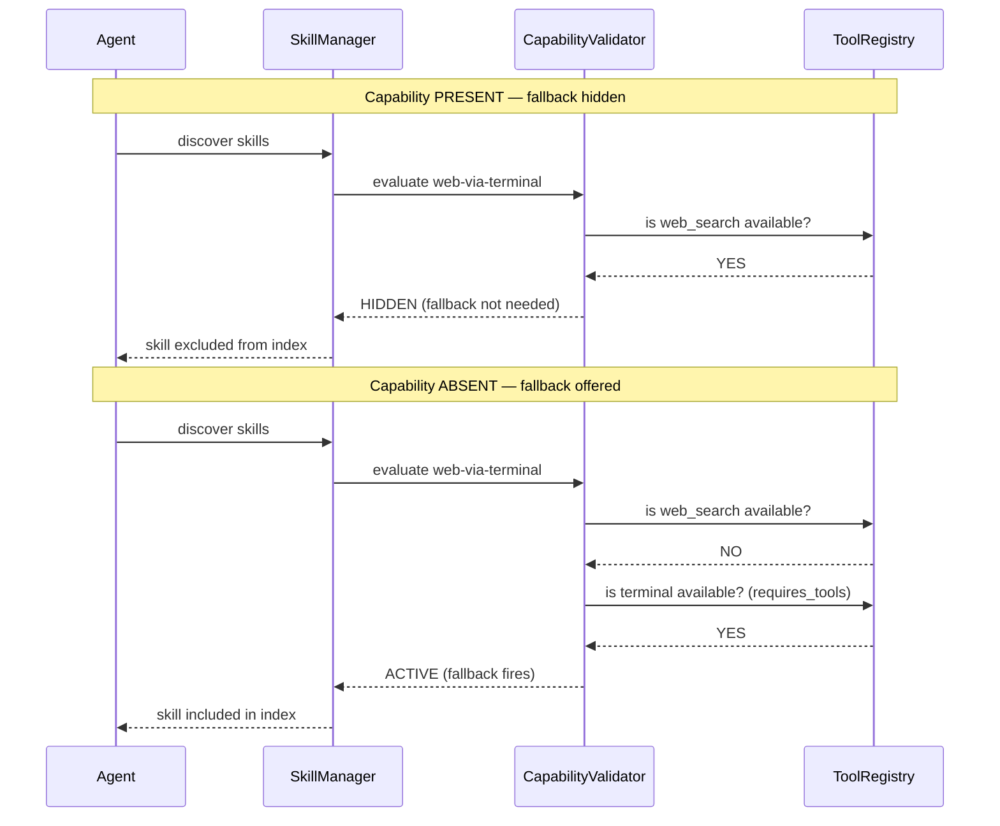
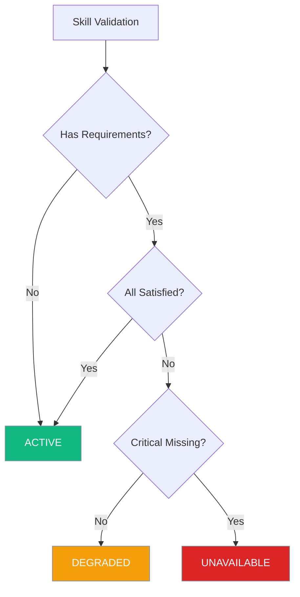
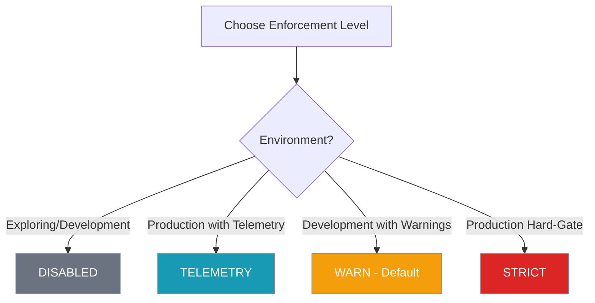

Skill Capability Gates allow you to declare tool, server, and environment variable requirements in your skills and enforce them at runtime with configurable strictness levels.

```python
from praisonaiagents import Agent

agent = Agent(
    name="PDF Assistant",
    instructions="Process PDFs for the user",
    skills=["./skills/pdf-processor"],
)
agent.start("Extract text from invoice.pdf")
```



## Quick Start

<Steps>
<Step title="Simple Agent with Skill Requirements">
```python
from praisonaiagents import Agent

agent = Agent(
    name="PDF Assistant",
    instructions="Process PDFs for the user",
    skills=["./skills/pdf-processor"]  # skill declares requires_tools
)

agent.start("Extract text from invoice.pdf")
# → if requires_tools are missing, skill is degraded/unavailable based on enforcement level
```
</Step>

<Step title="Skill with Capability Requirements">
Create a `SKILL.md` with requirements:

```yaml
---
name: pdf-processor
description: Extract text and OCR from PDF documents
requires_tools: [pdf_read, ocr_extract]
requires_servers: ["mcp:filesystem"]
requires_env: [OPENAI_API_KEY]
---

# PDF Processing Instructions
When asked to process a PDF, call pdf_read first, then ocr_extract for image pages.
```
</Step>
</Steps>

---

## How It Works



| Component | Purpose |
|-----------|---------|
| **SkillRequirements** | Parsed requirements from frontmatter |
| **CapabilityValidator** | Validates skills against available capabilities |
| **ValidationResult** | Per-skill validation status and details |
| **EnforcementLevel** | Controls strictness of requirement checking |

---

## Frontmatter Reference

All frontmatter keys are **optional** and **backward-compatible**. Existing skills without requirements are unaffected.

| Frontmatter Key | Aliases | Type | Maps to |
|---|---|---|---|
| `requires_tools` | `requires-tools` | `list[str]` or string | `SkillRequirements.tools` |
| `requires_servers` | `requires-servers` | `list[str]` or string | `SkillRequirements.servers` |
| `requires_env` | `requires-env` | `list[str]` or string | `SkillRequirements.env_vars` |
| `allowed-tools` | — | `list[str]` or string | **Also** appended to `tools` (backward compat) |
| `openclaw` | — | `dict` | `SkillRequirements.openclaw_hints` (passthrough) |
| `fallback_for_tools` | `fallback-for-tools` | `list[str]` or string | `SkillRequirements.fallback_for_tools` |
| `fallback_for_servers` | `fallback-for-servers` | `list[str]` or string | `SkillRequirements.fallback_for_servers` |

**String forms are normalized** — both `requires_tools: "pdf_read, ocr_extract"` and `requires_tools: "pdf_read ocr_extract"` work. The same normalization applies to `fallback_for_tools` and `fallback_for_servers`.

---

## Graceful Fallback Skills

`fallback_for_tools` / `fallback_for_servers` let a skill stay hidden until the agent is missing the capability it covers.

```python
from praisonaiagents import Agent

agent = Agent(
    name="Researcher",
    instructions="Answer questions, citing sources",
    skills=["./skills/web-via-terminal"],  # auto-hidden if web_search tool is present
)

agent.start("Find today's BTC closing price")
```

The matching `SKILL.md` frontmatter:

```yaml
---
name: web-via-terminal
description: Fetch the web via terminal when no web tool is available.
requires_tools: [terminal]       # this fallback still needs a shell to run
fallback_for_tools: [web_search] # only offered when web_search is absent
---

# Web via terminal
When asked to fetch a URL, use curl/wget through the terminal tool.
```

### Behaviour

| `web_search` present | `terminal` present | `web-via-terminal` offered? |
|:--:|:--:|:--:|
| ✅ | ✅ | ❌ (hidden — capable agent doesn't need fallback) |
| ❌ | ✅ | ✅ (fallback fires) |
| ❌ | ❌ | ❌ (own `requires_tools: [terminal]` unmet) |
| ✅ | ❌ | ❌ (capability already present) |

<Note>
A fallback skill's own `requires_*` gates are always enforced, regardless of the enforcement level. An unusable fallback is never injected into the agent's context.
</Note>

### When to Use fallback vs. requires



### Skill Discovery Sequence



The validator evaluates both `available_tools` / `available_servers` for the keep-or-hide decision and the fallback skill's own `requires_*` gates before injecting it.

---

## Skill States



| State | Meaning | Behavior |
|---|---|---|
| **ACTIVE** | All requirements satisfied | Skill fully available |
| **DEGRADED** | Some requirements missing (env vars) | Skill available with warnings |
| **UNAVAILABLE** | Critical requirements missing (tools/servers) | Under strict mode, excluded from picker |
| **UNKNOWN** | Not yet validated | Initial state before validation |

---

## Enforcement Levels



| Level | Value | Behavior | Logging |
|---|---|---|---|
| **DISABLED** | `"disabled"` | No enforcement (legacy behavior) | None |
| **TELEMETRY** | `"telemetry"` | Log-only, no blocking | Debug/warn |
| **WARN** | `"warn"` | **Default** — surface warnings, allow activation | Warning |
| **STRICT** | `"strict"` | Hard fail — skills in UNAVAILABLE state excluded from system prompt | Error |

---

## Configuration

### Environment Variable

```bash
# Set enforcement level (case-insensitive)
export SKILL_CAPABILITY_ENFORCEMENT=strict

# Accepted values
SKILL_CAPABILITY_ENFORCEMENT=disabled  # or 'off'
SKILL_CAPABILITY_ENFORCEMENT=telemetry # or 'log'
SKILL_CAPABILITY_ENFORCEMENT=warn      # or 'warning' (default)
SKILL_CAPABILITY_ENFORCEMENT=strict    # or 'hard', 'fail'
```

### Programmatic Configuration

```python
from praisonaiagents import SkillManager, EnforcementLevel

# Default (uses environment or 'warn')
manager = SkillManager()

# Explicit enforcement level
manager = SkillManager(enforcement_level=EnforcementLevel.STRICT)
```

---

## Diagnostics from Code

### Basic Validation

```python
from praisonaiagents import SkillManager

manager = SkillManager()
manager.discover(["./skills"])

# Validate specific skill
result = manager.validate_skill_capabilities("pdf-processor")
print(f"State: {result.state.value}")
print(f"Missing tools: {result.missing_tools}")
print(f"Missing servers: {result.missing_servers}")
```

### Full Diagnostics

```python
# Get diagnostics for all skills
diagnostics = manager.get_skills_diagnostics()

for name, result in diagnostics.items():
    print(f"{name}: {result.state.value}")
    if result.warnings:
        print(f"  Warnings: {result.warnings}")
    if result.errors:
        print(f"  Errors: {result.errors}")
```

### Filter Skills by State

```python
from praisonaiagents import SkillState

# Get only active skills
active_skills = manager.get_available_skills_by_state(SkillState.ACTIVE)

# Get degraded skills
degraded_skills = manager.get_available_skills_by_state(SkillState.DEGRADED)
```

---

## CLI Diagnostics

### Basic Skills Check

```bash
praisonai doctor skills                  # Basic skills health check
praisonai doctor skills --deep           # Deeper probes
praisonai doctor skills --json           # JSON output
```

### Detailed Requirements Check

```bash
praisonai doctor skills --requirements   # Show detailed per-skill diagnostics
```

**Sample output structure:**
```json
{
  "total_skills": 5,
  "active": 3,
  "degraded": 1,
  "unavailable": 1,
  "enforcement_level": "warn",
  "sample_issues": [
    "pdf-processor: Missing required tools: pdf_read",
    "email-sender: Missing required environment variables: SMTP_PASSWORD"
  ]
}
```

---

## Common Patterns

### Terminal-based Web Fallback

```yaml
---
name: web-via-terminal
description: Fetch the web via terminal when no web tool is available.
requires_tools: [terminal]
fallback_for_tools: [web_search]
---

# Web via terminal
When asked to fetch a URL, use curl/wget through the terminal tool.
```

### Local-file Fallback for Absent MCP Server

```yaml
---
name: local-notes
description: Search ~/notes when the Notion MCP server is unavailable.
requires_tools: [filesystem_read]
fallback_for_servers: [mcp:notion]
---

# Local notes search
Search ~/notes/ for relevant files when Notion is unavailable.
```

### Soft-warn in Dev, Strict in Prod

```python
import os

# Production configuration
if os.getenv('ENV') == 'production':
    os.environ['SKILL_CAPABILITY_ENFORCEMENT'] = 'strict'
else:
    os.environ['SKILL_CAPABILITY_ENFORCEMENT'] = 'warn'

from praisonaiagents import Agent
agent = Agent(skills=["./skills"])
```

### Add Tool Requirement to Existing Skill

```yaml
---
name: existing-skill
description: Existing skill functionality
# Add new requirement
requires_tools: [new_required_tool]
---
```

### Filter to Active-Only Skills for System Prompt

```python
from praisonaiagents import SkillManager, EnforcementLevel

# Strict mode automatically filters system prompt
manager = SkillManager(enforcement_level=EnforcementLevel.STRICT)
manager.discover()

# Only active skills included in prompt
prompt_xml = manager.to_prompt()
```

---

## Best Practices

<AccordionGroup>

<Accordion title="Prefer requires_tools over allowed-tools for new skills">
Use the new `requires_tools` frontmatter key for better validation:

```yaml
# Preferred (new)
requires_tools: [pdf_read, ocr_extract]

# Still supported (legacy)
allowed-tools: [pdf_read, ocr_extract]
```
</Accordion>

<Accordion title="Use requires_env sparingly (prefer tool-level auth)">
Minimize environment variable dependencies:

```yaml
# Prefer tool-level authentication
requires_tools: [authenticated_api_client]

# Avoid if possible
requires_env: [API_KEY, SECRET_TOKEN]
```
</Accordion>

<Accordion title="Default to warn in development, strict in production">
Configure appropriate enforcement levels:

```python
# Development
SKILL_CAPABILITY_ENFORCEMENT=warn

# Production
SKILL_CAPABILITY_ENFORCEMENT=strict
```
</Accordion>

<Accordion title="Use fallback_for_* for graceful degradation, not as a feature switch">
Fallback skills disappear automatically when the real capability is present; they are not a runtime toggle. If you need a user-controlled switch, gate the skill with `requires_env` on a feature-flag env var instead.
</Accordion>

<Accordion title="Cache validation results (validator already caches; document clear_cache())">
Validation results are automatically cached for performance:

```python
manager = SkillManager()

# First call validates and caches
result1 = manager.validate_skill_capabilities("skill-name")

# Second call uses cache
result2 = manager.validate_skill_capabilities("skill-name")

# Force refresh
result3 = manager.validate_skill_capabilities("skill-name", force_refresh=True)

# Clear all caches
manager.clear()
```
</Accordion>

</AccordionGroup>

---

## Inverse: Graceful Fallback

`fallback_for_tools` and `fallback_for_servers` are the **inverse** of `requires_*` — a skill with these keys is offered only when the listed tool or server is **absent**.

```yaml
---
name: web-via-terminal
description: Fetch the web via terminal when no web tool is available.
requires_tools: [terminal]
fallback_for_tools: [web_search, web]
---

# How to fetch the web with curl/wget when no web tool is available
...
```

| Key | Behaviour |
|---|---|
| `requires_tools` | Skill needs these tools to be active |
| `fallback_for_tools` | Skill is hidden when **any** of these tools is present |

See [Skill Fallback](/docs/features/skill-fallback) for the full reference.

---

## Related

<CardGroup cols={2}>
<Card title="Skill Fallback" icon="life-ring" href="/docs/features/skill-fallback">
The inverse — offer a skill only when a tool or server is absent
</Card>

<Card title="Agent Skills" icon="puzzle-piece" href="/docs/features/skills">
Learn about the Agent Skills system and how to create skills
</Card>

<Card title="Graceful Skill Fallback" icon="shield-half" href="/docs/features/skill-fallback">
Offer fallback skills only when a preferred capability is absent
</Card>

<Card title="Hermes/OpenClaw Import" icon="download" href="/docs/features/hermes-openclaw-skills-import">
Import skills from Hermes and OpenClaw with capability requirements
</Card>

<Card title="Skill Management" icon="wrench" href="/docs/features/skill-manage">
Manage skills programmatically with the SkillManager API
</Card>

<Card title="Doctor CLI" icon="stethoscope" href="/docs/cli/doctor">
Use the doctor command to diagnose skill capability issues
</Card>
</CardGroup>